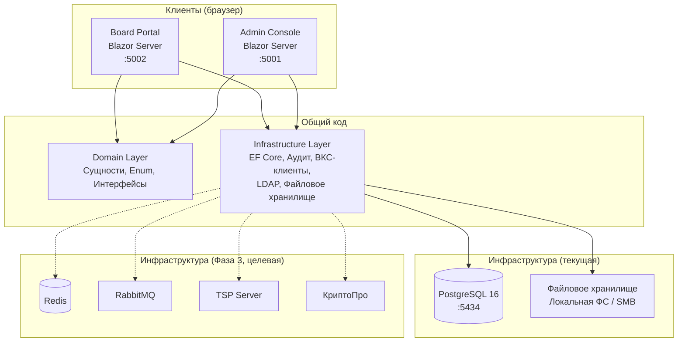
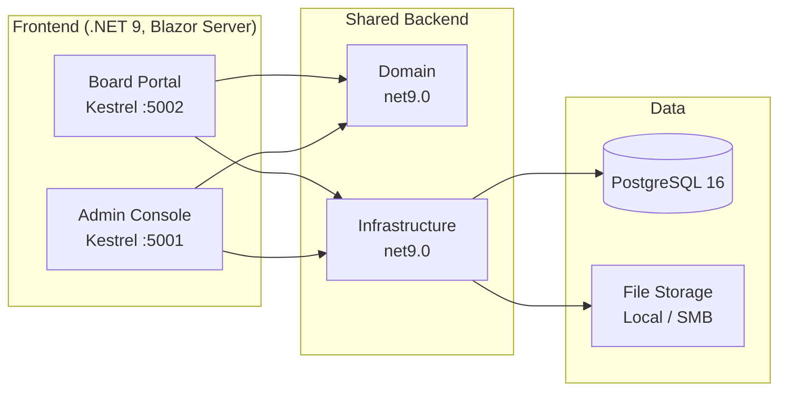
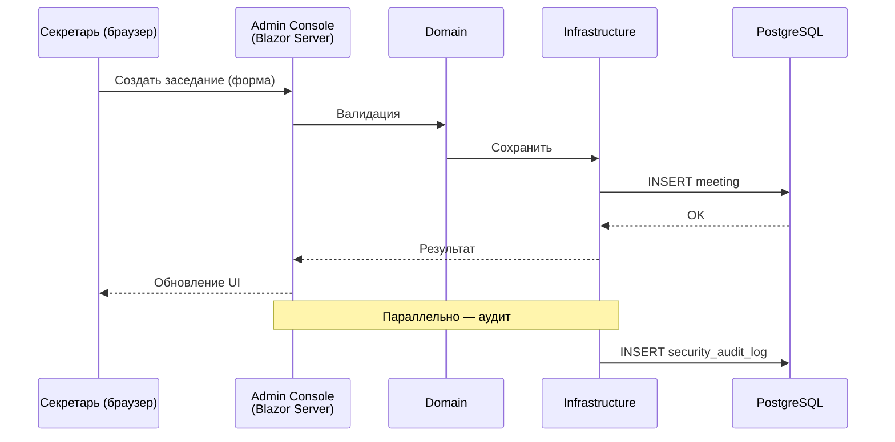
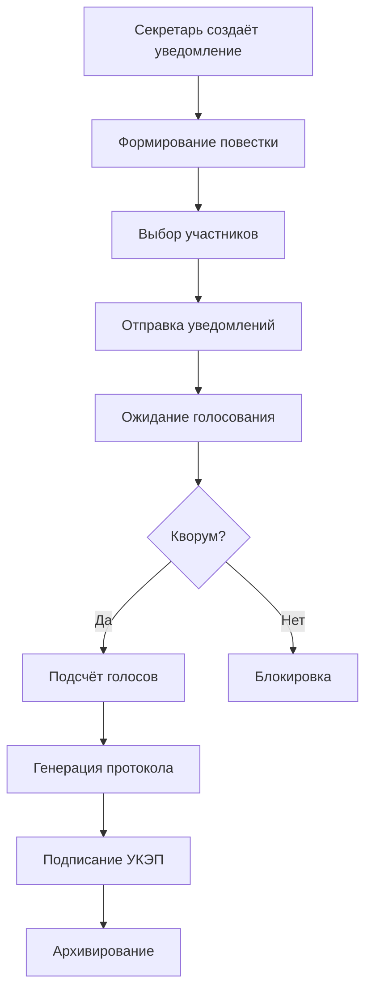
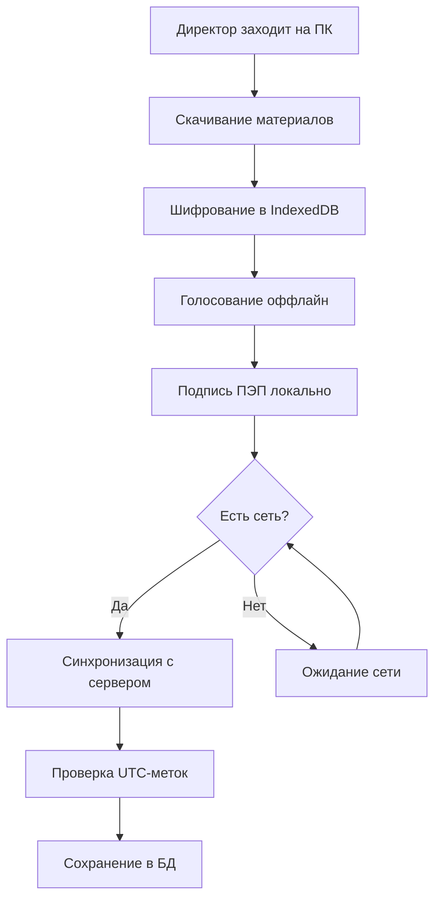
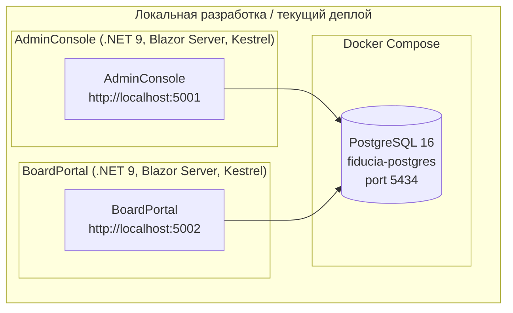
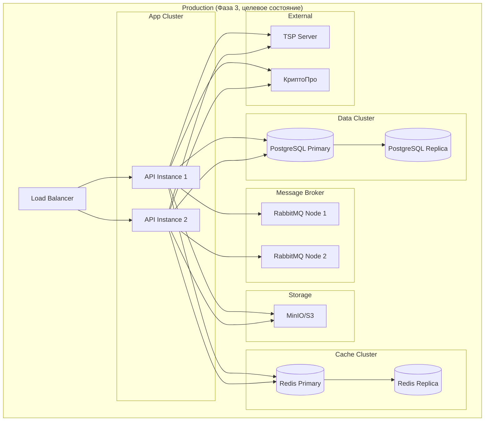

# Архитектура проекта «Цифровой Совет Директоров»

---

## Обзор

Платформа построена по принципам чистой архитектуры: два независимых Blazor Server-приложения (Board Portal и Admin Console) разделяют общий доменный слой и инфраструктуру. Система спроектирована для обеспечения юридической значимости решений, полного соответствия корпоративному законодательству РФ и работы в офлайн-режиме.

---

## Архитектурные принципы

| Принцип | Описание |
|---------|----------|
| **Чистая архитектура** | Зависимости направлены внутрь — BoardPortal/AdminConsole → Infrastructure → Domain |
| **Domain-Driven Design** | Моделирование через доменные сущности, ограниченные контексты |
| **SOLID** | Соблюдение всех пяти принципов |
| **Legal-First** | Юридические требования на первом месте |
| **Database-First** | Схема БД ведётся одним каноническим SQL (BDR‑002) |
| **Справочники с префиксом** | Все справочники имеют префикс `ref_` и единый стиль идентификаторов |

---

## Общая архитектура



Два Blazor Server-приложения работают независимо, разделяя общие проекты `Domain` и `Infrastructure`. Взаимодействие с БД — через EF Core (Database-First, схема из `tools/db/01_schema.sql`). Redis, RabbitMQ, TSP и КриптоПро запланированы на Фазу 3 и в текущей версии не используются (показаны пунктиром).

---

## Системная архитектура (текущая)



---

## Структура проекта

```
SamorodinkaTech.Fiducia/
├── SamorodinkaTech.Fiducia.BoardPortal/   # Blazor Server — портал директоров (:5002)
│   ├── Pages/                             # Razor-страницы (Login, Meetings, Voting, …)
│   ├── Shared/                            # Общие компоненты (MainLayout, NavMenu, …)
│   ├── Program.cs                         # Точка входа, DI, middleware
│   └── appsettings.json                   # Конфигурация
├── SamorodinkaTech.Fiducia.AdminConsole/  # Blazor Server — админ-панель (:5001)
│   ├── Pages/                             # Razor-страницы (LegalEntities, Committees, …)
│   ├── Shared/                            # Общие компоненты (MainLayout, NavMenu, …)
│   ├── Services/                          # Сервисы, специфичные для Admin Console
│   ├── Contracts/                         # DTO/контракты для форм
│   ├── Program.cs                         # Точка входа, DI, middleware
│   └── appsettings.json                   # Конфигурация
├── src/
│   ├── Domain/                            # Domain Layer (net9.0)
│   │   ├── Entities/                      # Доменные сущности (24 шт.)
│   │   ├── Enums/                         # Перечисления (8 шт.)
│   │   ├── Interfaces/                    # Абстракции (11 шт.)
│   │   ├── Models/                        # Модели данных (DTO внешних API)
│   │   └── Validation/                    # Валидаторы доменной логики
│   ├── Infrastructure/                    # Infrastructure Layer (net9.0)
│   │   ├── Persistence/                   # EF Core DbContext, конфигурации, репозитории
│   │   ├── Services/                      # Реализации интерфейсов домена
│   │   ├── Authentication/               # LDAP, JWT-провайдеры
│   │   ├── Auditing/                      # Аудит-лог (БД + файлы)
│   │   ├── FileStorage/                   # Локальное/S3 файловое хранилище
│   │   ├── Notifications/                 # Email/SMS-уведомления
│   │   └── Middleware/                    # ПО промежуточного слоя
│   ├── Common/                            # Общие утилиты
│   │   └── Exceptions/                    # Базовые классы исключений
│   └── Tools/                             # Утилиты
│       ├── DbReset/                       # Сброс и пересоздание БД
│       ├── LegalEntitiesDemo/             # Генератор демо-данных ЮЛ
│       └── OkopfImporter/                 # Импорт справочника ОКОПФ
├── tests/
│   ├── SamorodinkaTech.Fiducia.Tests.Unit/
│   ├── SamorodinkaTech.Fiducia.Tests.Integration/
│   └── SamorodinkaTech.Fiducia.Tests.Functional/
├── tools/
│   ├── db/                                # SQL-скрипты (01_schema, 02_seed, 03_demo)
│   ├── ldap/                              # LDAP seed-данные
│   └── dev/                               # Скрипты разработчика
├── docs/                                  # Документация
├── docker-compose.yml                     # PostgreSQL 16
├── docker-compose.ldap.yml                # OpenLDAP (только x86_64)
└── start.sh                               # Запуск обоих порталов
```

---

## Компоненты системы

### 1. Board Portal (Blazor Server, :5002)

**Ответственность**: Рабочее пространство директора — вход, просмотр заседаний, голосование, документы, оповещения.

**Технологии**: .NET 9, Blazor Server, Bootstrap 5, Kestrel.

**Ключевые элементы**:
- `Pages/` — Razor-страницы (Login, Meetings, Voting, Documents, Notifications, …)
- `Shared/` — MainLayout, NavMenu, общие компоненты
- `Program.cs` — DI-контейнер, middleware, конфигурация

### 2. Admin Console (Blazor Server, :5001)

**Ответственность**: Администрирование системы — управление ЮЛ, комитетами, пользователями, аудит-логом, печатными формами.

**Технологии**: .NET 9, Blazor Server, Bootstrap 5, Kestrel.

**Ключевые элементы**:
- `Pages/` — Razor-страницы (LegalEntities, Committees, Users, Audit, Print, …)
- `Shared/` — MainLayout, NavMenu, общие компоненты
- `Services/` — Сервисы, специфичные для Admin Console
- `Contracts/` — DTO и контракты для форм
- `Program.cs` — DI-контейнер, middleware, конфигурация

### 3. Domain Layer

**Ответственность**: Бизнес-логика, сущности, перечисления, интерфейсы, валидация.

**Паттерны**: Domain-Driven Design, Repository Pattern (через интерфейсы).

**Ключевые элементы**:
- `Entities/` — 24 сущности: User, Role, Meeting, AgendaQuestion, Bulletin, Committee, CommitteeMember, CommitteeTask, BoardMember, LegalEntity, Okopf, OsaMeeting, OsaForm, Notification, SecurityAuditLog, FileEntry и др.
- `Enums/` — 8 перечислений: MeetingForm, MeetingStatus, VoteValue, SignatureType, BehaviorType, TaskStatus, QuestionStatus, NotificationType
- `Interfaces/` — 11 абстракций: IApplicationDbContext, IAuthProvider, ISessionService, ISecurityAuditService, INotificationService, IFileStorage, ITrueConfApiClient, IMtsLinkApiClient, ILdapService, IBoardMemberLdapService, ILegalEntityGosaIntervalService
- `Validation/` — Валидаторы доменной логики
- `Models/` — DTO для внешних API (TrueConf, МТС Линк, LDAP)

### 4. Infrastructure Layer

**Ответственность**: Техническая реализация интерфейсов домена, доступ к данным, внешние интеграции.

**Технологии**: EF Core 9, Npgsql, System.DirectoryServices.Protocols.

**Ключевые элементы**:
- `Persistence/` — DbContext, EF-конфигурации сущностей, репозитории
- `Services/` — Реализации интерфейсов (TrueConfApiClient, MtsLinkApiClient, LdapService, BoardMemberLdapService, …)
- `Authentication/` — LdapAuthProvider, JWT-провайдер
- `Auditing/` — SecurityAuditService, SecurityAuditFileWriter
- `FileStorage/` — LocalFileStorage, MinioFileStorage
- `Notifications/` — Email- и SMS-уведомления
- `Middleware/` — ПО промежуточного слоя (аудит, обработка ошибок)

---

## Доменные модули

### Auth (Аутентификация и авторизация)

**Сущности**: `User`, `Role`, `UserRole`, `CurrentWorkplace`.

**Интерфейсы**: `IAuthProvider`, `ISessionService`.

**Реализация**: JWT cookie + LDAP (опционально) + ПЭП-соглашение.

**Особенности**:
- Блокировка входа до подписания Соглашения о ПЭП (63-ФЗ)
- Принудительное закрытие сессии при бездействии (УПД.15, 152-ФЗ)
- RBAC: SYS_ADMIN, CORP_SECRETARY, CHAIR_BOARD, MEMBER_BOARD и др.

### Meetings (Заседания)

**Сущности**: `Meeting`, `AgendaQuestion`, `Bulletin`, `OsaMeeting`, `OsaForm`, `OsaMeetingFile`.

**Ключевая логика**:
- Создание заседаний с контролем кворума и дедлайна 3 дня (208-ФЗ)
- Бюллетени с подписью ПЭП/УКЭП
- Подсчёт голосов (ЗА/ПРОТИВ/ВОЗДЕРЖАЛСЯ/КОНФЛИКТ)
- ОСА (Общее собрание акционеров) с настройкой интервала ГОСА

### Committees (Комитеты)

**Сущности**: `Committee`, `CommitteeMember`, `CommitteeTask`.

**Ключевая логика**:
- Два типа логики: CONTROL (защитный) и STRATEGIC (стратегический)
- Председатель и секретарь не могут быть одним лицом
- Поручения комитетам с дедлайнами и статусами

### Board (Совет директоров)

**Сущности**: `BoardMember`, `BoardMemberAppointment`, `BoardMemberType`, `BoardRole`, `LegalEntity`, `LegalEntityBoardSettings`.

**Ключевая логика**:
- Состав СД с типами (исполнительный, независимый, неисполнительный, штатный)
- Временный председательствующий
- Настройки ЮЛ: интервал ГОСА, количество директоров, секретарь

### Documents (Документооборот)

**Сущности**: `FileEntry`.

**Интерфейс**: `IFileStorage`.

**Реализация**: `LocalFileStorage` (основной), `MinioFileStorage` (опциональный).

**Особенности**:
- WORM-семантика (Write Once, Read Many) для соответствия 152-ФЗ
- Папочное хранилище с SMB/NFS-монтированием в production
- Печатные формы по ГОСТ Р 7.0.97-2025 (UI готов, генерация — в плане)

### Notifications (Оповещения)

**Сущности**: `Notification`.

**Интерфейс**: `INotificationService`.

**Типы**: созыв заседания, напоминание, протокол, дедлайн.

**Каналы**: UI-оповещения в Board Portal + Admin Console (email/SMS — в плане).

### Audit (Аудит безопасности)

**Сущности**: `SecurityAuditLog`.

**Интерфейс**: `ISecurityAuditService`.

**Реализация**: запись в PostgreSQL + файловый лог.

**Особенности**:
- Некорректируемый аудит-лог (152-ФЗ)
- Два потока: аудит безопасности + логи приложений
- Роллинг-файлы с настраиваемым форматом имени

### External Integrations (Внешние интеграции)

**Видеоконференцсвязь**:
- `ITrueConfApiClient` → TrueConf Server API v4
- `IMtsLinkApiClient` → МТС Линк API v3

**LDAP/AD**:
- `ILDapService` — низкоуровневые LDAP-операции
- `IBoardMemberLdapService` — синхронизация состава СД из каталога

**Справочники**:
- `Okopf` — справочник ОКОПФ (импорт из CSV, `ref_okopf`)

---

## Взаимодействие компонентов



Взаимодействие между компонентами происходит in-process: Blazor Server-приложение вызывает методы доменного слоя, тот — интерфейсы инфраструктуры. Внешних вызовов между приложениями нет — Board Portal и Admin Console работают независимо, разделяя общую БД.

---

## Поток данных

### Поток организации заседания



### Поток офлайн-голосования



---

## Требования к производительности

| Метрика | Целевое значение |
|---------|------------------|
| Latency API (p95) | < 200ms |
| Latency API (p99) | < 500ms |
| Throughput | 500 RPS |
| Concurrent Users | 1000 |
| Data Availability | 99.9% |
| Recovery Time Objective | < 15 мин |
| Recovery Point Objective | < 5 мин |

---

## Схема развёртывания

> Ниже приведены два описания: **фактическое** текущее развёртывание (as-is)
> и **целевое** развёртывание для Фазы 3 (to-be), закреплённое решениями
> ADR-001..ADR-007. Их не следует путать — as-is значительно проще и не
> содержит части компонентов, упомянутых в to-be диаграмме.

### Текущая реализация (as-is)

Фактически развёрнуты два независимых Blazor Server приложения и одна БД,
без внешних инфраструктурных сервисов:



**Ключевые отличия от целевой архитектуры**:

| Компонент | Целевая архитектура (to-be) | Фактическое состояние (as-is) |
|-----------|------------------------------|-------------------------------|
| Приложения | API Instance 1/2 за Load Balancer | Два отдельных Blazor Server приложения (AdminConsole, BoardPortal), без балансировщика |
| БД | PostgreSQL Primary + Replica | Один инстанс PostgreSQL 16 (`fiducia-postgres`, порт 5434), без реплики |
| Кэш | Redis Cluster (Primary + Replica) | Отсутствует |
| Message Broker | RabbitMQ (2 узла) | Отсутствует — коммуникация in-process |
| Файловое хранилище | MinIO/S3 | `LocalFileStorage` (папочное хранилище, WORM) — реализовано. MinIO — опционально |
| TSP Server | Внешний сервис меток времени | Не реализовано |
| КриптоПро (УКЭП) | Внешняя интеграция | Не реализовано (см. "Известные проблемы" в `AGENTS.md`) |
| Сессии | — | JWT cookie через `ISessionService`, без Redis |

### Целевая архитектура (to-be, Фаза 3)

Ориентир для масштабирования, зафиксированный в ADR-001..ADR-007. Не
описывает текущее развёртывание.



---

## Бизнес-уровень: трассируемость требований законодательства

Отображение бизнес/юридического уровня ведётся как отдельный слой
трассируемости между нормами федеральных законов и техническими
компонентами системы, зафиксированный в **ADR-008** и подробно раскрытый в
отдельном документе [`docs/legal-traceability.md`](legal-traceability.md).
Здесь приведена сводная таблица соответствия:

| Закон | Требование | Модуль/Компонент | Статус реализации |
|-------|-----------|-------------------|--------------------|
| 208-ФЗ (АО) | Автоматический контроль кворума ([ст. 68](laws/article-68.md)) | Meeting → `QuorumService` | Реализовано |
| 208-ФЗ (АО) | Фиксация участников в протоколе (ст. 181.2 ГК РФ) | Document → `ProtocolService` | Реализовано |
| 208-ФЗ (АО) | Дедлайн 3 календарных дня после заседания | Meeting → `MeetingService` | Реализовано |
| 14-ФЗ (ООО) | Учёт письменных мнений отсутствующих директоров | Meeting → `MeetingService` | Частично |
| 14-ФЗ (ООО) | Контроль кворума ([ст. 32](laws/article-14fz-32.md)) | Meeting → `QuorumService` | Реализовано |
| 63-ФЗ (ЭП) | Блокировка входа до подписания Соглашения о ПЭП | Auth → `PepAgreementService` | Реализовано |
| 63-ФЗ (ЭП) | УКЭП через КриптоПро | Voting → `SignatureService` | Не реализовано |
| 63-ФЗ (ЭП) | Защита от манипуляций с временем (TSP) | Voting → `TspService` | Не реализовано |
| 152-ФЗ (ПДн) | Некорректируемый аудит-лог | Audit → `AuditLogService` | Реализовано |
| 152-ФЗ (ПДн) | Локализация данных на территории РФ | Infrastructure → PostgreSQL (РФ-хостинг) | Организационно |
| 152-ФЗ (ПДн) | Шифрование чувствительных данных | Domain/Infrastructure | Частично |

Подробное описание методологии ведения этой матрицы, её актуализации при
изменении законодательства и ответственных за каждую строку — в ADR-008 и
в `docs/legal-traceability.md`.
