# Архитектура проекта «Цифровой Совет Директоров»

---

## Обзор

Платформа построена по принципам модульной монолитной архитектуры с выделенным ядром бизнес-логики. Система спроектирована для обеспечения юридической значимости решений, полного соответствия корпоративному законодательству РФ и работы в офлайн-режиме.

---

## Архитектурные принципы

| Принцип | Описание |
|---------|----------|
| **Чистая архитектура** | Зависимости направлены внутрь — от инфраструктуры к бизнес-логике |
| **Domain-Driven Design** | Моделирование через домены, ограниченные контексты |
| **Event-Driven** | Асинхронная коммуникация через события |
| **CQRS** | Разделение чтения и записи для оптимизации |
| **SOLID** | Соблюдение всех пяти принципов |
| **Legal-First** | Юридические требования на первом месте |
| **Database-First** | Схема БД ведётся одним каноническим SQL (ADR‑012) |
| **Справочники с префиксом** | Все справочники имеют префикс `ref_` и единый стиль идентификаторов |

---

## Общая архитектура

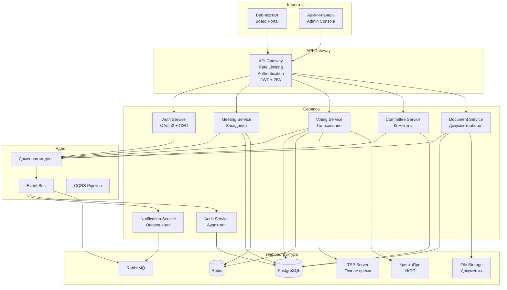

---

## Системная архитектура

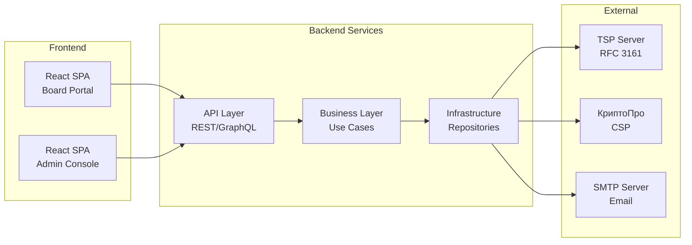

---

## Структура каталогов

```
SamorodinkaTech.Fiducia/
├── src/
│   ├── Api/                          # REST API (ASP.NET Core)
│   │   ├── Controllers/
│   │   ├── Filters/
│   │   ├── Middleware/
│   │   └── Program.cs
│   ├── Application/                  # Application Layer (Use Cases)
│   │   ├── Contracts/                # Interfaces
│   │   ├── Services/                 # Application Services
│   │   ├── Commands/                 # CQRS Commands
│   │   ├── Queries/                  # CQRS Queries
│   │   └── Validators/              # FluentValidation
│   ├── Domain/                       # Domain Layer (Core)
│   │   ├── Entities/                 # Domain Entities
│   │   ├── ValueObjects/            # Value Objects
│   │   ├── Aggregates/              # Aggregates
│   │   ├── Events/                  # Domain Events
│   │   ├── Exceptions/             # Domain Exceptions
│   │   └── Interfaces/             # Domain Interfaces
│   ├── Infrastructure/              # Infrastructure Layer
│   │   ├── Persistence/             # EF Core, Repositories
│   │   ├── Messaging/               # RabbitMQ, MediatR
│   │   ├── External/                # External Services (TSP, КриптоПро)
│   │   ├── Cache/                   # Redis
│   │   └── Storage/                 # File Storage
│   └── Common/                      # Shared Kernel
│       ├── Primitives/              # Base Classes
│       ├── Extensions/              # Extension Methods
│       └── Constants/              # Constants
├── tests/
│   ├── Unit/                        # Unit Tests
│   ├── Integration/                # Integration Tests
│   └── Functional/                 # Functional Tests
├── docs/                            # Documentation
├── tools/                           # Dev Tools, Scripts
├── .mimocode/                       # AI Assistant Config
├── *.sln                            # Solution Files
└── *.md                             # Documentation
```

---

## Компоненты системы

### 1. API Layer (Presentation)

**Ответственность**: Обработка HTTP-запросов, валидация, авторизация.

**Технологии**: ASP.NET Core 8, MediatR, FluentValidation.

**Ключевые элементы**:
- `Controllers/` — REST API endpoints
- `Filters/` — Action/Exception фильтры
- `Middleware/` — Pipeline middleware

### 2. Application Layer

**Ответственность**: Оркестрация бизнес-операций, транзакции, кросс-модульная коммуникация.

**Паттерны**: CQRS, MediatR, Use Cases.

**Ключевые элементы**:
- `Commands/` — Запись данных (Create, Update, Delete)
- `Queries/` — Чтение данных (Get, Search, Filter)
- `Services/` — Application Services
- `Validators/` — Валидация входных данных

### 3. Domain Layer

**Ответственность**: Бизнес-логика, правила, инварианты.

**Паттерны**: Domain Events, Value Objects, Aggregates.

**Ключевые элементы**:
- `Entities/` — Сущности с уникальным Identity
- `ValueObjects/` — Immutable value types
- `Aggregates/` — Корни агрегации
- `Events/` — Domain Events
- `Exceptions/` — Business Exceptions

### 4. Infrastructure Layer

**Ответственность**: Техническая реализация, доступ к данным, внешние интеграции.

**Технологии**: EF Core, RabbitMQ, Redis, MinIO/S3.

**Ключевые элементы**:
- `Persistence/` — Repositories, EF Core DbContext
- `Messaging/` — Event Bus, Message Handlers
- `External/` — API Clients (TSP, КриптоПро, SMTP)
- `Cache/` — Redis Cache
- `Storage/` — File Storage (MinIO/S3)

---

## Модули системы

### Module: Auth (Авторизация)

**Описание**: Управление пользователями, аутентификация, авторизация.

**Компоненты**:
- `UserService` — Управление пользователями
- `AuthService` — OAuth2 + 2FA
- `PepAgreementService` — Подписание Соглашения о ПЭП
- `RoleService` — RBAC матрица

**Доменная модель**:
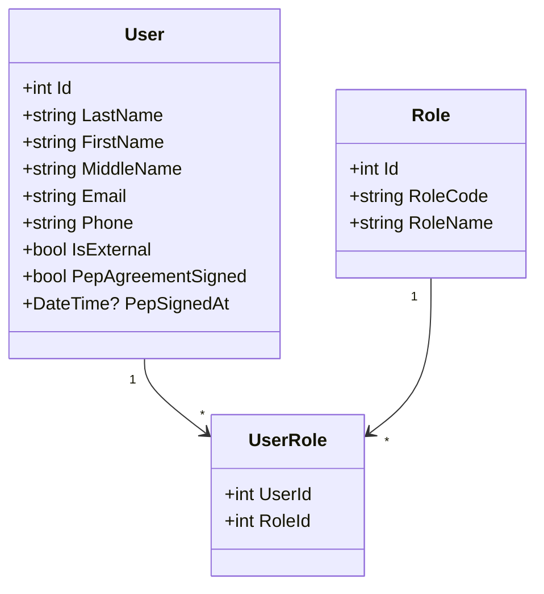

### Module: Meeting (Заседания)

**Описание**: Организация и управление заседаниями совета директоров.

**Компоненты**:
- `MeetingService` — Управление заседаниями
- `AgendaService` — Повестка дня
- `QuorumService` — Контроль кворума
- `NotificationService` — Уведомления о созыве

**Доменная модель**:
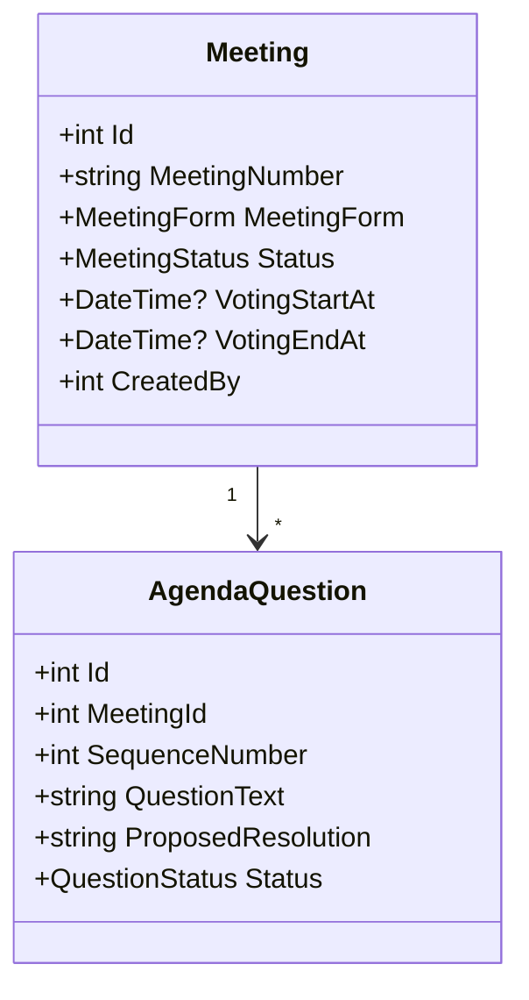

### Module: Voting (Голосование)

**Описание**: Электронное голосование с ПЭП/УКЭП.

**Компоненты**:
- `BulletinService` — Бюллетени
- `VoteService` — Подсчёт голосов
- `SignatureService` — Электронные подписи
- `TspService` — Метки времени

**Доменная модель**:
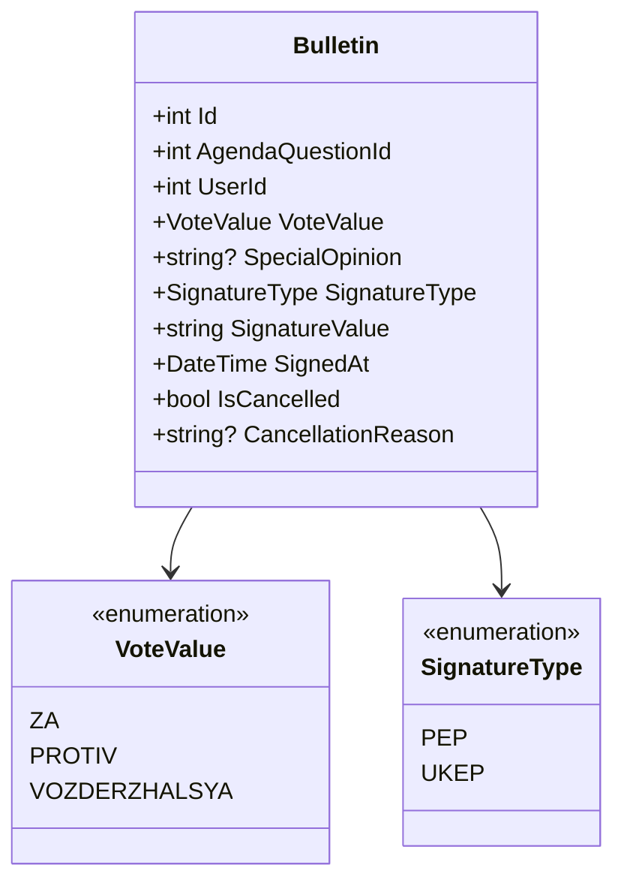

### Module: Committee (Комитеты)

**Описание**: Динамическое управление комитетами совета директоров.

**Компоненты**:
- `CommitteeService` — Управление комитетами
- `CommitteeMemberService` — Члены комитетов
- `CommitteeTaskService` — Поручения комитетам
- `CommitteeMeetingService` — Заседания комитетов

**Доменная модель**:
```mermaid
classDiagram
    class Committee {
        +int Id
        +string Code
        +string Name
        +BehaviorType BehaviorType
        +bool IsActive
        +int? ChairId
        +int? SecretaryId
    }

    class CommitteeMember {
        +int CommitteeId
        +int UserId
    }

    class CommitteeTask {
        +int Id
        +int CommitteeId
        +int? AgendaQuestionId
        +string TaskDescription
        +DateTime DeadlineAt
        +TaskStatus Status
        +int CreatedBy
    }

    class BehaviorType {
        <<enumeration>>
        CONTROL
        STRATEGIC
    }

    Committee --> BehaviorType
    Committee "1" --> "*" CommitteeMember
    Committee "1" --> "*" CommitteeTask
```

### Module: Document (Документооборот)

**Описание**: Генерация и управление документами по ГОСТ Р 7.0.97-2025.

**Компоненты**:
- `ProtocolService` — Протоколы заседаний
- `GostTemplateService` — ГОСТ-шаблоны
- `WatermarkService` — Водяные знаки
- `FileStorageService` — Хранилище файлов

### Module: Audit (Аудит)

**Описание**: Некорректируемый журнал аудита ИБ.

**Компоненты**:
- `AuditLogService` — Журнал аудита
- `SecurityEventService` — События безопасности

---

## Взаимодействие модулей

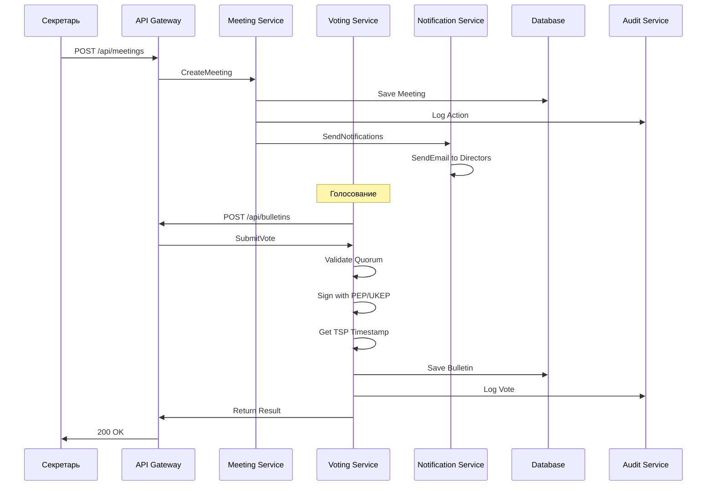

---

## Поток данных

### Поток организации заседания

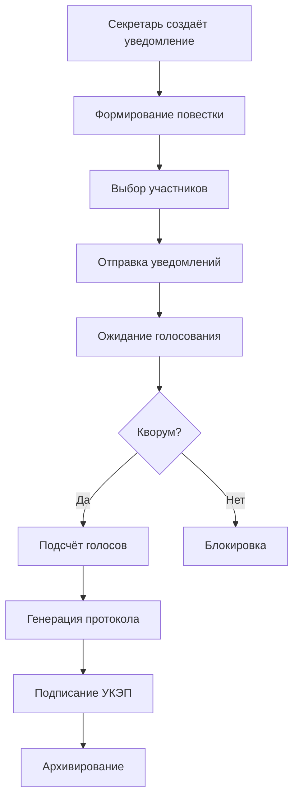

### Поток офлайн-голосования

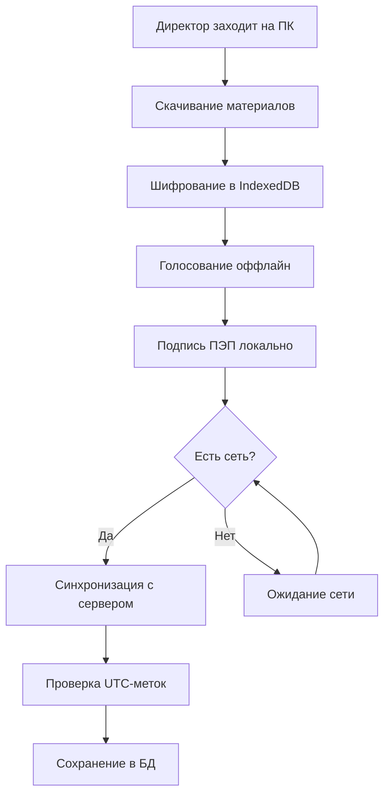

---

## Требования к производительности

| Метрика | Целевое значение |
|---------|------------------|
| Latency API (p95) | < 200ms |
| Latency API (p99) | < 500ms |
| Throughput | 500 RPS |
| Concurrent Users | 1000 |
| Data Availability | 99.9% |
| Recovery Time Objective | < 15 мин |
| Recovery Point Objective | < 5 мин |

---

## Схема развёртывания

> Ниже приведены два описания: **фактическое** текущее развёртывание (as-is)
> и **целевое** развёртывание для Фазы 3 (to-be), закреплённое решениями
> ADR-001..ADR-007. Их не следует путать — as-is значительно проще и не
> содержит части компонентов, упомянутых в to-be диаграмме.

### Текущая реализация (as-is)

Фактически развёрнуты два независимых Blazor Server приложения и одна БД,
без внешних инфраструктурных сервисов:

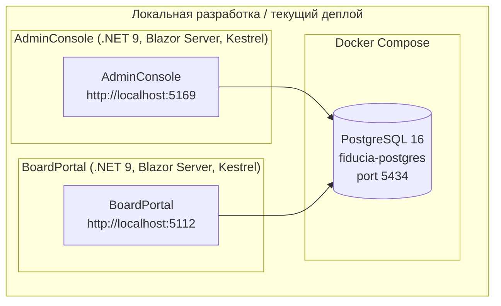

**Ключевые отличия от целевой архитектуры**:

| Компонент | Целевая архитектура (to-be) | Фактическое состояние (as-is) |
|-----------|------------------------------|-------------------------------|
| Приложения | API Instance 1/2 за Load Balancer | Два отдельных Blazor Server приложения (AdminConsole, BoardPortal), без балансировщика |
| БД | PostgreSQL Primary + Replica | Один инстанс PostgreSQL 16 (`fiducia-postgres`, порт 5434), без реплики |
| Кэш | Redis Cluster (Primary + Replica) | Отсутствует |
| Message Broker | RabbitMQ (2 узла) | Отсутствует — коммуникация in-process |
| Файловое хранилище | MinIO/S3 | Не реализовано |
| TSP Server | Внешний сервис меток времени | Не реализовано |
| КриптоПро (УКЭП) | Внешняя интеграция | Не реализовано (см. "Известные проблемы" в `AGENTS.md`) |
| Сессии | — | JWT cookie через `ISessionService`, без Redis |

### Целевая архитектура (to-be, Фаза 3)

Ориентир для масштабирования, зафиксированный в ADR-001..ADR-007. Не
описывает текущее развёртывание.

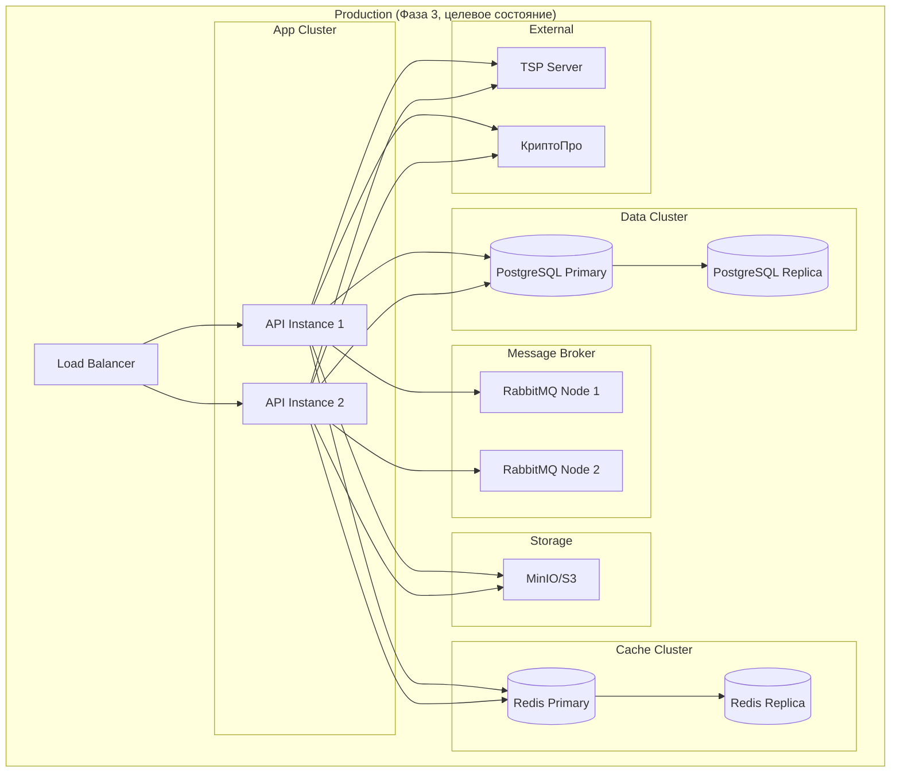

---

## Бизнес-уровень: трассируемость требований законодательства

Отображение бизнес/юридического уровня ведётся как отдельный слой
трассируемости между нормами федеральных законов и техническими
компонентами системы, зафиксированный в **ADR-008** и подробно раскрытый в
отдельном документе [`docs/legal-traceability.md`](legal-traceability.md).
Здесь приведена сводная таблица соответствия:

| Закон | Требование | Модуль/Компонент | Статус реализации |
|-------|-----------|-------------------|--------------------|
| 208-ФЗ (АО) | Автоматический контроль кворума (ст. 68) | Meeting → `QuorumService` | Реализовано |
| 208-ФЗ (АО) | Фиксация участников в протоколе (ст. 181.2 ГК РФ) | Document → `ProtocolService` | Реализовано |
| 208-ФЗ (АО) | Дедлайн 3 календарных дня после заседания | Meeting → `MeetingService` | Реализовано |
| 14-ФЗ (ООО) | Учёт письменных мнений отсутствующих директоров | Meeting → `MeetingService` | Частично |
| 14-ФЗ (ООО) | Контроль кворума (ст. 32) | Meeting → `QuorumService` | Реализовано |
| 63-ФЗ (ЭП) | Блокировка входа до подписания Соглашения о ПЭП | Auth → `PepAgreementService` | Реализовано |
| 63-ФЗ (ЭП) | УКЭП через КриптоПро | Voting → `SignatureService` | Не реализовано |
| 63-ФЗ (ЭП) | Защита от манипуляций с временем (TSP) | Voting → `TspService` | Не реализовано |
| 152-ФЗ (ПДн) | Некорректируемый аудит-лог | Audit → `AuditLogService` | Реализовано |
| 152-ФЗ (ПДн) | Локализация данных на территории РФ | Infrastructure → PostgreSQL (РФ-хостинг) | Организационно |
| 152-ФЗ (ПДн) | Шифрование чувствительных данных | Domain/Infrastructure | Частично |

Подробное описание методологии ведения этой матрицы, её актуализации при
изменении законодательства и ответственных за каждую строку — в ADR-008 и
в `docs/legal-traceability.md`.
