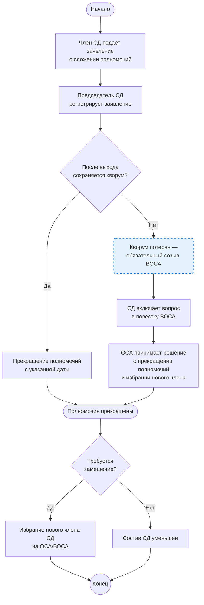

## Бизнес-процесс: Сложение полномочий члена Совета директоров

1. Назначение процесса

Определение порядка добровольного сложения полномочий членом совета директоров (СД) акционерного общества в соответствии с законодательством и уставом.

2. Входные данные

Заявление члена СД о добровольном сложении полномочий (письменная форма).

Информация о текущем составе СД и кворуме.

Устав общества (возможность сложения без решения ОСА, порядок замещения).

3. Выходные данные

Прекращение полномочий члена СД с определённой даты.

При необходимости — созыв внеочередного общего собрания акционеров (ВОСА) для избрания нового члена СД.

4. Описание этапов процесса

Этап 1. Подача заявления

Член СД направляет председателю СД письменное заявление о добровольном сложении полномочий с указанием желаемой даты прекращения. Заявление регистрируется в системе и становится основанием для запуска процесса.

Этап 2. Проверка кворума

После прекращения полномочий численность СД не должна стать менее кворума, установленного уставом (не менее половины от числа избранных членов, п. 2 ст. 68 208-ФЗ). Если после выхода члена кворум теряется — оставшиеся члены обязаны созвать ВОСА для избрания нового состава.

Этап 3. Принятие решения

Возможны два сценария в зависимости от устава:

Сценарий А: полномочия прекращаются автоматически с даты, указанной в заявлении (или с даты получения заявления председателем СД).

Сценарий Б: решение о прекращении полномочий принимается общим собранием акционеров (пп. 4 п. 1 ст. 48 208-ФЗ). В этом случае председатель СД инициирует созыв ОСА/ВОСА.

Этап 4. Замещение (при необходимости)

Если уставом предусмотрено кумулятивное голосование (ст. 66 208-ФЗ), выбывшего члена нельзя заменить единоличным решением СД — требуется решение общего собрания. СД включает вопрос об избрании в повестку ближайшего ОСА/ВОСА.

5. Техническая реализация в системе

- Заявление о сложении полномочий создаёт запись в таблице `board_member_appointments` с полем `resigned_at`.
- При автоматическом прекращении (сценарий А) система обновляет `resigned_at` немедленно.
- При необходимости решения ОСА (сценарий Б) система создаёт проект ОСА с вопросом «О досрочном прекращении полномочий члена СД».
- Если после сложения численность СД падает ниже кворума — система генерирует предупреждение и блокирует принятие новых решений до восстановления состава.

6. Юридические основания

| Норма | Содержание |
|-------|-----------|
| пп. 4 п. 1 ст. 48 208-ФЗ | Общее собрание вправе досрочно прекратить полномочия членов СД |
| п. 1 ст. 66 208-ФЗ | Члены СД избираются общим собранием; могут быть переизбраны досрочно |
| п. 2 ст. 68 208-ФЗ | Кворум СД — не менее половины от числа избранных членов |

