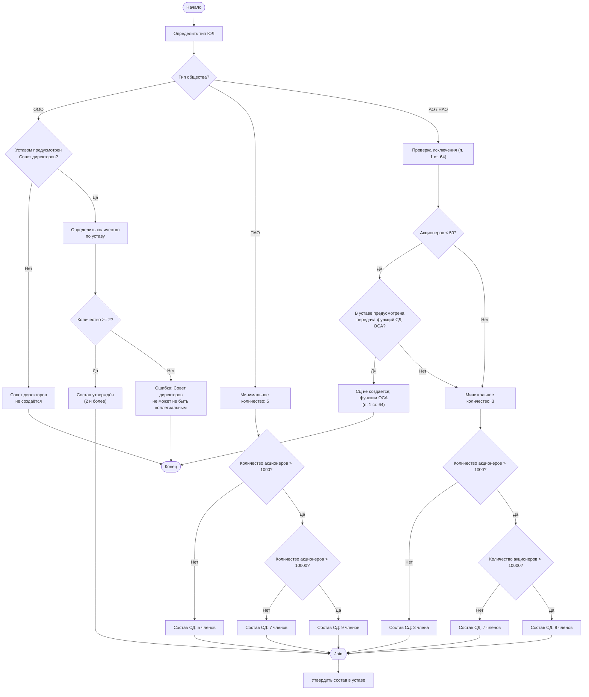

## Бизнес-процесс: Определение минимального состава Совета директоров

1. Назначение процесса

Определение минимального количества членов Совета директоров (СД) или решения о его отсутствии в зависимости от типа ЮЛ и устава с учётом требования коллегиальности.

2. Входные данные

- Тип юридического лица (ООО, ПАО, АО/НАО)
- Устав общества (для ООО — наличие/отсутствие СД и его состав)
- Количество акционеров (для АО)
- Наличие в уставе положения по п. 1 [ст. 64](../laws/article-64.md) Закона «Об АО» (передача функций СД общему собранию при числе акционеров < 50)

3. Выходные данные

Утверждённый минимальный состав совета директоров, закреплённый в уставе, или решение о его отсутствии.

4. Этапы процесса

Шаг 1. Определение типа ЮЛ

Проверяется организационно-правовая форма: ООО, ПАО или АО/НАО.

Шаг 2. Для ООО — проверка устава

- Если уставом не предусмотрен СД → орган не создаётся, процесс завершается.
- Если уставом предусмотрен СД → проверяется количество членов, указанное в уставе.
- Если количество < 2 → ошибка: совет директоров не может не быть коллегиальным.
- Если количество ≥ 2 → состав утверждён.

Шаг 3. Для АО (ПАО, АО/НАО)

Исключение для непубличных АО (НАО) по п. 1 ст. 64 Закона «Об АО»:

- Если акционеров — владельцев голосующих акций < 50 и уставом предусмотрено, что функции совета директоров осуществляет общее собрание акционеров (ОСА), совет директоров не создаётся — его функции выполняет ОСА.
- Если исключение не применяется, минимальное количество членов совета директоров устанавливается законом:
  - ПАО → 5 членов.
  - АО/НАО → 3 члена.

Шаг 4. Корректировка по числу акционеров (для всех АО)

- Если акционеров > 1000 → минимум увеличивается до 7.
- Если акционеров > 10 000 → минимум увеличивается до 9.

Шаг 5. Закрепление состава

Утверждённое количество фиксируется в уставе общества.

5. Итоговые правила со ссылками на законы

| Тип общества | Условие | Минимальное количество членов СД | Норма закона |
|---|---|---:|---|
| ООО | Уставом не предусмотрен | Не создаётся | [п. 4 ст. 65.3 ГК РФ](../laws/article-gk-65.3.md); [п. 2 ст. 32 Закона об ООО](../laws/article-14fz-32.md) |
| ООО | Уставом предусмотрен | ≥ 2 (определяется уставом) | Коллегиальность: [п. 4 ст. 65.3 ГК РФ](../laws/article-gk-65.3.md); кворум ≥ 1/2: [п. 3.1 ст. 32 Закона об ООО](../laws/article-14fz-32.md) |
| ПАО | Всегда | 5 (7 при >1000, 9 при >10000 акционеров) | п. 3 [ст. 66](../laws/article-66.md) Закона об АО |
| АО / НАО | Акционеров < 50 и уставом предусмотрено выполнение функций СД общим собранием | Не создаётся (функции выполняет ОСА) | п. 1 [ст. 64](../laws/article-64.md) Закона об АО |
| АО / НАО | В остальных случаях | 3 (7 при >1000, 9 при >10000 акционеров) | [п. 3 ст. 66](../laws/article-66.md) Закона об АО |

