# Бизнес-процесс: Ввод в ИС устава Общества и протоколов (ОСА и СД)

Настоящий документ описывает бизнес-процесс ввода в информационную систему (ИС) ключевых параметров, содержащихся в уставе Общества и протоколах общего собрания акционеров (ОСА) и первого заседания Совета директоров (СД). Протокол ОСА является первичным документом, на котором избирается состав Совета директоров. На основе этого состава проводится первое организационное заседание СД для избрания Председателя и начала работы.

**Важное требование:** Настройка состава Совета директоров в информационной системе выполняется **на каждый календарный год отдельно**. При этом в ИС обязательно прикладываются файлы документов, на основании которых производится настройка.

---

## 1. Ввод данных из устава Общества

Устав Общества является основным документом, определяющим структуру и состав органов управления. В ИС подлежат вводу следующие параметры:

### 1.1. Реквизиты устава

| Параметр | Описание |
|----------|----------|
| **Год создания устава** | Год, в котором устав был впервые утвержден |
| **Год последнего изменения** | Год внесения последних изменений в устав |
| **Номер версии** | Версия устава (при наличии) |

### 1.2. Количественный состав Совета директоров

**Источник данных:** Устав общества или решение общего собрания акционеров .

**Порядок ввода:** В ИС фиксируется количественный состав Совета директоров в соответствии с уставом. Законодательство устанавливает минимальные требования к этому числу, которые зависят от типа общества и количества акционеров :

| Категория общества | Минимальное количество членов СД |
| :--- | :--- |
| Публичное АО (менее 1000 акционеров) | 5 |
| Непубличное АО (менее 1000 акционеров) | 3 |
| АО с числом акционеров от 1000 до 10000 | 7 |
| АО с числом акционеров более 10000 | 9 |

Количество членов Совета директоров может быть больше минимального, но не может быть меньше. Устав определяет точную цифру, которая и фиксируется в ИС .

### 1.3. Наличие должности "Заместитель председателя Совета директоров"

**Источник данных:** Устав и (или) Положение о Совете директоров.

**Порядок ввода:** Устав или внутренние документы могут предусматривать должность заместителя председателя Совета директоров. Если такая должность существует, в ИС вносится отметка о наличии этой роли. Заместитель избирается по решению Совета директоров, обычно из числа членов Совета . Заместитель председателя исполняет его функции в случае отсутствия последнего .

### 1.4. Наличие должности "Секретарь Совета директоров"

**Источник данных:** Устав и (или) Положение о Совете директоров, а также решение Совета директоров.

**Порядок ввода:** Наличие секретаря Совета директоров может быть как предусмотрено уставом, так и быть решением самого Совета. В ИС фиксируется, предусмотрена ли эта должность . Секретарь может быть как членом Совета, так и работником Общества.

---

## 2. Ввод данных из протокола ОСА об избрании Совета директоров

Протокол общего собрания акционеров (ОСА) является первичным документом, на основании которого формируется состав Совета директоров.

### 2.1. Реквизиты протокола ОСА

| Параметр | Описание |
|----------|----------|
| **Год проведения ОСА** | Календарный год проведения собрания |
| **Номер протокола** | Порядковый номер протокола ОСА |
| **Дата проведения** | Дата проведения общего собрания акционеров |
| **Тип собрания** | Годовое (ГОСА) или внеочередное (ВОСА) |

### 2.2. Сведения об избранном составе Совета директоров

Из протокола ОСА в ИС вносятся следующие сведения:

| Параметр | Описание |
|----------|----------|
| **Список избранных членов СД** | Ф.И.О. всех избранных членов Совета директоров |
| **Результаты кумулятивного голосования** | Количество голосов, поданных за каждого кандидата |
| **Срок полномочий** | До следующего годового общего собрания акционеров |

**Правовое основание:** Избрание Совета директоров осуществляется на общем собрании акционеров в порядке, предусмотренном **п. 1, 3 [ст. 66](../laws/article-66.md) Закона № 208-ФЗ** . Для публичных обществ и непубличных с числом акционеров более 1000 применяется **кумулятивное голосование ([п. 4 ст. 66](../laws/article-66.md) Закона № 208-ФЗ)** .

---

## 3. Ввод данных из протокола первого заседания Совета директоров

Первое заседание Совета директоров нового состава является организационным. На нем избирается Председатель Совета директоров и решаются другие вопросы организации работы.

### 3.1. Реквизиты протокола первого заседания СД

| Параметр | Описание |
|----------|----------|
| **Год проведения** | Календарный год проведения заседания |
| **Номер протокола СД** | Порядковый номер протокола заседания СД |
| **Дата проведения** | Дата проведения первого заседания СД |

### 3.2. Временный председательствующий

До момента избрания постоянного Председателя заседание должен кто-то вести. Эту роль исполняет **временный председательствующий**. На практике используются три основных способа его назначения:

| Способ | Описание |
|--------|----------|
| **По уставу — старший по возрасту** | В уставе может быть закреплено, что функции председательствующего на первом заседании исполняет старейший по возрасту член Совета директоров |
| **По решению ОСА** | В решении общего собрания акционеров об избрании Совета директоров может быть указано конкретное лицо, которое созывает и ведет первое заседание |
| **По решению СД** | Члены Совета избирают временного председательствующего из своего состава простым большинством голосов |

В ИС вносится информация о том, какой из этих сценариев реализован, и кто именно исполнял функции временного председательствующего.

### 3.3. Избрание постоянного Председателя Совета директоров

**Процедура голосования:**

- Кандидат должен быть членом Совета директоров .
- Кворум для голосования: **не менее 50% от числа избранных членов** Совета .
- Решение принимается **большинством голосов от общего числа избранных членов** Совета, а не от числа присутствующих **([п. 2 ст. 66](../laws/article-66.md) Закона № 208-ФЗ)** .
- Председатель **не может быть** Генеральным директором или членом правления общества **([п. 2 ст. 66](../laws/article-66.md) Закона № 208-ФЗ)** .

**Результаты:**

- **Если Председатель избран:** В ИС фиксируется Ф.И.О. избранного, дата избрания и результаты голосования.
- **Если Председатель не избран:** В ИС фиксируются результаты голосования и причина (недостаток голосов). В этом случае Совет назначает исполняющего функции Председателя из числа членов СД до следующего заседания **([п. 3 ст. 67](../laws/article-67.md) Закона № 208-ФЗ)** .

### 3.4. Секретарь заседания и подписание протокола

На первом заседании избирается секретарь заседания из присутствующих членов СД для ведения протокола и оформления документов.

**Кто подписывает протокол СД?**

| Случай | Кто подписывает | Правовое основание |
|--------|-----------------|-------------------|
| Председатель избран | **Председатель СД** | [п. 4 ст. 68](../laws/article-68.md) Закона № 208-ФЗ  |
| Председатель не избран, назначен исполняющий | **Исполняющий функции Председателя** | [п. 3 ст. 67](../laws/article-67.md) Закона № 208-ФЗ  |
| Председатель отсутствует, есть Заместитель | **Заместитель Председателя** | [п. 2, 3 ст. 67](../laws/article-67.md) Закона № 208-ФЗ  |
| Секретарь СД назначен | **Секретарь СД** (в дополнение к Председателю) | [п. 4 ст. 68](../laws/article-68.md) Закона № 208-ФЗ, п. 11.4 Положения о СД  |

**Важно:** Секретарь Совета директоров **не подписывает** протокол, если это не предусмотрено уставом или внутренним документом. В этом случае протокол подписывает только председательствующий на заседании .

---

## 4. Настройка Совета директоров в ИС на каждый год

Информационная система должна обеспечивать **ежегодную настройку состава Совета директоров** на каждый календарный год отдельно. Это связано с тем, что:

- Полномочия членов Совета директоров действуют **до следующего годового общего собрания акционеров** .
- По итогам каждого ГОСА состав Совета может меняться (переизбрание, довыборы, ротация).
- В течение года могут происходить изменения (избрание нового Председателя, назначение Заместителя, введение должности Секретаря).

### 4.1. Требования к настройке ИС

| Требование | Описание |
|------------|----------|
| **Привязка к году** | Каждый состав Совета директоров настраивается в ИС с указанием календарного года, на который он действует |
| **Возможность исторического хранения** | ИС должна сохранять все предыдущие составы СД с возможностью просмотра |
| **Приоритет текущего года** | При формировании документов и проведении заседаний ИС использует настройки текущего года |

### 4.2. Приложение файлов-оснований

При настройке состава Совета директоров в ИС **обязательно прикладываются файлы документов**, на основании которых производится настройка:

| Документ | Описание | Обязательность |
|----------|----------|----------------|
| **Устав Общества** | Текущая редакция устава, содержащая количественный состав СД и правила его формирования | **Обязательно** |
| **Протокол ОСА об избрании СД** | Протокол общего собрания акционеров, на котором избран состав СД | **Обязательно** |
| **Протокол первого заседания СД** | Протокол организационного заседания, на котором избран Председатель СД | **Обязательно** |
| **Положение о Совете директоров** | Внутренний документ, регулирующий работу СД (если есть) | Рекомендуется |
| **Решение о назначении Секретаря СД** | Документ о назначении Секретаря СД (если должность предусмотрена) | При наличии |

### 4.3. Порядок настройки ИС

1. **Открывается период настройки на календарный год** (например, 2026 год).

2. **Загружаются файлы документов-оснований:**
   - Устав (текущая редакция)
   - Протокол ОСА об избрании СД
   - Протокол первого заседания СД
   - Положение о СД (при наличии)

3. **Вводятся реквизитные данные:**
   - Количественный состав СД
   - Список членов СД (Ф.И.О.)
   - Председатель СД
   - Заместитель Председателя (если есть)
   - Секретарь СД (если есть)
   - Подписант протокола СД

4. **Проверка данных (валидация):**
   - Количество членов СД ≥ минимального
   - Все члены СД имеют Ф.И.О.
   - Председатель СД входит в состав
   - Председатель СД ≠ Генеральный директор
   - Заместитель (если есть) входит в состав

5. **Сохранение настроек и активация на календарный год.**

### 4.4. Изменения в течение года

В течение календарного года возможны изменения в составе СД. Порядок внесения изменений:

| Событие | Документ-основание | Действие в ИС |
|---------|-------------------|---------------|
| Избрание нового Председателя | Протокол заседания СД | Внести изменения → приложить протокол |
| Довыборы членов СД | Протокол ВОСА | Добавить новых членов → приложить протокол |
| Введение должности Секретаря | Решение СД | Добавить роль → приложить решение |
| Прекращение полномочий члена СД | Протокол ОСА/ВОСА | Деактивировать члена → приложить протокол |

---

## 5. Сводная таблица параметров для ввода в ИС

| № | Параметр | Источник данных | Примечание |
| :--- | :--- | :--- | :--- |
| 1 | **Реквизиты устава** (год создания, год изменения, версия) | Устав | — |
| 2 | **Файл устава** | Устав | Прикладывается в ИС |
| 3 | **Количественный состав СД** | Устав | Должен соответствовать требованиям закона  |
| 4 | **Заместитель председателя** | Устав/Решение СД | Указывается, предусмотрена ли должность |
| 5 | **Секретарь СД** | Устав/Решение СД | Указывается, предусмотрена ли должность |
| 6 | **Реквизиты протокола ОСА** (год, номер, дата, тип) | Протокол ОСА | — |
| 7 | **Файл протокола ОСА** | Протокол ОСА | Прикладывается в ИС |
| 8 | **Список избранных членов СД** | Протокол ОСА | Результаты кумулятивного голосования |
| 9 | **Реквизиты протокола СД** (год, номер, дата) | Протокол СД | — |
| 10 | **Файл протокола СД** | Протокол СД | Прикладывается в ИС |
| 11 | **Временный председательствующий** | Устав/Решение ОСА/Решение СД | Фиксируется способ назначения |
| 12 | **Избранный Председатель СД** | Протокол СД | Фиксируется избранное лицо и результат голосования |
| 13 | **Подписант протокола** | Протокол СД | Указывается, кто подписал протокол |

---

## 6. Концептуальная схема бизнес-процесса

```mermaid
graph TD
    %% Стили
    classDef process fill:#f8f9fa,stroke:#7f8c8d,stroke-width:1px,color:#2c3e50;
    classDef doc fill:#ffffff,stroke:#34495e,stroke-width:1px,color:#2c3e50;
    classDef role fill:#dfe6e9,stroke:#b2bec3,stroke-width:1px,color:#2c3e50;
    classDef decision fill:#fff3cd,stroke:#ffc107,stroke-width:2px,color:#2c3e50;
    classDef legal fill:#f39c12,stroke:#e67e22,stroke-width:2px,color:#fff;
    classDef input fill:#e8f4f8,stroke:#4a90d9,stroke-width:1px,color:#2c3e50;

    %% ===== СТАРТ =====
    Старт[Начало: Ввод данных в ИС<br>──────────────<br>На каждый календарный год<br>настраивается отдельный состав СД]:::process

    %% ===== БЛОК 1: УСТАВ =====
    Устав[Ввод данных из УСТАВА]:::process
    Устав_Реквизиты[Реквизиты устава<br>──────────────<br>• Год создания устава<br>• Год последнего изменения<br>• Номер версии]:::input
    Файл_Устав[Приложение: Файл устава<br>──────────────<br>Текущая редакция устава<br>прикрепляется в ИС]:::input
    КолСостав[Количественный состав СД<br>──────────────<br>Фиксируется численность СД<br>──────────────<br>Минимум:<br>• ПАО: 5 членов<br>• НеПАО: 3 члена<br>• > 1000 акц: 7 членов<br>• > 10000 акц: 9 членов]:::input
    Заместитель[Наличие Заместителя<br>председателя СД]:::input
    Секретарь[Наличие Секретаря СД]:::input

    %% ===== БЛОК 2: ПРОТОКОЛ ОСА =====
    Протокол_ОСА[Ввод данных из ПРОТОКОЛА ОСА<br>об избрании Совета директоров]:::process
    Протокол_Реквизиты[Реквизиты протокола ОСА<br>──────────────<br>• Год проведения ОСА<br>• Номер протокола<br>• Дата проведения<br>• Тип собрания]:::input
    Файл_ОСА[Приложение: Файл протокола ОСА<br>──────────────<br>Протокол ОСА об избрании СД<br>прикрепляется в ИС]:::input
    Состав_СД[Сведения об избранном составе СД<br>──────────────<br>• Список избранных членов СД<br>• Результаты кумулятивного голосования<br>• Срок полномочий]:::input

    %% ===== ПЕРВОЕ ЗАСЕДАНИЕ =====
    ПервоеЗаседание_СД[Ввод данных из ПРОТОКОЛА<br>ПЕРВОГО ЗАСЕДАНИЯ СД]:::process
    Протокол_СД_Реквизиты[Реквизиты протокола СД<br>──────────────<br>• Год проведения<br>• Номер протокола СД<br>• Дата проведения]:::input
    Файл_СД[Приложение: Файл протокола СД<br>──────────────<br>Протокол первого заседания СД<br>прикрепляется в ИС]:::input

    %% ===== ВРЕМЕННЫЙ ПРЕДСЕДАТЕЛЬСТВУЮЩИЙ =====
    Временный[Определение Временного<br>председательствующего]:::decision
    Временный_Старший[Способ 1: Старший по возрасту]:::legal
    Временный_ОСА[Способ 2: Назначен ОСА]:::legal
    Временный_Решение[Способ 3: Решение СД]:::legal

    %% ===== ИЗБРАНИЕ ПРЕДСЕДАТЕЛЯ =====
    Избрание[Голосование по избранию<br>Председателя СД<br>──────────────<br>• кандидат — член СД<br>• кворум: ≥ 50% избранных членов<br>• решение: большинство ОТ ОБЩЕГО<br>  числа избранных членов<br>• Председатель НЕ может быть<br>  Генеральным директором]:::process
    Избран{Председатель избран?}:::decision

    Председатель_Избран[Председатель избран<br>──────────────<br>Фиксируется в ИС:<br>• Ф.И.О.<br>• дата избрания<br>• результаты голосования]:::input
    Председатель_Не_Избран[Председатель не избран<br>──────────────<br>Совет назначает исполняющего<br>функции Председателя]:::input

    %% ===== СЕКРЕТАРЬ И ПРОТОКОЛ =====
    Секретарь_Заседания[Назначение Секретаря заседания]:::process

    Подписание{Кто подписывает<br>протокол СД?}:::decision

    Подписание_Председатель[Протокол подписывает<br>ПРЕДСЕДАТЕЛЬ СД]:::legal
    Подписание_Исполняющий[Протокол подписывает<br>ИСПОЛНЯЮЩИЙ ФУНКЦИИ<br>ПРЕДСЕДАТЕЛЯ]:::legal
    Подписание_Заместитель[Протокол подписывает<br>ЗАМЕСТИТЕЛЬ ПРЕДСЕДАТЕЛЯ]:::legal
    Подписание_Секретарь[Протокол также подписывает<br>СЕКРЕТАРЬ СД<br>──────────────<br>Если должность предусмотрена]:::legal

    %% ===== КОНЕЦ =====
    Конец[Данные введены в ИС<br>──────────────<br>Состав СД настроен<br>на календарный год<br>──────────────<br>Файлы приложены:<br>✓ Устав<br>✓ Протокол ОСА<br>✓ Протокол СД]:::process

    %% ===== СВЯЗИ =====
    Старт -->|Вводятся| Устав
    Устав -->|Вводятся| Устав_Реквизиты
    Устав -->|Прикладывается| Файл_Устав
    Устав_Реквизиты -->|Вводятся| КолСостав
    Устав -->|Вводятся| КолСостав
    Устав -->|Вводятся| Заместитель
    Устав -->|Вводятся| Секретарь

    Старт -->|Вводятся| Протокол_ОСА
    Протокол_ОСА -->|Вводятся| Протокол_Реквизиты
    Протокол_ОСА -->|Прикладывается| Файл_ОСА
    Протокол_Реквизиты -->|Вводятся| Состав_СД

    Состав_СД -->|На основе состава СД<br>проводится| ПервоеЗаседание_СД
    ПервоеЗаседание_СД -->|Вводятся| Протокол_СД_Реквизиты
    ПервоеЗаседание_СД -->|Прикладывается| Файл_СД
    Протокол_СД_Реквизиты -->|Определяется| Временный

    Временный -->|По уставу| Временный_Старший
    Временный -->|По решению ОСА| Временный_ОСА
    Временный -->|По решению СД| Временный_Решение

    Временный_Старший -->|Ведет заседание| Избрание
    Временный_ОСА -->|Ведет заседание| Избрание
    Временный_Решение -->|Ведет заседание| Избрание

    Избрание -->|Результат| Избран
    Избран -->|Да| Председатель_Избран
    Избран -->|Нет| Председатель_Не_Избран

    Председатель_Избран -->|Назначает| Секретарь_Заседания
    Председатель_Не_Избран -->|Назначает| Секретарь_Заседания

    Секретарь_Заседания -->|Оформляет| Подписание
    Подписание -->|Если есть Председатель| Подписание_Председатель
    Подписание -->|Если Председатель не избран| Подписание_Исполняющий
    Подписание -->|Если Председатель отсутствует| Подписание_Заместитель
    Подписание -->|Если секретарь назначен| Подписание_Секретарь

    Председатель_Избран -->|Данные сохранены| Конец
    Председатель_Не_Избран -->|Данные сохранены| Конец
    Подписание_Председатель -->|Данные сохранены| Конец
    Подписание_Исполняющий -->|Данные сохранены| Конец
    Подписание_Заместитель -->|Данные сохранены| Конец
    Подписание_Секретарь -->|Данные сохранены| Конец
```

## 7. Ключевые правовые нормы

| Действие | Правовое основание |
|----------|-------------------|
| Избрание СД на ОСА | [п. 1, 3 ст. 66](../laws/article-66.md) Закона № 208-ФЗ  |
| Кумулятивное голосование | [п. 4 ст. 66](../laws/article-66.md) Закона № 208-ФЗ  |
| Срок полномочий СД — до следующего ГОСА | [п. 1 ст. 66](../laws/article-66.md) Закона № 208-ФЗ  |
| ГОСА — с 1 марта по 30 июня | [п. 3 ст. 47](../laws/article-47.md) Закона № 208-ФЗ  |
| Протокол ОСА — не позднее 3 рабочих дней | [п. 1 ст. 63](../laws/article-63.md) Закона № 208-ФЗ  |
| Избрание Председателя СД | [п. 2 ст. 66](../laws/article-66.md) Закона № 208-ФЗ  |
| Председатель не может быть Генеральным директором | [п. 2 ст. 66](../laws/article-66.md) Закона № 208-ФЗ  |
| При отсутствии Председателя — один из членов СД | [п. 3 ст. 67](../laws/article-67.md) Закона № 208-ФЗ  |
| Кворум СД — не менее половины от числа избранных членов | [п. 2 ст. 68](../laws/article-68.md) Закона № 208-ФЗ  |
| Протокол СД подписывается Председателем и Секретарем (если есть) | [п. 4 ст. 68](../laws/article-68.md) Закона № 208-ФЗ  |
| Секретарь СД — не обязан, может быть назначен | [п. 1 ст. 68](../laws/article-68.md) Закона № 208-ФЗ  |

---

*Документ подготовлен на основе норм действующего законодательства РФ по состоянию на 2026 год.*