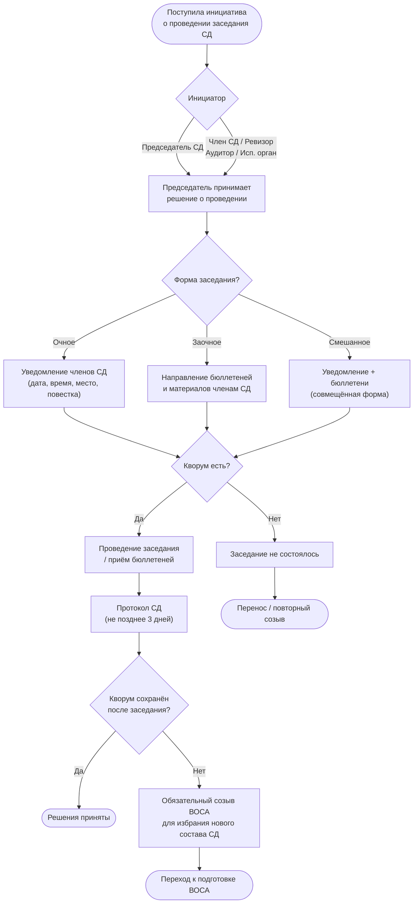

## Бизнес-процесс: Созыв заседания Совета директоров

### 1. Назначение процесса

Определение порядка инициирования, подготовки и созыва заседания совета директоров (СД) в соответствии со [ст. 68](../laws/article-68.md) Федерального закона № 208-ФЗ «Об акционерных обществах».

### 2. Инициаторы созыва

Решение о проведении заседания принимается председателем СД по собственной инициативе либо по требованию (п. 1 ст. 68 208-ФЗ):

| Инициатор | Основание |
|-----------|-----------|
| Председатель СД | Собственная инициатива |
| Член совета директоров | Требование к председателю |
| Ревизионная комиссия (ревизор) | Требование к председателю |
| Аудиторская организация | Требование к председателю |
| Исполнительный орган общества | Требование к председателю |

### 3. Формы проведения заседания

Согласно [п. 1 ст. 68](../laws/article-68.md) 208-ФЗ, решения СД могут приниматься:

- **На заседании** — очное присутствие членов СД (включая дистанционное участие с помощью электронных средств).
- **Заочным голосованием** — без проведения заседания, путём сбора документов с волеизъявлением членов СД.
- **Смешанная форма** — заседание с совмещением очного и заочного голосования.

> **Ограничение:** первое (организационное) заседание совета директоров не может быть проведено в заочной форме.

### 4. Сроки уведомления

Уведомление о проведении заседания направляется членам СД в срок, определённый уставом или внутренним документом общества. Закон не устанавливает жёсткого минимального срока, но деловая практика рекомендует:

| Тип заседания | Рекомендуемый срок уведомления |
|---------------|-------------------------------|
| Очередное заседание | Не менее 5 рабочих дней |
| Внеочередное заседание | Не менее 3 календарных дней |

Уведомление должно содержать: дату, время, место/способ проведения, повестку дня и материалы к заседанию.

### 5. Кворум и потеря кворума

**Кворум** для принятия решений — не менее половины от числа избранных членов СД ([п. 2 ст. 68](../laws/article-68.md) 208-ФЗ). Уставом может быть определён больший кворум.

**При потере кворума** (численность стала менее ½ избранных членов):

1. Совет обязан принять решение о созыве **внеочередного общего собрания акционеров (ВОСА)** для избрания нового состава СД или, если предусмотрено уставом, для доизбрания членов взамен выбывших.
2. Оставшиеся члены вправе принимать решение **только** о созыве ВОСА — иные решения недействительны.

### 6. Принятие решений

- Каждый член СД обладает **одним голосом**. Передача права голоса иному лицу не допускается.
- Решения принимаются **большинством голосов** участвующих членов ([п. 3 ст. 68](../laws/article-68.md) 208-ФЗ).
- Уставом может быть предусмотрено **право решающего голоса** председателя при равенстве голосов.

### 7. Протокол заседания

Протокол составляется не позднее **трёх дней** после проведения заседания или окончания приёма документов при заочном голосовании ([п. 4 ст. 68](../laws/article-68.md) 208-ФЗ).

Подписывается **председателем СД** (а в его отсутствие — членом СД, осуществляющим его функции). Подписант несёт ответственность за правильность составления протокола.

В протоколе указываются: дата, время, участники, повестка дня, результаты голосования с поименным указанием варианта каждого члена СД, принятые решения.

### 8. Блок-схема процесса

### 9. Практические рекомендации

- Закрепить в уставе или положении о СД конкретные сроки уведомления о заседаниях.
- При формировании повестки прикладывать все необходимые материалы — это снижает риск оспаривания решений.
- Вести учёт кворума перед каждым заседанием; при риске потери кворума — немедленно инициировать ВОСА.
- Хранить протоколы СД с поименными результатами голосования — это требование закона и основа для аудита.

### 10. Юридические основания

| Норма | Содержание |
|-------|-----------|
| [п. 1 ст. 68](../laws/article-68.md) 208-ФЗ | Инициаторы созыва, формы проведения (очная, заочная, смешанная) |
| [п. 2 ст. 68](../laws/article-68.md) 208-ФЗ | Кворум ≥ ½ избранных членов; обязанность созыва ВОСА при потере кворума |
| [п. 3 ст. 68](../laws/article-68.md) 208-ФЗ | Порядок принятия решений: большинство голосов, один голос у каждого члена |
| [п. 4 ст. 68](../laws/article-68.md) 208-ФЗ | Протокол СД: срок 3 дня, подписант, содержание, ответственность |
| [п. 1 ст. 66](../laws/article-66.md) 208-ФЗ | Срок полномочий СД — до следующего ГОСА |
