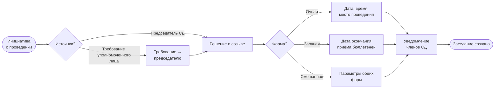

## Бизнес-процесс: Созыв заседания Совета директоров

### 1. Что такое «созыв»

Созыв заседания — это юридически значимый акт, которым председатель СД объявляет о проведении заседания и надлежащим образом уведомляет об этом членов совета директоров. Созыв завершается в момент, когда все члены СД получили уведомление. Всё, что происходит после (проведение, голосование, протокол) — не относится к созыву.

Правовая основа — п. 1 [ст. 68](../laws/article-68.md), п. 2 [ст. 67](../laws/article-67.md) Федерального закона № 208-ФЗ.

### 2. Кто инициирует

Председатель СД принимает решение о созыве по одному из двух сценариев (п. 1 ст. 68 208-ФЗ):

1. **По своей инициативе** — председатель сам определяет необходимость заседания и объявляет созыв.

2. **По требованию** — любой из перечисленных лиц направляет председателю требование о проведении заседания. Председатель **обязан** принять решение о созыве:

   - Член совета директоров
   - Ревизионная комиссия (ревизор) — внутренний орган контроля, избирается ОСА
   - Аудиторская организация — внешний независимый аудитор, утверждается ОСА (не путать с комитетом по аудиту СД)
   - Исполнительный орган общества

Требование должно содержать предлагаемую повестку дня.

### 3. Решение председателя о созыве

В решении председатель фиксирует три обязательных элемента:

| Элемент | Что определяется |
|---------|-----------------|
| **Форма** | Очная (включая дистанционное участие), заочная (бюллетени) или смешанная |
| **Дата и время** | Для очного заседания — дата/время начала; для заочного — дата окончания приёма бюллетеней |
| **Способ участия** | Адрес места проведения или платформа для дистанционного подключения |

> Первое организационное заседание нового состава СД не может быть заочным.

### 4. Уведомление членов СД

Уведомление направляется каждому члену совета директоров. Минимально необходимый состав уведомления:

- Дата, время проведения (или окончания приёма бюллетеней)
- Форма заседания (очная / заочная / смешанная)
- Место или способ подключения
- Повестка дня

**Срок уведомления** устанавливается уставом. Рекомендуемые значения:

- Очередное заседание — не менее 5 рабочих дней
- Внеочередное заседание — не менее 3 календарных дней

### 5. Момент завершения созыва

Созыв считается завершённым, когда уведомления направлены всем членам СД с соблюдением установленного срока. С этого момента заседание является созванным, и процесс переходит к проведению.

### 6. Блок-схема

### 7. Юридические основания

| Норма | Содержание |
|-------|-----------|
| [п. 1 ст. 68](../laws/article-68.md) 208-ФЗ | Решение о созыве принимается председателем; инициаторы созыва; формы проведения |
| [п. 2 ст. 67](../laws/article-67.md) 208-ФЗ | Председатель организует работу СД, принимает решение о проведении заседания |
