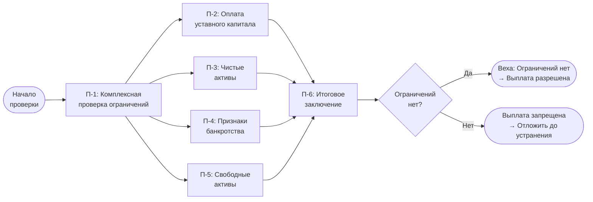

# Бизнес-процесс: Проверка финансовых ограничений на выплату дивидендов (ООО)

> **Область применения:** Общества с ограниченной ответственностью (ООО), планирующие выплату дивидендов.
>
> **Правовая основа:** [ст. 28 14-ФЗ](../laws/article-14fz-28.md) — порядок и сроки выплаты дивидендов; [ст. 29 14-ФЗ](../laws/article-14fz-29.md) — основания для увеличения/уменьшения уставного капитала.
>
> **Связанные документы:** [Диаграмма Ганта: выплата дивидендов в ООО](../gantt/dividend-distribution-ooo-gantt.md).

---

## 1. Назначение процесса

Проверка финансовых ограничений — обязательный этап **до принятия решения общего собрания участников (ОСУ)** о выплате дивидендов. Результат — заключение о возможности/невозможности выплаты, которое включается в материалы для общего собрания участников.

**Когда выполняется:** параллельно с подготовкой к ОСУ, до момента голосования по вопросу о дивидендах.

---

## 2. Таблица работ

| № | Работа | Ответственный | Срок | Результат |
|---|--------|---------------|------|-----------|
| П-1 | Проверка ограничений на принятие решения о выплате дивидендов | Финансовая служба + юристы | До подготовки материалов к ОСУ | Заключение: выплата разрешена |
| П-2 | Проверка оплаты уставного капитала | Финансовая служба / корпоративный блок | 1 раб. день | Нарушений нет |
| П-3 | Проверка чистых активов с учётом планируемой выплаты | Финансовая служба | 1–2 раб. дня | Ограничений нет |
| П-4 | Проверка отсутствия признаков банкротства | Финансовая служба + юристы | 1 раб. день | Ограничений нет |
| П-5 | Проверка наличия свободных активов для выплаты | Финансовая служба | 1 раб. день | Активы достаточны |
| П-6 | **Подтверждение возможности выплаты дивидендов** | Генеральный директор / уполномоченное лицо | 1 день | **Веха — «Ограничений нет»** |

---

## 3. Детальное описание работ

### П-1. Проверка ограничений на принятие решения о выплате дивидендов

Комплексная проверка всех условий [ст. 28 14-ФЗ](../laws/article-14fz-28.md). Выполняется параллельно с работами П-2 — П-5. Результат — итоговое заключение для общего собрания участников.

**Ответственные:** финансовая служба + юристы.

### П-2. Проверка оплаты уставного капитала

Проверяется, что уставный капитал общества полностью оплачен. Выплата дивидендов **запрещена** до полной оплаты всего уставного капитала общества.

**Источники данных:** устав, сведения из ЕГРЮЛ, внутренние регистры.

### П-3. Проверка чистых активов с учётом планируемой выплаты

Расчёт чистых активов (раздел I бухгалтерского баланса — итого по строке 1600 за вычетом строк 1400 и 1500). Проверяется два условия:

1. Стоимость чистых активов **не меньше** уставного капитала и резервного фонда.
2. После выплаты дивидендов стоимость чистых активов **не станет меньше** уставного капитала и резервного фонда.

**Срок:** 1–2 рабочих дня (включает расчёт сценария «до» и «после» выплаты).

### П-4. Проверка отсутствия признаков банкротства

Проверяется отсутствие оснований для признания общества банкротом. Выплата дивидендов **запрещена**, если на момент принятия решения об их выплате стоимость чистых активов общества меньше уставного капитала и резервного фонда либо станет меньше их размера в результате выплаты дивидендов.

**Ответственные:** финансовая служба + юристы.

### П-5. Проверка наличия свободных активов для выплаты

Проверяется, что активы общества (денежные средства, имущество) достаточны для выплаты дивидендов в полном объёме. В случае использования имущества для выплаты — проверяется соответствие требованиям устава.

**Примечание:** в отличие от АО, ООО не обязано раскрывать информацию о выплате дивидендов на сайте или в информационном агентстве.

### П-6. Подтверждение возможности выплаты дивидендов (Веха)

Генеральный директор (или уполномоченное лицо) подписывает итоговое заключение о возможности выплаты дивидендов. Заключение включается в повестку ОСУ как основание для принятия решения.

---

## 4. Блок-схема

---

## 5. Юридические основания

| Норма | Содержание |
|-------|-----------|
| [ст. 28 14-ФЗ](../laws/article-14fz-28.md) | Порядок и сроки выплаты дивидендов (не более 60 кал. дн.) |
| [ст. 29 14-ФЗ](../laws/article-14fz-29.md) | Основания для увеличения/уменьшения уставного капитала |
| [ст. 30 14-ФЗ](../laws/article-14fz-30.md) | Решение об увеличении уставного капитала |
| [ст. 33 14-ФЗ](../laws/article-14fz-33.md) | Компетенция ОСУ: решение о распределении прибыли |
