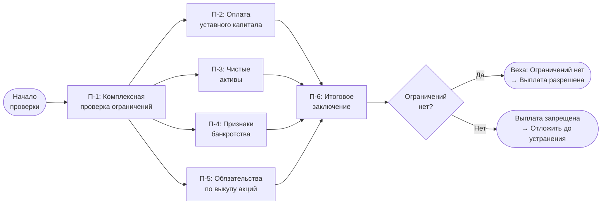

# Бизнес-процесс: Проверка финансовых ограничений на выплату дивидендов

> **Область применения:** Акционерные общества (АО), планирующие выплату дивидендов.
>
> **Правовая основа:** [ст. 43 208-ФЗ](../laws/article-43.md) — ограничения выплаты дивидендов.
>
> **Связанные документы:** [Диаграмма Ганта: выплата дивидендов в АО](../gantt/dividend-distribution-ao-gantt.md).

---

## 1. Назначение процесса

Проверка финансовых ограничений — обязательный этап **до принятия решения ОСА** о выплате дивидендов. Результат — заключение о возможности/невозможности выплаты, которое включается в материалы для совета директоров и общего собрания акционеров.

**Когда выполняется:** параллельно с подготовкой к ОСА, до момента голосования по вопросу о дивидендах.

---

## 2. Таблица работ

| № | Работа | Ответственный | Срок | Результат |
|---|--------|---------------|------|-----------|
| П-1 | Проверка ограничений на принятие решения о выплате дивидендов | Финансовая служба + юристы | До подготовки материалов к ОСА | Заключение: выплата разрешена |
| П-2 | Проверка оплаты уставного капитала | Финансовая служба / корпоративный блок | 1 раб. день | Нарушений нет |
| П-3 | Проверка чистых активов с учётом планируемой выплаты | Финансовая служба | 1–2 раб. дня | Ограничений нет |
| П-4 | Проверка отсутствия признаков банкротства | Финансовая служба + юристы | 1 раб. день | Ограничений нет |
| П-5 | Проверка обязательств по выкупу акций | Корпоративный блок | 1 раб. день | Все необходимые акции выкуплены |
| П-6 | **Подтверждение возможности выплаты дивидендов** | Финансовый директор / уполномоченное лицо | 1 день | **Веха — «Ограничений нет»** |

---

## 3. Детальное описание работ

### П-1. Проверка ограничений на принятие решения о выплате дивидендов

Комплексная проверка всех условий [ст. 43 208-ФЗ](../laws/article-43.md). Выполняется параллельно с работами П-2 — П-5. Результат — итоговое заключение для совета директоров.

**Ответственные:** финансовая служба + юристы.

### П-2. Проверка оплаты уставного капитала

Проверяется, что уставный капитал общества полностью оплачен. Выплата дивидендов **запрещена** до полной оплаты всего уставного капитала (п. 1 [ст. 43 208-ФЗ](../laws/article-43.md)).

**Источники данных:** устав, сведения из ЕГРЮЛ, внутренние регистры.

### П-3. Проверка чистых активов с учётом планируемой выплаты

Расчёт чистых активов (раздел I бухгалтерского баланса — итого по строке 1600 за вычетом строк 1400 и 1500). Проверяется два условия (п. 2 [ст. 43 208-ФЗ](../laws/article-43.md)):

1. Стоимость чистых активов **не меньше** уставного капитала и резервного фонда.
2. После выплаты дивидендов стоимость чистых активов **не станет меньше** уставного капитала и резервного фонда.

**Срок:** 1–2 рабочих дня (включает расчёт сценария «до» и «после» выплаты).

### П-4. Проверка отсутствия признаков банкротства

Проверяется отсутствие оснований для признания общества банкротом в соответствии с [Федеральным законом № 127-ФЗ «О несостоятельности (банкротстве)»](https://www.consultant.ru/document/cons_doc_LAW_39091/). Выплата дивидендов **запрещена**, если на момент принятия решения об их выплате стоимость чистых активов общества меньше уставного капитала и резервного фонда либо станет меньше их размера в результате выплаты (п. 2, 3 [ст. 43 208-ФЗ](../laws/article-43.md)).

**Ответственные:** финансовая служба + юристы.

### П-5. Проверка обязательств по выкупу акций

Проверяется отсутствие невыполненных обязательств по выкупу акций. Выплата дивидендов **запрещена** до выкупа всех акций, которые общество обязано выкупить (п. 1 [ст. 43 208-ФЗ](../laws/article-43.md)).

**Основания для обязательного выкупа:**
- Требование акционера о выкупе акций при реорганизации, изменении устава и т.п.
- Решение ОСА о приобретении акций.

### П-6. Подтверждение возможности выплаты дивидендов (Веха)

Финансовый директор (или уполномоченное лицо) подписывает итоговое заключение о возможности выплаты дивидендов. Заключение включается в повестку ОСА как основание для принятия решения.

---

## 4. Блок-схема



---

## 5. Диаграмма Ганта

```mermaid
gantt
    title Проверка финансовых ограничений на выплату дивидендов
    dateFormat  YYYY-MM-DD
    axisFormat  %d.%m

    section Проверка
    П-1: Комплексная проверка ограничений           :p1, 2026-04-01, 3d
    П-2: Оплата уставного капитала                   :p2, 2026-04-01, 1d
    П-3: Чистые активы с учётом выплаты             :p3, 2026-04-01, 2d
    П-4: Отсутствие признаков банкротства            :p4, 2026-04-01, 1d
    П-5: Обязательства по выкупу акций               :p5, 2026-04-01, 1d

    section Завершение
    П-6: Подтверждение возможности выплаты           :milestone, p6, after p2 p3 p4 p5, 0d
```

**Примечание:** задачи П-2 — П-5 выполняются параллельно. Веха П-6 наступает после завершения всех проверок.

---

## 6. Юридические основания

| Норма | Содержание |
|-------|-----------|
| п. 1 [ст. 43 208-ФЗ](../laws/article-43.md) | Запрет выплаты до полной оплаты уставного капитала и выкупа акций |
| п. 2 [ст. 43 208-ФЗ](../laws/article-43.md) | Запрет выплаты при недостаточности чистых активов |
| п. 3 [ст. 43 208-ФЗ](../laws/article-43.md) | Запрет выплаты при признаках банкротства |
| п. 4 [ст. 43 208-ФЗ](../laws/article-43.md) | Ответственность за нарушение порядка выплаты |
| [ст. 42 208-ФЗ](../laws/article-42.md) | Порядок распределения чистой прибыли и выплаты дивидендов |
