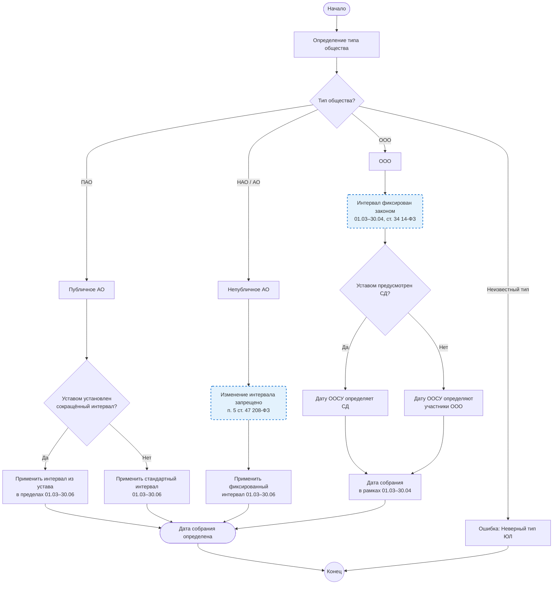

## Бизнес-процесс: Определение интервала проведения ГОСА / ООСУ

1. Назначение процесса

Определение законного временного интервала для проведения годового общего собрания акционеров (ГОСА) или очередного общего собрания участников (ООСУ) в зависимости от организационно-правовой формы общества.

2. Входные данные

Информация о типе общества: ПАО, НАО/АО (для АО) или ООО.

Устав общества (для ПАО — наличие/отсутствие сокращенного интервала; для ООО — факт наличия совета директоров).

3. Выходные данные

Интервал проведения ГОСА / ООСУ (дата начала, дата окончания) и утвержденная дата проведения собрания в рамках установленного интервала.

4. Описание этапов процесса

Этап 1. Определение типа общества

На входе процесса определяется организационно-правовая форма: ПАО (публичное АО), НАО/АО (непубличное АО) или ООО (общество с ограниченной ответственностью). В официальных документах непубличные общества (НАО) указываются просто как «АО». Если тип не соответствует ни одному из них, процесс завершается ошибкой.

Этап 2. Определение интервала для ПАО

Для публичного акционерного общества (ПАО) выполняется проверка устава:

Если в уставе установлен сокращенный интервал (например, с 1 апреля по 31 мая) в пределах законодательного «окна» — применяется этот интервал и сохраняется в `legal_entity_board_settings.gosa_window_start/gosa_window_end`.

Если в уставе сокращенный интервал не установлен — применяется стандартный законодательный интервал: с 1 марта по 30 июня (сохраняется как 01.03–30.06).

Этап 3. Определение интервала для НАО/АО

Для непубличного акционерного общества (НАО/АО) изменение интервала запрещено законом (п. 5 ст. 47 ФЗ «Об АО»). Общество обязано применять строго фиксированный интервал: с 1 марта по 30 июня. В системе хранится ровно 01.03–30.06 (год — текущий).

Этап 4. Определение интервала для ООО (ООСУ)

Для общества с ограниченной ответственностью (ООО) очередное общее собрание участников (ООСУ) проводится не ранее 1 марта и не позднее 30 апреля (ст. 34 14-ФЗ). Интервал фиксирован: 01.03–30.04. Совет директоров в ООО не обязателен и создаётся только если предусмотрен уставом (ст. 32 14-ФЗ).

Этап 5. Фиксация даты собрания

На основе установленного для конкретного типа общества интервала совет директоров (наблюдательный совет) либо, при применимости исключения п. 1 ст. 64 Закона «Об АО», общее собрание акционеров выбирает и утверждает конкретную дату проведения собрания в рамках этого интервала.

Техническая реализация в системе:
- Интервал хранится на уровне ЮЛ в таблице `legal_entity_board_settings` полями `gosa_window_start` и `gosa_window_end`.
- Для АО/НАО интервал принудительно фиксирован как 01.03–30.06 (редактирование интерфейсом и сохранение вне этих границ отклоняется на бекенде).
- Для ООО интервал принудительно фиксирован как 01.03–30.04 (ст. 34 14-ФЗ).
- Для ПАО разрешается сохранять любой подинтервал в этих границах согласно уставу.

