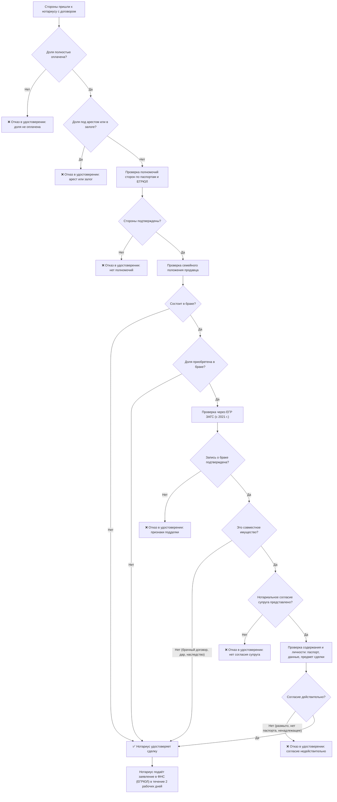
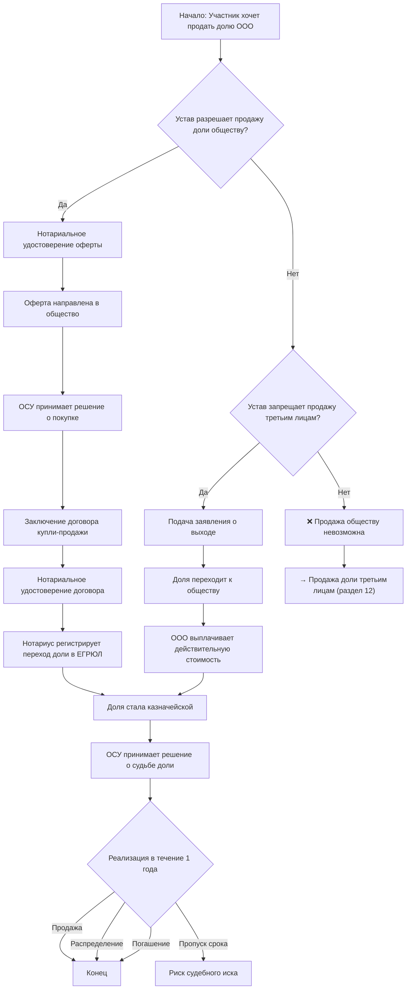
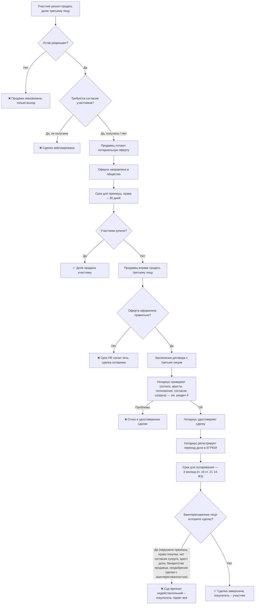
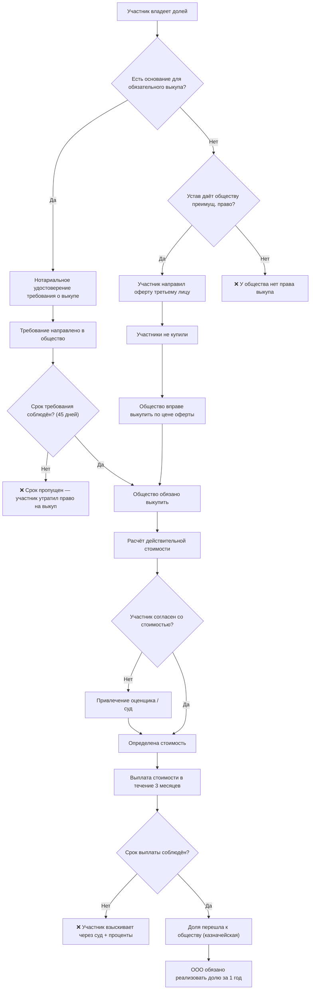
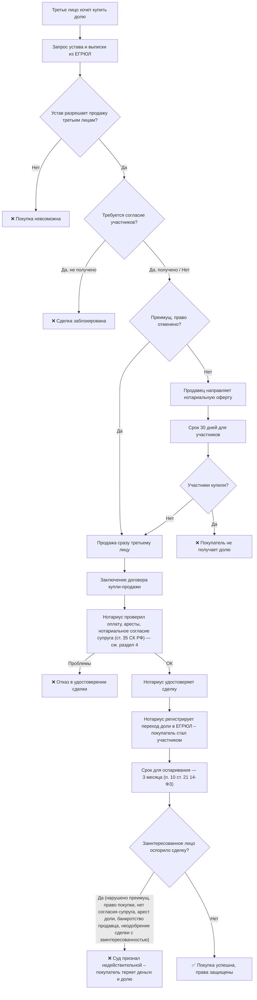

## Бизнес-процесс: Покупка и продажа доли в ООО

### 1. Правовое регулирование

- Основной закон: № 14‑ФЗ «Об обществах с ограниченной ответственностью», [статья 21](../laws/article-14fz-21.md).
- Поправки 2025 года:
  - с 1 сентября 2025: уставом можно отменить преимущественное право покупки (единогласное решение всех участников);
  - с 28 декабря 2025: действительную стоимость доли можно определять по рыночной оценке (если устав позволяет).

### 2. Способы отчуждения доли

Участник может продать долю:
- другим участникам ООО (самый простой путь);
- самому обществу (казначейская доля) – в случаях, предусмотренных законом или уставом;
- третьим лицам – при соблюдении преимущественного права (если оно не отменено).

### 3. Преимущественное право покупки

- По умолчанию другие участники имеют право купить долю раньше любого постороннего.
- Продавец обязан направить **нотариально удостоверенную оферту** в общество.
- Срок для ответа – **30 дней** (или иной срок, установленный уставом).
- С 1 сентября 2025 уставом можно **отменить** преимущественное право для всех или отдельных участников (единогласное решение).

### 4. Нотариальное удостоверение сделки

- Все сделки по отчуждению доли (кроме продажи казначейской доли) **подлежат обязательному нотариальному удостоверению**.
- Нотариус проверяет: оплату доли, отсутствие арестов/залогов, полномочия сторон, нотариально удостоверенное согласие супруга (если доля — совместное имущество, [ст. 34–35 СК РФ](../laws/article-sk-34.md)).

> **Почему это важно:** если доля приобретена в браке, она — совместное имущество супругов. Продажа без нотариального согласия второго супруга даёт ему право в течение года оспорить сделку в суде и потребовать признания её недействительной. Отсутствие такого согласия — одно из оснований для оспаривания, наряду с нарушением преимущественного права и другими дефектами.

#### Как нотариус проверяет согласие супруга

1. **Устанавливает факт брака** — по штампу в паспорте или свидетельству о заключении брака. Если доля приобретена до брака, в дар или по наследству либо исключена из общего имущества брачным договором — согласие не требуется.
2. **Запрашивает нотариально удостоверенное согласие** — отдельный документ, оформленный любым нотариусом. В нём супруг прямо указывает, что не возражает против продажи доли на любых условиях. Без этого документа нотариус **обязан отказать** в удостоверении сделки.
3. **Проверяет факт брака через ЕГР ЗАГС** — с 2021 года нотариусы имеют доступ к Единому реестру записей актов гражданского состояния и могут проверить запись о браке онлайн, исключая подделку свидетельства.
4. **Проверяет содержание согласия и личность супруга** — в согласии должны быть указаны данные супруга-продавца, данные супруга-соглашающегося, предмет согласия (конкретная доля в конкретном ООО). Одновременно сверяет личность супруга по паспорту. Размытые формулировки («согласен на любые сделки») не принимаются.
5. **При нотариусе-дублёре** — если согласие выдано другим нотариусом, проверяется подлинность нотариального акта через Единую информационную систему нотариата.

#### Схема проверки и заверения сделки нотариусом

### 5. Казначейская доля ([ст. 24](../laws/article-14fz-24.md) 14-ФЗ)

- **Определение:** доля, принадлежащая самому ООО. Возникает при выходе участника, исключении, отказе наследников, неоплате доли и т.д.
- **Отображение в ЕГРЮЛ и СПАРК:** в выписке вместо Ф.И.О. участника указывается само общество. В СПАРК сумма долей реальных владельцев будет меньше 100% (для деталей нужен платный доступ).
- **Реальный пример:** ООО «ГУМ» (Липецкая область) – 99,996% уставного капитала принадлежат самому обществу после выхода участника.
- **Судьба казначейской доли:** общество обязано в течение **одного года** продать, распределить или погасить её. При пропуске срока – риск судебных исков от бывшего участника.
- **Продажа казначейской доли:** решение принимается общим собранием **единогласно**, нотариальное удостоверение **не требуется**, участники не имеют преимущественного права на её покупку.

### 6. Определение стоимости доли ([ст. 23](../laws/article-14fz-23.md) 14-ФЗ)

- **Действительная стоимость** – часть чистых активов, пропорциональная доле, по данным бухгалтерской отчётности.
- С 28 декабря 2025 допускается определять стоимость **по рыночной цене** активов и обязательств (при несогласии с балансовой оценкой и если это прописано в уставе).

### 7. Поиск покупателя (третьего лица)

Основные каналы:
- специализированные площадки («БИБОСС», «РБК Бизторг», «Авито», «Циан»);
- бизнес-брокеры (за комиссию находят инвестора и сопровождают сделку);
- личные контакты (предложение партнёрам, поставщикам, конкурентам);
- сервисы поиска контрагентов (СПАРК, Контур.Фокус).

### 8. Кто принимает решение о запрете продажи доли?

- Запрет на продажу третьим лицам или требование согласия участников устанавливается **уставом**.
- При создании ООО – учредителями; при внесении изменений позже – **общим собранием участников** большинством **не менее 2/3 голосов**.
- **Отменить преимущественное право** (сделать продажу свободной) можно только **единогласным решением** всех участников (с 1 сентября 2025).
- Генеральный директор **не вправе** единолично запрещать или разрешать продажу долей.

### 9. Можно ли купить долю без возражений участников?

Да, в двух случаях:
1. **В уставе отменено преимущественное право** – продажа сразу третьему лицу.
2. **Преимущественное право действует, но участники не воспользовались** – продавец направил оферту, 30 дней прошли, они молчали или отказались – вы покупаете без их согласия.
Если в уставе есть прямой запрет на продажу третьим лицам или требуется согласие – участники могут заблокировать сделку.

---

### 10. Вопросы продажи долей, решаемые общим собранием участников (ОСУ)

В ООО, в отличие от акционерных обществ, **продажа доли самим участником** по общему правилу **не требует** проведения общего собрания участников и принятия какого-либо решения. Участник вправе продать свою долю другому участнику или третьему лицу в порядке, предусмотренном законом и уставом. Однако есть **четыре категории вопросов**, связанных с продажей долей, которые относятся к **исключительной компетенции общего собрания участников**.

#### 10.1. Продажа доли, принадлежащей самому обществу (казначейской доли)

Когда доля по каким-либо основаниям переходит к самому ООО (выход участника, исключение, отказ наследников и т.д.), **решение о её продаже принимает общее собрание участников**.

При этом закон устанавливает особый порядок голосования:

> **Продажа доли или части доли участникам общества, в результате которой изменяются размеры долей его участников, а также продажа доли или части доли третьим лицам и определение иной цены на продаваемую долю осуществляются по решению общего собрания участников общества, принятому всеми участниками общества единогласно** ([п. 4 ст. 24](../laws/article-14fz-24.md) 14-ФЗ).

Таким образом, продажа казначейской доли — **не вопрос индивидуального решения директора**, а **коллегиальное решение всех участников, принимаемое единогласно**.

#### 10.2. Определение цены продажи казначейской доли

Общее собрание участников также определяет **цену**, по которой общество продаёт принадлежащую ему долю.

По общему правилу казначейская доля продаётся по цене **не ниже** той, которая была уплачена обществом при её приобретении. Однако **общее собрание участников вправе установить иную цену** — своим решением, принятым единогласно ([п. 4 ст. 24](../laws/article-14fz-24.md) 14-ФЗ).

#### 10.3. Распределение казначейской доли между участниками

Вместо продажи общество может **распределить** казначейскую долю между всеми участниками пропорционально их существующим долям. Это также делается **по решению общего собрания участников** ([п. 1 ст. 24](../laws/article-14fz-24.md) 14-ФЗ).

#### 10.4. Изменение устава, касающееся порядка продажи долей

Любые изменения в уставе, которые затрагивают правила продажи долей (например, введение или отмена запрета на продажу третьим лицам, установление требования о согласии участников, отмена преимущественного права), принимаются **общим собранием участников** ([п. 4.1 ст. 21](../laws/article-14fz-21.md) 14-ФЗ).

#### Что НЕ требует решения ОСУ

| Действие | Требуется ли ОСУ? |
|----------|-------------------|
| Участник продаёт свою долю **другому участнику** ООО | **НЕТ**, сделка заключается индивидуально |
| Участник продаёт свою долю **третьему лицу** (если устав не требует иного) | **НЕТ**, сделка заключается индивидуально |
| Участник получает **согласие других участников** на продажу (если требуется по уставу) | **НЕТ**, согласие оформляется письменными заявлениями, а не решением ОСУ |
| Нотариальное удостоверение сделки купли-продажи | **НЕТ**, это компетенция нотариуса |

#### Сводная таблица

| Вопрос | Решает ли ОСУ? | Каким большинством? |
|--------|----------------|---------------------|
| Продажа доли самим участником | **НЕТ** | — |
| Продажа казначейской доли (принадлежащей ООО) | **ДА** | **Единогласно** всеми участниками |
| Определение цены на продаваемую казначейскую долю | **ДА** | **Единогласно** всеми участниками |
| Распределение казначейской доли между участниками | **ДА** | Решением ОСУ (порядок голосования — по уставу) |
| Внесение изменений в устав о порядке продажи долей | **ДА** | **Единогласно** (с 1 сентября 2025) |

> **Ключевой вывод:** пока доля принадлежит участнику — он продаёт её **самостоятельно**, без решений ОСУ. Как только доля перешла к самому обществу (стала казначейской) — **все решения о её продаже, цене и распределении принимает общее собрание участников единогласно**.

---

### 11. Алгоритм продажи доли обществу ([ст. 23](../laws/article-14fz-23.md), [ст. 26](../laws/article-14fz-26.md) 14-ФЗ)

1. Участник проверяет устав: разрешена ли продажа доли самому ООО.
2. Если **да** — участник готовит и направляет в ООО нотариально удостоверенную оферту о продаже доли.
3. Если **нет**, но устав запрещает продажу третьим лицам — участник подаёт нотариально удостоверенное заявление о выходе из ООО, доля переходит к обществу, и оно обязано выплатить действительную стоимость.
4. Если устав не разрешает продажу обществу и не запрещает продажу третьим лицам — продажа обществу невозможна, но долю можно продать другим участникам (раздел 2) или третьим лицам (раздел 12).
5. Общее собрание участников принимает решение о покупке доли (или отказе).
6. При положительном решении стороны заключают договор купли-продажи.
7. Договор подлежит нотариальному удостоверению (если это не выход, а продажа) — см. раздел 4.
8. Нотариус регистрирует переход доли в ЕГРЮЛ (подаёт заявление в ФНС в течение 2 рабочих дней, п. 13 ст. 21 14-ФЗ).
9. Доля переходит к обществу и становится казначейской.
10. Общее собрание участников принимает решение о судьбе доли (продать, распределить или погасить) — единогласно.
11. Общество обязано в течение одного года реализовать принятое решение. При пропуске срока – риск судебного иска от бывшего участника.

**Негативные сценарии:**
- Если устав не предусматривает права общества на выкуп и нет оснований для обязательного выкупа – продажа обществу невозможна.
- Если участник пропустил 45-дневный срок для требования выкупа (при крупной сделке или увеличении уставного капитала) — участник утрачивает право требования выкупа.
- При несогласии с расчётом действительной стоимости – можно привлечь независимого оценщика (с 28 декабря 2025) или обратиться в суд.
- При нарушении срока выплаты (3 месяца) – участник вправе взыскать сумму через суд с процентами.

---

### 12. Алгоритм продажи доли третьим лицам ([ст. 21](../laws/article-14fz-21.md) 14-ФЗ)

1. Продавец проверяет устав на предмет запрета продажи третьим лицам или требования согласия других участников.
2. Если запрет есть – продажа невозможна; возможен только выход из ООО с выкупом доли обществом.
3. Если требуется согласие участников – продавец его запрашивает. Без согласия сделка блокируется.
4. Если продажа разрешена, продавец готовит нотариально удостоверенную оферту (если преимущественное право не отменено уставом).
5. Оферта направляется в общество и считается полученной всеми участниками.
6. Начинается отсчёт срока для реализации преимущественного права – 30 дней (или иной срок по уставу).
7. Если кто-то из участников воспользовался правом – доля продаётся ему, сделка с третьим лицом не состоится.
8. Если участники отказались или пропустили срок – продавец вправе продать долю третьему лицу.
9. Заключается договор купли-продажи с третьим лицом.
10. Нотариус проверяет оплату доли продавцом, отсутствие арестов/залогов, полномочия сторон, нотариальное согласие супруга (если доля — совместное имущество) — см. раздел 4.
11. При обнаружении проблем нотариус отказывает в удостоверении сделки.
12. Если проверка пройдена — нотариус удостоверяет сделку.
13. Нотариус регистрирует переход доли в ЕГРЮЛ (подаёт заявление в ФНС в течение 2 рабочих дней, п. 13 ст. 21 14-ФЗ).
14. С момента внесения записи покупатель становится участником ООО.
15. С этого момента начинается 3-месячный срок для оспаривания сделки заинтересованными лицами (п. 10 ст. 21 14-ФЗ).
16. Если сделка оспорена по основаниям (нарушение преимущественного права покупки, отсутствие нотариального согласия супруга, арест доли, банкротство продавца, неодобрение сделки с заинтересованностью и др.) — суд признаёт её недействительной, покупатель теряет и долю, и деньги.

**Негативные сценарии:**
- Оферта оформлена ненадлежащим образом (без нотариуса, без цены и т.д.) – срок для преимущественного права **не начинает течь**, и продажа третьему лицу может быть оспорена.
- Договор не удостоверен нотариусом – сделка ничтожна.
- Нотариус выявил аресты, залог, неуплату доли – отказ в удостоверении.
- Сделка может быть оспорена в суде по основаниям: нарушение преимущественного права покупки, отсутствие нотариального согласия супруга (доля — совместное имущество, ст. 34–35 СК РФ), арест доли, банкротство продавца, неодобрение сделки с заинтересованностью. В этом случае покупатель теряет и долю, и деньги.

---

### 13. Алгоритм покупки доли обществом ([ст. 23](../laws/article-14fz-23.md), [ст. 26](../laws/article-14fz-26.md) 14-ФЗ)

1. Участник проверяет наличие оснований для обязательного выкупа:
   - устав запрещает продажу третьим лицам, а другие участники отказались от покупки;
   - устав требует согласия на отчуждение, а согласие не получено;
   - принято решение о крупной сделке, участник голосовал против или не участвовал;
   - принято решение об увеличении уставного капитала, участник голосовал против или не участвовал;
   - участник исключён из общества.
2. При наличии основания участник направляет обществу нотариально удостоверенное требование о выкупе (срок – 45 дней для случаев крупной сделки или увеличения УК).
3. Если срок пропущен — участник утрачивает право требования выкупа.
4. Если оснований нет, но устав предусматривает преимущественное право общества – общество может выкупить долю, если участники не использовали своё право (после оферты третьему лицу).
5. Общество определяет действительную стоимость доли по бухгалтерской отчётности.
6. При несогласии участника – привлекается независимый оценщик (с 28 декабря 2025) или спор решается в суде.
7. Общество выплачивает стоимость в течение **трёх месяцев** со дня возникновения обязанности (если иной срок не предусмотрен уставом).
8. При нарушении срока выплаты – участник вправе взыскать сумму через суд с процентами.
9. После выплаты доля переходит к обществу и становится казначейской.
10. Общество обязано реализовать долю в течение одного года (продать, распределить или погасить).

---

### 14. Алгоритм покупки доли третьим лицом ([ст. 21](../laws/article-14fz-21.md) 14-ФЗ)

1. Покупатель запрашивает у продавца устав ООО и актуальную выписку из ЕГРЮЛ.
2. Проверяет устав: разрешена ли продажа третьим лицам, требуется ли согласие других участников.
3. Если продажа запрещена – покупка невозможна.
4. Если требуется согласие – продавец должен его получить; без этого сделка блокируется.
5. Если преимущественное право действует – продавец направляет нотариальную оферту, идёт 30-дневный срок. Если кто-то из участников покупает – покупатель теряет сделку.
6. Если преимущественное право отменено или участники не воспользовались – продавец вправе продать долю покупателю.
7. Стороны заключают договор купли-продажи.
8. Нотариус проверяет оплату доли продавцом, отсутствие арестов/залогов, полномочия сторон, нотариальное согласие супруга (если доля — совместное имущество) — см. раздел 4.
9. При выявлении проблем нотариус отказывает в удостоверении сделки.
10. Если проверка пройдена — нотариус удостоверяет сделку.
11. Нотариус регистрирует переход доли в ЕГРЮЛ (подаёт заявление в ФНС в течение 2 рабочих дней, п. 13 ст. 21 14-ФЗ).
12. С момента внесения записи покупатель становится участником ООО.
13. С этого момента начинается 3-месячный срок для оспаривания сделки заинтересованными лицами (п. 10 ст. 21 14-ФЗ).
14. Сделка может быть оспорена в суде (нарушение преимущественного права покупки, отсутствие нотариального согласия супруга, арест доли, банкротство продавца, неодобрение сделки с заинтересованностью и др.) – тогда покупатель теряет и долю, и деньги.

**Рекомендации покупателю:**
- Всегда проверяйте устав до подписания.
- Требуйте нотариальное согласие супруга продавца (если доля приобретена в браке).
- Проверяйте долю на аресты через выписку из ЕГРЮЛ и базы ФССП.
- Проверяйте продавца на банкротство через «Прозрачный бизнес» ФНС.
- Настаивайте на нотариальном удостоверении – это защищает и вас.

---

### 15. Налоговые аспекты

- **НДФЛ** для физических лиц – 13% (до 5 млн) / 15% (свыше).
- **Налог на прибыль** для юридических лиц – 20%.
- С 2025 года: если доля продана **дешевле действительной стоимости**, у покупателя возникает **материальная выгода**, облагаемая НДФЛ (13–15% с разницы).

---

### 16. Риски и способы их снижения

| Риск | Последствия | Меры по снижению |
|------|-------------|------------------|
| Игнорирование преимущественного права | Сделка может быть признана недействительной | Строго соблюдать процедуру оферты и сроков |
| Отсутствие нотариального удостоверения | Сделка ничтожна | Всегда обращаться к нотариусу |
| Непроверка контрагента | Риск банкротства, арестов, мошенничества | Проверять через СПАРК, Контур.Фокус, запрашивать выписку |
| Неверный расчёт стоимости | Налоговые доначисления, споры | Заказывать независимую оценку |
| Занижение цены | Материальная выгода у покупателя, налог | Обосновывать скидки документально |
| Пропуск срока регистрации | Затягивание перехода прав | Контролировать сроки, поручать нотариусу |
| Неучёт уставных запретов | Сделка блокируется или оспаривается | Изучить устав до переговоров |
| Неправильное оформление оферты | **30-дневный срок не начинает течь** | Оформлять строго по закону, с нотариусом, указывать все условия |

---

### 17. Заключение

- Всегда изучайте устав – в нём все ограничения.
- Соблюдайте процедуру преимущественного права, если оно не отменено.
- Оформляйте сделку у нотариуса (кроме казначейской доли).
- Учитывайте новые правила 2025 года (отмена преимущественного права, рыночная оценка).
- Помните о налоговых рисках при занижении цены.
- Для сложных сделок привлекайте профессиональных юристов и оценщиков.

*Данный материал носит информационный характер и не является юридической консультацией.*
