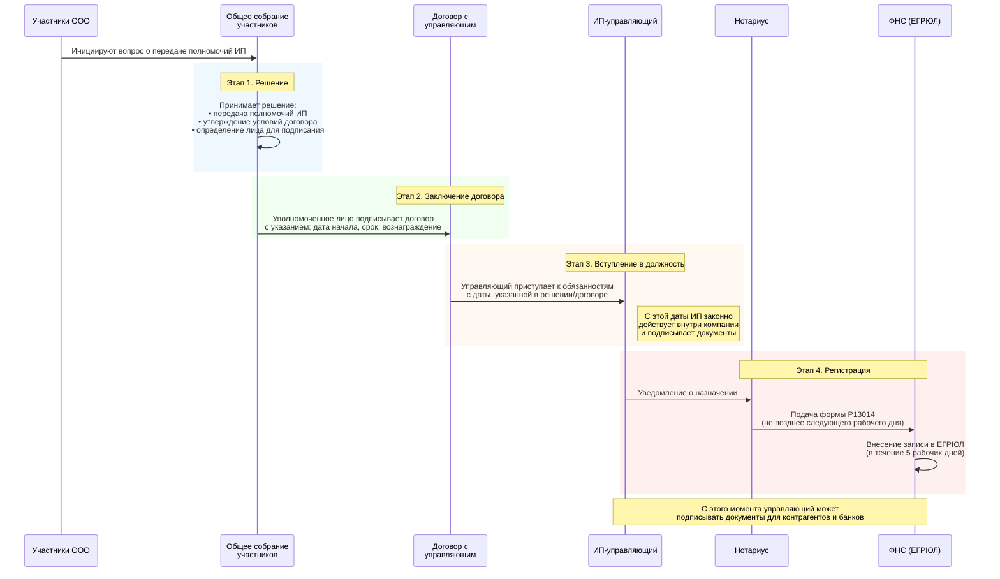

# Назначение управляющего ИП в ООО (ст. 42 14-ФЗ)

> Правовая основа: ст. 42 14-ФЗ, п. 2 ст. 33 14-ФЗ, ст. 40 14-ФЗ

## Суть

Общество вправе передать по договору полномочия единоличного исполнительного органа (генерального директора) управляющему — индивидуальному предпринимателю. Решение принимается общим собранием участников. С этого момента управляющий действует от имени общества без доверенности.

---

## Диаграмма

---

## Этапы

### 1. Принятие решения (ОСУ)

Общее собрание участников принимает решение о:
- передаче полномочий ЕИО конкретному ИП-управляющему
- утверждении условий договора (срок, вознаграждение)
- определении лица, уполномоченного подписать договор

> Правовая основа: п. 2 ст. 33, ст. 42 14-ФЗ. Решение — исключительная компетенция ОСУ.

### 2. Заключение договора

Договор подписывается лицом, указанным в решении (председатель собрания или уполномоченный участник). В договоре обязательно:
- дата начала исполнения управляющим полномочий
- срок действия (бессрочный или срочный)
- размер вознаграждения

### 3. Вступление в должность

Полномочия управляющего возникают **с даты, указанной в решении и/или в договоре**, а не с момента внесения записи в ЕГРЮЛ.

> Внесение сведений в ЕГРЮЛ носит уведомительный характер. Отсутствие записи не означает, что лицо не является руководителем, если оно назначено в установленном порядке.

С этой даты управляющий:
- действует от имени общества без доверенности
- подписывает внутренние документы
- принимает управленческие решения

### 4. Регистрация в ЕГРЮЛ

| Действие | Срок |
|----------|------|
| Нотариус подаёт форму Р13014 в ФНС | Не позднее следующего рабочего дня |
| ФНС вносит запись в ЕГРЮЛ | В течение 5 рабочих дней |

С момента внесения записи управляющий может подписывать документы для контрагентов и банков.

---

## Порядок действий (сводная таблица)

| Этап | Действие | Момент |
|------|----------|--------|
| 1 | Решение ОСУ о назначении управляющего и утверждении условий договора | Дата принятия решения |
| 2 | Заключение договора (включает дату начала полномочий) | После принятия решения |
| 3 | **Управляющий вступает в должность** | **Дата, указанная в решении/договоре** |
| 4 | Нотариус подаёт Р13014 в ФНС | Не позднее следующего рабочего дня |
| 5 | Внесение записи об управляющем в ЕГРЮЛ | В течение 5 рабочих дней |

---

## Ключевой момент

Договор с управляющим заключается **до подачи документов в ФНС**. В договоре определяется дата вступления в должность — именно с этой даты управляющий законно действует внутри компании, даже если в ЕГРЮЛ ещё не внесены изменения.

---

← [Назад к бизнес-процессам](README.md) | [Договоры с управляющими](../tech-debt/README.md)
