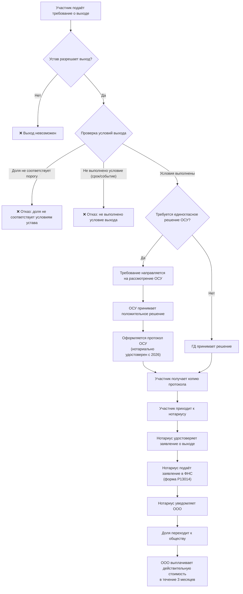

## Бизнес-процесс: Выход участника из ООО

### 1. Правовое регулирование

- Основной закон: № 14‑ФЗ «Об обществах с ограниченной ответственностью», [статья 26](../laws/14-fz/article-14fz-26.md).
- Выход участника из ООО возможен **только если это прямо разрешено уставом**.
- С 2026 года: протокол ОСУ, которым принято решение о выходе, должен быть **нотариально удостоверен** (если уставом не предусмотрено иное).

### 2. Условия выхода из ООО

Право на выход участника из ООО определяется уставом. Нетиповой устав может содержать следующие ограничения:

| Условие | Описание | Пример формулировки в уставе |
|---------|----------|------------------------------|
| **Минимальная доля** | Выход разрешён только участникам с долей ≥ N% | «Право на выход имеют участники с долей не менее 10%» |
| **Максимальная доля** | Выход разрешён только участникам с долей ≤ N% | «Право на выход имеют участники с долей не более 30%» |
| **Диапазон доли** | Выход разрешён участникам с долей в диапазоне от N% до M% | «Право на выход имеют участники с долей от 5% до 25%» |
| **Условие (срок/событие)** | Выход возможен при наступлении определённого условия | «Право на выход возникает по истечении 2 лет с момента вступления» |
| **Единогласное решение ОСУ** | Выход требует единогласного решения общего собрания участников | «Выход участника осуществляется по единогласному решению ОСУ» |

> **Важно:** если устав не содержит положения о праве на выход — участник **не может выйти** из ООО. Единственный способ получить деньги за долю — продать её другому участнику или третьему лицу.

### 3. Алгоритм выхода участника из ООО

### 4. Подача требования о выходе

Участник подаёт требование о выходе через систему. Требование проверяется на соответствие условиям устава:

1. **Проверка наличия права на выход** — устав должен содержать положение о праве на выход (`ExitAllowed = true`).
2. **Проверка минимальной доли** — если установлен порог, доля участника должна быть ≥ минимального значения.
3. **Проверка максимальной доли** — если установлен максимум, доля участника должна быть ≤ максимального значения.
4. **Проверка условий выхода** — если установлено условие (срок, событие), оно должно быть выполнено.
5. **Проверка единогласия ОСУ** — если требуется единогласное решение ОСУ, требование направляется на рассмотрение собрания.

> **См. также:** [Настройка нетипового устава ООО](non-standard-charter.md) — параметры выхода в системе Fiducia.

### 5. Рассмотрение требования ОСУ

Если уставом предусмотрено, что выход участника требует **единогласного решения общего собрания участников**:

1. Требование автоматически получает статус `OSU_REVIEW` (рассмотрение ОСУ).
2. Требование отображается в списке требований на рассмотрении ГД/ОСУ.
3. Общее собрание участников рассматривает вопрос о выходе.
4. Решение принимается **единогласно** — все участники должны проголосовать «за».
5. Если решение положительное — оформляется протокол ОСУ.

### 6. Протокол ОСУ о выходе участника

После принятия положительного решения ОСУ:

1. Оформляется **протокол общего собрания участников**.
2. С 2026 года протокол должен быть **нотариально удостоверен** (если уставом не предусмотрено иное).
3. Участник получает **копию протокола** на руки.

> **Основание:** п. 3 ст. 67.1 ГК РФ — решение ОСУ удостоверяется нотариусом, если иной способ не предусмотрен уставом.

### 7. Удостоверение заявления о выходе нотариусом

Участник приходит к нотариусу со следующими документами:

| Документ | Назначение |
|----------|------------|
| **Заявление о выходе** | Заявление участника о выходе из ООО |
| **Копия протокола ОСУ** | Документ, подтверждающий соблюдение уставного условия (единогласное решение) |
| **Документы, удостоверяющие личность** | Паспорт или иной документ |

#### Проверка нотариусом

Нотариус выполняет следующие действия:

1. **Проверяет протокол ОСУ** — убеждается, что решение принято и оно положительное.
2. **Проверяет полномочия участника** — подтверждает, что лицо является участником ООО.
3. **Удостоверяет заявление о выходе** — заверяет подпись участника на заявлении.

### 8. Действия нотариуса после удостоверения

После удостоверения заявления о выходе нотариус выполняет следующие действия:

| № | Действие нотариуса | Срок | Основание |
|---|-------------------|------|-----------|
| 1 | **Подаёт заявление в ФНС** — направляет в налоговую инспекцию по месту нахождения ООО заявление о внесении изменений в ЕГРЮЛ (форма Р13014) в виде электронного документа, подписанного своей усиленной квалифицированной электронной подписью | В течение **2 рабочих дней** с даты удостоверения заявления | [п. 1.1 ст. 26](../laws/14-fz/article-14fz-26.md) 14-ФЗ |
| 2 | **Уведомляет общество** — передает обществу два документа: удостоверенное заявление о выходе и копию заявления, поданного в ФНС. Документы направляются по юридическому адресу ООО (из ЕГРЮЛ) или, при наличии, на его электронную почту | **Не позднее 1 рабочего дня** со дня подачи заявления в ФНС | [п. 1.1 ст. 26](../laws/14-fz/article-14fz-26.md) 14-ФЗ |

### 9. Переход доли к обществу и выплата стоимости

После внесения изменений в ЕГРЮЛ:

1. **Доля участника переходит к обществу** — становится казначейской долей.
2. **Общество обязано выплатить действительную стоимость доли** в течение **3 месяцев** со дня получения заявления о выходе (если иной срок не предусмотрен уставом).
3. **Определение действительной стоимости** — по данным бухгалтерской отчётности (пропорционально доле в уставном капитале).

> **С 28 декабря 2025 года:** устав может предусматривать определение действительной стоимости доли **по рыночной цене** активов и обязательств, если участник не согласен с бухгалтерской оценкой ([п. 6.2 ст. 23](../laws/14-fz/article-14fz-23.md) 14-ФЗ).

#### Судьба казначейской доли

После перехода доли к обществу она становится **казначейской** ([ст. 24](../laws/14-fz/article-14fz-24.md) 14-ФЗ). Общество обязано в течение **одного года**:

- продать долю участникам или третьим лицам;
- распределить долю между участниками;
- погасить долю (уменьшить уставный капитал).

> **Подробнее:** [Покупка и продажа доли в ООО](llc-share-purchase-sale.md) — раздел «Казначейская доля».

### 10. Негативные сценарии

| Сценарий | Последствия |
|----------|-------------|
| Устав не содержит положения о праве на выход | Участник **не может выйти** из ООО; единственный способ — продать долю |
| Доля участника не соответствует порогу устава | Требование о выходе **отклоняется** |
| Не выполнено условие выхода (срок/событие) | Требование о выходе **отклоняется** |
| ОСУ отклонило решение о выходе | Участник остаётся в ООО; может обжаловать решение в суде |
| Нотариус отказал в удостоверении заявления | Участник не может выйти; необходимо устранить основания отказа |
| Общество нарушает срок выплаты (3 месяца) | Участник вправе взыскать сумму через суд **с процентами** |
| Общество не реализовало казначейскую долю в течение 1 года | Риск судебного иска от бывшего участника |

### 11. Чек-лист для участника

- [ ] Проверить устав: разрешён ли выход из ООО
- [ ] Проверить условия выхода: минимальная/максимальная доля, сроки, события
- [ ] Проверить: требуется ли единогласное решение ОСУ
- [ ] Подать требование о выходе через систему
- [ ] Дождаться решения ОСУ (если требуется)
- [ ] Получить копию протокола ОСУ
- [ ] Обратиться к нотариусу с заявлением, протоколом и паспортом
- [ ] Получить подтверждение от нотариуса
- [ ] Дождаться внесения изменений в ЕГРЮЛ (3–5 рабочих дней)
- [ ] Получить выплату действительной стоимости доли (в течение 3 месяцев)

---

*Выход из ООО — это не продажа доли, а одностороннее волеизъявление участника. Доля переходит к обществу автоматически, а участник получает действительную стоимость по бухгалтерскому балансу. Порядок выхода строго регламентирован уставом и законом.*
