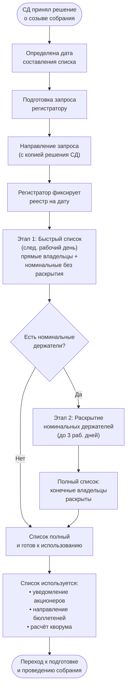

## Бизнес-процесс: Запрос списка акционеров

### 1. Что такое список акционеров

Список лиц, имеющих право на участие в общем собрании акционеров (далее — список), составляется на основании данных реестра акционеров общества. Реестр ведётся **регистратором** — профессиональным участником рынка ценных бумаг, имеющим лицензию ЦБ РФ. Общество не ведёт реестр самостоятельно, а получает список по запросу от регистратора.

Без этого списка невозможно провести ни ГОСА, ни ВОСА: именно он определяет, кто имеет право голоса, кому направлять уведомления, бюллетени и от чьего имени считать кворум.

Правовая основа: ст. 51 Федерального закона № 208-ФЗ «Об акционерных обществах», Федеральный закон № 39-ФЗ «О рынке ценных бумаг», Положение ЦБ РФ № 572-П.

### 2. Кто запрашивает

Запрос списка направляет **общество** в лице единоличного исполнительного органа (генерального директора) или уполномоченного доверенностью лица. На практике запрос обычно готовит корпоративный секретарь и подписывает ГД.

Запрос направляется регистратору, обслуживающему реестр акционеров данного общества.

### 3. Кто такой регистратор и как общество его выбрало

Регистратор — профессиональный участник рынка ценных бумаг, имеющий лицензию Банка России на осуществление деятельности по ведению реестра владельцев ценных бумаг. Лицензия бессрочная. Официальный реестр лицензированных регистраторов ведётся и публикуется Банком России на сайте в разделе «Субъекты рынка ценных бумаг».

**Обязательность передачи реестра.** С 1 октября 2014 года все акционерные общества **обязаны** передать ведение реестра регистратору, независимо от числа акционеров. Общество не может вести реестр самостоятельно ([ст. 44](../laws/article-44.md) 208-ФЗ).

**Выбор регистратора.** Решение о выборе регистратора и утверждении условий договора с ним принимает **совет директоров** (если уставом этот вопрос не отнесён к компетенции общего собрания акционеров).

**Договор на ведение реестра.** Существенные условия:

- Перечень оказываемых услуг (ведеение реестра, предоставление списков, подготовка к собраниям)
- Сроки предоставления информации (список для собрания — не позднее следующего рабочего дня после запроса)
- Конфиденциальность и защита персональных данных акционеров
- Ответственность регистратора за ошибки в учётных записях

**Смена регистратора.** Общество вправе в любой момент сменить регистратора решением СД. При смене старый регистратор обязан передать новому реестр в полном объёме в установленный договором срок.

> **Правовая основа:** [ст. 44 Закона № 208-ФЗ](../laws/article-44.md) (держатель реестра), гл. 3 Федерального закона № 39-ФЗ «О рынке ценных бумаг», Положение ЦБ РФ № 572-П.

### 4. Дата составления списка (дата фиксации)

Дата, на которую составляется список, определяется советом директоров при принятии решения о созыве собрания. Закон устанавливает для неё пределы (п. 1 ст. 51 208-ФЗ):

| Тип собрания | Не ранее чем после решения СД | Не позднее чем до даты собрания |
|-------------|------------------------------|-------------------------------|
| ГОСА | 10 дней | 25 дней |
| ВОСА | 0 дней (может быть дата решения) | 10 дней |

Дата фиксации — это та дата, на которую регистратор «замораживает» реестр и формирует список лиц, имеющих право на участие в конкретном собрании. Изменения в реестре после этой даты на включение в список уже не влияют.

**Что означает «заморозка» на практике.** Сделки с акциями после даты фиксации продолжаются, но на право участия в данном собрании они не влияют: продавец остаётся в списке и голосует (хотя экономически акциями уже не владеет), а покупатель — не может участвовать, даже если сделка уже закрыта. Он получит право голоса на следующем собрании, когда попадёт в список на новую дату фиксации. Дата фиксации — это отсечка, которая даёт определённость: без неё состав акционеров менялся бы каждый день, и никто не знал бы, кого уведомлять и чьи голоса считать.

**Проверка акционеров на собрании.** Прибывший на собрание акционер предъявляет паспорт (или доверенность, если представитель). Счётная комиссия сверяет Ф.И.О. и паспортные данные со списком, чтобы идентифицировать человека. Количество акций акционер не заявляет — оно уже зафиксировано в списке, полученном от регистратора, и ошибиться в нём на входе невозможно.

> Подробнее о двух этапах получения списка — см. раздел 9.

### 5. Содержание запроса

В запросе регистратору указываются:

| Элемент | Описание |
|---------|----------|
| Реквизиты общества | Полное наименование, ОГРН, ИНН |
| Тип собрания | ГОСА или ВОСА |
| Дата фиксации | Конкретная дата, на которую составляется список |
| Цель запроса | Подготовка к общему собранию акционеров |

К запросу прилагается копия решения совета директоров о созыве собрания, в котором зафиксирована дата составления списка.

### 6. Содержание списка

Список, предоставляемый регистратором, содержит по каждому лицу (п. 3 ст. 51 208-ФЗ):

- Фамилия, имя, отчество (наименование) акционера
- Вид, номер и серия документа, удостоверяющего личность
- Адрес для направления уведомлений
- Количество, категория (тип) и номинальная стоимость принадлежащих акций

**Требования ЦБ РФ к структуре списка.** Формат и состав списка регулируются Положением Банка России № 572-П и договором между эмитентом и регистратором. Основные требования к содержанию списка:

- Формат предоставления (XML, XLSX, CSV) и структура полей согласовываются в договоре с регистратором. Список подписывается усиленной квалифицированной электронной подписью (УКЭП) регистратора.
- Для каждого зарегистрированного лица — отдельный блок с обязательным набором полей, зависящим от типа лица (физическое, юридическое, номинальный держатель, доверительный управляющий)
- Для физических лиц обязательны: Ф.И.О., гражданство, реквизиты документа, удостоверяющего личность (тип, серия, номер, дата выдачи), адрес
- Для юридических лиц: полное и сокращённое наименование, ОГРН, ИНН, место нахождения
- По каждому лицевому счёту: номер счёта, количество ценных бумаг с разбивкой по категориям (типам) и государственным регистрационным номерам выпусков
- Для номинальных держателей — отдельный признак типа счёта и, если конечные владельцы раскрыты, — цепочка номинальных держателей с ОГРН каждого звена
- Признак наличия ограничений/обременений по счёту (залог, арест, блокировка)
- Справочник типов документов, удостоверяющих личность, — стандартизирован (например, код 21 = паспорт гражданина РФ)
- Дополнительно: сведения о выплате дивидендов (банковские реквизиты) и способе доставки уведомлений, если они запрашивались

Формат и структура полей согласовываются в договоре с регистратором. Список подписывается усиленной квалифицированной электронной подписью (УКЭП) регистратора — именно подписанный документ, независимо от формата, является юридически значимым.

### 7. Откуда регистратор берёт персональные данные акционеров

Регистратор собирает данные поэтапно:

1. **При создании общества / первичной эмиссии.** Эмитент передаёт регистратору анкеты зарегистрированных лиц — первых акционеров-учредителей. На каждого открывается **лицевой счёт**.

2. **При переходе прав на акции.** Каждая сделка оформляется **передаточным распоряжением** — документом, подаваемым регистратору. В нём данные и передающего, и принимающего лица. Принимающему открывается новый счёт с заполнением анкеты.

3. **Номинальные держатели.** Значительная часть акций (особенно в ПАО) учитывается не напрямую у регистратора, а у депозитариев — **номинальных держателей**. Регистратор видит только номинального держателя. Конечный акционер раскрывается по запросу регистратора к депозитарию при подготовке списка к собранию. Срок раскрытия — 3 рабочих дня ([ст. 8.9 39-ФЗ](../laws/article-39fz-registrar.md)). Если депозитарий не раскрыл — он сам обязан уведомить своих депонентов.

4. **Обновление данных.** Акционер обязан сообщать регистратору об изменении паспортных данных и адреса. На практике это слабое место: многие не обновляют данные годами.

### 8. Риски и как они отрабатываются

**Риск: номинальный держатель не раскрыл конечных владельцев.**

> Как отрабатывается: [ст. 8.9 39-ФЗ](../laws/article-39fz-registrar.md) обязывает раскрыть за 3 рабочих дня. При нарушении — депозитарий сам уведомляет своих депонентов. ЦБ РФ контролирует раскрытие через проверки регистраторов и депозитариев. Штраф по КоАП РФ — до 1 млн руб.

**Риск: акционер не обновил адрес → уведомление не дошло.**

> Как отрабатывается: юридически это риск акционера. Ст. 52 208-ФЗ — уведомление считается надлежащим, если направлено по адресу из реестра. [Ст. 165.1 ГК РФ](../laws/article-gk-165.1.md) — юридически значимое сообщение считается доставленным, даже если не вручено по обстоятельствам, зависящим от адресата. Дополнительно: общество **обязано** опубликовать сообщение о собрании на своём сайте и на ленте Интерфакс/СКРИН — это резервный канал для тех, кто не получил персональное уведомление.

### 9. Сроки предоставления списка: два этапа

Эмитент направляет регистратору **один** запрос — «подготовить список к собранию на дату Х». Но результат приходит в два этапа, потому что раскрытие номинальных держателей занимает больше времени, чем простая выгрузка реестра.

| Этап | Что содержит | Срок (после запроса) | Основание |
|------|-------------|---------------------|-----------|
| **1. Быстрый список** | Прямые владельцы (Ф.И.О., паспорт, адрес, акции) + строки номинальных держателей **без раскрытия** конечных владельцев | Следующий рабочий день | п. 16 ст. 8.6-1 39-ФЗ |
| **2. Полный список** | То же, что в быстром + конечные владельцы за номинальными держателями **с раскрытием** (там, где цепочка отработала) | До 3 рабочих дней дополнительно | [ст. 8.9 39-ФЗ](../laws/article-39fz-registrar.md) — срок раскрытия номинальными |

**Почему два этапа.** Для небольшого НАО с десятком прямых акционеров и без номинальных держателей этапы совпадают — регистратор сразу выдаёт полный список. Для ПАО с тысячами акционеров, чьи акции учитываются через цепочку «брокер → депозитарий → НРД», раскрытие — это многоуровневый каскад запросов. Уложить его в один рабочий день физически невозможно, поэтому закон даёт 3 дня.

**Как это используется.** Быстрый список позволяет обществу немедленно начать предварительный расчёт кворума и подготовку уведомлений для прямых акционеров. Полный список подтягивается следом, и рассылка дополняется конечными владельцами. Цепочка выглядит так:

```
День −25: дата фиксации
День −24: быстрый список у эмитента (следующий рабочий день)
День −24…−22: регистратор получает раскрытие от номинальных
День −21: полный список собран → уведомления акционерам
```

**Практический приём: предварительное раскрытие.** Крупные ПАО, у которых значительная часть акций у номинальных держателей, не ждут запроса списка к собранию — они отправляют регистратору **отдельный запрос на раскрытие номинальных держателей заранее**, за 1–2 недели до даты фиксации. К моменту, когда приходит время формировать список к собранию, цепочки уже раскрыты, и регистратор выдаёт полный список сразу, без задержки на 3 дня. Это не требование закона, а деловая практика: эмитент снимает с себя риск не успеть с уведомлениями к дедлайну в 21 день.

### 10. Проверка полученного списка

После получения списка от регистратора общество проверяет:

- Соответствие количества акционеров ожидаемому
- Наличие ограничений по голосующим акциям (казначейские акции, привилегированные без права голоса)
- Корректность адресов и реквизитов для рассылки уведомлений
- Количество голосов для предварительного расчёта кворума

При обнаружении расхождений направляется повторный запрос регистратору с указанием конкретных несоответствий.

### 11. Блок-схема



### 12. Использование списка в дальнейших процессах

Полученный и проверенный список акционеров является исходным документом для:

- Направления уведомлений о собрании каждому акционеру
- Рассылки бюллетеней для голосования
- Расчёта кворума на собрании
- Подсчёта голосов по каждому вопросу повестки
- Формирования итогового протокола

### 13. Другие виды запросов к регистратору

Помимо списка к собранию, общество регулярно направляет регистратору:

| Запрос | Повод | Частота |
|--------|-------|---------|
| Выписка по лицевому счёту | Подтверждение права собственности: суд, нотариус, сделка | По мере обращения акционера |
| Справка об операциях за период | Налоговая, корпоративные споры | По запросу |
| Данные для выплаты дивидендов | Банковские реквизиты акционеров | Перед каждым решением о дивидендах |
| Список для оферты | Обязательное/добровольное предложение о выкупе (ст. 84.2 208-ФЗ) | При сделках M&A |
| Список для преимущественного права | Допэмиссия — уведомление о праве выкупа | При эмиссии |
| Список для реорганизации | Слияние, присоединение, разделение — уведомление + конвертация | При реорганизации |
| Список для выкупа по требованию | Акционер голосовал против → требует выкупа (ст. 75–76 208-ФЗ) | После собраний, где были соответствующие вопросы |
| Раскрытие аффилированных лиц | ≥5% акций, ежеквартальная отчётность | Ежеквартально |
| Исправление ошибки в реестре | Обнаружено расхождение | По факту обнаружения |

### 14. Юридические основания

| Норма | Содержание |
|-------|-----------|
| [ст. 44 208-ФЗ](../laws/article-44.md) | Держатель реестра — регистратор; обязательность передачи реестра; смена регистратора |
| [ст. 51 208-ФЗ](../laws/article-51.md) | Составление списка лиц, имеющих право на участие в собрании: дата фиксации, содержание, доступ |
| [ст. 52 208-ФЗ](../laws/article-52.md) | Уведомление акционеров о проведении собрания (на основе списка) |
| [ст. 8, 8.6-1 Закона № 39-ФЗ](../laws/article-39fz-registrar.md) | Деятельность регистратора, обязанность предоставить список не позднее следующего рабочего дня, ответственность |
| Положение ЦБ РФ № 572-П | Правила ведения реестра владельцев ценных бумаг |
