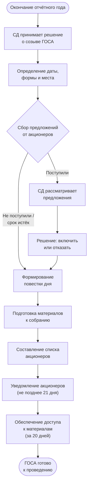

## Бизнес-процесс: Подготовка к ГОСА

### 1. Что такое ГОСА и когда оно проводится

Годовое общее собрание акционеров (ГОСА) — высший орган управления АО, созываемый ежегодно для решения вопросов, отнесённых законом к его компетенции. Проводится не ранее 1 марта и не позднее 30 июня ([п. 3 ст. 47](../laws/article-47.md) 208-ФЗ).

Настоящая статья охватывает **подготовительную фазу** — от принятия решения о созыве до момента готовности к проведению собрания.

### 2. Решение о созыве ГОСА

Решение о созыве ГОСА принимает совет директоров. В решении фиксируются:

| Элемент | Содержание |
|---------|-----------|
| Дата, время и место | Конкретная дата в интервале 01.03–30.06; адрес или платформа для дистанционного участия |
| Форма | Очная (включая дистанционное участие), заочная или смешанная |
| Дата составления списка акционеров | Дата, на которую фиксируются лица, имеющие право на участие |
| Повестка дня | Перечень вопросов с формулировками проектов решений |

### 3. Формирование повестки дня

**Обязательные вопросы** повестки ГОСА (п. 3 ст. 47 208-ФЗ):

1. Избрание совета директоров
2. Избрание ревизионной комиссии (если обязательна по закону или уставу)
3. Назначение аудиторской организации (при обязанности аудита) или индивидуального аудитора
4. Вопросы, предусмотренные подп. 11 и 11.1 п. 1 ст. 48 (распределение прибыли, дивиденды)

**Дополнительные вопросы** — любые вопросы компетенции общего собрания (ст. 48), предложенные СД, акционерами или иными уполномоченными лицами.

### 4. Предложения акционеров в повестку и кандидатов

Акционеры, владеющие **не менее чем 2%** голосующих акций, вправе (ст. 53 208-ФЗ):

- Вносить предложения в повестку дня ГОСА
- Выдвигать кандидатов в совет директоров, ревизионную комиссию и на иные выборные должности

**Срок подачи предложений** — не позднее 30 дней после окончания отчётного года, если уставом не установлен более поздний срок.

Совет директоров обязан рассмотреть поступившие предложения и не позднее 5 дней с даты окончания срока принять решение: включить или мотивированно отказать.

### 5. Подготовка материалов к собранию

К моменту уведомления акционеров должны быть подготовлены:

| Материал | Содержание |
|----------|-----------|
| Годовой отчёт общества | Утверждается СД, содержит основные результаты деятельности за год |
| Годовая бухгалтерская отчётность | Включая заключение аудиторской организации и ревизионной комиссии |
| Сведения о кандидатах | Ф.И.О., образование, опыт работы, должности в других организациях, сведения о сделках с акциями |
| Проекты решений | Формулировки по каждому вопросу повестки дня |
| Бюллетени для голосования | Для каждого вопроса повестки; содержат варианты «за», «против», «воздержался» |

Доступ акционеров к материалам должен быть обеспечен за **20 дней** до даты проведения ГОСА.

### 6. Уведомление акционеров

Уведомление о проведении ГОСА направляется каждому акционеру, имеющему право на участие, не позднее чем за **21 день** до даты проведения (ст. 52 208-ФЗ). Содержание уведомления:

- Полное фирменное наименование общества и его место нахождения
- Дата, время, место проведения и форма собрания
- Дата составления списка лиц, имеющих право на участие
- Повестка дня с формулировками проектов решений
- Порядок ознакомления с материалами и адрес для этого
- Информация о праве акционеров вносить предложения (если срок не истёк)

### 7. Составление списка акционеров

Список лиц, имеющих право на участие в ГОСА, составляется на дату, определённую советом директоров. Дата не может быть установлена ранее чем через 10 дней с даты принятия решения о созыве и не позднее чем за 25 дней до даты проведения ГОСА.

> **Детально:** процедура запроса списка у регистратора, его содержание и проверка описаны в отдельной статье — [Запрос списка акционеров](shareholders-list-request.md).

### 8. Блок-схема

### 9. Юридические основания

| Норма | Содержание |
|-------|-----------|
| [п. 3 ст. 47](../laws/article-47.md) 208-ФЗ | ГОСА проводится в интервале 01.03–30.06; обязательные вопросы повестки |
| [п. 1 ст. 66](../laws/article-66.md) 208-ФЗ | Избрание СД — обязательный вопрос ГОСА; срок полномочий до следующего ГОСА |
| ст. 48 208-ФЗ | Компетенция общего собрания акционеров |
| ст. 52 208-ФЗ | Уведомление о проведении ОСА (сроки, содержание) |
| ст. 53 208-ФЗ | Право акционеров (≥2%) вносить предложения в повестку и кандидатов |
| ст. 54 208-ФЗ | Подготовка материалов к собранию, доступ акционеров |
