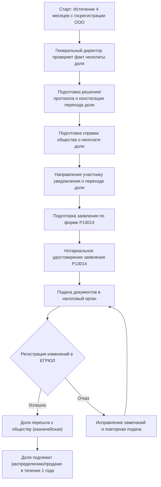

# Бизнес-процесс: Переход неоплаченной доли к обществу

## 1. Правовое регулирование

- Основной закон: [№ 14-ФЗ «Об обществах с ограниченной ответственностью»](../laws/article-14fz-24.md)
- Ключевые статьи:
  - [ст. 16](../laws/article-14fz-16.md) — оплата долей в уставном капитале
  - [ст. 24](../laws/article-14fz-24.md) — доля, принадлежащая обществу
  - п. 3 ст. 21 ГК РФ — ответственность участника ООО

## 2. Стартовое событие

> Участник общества обязан оплатить полностью доли в уставном капитале общества в срок, предусмотренный уставом общества, но не более четырёх месяцев с момента государственной регистрации общества.

> — п. 1 ст. 16 Закона № 14-ФЗ

**Старт:** истечение 4 месяцев с момента государственной регистрации ООО (или иной срок, установленный уставом), в течение которых участник не оплатил свою долю.

## 3. Заявитель

- **Заявителем выступает общество** (ООО) в лице единоличного исполнительного органа (генерального директора).
- Генеральный директор действует на основании устава или решения общего собрания участников.

## 4. Основание перехода доли

Доля участника переходит к обществу в случае её **неоплаты** в установленный срок. Это одно из оснований, предусмотренных законом для возникновения казначейской доли.

> Доля или часть доли в уставном капитале общества, принадлежащая обществу, не учитывается при определении результатов голосования на общем собрании участников общества, а также при распределении прибыли и имущества общества в случае его ликвидации.

> — п. 2 ст. 24 Закона № 14-ФЗ

## 5. Документы для подачи в налоговый орган

### 5.1. Заявление по форме Р13014

- Заполняется в отношении изменений, связанных с переходом доли к обществу.
- Подписывается генеральным директором (заявителем).
- Подлежит нотариальному удостоверению.

### 5.2. Документ, подтверждающий основание перехода доли

Может служить один из следующих документов:

| Документ | Описание |
|----------|----------|
| **Решение единственного участника** | Если в ООО один участник — он принимает решение о констатации перехода доли |
| **Протокол общего собрания участников** | Если участников несколько — собрание констатирует факт перехода доли к обществу в связи с неоплатой |

В решении/протоколе должны быть:
- Сведения об участнике, не оплатившем долю
- Размер неоплаченной доли (номинальная стоимость)
- Констатация факта перехода доли к обществу
- Поручение генеральному директору уведомить участника и подать документы в налоговый орган

### 5.3. Справка общества

Справка, подтверждающая, что доля участника **не была оплачена** в установленный срок. Справка составляется в свободной форме и должна содержать:

- Наименование ООО
- Сведения об участнике (ФИО/наименование, ИНН, размер доли)
- Ссылку на устав (срок оплаты доли)
- Констатацию факта неоплаты
- Подпись генерального директора, печать (при наличии)

### 5.4. Уведомление участника

- Участник должен быть **письменно уведомлён** о переходе его доли к обществу.
- Уведомление направляется заказным письмом с уведомлением о вручении.
- Квитанция об отправке и опись вложений прилагаются к документам.

## 6. Порядок действий

## 7. Сроки

| Этап | Срок |
|------|------|
| Оплата доли участником | 4 месяца с госрегистрации (или иной срок по уставу) |
| Уведомление участника | Незамедлительно после принятия решения |
| Подача документов в ФНС | В разумный срок после уведомления участника |
| Регистрация изменений в ЕГРЮЛ | 5 рабочих дней |
| Реализация казначейской доли | 1 год со дня перехода к обществу |

## 8. Судьба казначейской доли

После перехода доли к обществу она становится **казначейской** и подлежит реализации в течение **одного года**:

> Доля, принадлежащая обществу, в течение одного года со дня её перехода к обществу должна быть по решению общего собрания участников общества распределена между всеми участниками общества пропорционально их долям в уставном капитале общества или предложена для приобретения всем либо некоторым участникам общества и (или), если это не запрещено уставом общества, третьим лицам.

> — п. 1 ст. 24 Закона № 14-ФЗ

**Варианты реализации:**
1. Распределение между участниками пропорционально их долям
2. Продажа участникам и/или третьим лицам (если не запрещено уставом)
3. Погашение (если в течение года не распределена/не продана)

> В случае если в течение одного года со дня перехода доли к обществу она не будет распределена или продана в установленном порядке, доля должна быть погашена, а размер уставного капитала общества уменьшен на величину номинальной стоимости этой доли.

> — п. 3 ст. 24 Закона № 14-ФЗ

## 9. Особенности продажи казначейской доли

- Решение принимается общим собранием участников **единогласно**
- Нотариальное удостоверение сделки **не требуется**
- Участники **не имеют преимущественного права** покупки казначейской доли
- Договор подписывается генеральным директором или уполномоченным лицом

> Продажа доли, принадлежащей обществу, не требует нотариального удостоверения сделки. Решение общего собрания участников общества о продаже доли и договор купли-продажи подписываются лицом, осуществляющим функции единоличного исполнительного органа общества, или иным лицом, уполномоченным решением общего собрания участников общества.

> — п. 5 ст. 24 Закона № 14-ФЗ

## 10. Риски

| Риск | Последствия | Меры |
|------|-------------|------|
| Пропуск срока реализации (1 год) | Погашение доли, уменьшение УК | Контролировать сроки, провести ОСУ заблаговременно |
| Отсутствие уведомления участника | Участник может оспорить переход | Направлять заказным письмом с уведомлением |
| Ошибки в форме Р13014 | Отказ в регистрации | Проверять заполнение, нотариальное удостоверение |
| Неполный пакет документов | Отказ в регистрации | Использовать чеклист документации |

---

> **Связанные документы:**
> - [Покупка и продажа доли в ООО](llc-share-purchase-sale.md)
> - [Вопросы, рассматриваемые ОСУ в ООО](osu-ooo-questions.md)
> - [Статья 24. Доля, принадлежащая обществу](../laws/article-14fz-24.md)
