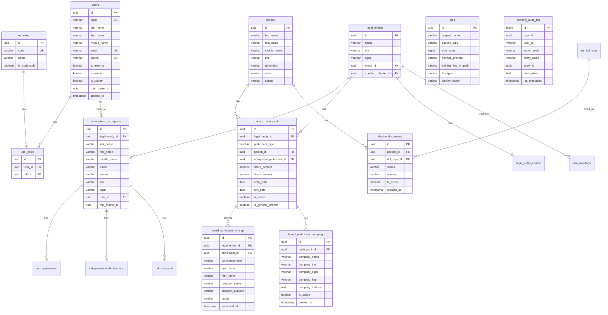

# Схема базы данных (Mermaid ER)

> **Связанные документы:** [Описание таблиц](database-tables.md) | [Индекс документации](database.md)

```mermaid
erDiagram
    users {
        uuid id PK
        varchar login UK
        varchar last_name
        varchar first_name
        varchar middle_name
        varchar email UK
        varchar phone UK
        boolean is_external
        boolean is_active
        boolean is_system
        uuid mpi_master_id
        timestamp created_at
    }

    ref_roles {
        uuid id PK
        varchar code UK
        varchar name
        boolean is_assignable
    }

    user_roles {
        uuid id PK
        uuid user_id FK
        uuid role_id FK
    }

    legal_entities {
        uuid id PK
        varchar name
        varchar inn
        varchar ogrn
        uuid okopf_id FK
        uuid standard_charter_id FK
    }

    person {
        uuid id PK
        varchar last_name
        varchar first_name
        varchar middle_name
        varchar inn
        varchar citizenship
        varchar snils
        varchar ogrnip
    }

    ecosystem_participants {
        uuid id PK
        uuid legal_entity_id FK
        varchar last_name
        varchar first_name
        varchar middle_name
        varchar email
        varchar phone
        varchar inn
        varchar login
        uuid user_id FK
        uuid mpi_master_id
    }

    board_participant {
        uuid id PK
        uuid legal_entity_id FK
        varchar participant_type
        uuid person_id FK
        uuid ecosystem_participant_id FK
        numeric share_percent
        numeric share_amount
        date entry_date
        date exit_date
        boolean is_active
        boolean is_general_director
    }

    board_participant_company {
        uuid id PK
        uuid participant_id FK
        varchar company_name
        varchar company_inn
        varchar company_ogrn
        varchar company_kpp
        text company_address
        boolean is_active
        timestamp created_at
    }

    identity_documents {
        uuid id PK
        uuid person_id FK
        uuid dul_type_id FK
        varchar series
        varchar number
        boolean is_active
        timestamp created_at
    }

    board_participant_change {
        uuid id PK
        uuid legal_entity_id FK
        uuid participant_id FK
        varchar participant_type
        varchar last_name
        varchar first_name
        varchar passport_series
        varchar passport_number
        varchar status
        timestamp submitted_at
    }

    files {
        uuid id PK
        varchar original_name
        varchar content_type
        bigint size_bytes
        varchar storage_provider
        varchar storage_key_or_path
        varchar file_type
        varchar display_name
    }

    security_audit_log {
        bigint id PK
        uuid user_id
        varchar user_ip
        varchar action_code
        varchar entity_name
        uuid entity_id
        text description
        timestamp log_timestamp
    }

    users ||--o{ user_roles : has
    ref_roles ||--o{ user_roles : has
    legal_entities ||--o{ ecosystem_participants : has
    users ||--o{ ecosystem_participants : linked_to
    ecosystem_participants ||--o{ pep_agreements : has
    ecosystem_participants ||--o{ independence_declarations : has
    ecosystem_participants ||--o{ pdn_consents : has
    legal_entities ||--o{ board_participant : has
    person ||--o{ board_participant : has
    person ||--o{ identity_documents : has
    ref_dul_type ||--o{ identity_documents : typed_as
    board_participant ||--o{ board_participant_change : informs
    board_participant ||--o{ board_participant_company : has
    legal_entities ||--|| legal_entity_charter : has
    legal_entities ||--o{ osa_meetings : organises
```
