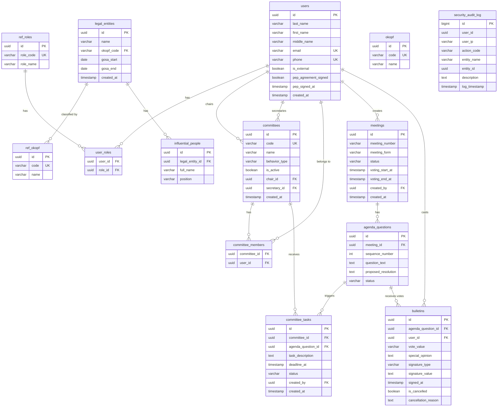

# Описание модели данных

---

## Обзор

Платформа «Цифровой Совет Директоров» использует PostgreSQL 16 в качестве основной системы хранения данных. Модель построена на принципах Domain-Driven Design с выделением агрегатов и ограниченных контекстов.

---

## Схема базы данных



---

## Применение SQL‑изменений к БД (локально, Docker)

Следуйте пошаговой инструкции из `docs/development.md` раздел «Изменения схемы данных (PostgreSQL)». Кратко:

1. Поднимите Postgres: `docker compose up -d postgres`.
2. Примените скрипты по порядку:
   - Схема: `cat tools/db/01_schema.sql | docker exec -i fiducia-postgres psql -U fiducia -d fiducia -v ON_ERROR_STOP=1`
   - Наполнение справочников: `cat tools/db/02_seed.sql | docker exec -i fiducia-postgres psql -U fiducia -d fiducia -v ON_ERROR_STOP=1`
   - Демо‑данные: `cat tools/db/03_demo.sql | docker exec -i fiducia-postgres psql -U fiducia -d fiducia -v ON_ERROR_STOP=1`
   - Доп. миграции (если есть): применяйте аналогично в нужном порядке.
3. Проверьте схему: `docker exec -it fiducia-postgres psql -U fiducia -d fiducia -c "\\dt"`.

Любые изменения модели данных должны быть отражены в этой диаграмме и соответствующих `*.sql` файлах.

---

## Описание таблиц

### users

Основная таблица пользователей.

| Поле | Тип | Описание |
|------|-----|----------|
| `id` | UUID | Первичный ключ |
| `last_name` | VARCHAR(150) | Фамилия (Им. падеж) |
| `first_name` | VARCHAR(150) | Имя |
| `middle_name` | VARCHAR(150) | Отчество (nullable) |
| `email` | VARCHAR(255) | Email (уникальный, OAuth2 ID) |
| `phone` | VARCHAR(20) | Телефон (уникальный, для 2FA и ПЭП) |
| `is_external` | BOOLEAN | Флаг: Внешнее лицо / Внутренний сотрудник |
| `pep_agreement_signed` | BOOLEAN | Подписано ли Соглашение о ПЭП |
| `pep_signed_at` | TIMESTAMP WITH TIME ZONE | Точное UTC-время подписания Соглашения |
| `created_at` | TIMESTAMP WITH TIME ZONE | Дата создания |

```sql
CREATE TABLE users (
    id UUID PRIMARY KEY,
    last_name VARCHAR(150) NOT NULL,
    first_name VARCHAR(150) NOT NULL,
    middle_name VARCHAR(150),
    email VARCHAR(255) UNIQUE NOT NULL,
    phone VARCHAR(20) UNIQUE NOT NULL,
    is_external BOOLEAN DEFAULT FALSE,
    pep_agreement_signed BOOLEAN DEFAULT FALSE,
    pep_signed_at TIMESTAMP WITH TIME ZONE,
    created_at TIMESTAMP WITH TIME ZONE DEFAULT CURRENT_TIMESTAMP
);

CREATE INDEX idx_users_email ON users(email);
CREATE INDEX idx_users_phone ON users(phone);
CREATE INDEX idx_users_is_external ON users(is_external);
```

### ref_roles

Справочник системных ролей (reference table с префиксом `ref_`).

| Поле | Тип | Описание |
|------|-----|----------|
| `id` | UUID | Первичный ключ |
| `role_code` | VARCHAR(50) | Код роли (уникальный) |
| `role_name` | VARCHAR(100) | Название роли |

```sql
CREATE TABLE ref_roles (
    id UUID PRIMARY KEY,
    role_code VARCHAR(50) UNIQUE NOT NULL,
    role_name VARCHAR(100) NOT NULL
);

-- Наполнение см. tools/db/02_seed.sql (идентификаторы заданы явно UUID)
```

### user_roles

Связь пользователей и ролей.

| Поле | Тип | Описание |
|------|-----|----------|
| `user_id` | UUID | Внешний ключ на users |
| `role_id` | UUID | Внешний ключ на ref_roles |

```sql
CREATE TABLE user_roles (
    user_id UUID REFERENCES users(id) ON DELETE CASCADE,
    role_id UUID REFERENCES ref_roles(id) ON DELETE CASCADE,
    PRIMARY KEY (user_id, role_id)
);
```

### committees

Динамический справочник комитетов.

| Поле | Тип | Описание |
|------|-----|----------|
| `id` | UUID | Первичный ключ |
| `code` | VARCHAR(20) | Код-аббревиатура (уникальный) |
| `name` | VARCHAR(255) | Полное наименование |
| `behavior_type` | VARCHAR(50) | Тип логики: 'CONTROL' или 'STRATEGIC' |
| `is_active` | BOOLEAN | Флаг активации/деактивации |
| `chair_id` | UUID | Ссылка на Председателя комитета |
| `secretary_id` | UUID | Ссылка на Секретаря комитета |
| `created_at` | TIMESTAMP WITH TIME ZONE | Дата создания |

```sql
CREATE TABLE committees (
    id UUID PRIMARY KEY,
    code VARCHAR(20) UNIQUE NOT NULL,
    name VARCHAR(255) NOT NULL,
    behavior_type VARCHAR(50) NOT NULL CHECK (behavior_type IN ('CONTROL', 'STRATEGIC')),
    is_active BOOLEAN DEFAULT TRUE,
    chair_id UUID REFERENCES users(id),
    secretary_id UUID REFERENCES users(id),
    created_at TIMESTAMP WITH TIME ZONE DEFAULT CURRENT_TIMESTAMP
);

CREATE INDEX idx_committees_code ON committees(code);
CREATE INDEX idx_committees_is_active ON committees(is_active);
CREATE INDEX idx_committees_behavior_type ON committees(behavior_type);
```

### committee_members

Члены комитетов.

| Поле | Тип | Описание |
|------|-----|----------|
| `committee_id` | UUID | Внешний ключ на committees |
| `user_id` | UUID | Внешний ключ на users |

```sql
CREATE TABLE committee_members (
    committee_id UUID REFERENCES committees(id) ON DELETE CASCADE,
    user_id UUID REFERENCES users(id) ON DELETE CASCADE,
    PRIMARY KEY (committee_id, user_id)
);
```

### meetings

Заседания и уведомления о созыве.

| Поле | Тип | Описание |
|------|-----|----------|
| `id` | UUID | Первичный ключ |
| `meeting_number` | VARCHAR(50) | Номер заседания / Директивы |
| `meeting_form` | VARCHAR(20) | 'OCHN' (Очная) или 'ZAOCHN' (Заочная) |
| `status` | VARCHAR(50) | DRAFT, NOTIFIED, VOTING, PROTOCOL, ARCHIVE |
| `voting_start_at` | TIMESTAMP WITH TIME ZONE | UTC-время старта голосования |
| `voting_end_at` | TIMESTAMP WITH TIME ZONE | UTC-дедлайн голосования |
| `created_by` | UUID | Ссылка на Корп. секретаря |
| `created_at` | TIMESTAMP WITH TIME ZONE | Дата создания |

```sql
CREATE TABLE meetings (
    id UUID PRIMARY KEY,
    meeting_number VARCHAR(50),
    meeting_form VARCHAR(20) NOT NULL CHECK (meeting_form IN ('OCHN', 'ZAOCHN')),
    status VARCHAR(50) DEFAULT 'DRAFT' CHECK (status IN ('DRAFT', 'NOTIFIED', 'VOTING', 'PROTOCOL', 'ARCHIVE')),
    voting_start_at TIMESTAMP WITH TIME ZONE,
    voting_end_at TIMESTAMP WITH TIME ZONE,
    created_by UUID REFERENCES users(id),
    created_at TIMESTAMP WITH TIME ZONE DEFAULT CURRENT_TIMESTAMP
);

CREATE INDEX idx_meetings_meeting_number ON meetings(meeting_number);
CREATE INDEX idx_meetings_status ON meetings(status);
CREATE INDEX idx_meetings_created_at ON meetings(created_at);
```

### agenda_questions

Вопросы повестки.

| Поле | Тип | Описание |
|------|-----|----------|
| `id` | UUID | Первичный ключ |
| `meeting_id` | UUID | Внешний ключ на meetings |
| `sequence_number` | INT | Порядковый номер вопроса |
| `question_text` | TEXT | Текст вопроса |
| `proposed_resolution` | TEXT | Проект решения для бюллетеня |
| `status` | VARCHAR(50) | PENDING, DISCUSSION, VOTED, POSTPONED |

```sql
CREATE TABLE agenda_questions (
    id UUID PRIMARY KEY,
    meeting_id UUID REFERENCES meetings(id) ON DELETE CASCADE,
    sequence_number INT NOT NULL,
    question_text TEXT NOT NULL,
    proposed_resolution TEXT NOT NULL,
    status VARCHAR(50) DEFAULT 'PENDING' CHECK (status IN ('PENDING', 'DISCUSSION', 'VOTED', 'POSTPONED'))
);

CREATE INDEX idx_aq_meeting_id ON agenda_questions(meeting_id);
CREATE INDEX idx_aq_status ON agenda_questions(status);
```

### committee_tasks

Поручения комитетам.

| Поле | Тип | Описание |
|------|-----|----------|
| `id` | UUID | Первичный ключ |
| `committee_id` | UUID | Внешний ключ на committees |
| `agenda_question_id` | UUID | Внешний ключ на agenda_questions |
| `task_description` | TEXT | Описание поручения |
| `deadline_at` | TIMESTAMP WITH TIME ZONE | UTC-дедлайн выполнения |
| `status` | VARCHAR(50) | IN_WORK, REVIEW, COMPLETED |
| `created_by` | UUID | Автор (автоподстановка текущего пользователя) |
| `created_at` | TIMESTAMP WITH TIME ZONE | Дата создания |

```sql
CREATE TABLE committee_tasks (
    id UUID PRIMARY KEY,
    committee_id UUID REFERENCES committees(id) ON DELETE CASCADE,
    agenda_question_id UUID REFERENCES agenda_questions(id),
    task_description TEXT NOT NULL,
    deadline_at TIMESTAMP WITH TIME ZONE NOT NULL,
    status VARCHAR(50) DEFAULT 'IN_WORK' CHECK (status IN ('IN_WORK', 'REVIEW', 'COMPLETED')),
    created_by UUID REFERENCES users(id),
    created_at TIMESTAMP WITH TIME ZONE DEFAULT CURRENT_TIMESTAMP
);

CREATE INDEX idx_ct_committee_id ON committee_tasks(committee_id);
CREATE INDEX idx_ct_status ON committee_tasks(status);
CREATE INDEX idx_ct_deadline_at ON committee_tasks(deadline_at);
```

### bulletins

Бюллетени и электронные подписи.

| Поле | Тип | Описание |
|------|-----|----------|
| `id` | UUID | Первичный ключ |
| `agenda_question_id` | UUID | Внешний ключ на agenda_questions |
| `user_id` | UUID | Внешний ключ на users |
| `vote_value` | VARCHAR(15) | 'ZA', 'PROTIV', 'VOZDERZHALSYA', 'CONFLICT' |
| `special_opinion` | TEXT | Особое / Письменное мнение директора |
| `signature_type` | VARCHAR(10) | 'PEP' (СМС) или 'UKEP' (КриптоПро токен) |
| `signature_value` | TEXT | Хэш-значение электронной подписи |
| `signed_at` | TIMESTAMP WITH TIME ZONE | UTC-время фиксации подписи (по TSP) |
| `is_cancelled` | BOOLEAN | Флаг отмены подписания |
| `cancellation_reason` | TEXT | Обязательная причина отмены для Audit Log |

```sql
CREATE TABLE bulletins (
    id UUID PRIMARY KEY,
    agenda_question_id UUID REFERENCES agenda_questions(id) ON DELETE CASCADE,
    user_id UUID REFERENCES users(id),
    vote_value VARCHAR(15) NOT NULL CHECK (vote_value IN ('ZA', 'PROTIV', 'VOZDERZHALSYA', 'CONFLICT')),
    special_opinion TEXT,
    signature_type VARCHAR(10) NOT NULL CHECK (signature_type IN ('PEP', 'UKEP')),
    signature_value TEXT NOT NULL,
    signed_at TIMESTAMP WITH TIME ZONE NOT NULL,
    is_cancelled BOOLEAN DEFAULT FALSE,
    cancellation_reason TEXT,
    CONSTRAINT unique_vote UNIQUE (agenda_question_id, user_id, is_cancelled)
);

CREATE INDEX idx_b_agenda_question_id ON bulletins(agenda_question_id);
CREATE INDEX idx_b_user_id ON bulletins(user_id);
CREATE INDEX idx_b_vote_value ON bulletins(vote_value);
CREATE INDEX idx_b_signed_at ON bulletins(signed_at);
```

### security_audit_log

Журнал аудита ИБ (некорректируемый).

| Поле | Тип | Описание |
|------|-----|----------|
| `id` | BIGSERIAL | Первичный ключ |
| `user_id` | UUID | ID пользователя (NULL, если до авторизации) |
| `user_ip` | VARCHAR(45) | IP-адрес ПК директора (IPv4/IPv6) |
| `action_code` | VARCHAR(100) | Код действия |
| `entity_name` | VARCHAR(100) | Имя затронутой таблицы |
| `entity_id` | UUID | ID затронутой записи |
| `description` | TEXT | Детальное текстовое описание действия |
| `log_timestamp` | TIMESTAMP WITH TIME ZONE | Строго UTC сервера |

```sql
CREATE TABLE security_audit_log (
    id BIGSERIAL PRIMARY KEY,
    user_id UUID,
    user_ip VARCHAR(45) NOT NULL,
    action_code VARCHAR(100) NOT NULL,
    entity_name VARCHAR(100),
    entity_id UUID,
    description TEXT NOT NULL,
    log_timestamp TIMESTAMP WITH TIME ZONE DEFAULT CURRENT_TIMESTAMP
);

CREATE INDEX idx_sal_user_id ON security_audit_log(user_id);
CREATE INDEX idx_sal_action_code ON security_audit_log(action_code);
CREATE INDEX idx_sal_log_timestamp ON security_audit_log(log_timestamp);
CREATE INDEX idx_sal_entity ON security_audit_log(entity_name, entity_id);

-- Запрет UPDATE и DELETE для защиты от модификации
REVOKE UPDATE, DELETE ON security_audit_log FROM PUBLIC;
```

---

## Типы данных (Enums)

### MeetingForm

```sql
CREATE TYPE meeting_form AS ENUM (
    'OCHN',      -- Очное
    'ZAOCHN'     -- Заочное
);
```

### MeetingStatus

```sql
CREATE TYPE meeting_status AS ENUM (
    'DRAFT',     -- Черновик
    'NOTIFIED',  -- Уведомление отправлено
    'VOTING',    -- Идёт голосование
    'PROTOCOL',  -- Формируется протокол
    'ARCHIVE'    -- Архив
);
```

### QuestionStatus

```sql
CREATE TYPE question_status AS ENUM (
    'PENDING',      -- Ожидает рассмотрения
    'DISCUSSION',   -- На обсуждении
    'VOTED',        -- Проголосован
    'POSTPONED'     -- Отложен
);
```

### VoteValue

```sql
CREATE TYPE vote_value AS ENUM (
    'ZA',                -- За
    'PROTIV',            -- Против
    'VOZDERZHALSYA',     -- Воздержался
    'CONFLICT'           -- Конфликт интересов
);
```

### SignatureType

```sql
CREATE TYPE signature_type AS ENUM (
    'PEP',      -- Простая электронная подпись (СМС)
    'UKEP'      -- Усиленная квалифицированная (КриптоПро)
);
```

### TaskStatus

```sql
CREATE TYPE task_status AS ENUM (
    'IN_WORK',    -- В работе
    'REVIEW',     -- На проверке
    'COMPLETED'   -- Выполнено
);
```

### BehaviorType

```sql
CREATE TYPE behavior_type AS ENUM (
    'CONTROL',     -- Защитный / Контролирующий контур
    'STRATEGIC'    -- Развивающий / Стратегический контур
);
```

---

## Индексы

### Performance Indexes

```sql
-- Быстрый поиск пользователя
CREATE INDEX idx_users_email_phone ON users(email, phone);

-- Заседания по статусу и дате
CREATE INDEX idx_meetings_status_created ON meetings(status, created_at);

-- Вопросы по заседанию и статусу
CREATE INDEX idx_aq_meeting_status ON agenda_questions(meeting_id, status);

-- Бюллетени по вопросу и статусу
CREATE INDEX idx_b_question_cancelled ON bulletins(agenda_question_id, is_cancelled);

-- Аудит по времени и действию
CREATE INDEX idx_sal_timestamp_action ON security_audit_log(log_timestamp, action_code);
```

---

## Миграции

### influential_people

Лица, оказывающие существенное влияние на ЮЛ (ЛОСВ).

```sql
CREATE TABLE influential_people (
    id UUID PRIMARY KEY,
    legal_entity_id UUID NOT NULL REFERENCES legal_entities(id) ON DELETE CASCADE,
    full_name VARCHAR(300) NOT NULL,
    position VARCHAR(200)
);

CREATE INDEX ix_influential_people_legal_entity_id ON influential_people(legal_entity_id);
```

### Структура SQL-скриптов (Database‑First)

Проект использует Database‑First (BDR‑002). Все изменения схемы вносятся через SQL-скрипты:

```
tools/db/
├── 01_schema.sql    # Полная схема БД (DDL)
├── 02_seed.sql      # Начальные данные справочников
└── 03_demo.sql      # Демо-данные для разработки
```

Применение скриптов:
```bash
cat tools/db/01_schema.sql | docker exec -i fiducia-postgres psql -U fiducia -d fiducia -v ON_ERROR_STOP=1
cat tools/db/02_seed.sql | docker exec -i fiducia-postgres psql -U fiducia -d fiducia -v ON_ERROR_STOP=1
cat tools/db/03_demo.sql | docker exec -i fiducia-postgres psql -U fiducia -d fiducia -v ON_ERROR_STOP=1
```

---

## Seed Data

### Начальные данные

```sql
-- Тестовые роли
INSERT INTO ref_roles (role_code, role_name) VALUES
    ('SYS_ADMIN', 'Системный администратор'),
    ('CORP_SECRETARY', 'Корпоративный секретарь'),
    ('CHAIR_BOARD', 'Председатель СД'),
    ('MEMBER_BOARD', 'Член СД'),
    ('EXTERNAL_DIRECTOR', 'Внешний/Независимый директор'),
    ('SHAREHOLDER', 'Акционер'),
    ('COMMITTEE_CHAIR', 'Председатель комитета'),
    ('COMMITTEE_MEMBER', 'Член комитета');

-- Тестовые пользователи
INSERT INTO users (last_name, first_name, middle_name, email, phone, is_external)
VALUES
    ('Иванов', 'Иван', 'Иванович', 'ivanov@example.com', '+79001234567', false),
    ('Петров', 'Петр', 'Петрович', 'petr@example.com', '+79007654321', false),
    ('Сидорова', 'Мария', 'Александровна', 'sidorova@example.com', '+79009876543', false),
    ('Козлов', 'Алексей', 'Сергеевич', 'kozlov@example.com', '+79001112233', true);
```

---

## Оптимизация

### Partitioning

```sql
-- Разбиение таблицы аудита по месяцам
CREATE TABLE security_audit_log (
    -- ...
) PARTITION BY RANGE (log_timestamp);

CREATE TABLE security_audit_log_2026_01 PARTITION OF security_audit_log
    FOR VALUES FROM ('2026-01-01') TO ('2026-02-01');
```

### Архивирование

```sql
-- Архивация старых заседаний
INSERT INTO meetings_archive
SELECT * FROM meetings
WHERE created_at < NOW() - INTERVAL '2 years';

DELETE FROM meetings
WHERE created_at < NOW() - INTERVAL '2 years';
```

---

## Backup

### Автоматический бэкап

```bash
# Cron job для ежедневного бэкапа
0 2 * * * pg_dump -U fiducia fiducia | gzip > /backups/fiducia_$(date +\%Y\%m\%d).sql.gz
```

### Восстановление

```bash
gunzip < backup_20260115.sql.gz | psql -U fiducia fiducia
```
