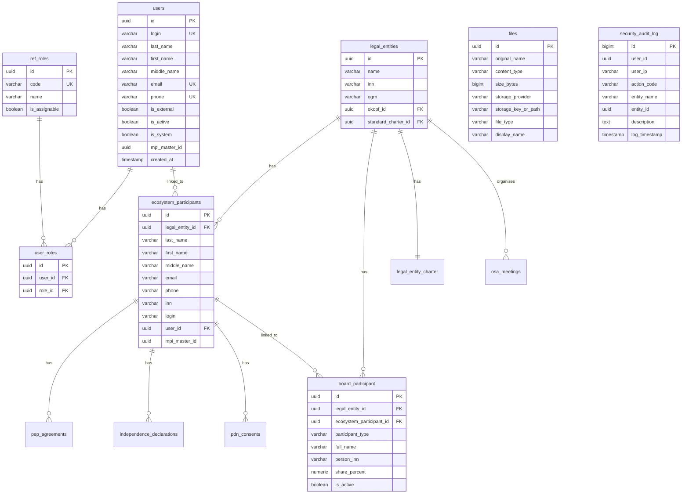

# Описание модели данных

---

## Обзор

Платформа «Цифровой Совет Директоров» использует PostgreSQL 16. Модель построена на принципах Database-First (BDR-002): каноническая схема — `tools/db/01_schema.sql`. Документация ниже отражает актуальную структуру БД.

---

## Схема базы данных (Mermaid ER)


```mermaid
erDiagram
    users {
        uuid id PK
        varchar login UK
        varchar last_name
        varchar first_name
        varchar middle_name
        varchar email UK
        varchar phone UK
        boolean is_external
        boolean is_active
        boolean is_system
        uuid mpi_master_id
        timestamp created_at
    }

    ref_roles {
        uuid id PK
        varchar code UK
        varchar name
        boolean is_assignable
    }

    user_roles {
        uuid id PK
        uuid user_id FK
        uuid role_id FK
    }

    legal_entities {
        uuid id PK
        varchar name
        varchar inn
        varchar ogrn
        uuid okopf_id FK
        uuid standard_charter_id FK
    }

    ecosystem_participants {
        uuid id PK
        uuid legal_entity_id FK
        varchar last_name
        varchar first_name
        varchar middle_name
        varchar email
        varchar phone
        varchar inn
        varchar login
        uuid user_id FK
        uuid mpi_master_id
    }

    board_participant {
        uuid id PK
        uuid legal_entity_id FK
        uuid ecosystem_participant_id FK
        varchar participant_type
        varchar full_name
        varchar person_inn
        numeric share_percent
        boolean is_active
    }

    files {
        uuid id PK
        varchar original_name
        varchar content_type
        bigint size_bytes
        varchar storage_provider
        varchar storage_key_or_path
        varchar file_type
        varchar display_name
    }

    security_audit_log {
        bigint id PK
        uuid user_id
        varchar user_ip
        varchar action_code
        varchar entity_name
        uuid entity_id
        text description
        timestamp log_timestamp
    }

    users ||--o{ user_roles : has
    ref_roles ||--o{ user_roles : has
    legal_entities ||--o{ ecosystem_participants : has
    users ||--o{ ecosystem_participants : linked_to
    ecosystem_participants ||--o{ pep_agreements : has
    ecosystem_participants ||--o{ independence_declarations : has
    ecosystem_participants ||--o{ pdn_consents : has
    legal_entities ||--o{ board_participant : has
    ecosystem_participants ||--o{ board_participant : linked_to
    legal_entities ||--|| legal_entity_charter : has
    legal_entities ||--o{ osa_meetings : organises
```

---

## Описание таблиц

### users

Основная таблица пользователей системы. Учётная запись с логином для входа.

| Поле | Тип | Описание |
|------|-----|----------|
| `id` | UUID | Первичный ключ |
| `login` | VARCHAR(100) | Логин для входа (уникальный) |
| `last_name` | VARCHAR(150) | Фамилия |
| `first_name` | VARCHAR(150) | Имя |
| `middle_name` | VARCHAR(150) | Отчество (nullable) |
| `email` | VARCHAR(255) | Email (уникальный) |
| `phone` | VARCHAR(20) | Телефон (уникальный) |
| `is_external` | BOOLEAN | Флаг: внешнее лицо |
| `created_at` | TIMESTAMP WITH TIME ZONE | Дата создания |
| `created_by` | UUID | Кто создал (nullable) |
| `invitation_token` | VARCHAR(255) | Токен приглашения (nullable) |
| `invitation_expires_at` | TIMESTAMP WITH TIME ZONE | Срок действия приглашения (nullable) |
| `is_active` | BOOLEAN | Учётная запись активна |
| `account_expires_at` | TIMESTAMP WITH TIME ZONE | Дата окончания (nullable) |
| `ldap_created_at` | TIMESTAMP WITH TIME ZONE | Дата создания в LDAP (nullable) |
| `is_system` | BOOLEAN | Системный пользователь |
| `mpi_master_id` | UUID | Идентификатор мастер-записи MPI (из LDAP/AD, nullable) |

### ref_roles

Справочник системных ролей.

| Поле | Тип | Описание |
|------|-----|----------|
| `id` | UUID | Первичный ключ |
| `code` | VARCHAR(50) | Код роли (уникальный): SYS_ADMIN, SECRETARY, CHAIR_BOARD, MEMBER_BOARD, EXTERNAL_DIRECTOR, SHAREHOLDER, COMMITTEE_CHAIR, COMMITTEE_MEMBER, DEPUTY_CHAIR, LAWYER, PARTICIPANT, CEO, LE_ADMIN |
| `name` | VARCHAR(100) | Название роли |
| `created_at` | TIMESTAMP WITH TIME ZONE | Дата создания |
| `created_by` | UUID | FK → users |
| `is_assignable` | BOOLEAN | Доступна для назначения через UI |

### user_roles

Связь пользователей и ролей. Каждый пользователь может иметь несколько ролей.

| Поле | Тип | Описание |
|------|-----|----------|
| `id` | UUID | Первичный ключ |
| `user_id` | UUID | FK → users (ON DELETE RESTRICT) |
| `role_id` | UUID | FK → ref_roles (ON DELETE RESTRICT) |

Ограничение: UNIQUE(user_id, role_id).

### legal_entities

Юридические лица (ПАО, НАО, ООО).

| Поле | Тип | Описание |
|------|-----|----------|
| `id` | UUID | Первичный ключ |
| `name` | VARCHAR(500) | Полное наименование |
| `short_name` | VARCHAR(255) | Краткое наименование (nullable) |
| `inn` | VARCHAR(12) | ИНН (nullable) |
| `ogrn` | VARCHAR(15) | ОГРН (nullable) |
| `okopf_id` | UUID | FK → ref_okopf (nullable) |
| `standard_charter_id` | UUID | FK → ref_standard_charter (nullable) |

### ecosystem_participants

Участники экосистемы — «золотая запись» ФЛ в пределах ЮЛ. Связывает ФЛ с ЮЛ, содержит MPI MasterId из ЕДИН.

| Поле | Тип | Описание |
|------|-----|----------|
| `id` | UUID | Первичный ключ |
| `legal_entity_id` | UUID | FK → legal_entities (ON DELETE RESTRICT) |
| `last_name` | VARCHAR(150) | Фамилия |
| `first_name` | VARCHAR(150) | Имя |
| `middle_name` | VARCHAR(150) | Отчество (nullable) |
| `email` | VARCHAR(255) | Email (nullable) |
| `phone` | VARCHAR(20) | Телефон (nullable) |
| `login` | VARCHAR(100) | Логин (уникальный в пределах legal_entity_id) |
| `user_id` | UUID | FK → users (nullable, ON DELETE SET NULL) |
| `mpi_master_id` | UUID | Идентификатор мастер-записи MPI из ЕДИН API (nullable) |
| `created_at` | TIMESTAMP WITH TIME ZONE | Дата создания |
| `created_by` | UUID | FK → users (nullable) |

Ограничение: UNIQUE(legal_entity_id, login).

### board_participant

Реестр участников общества (участники СД, акционеры). Хранит данные ДУЛ/реквизитов ЮЛ.

| Поле | Тип | Описание |
|------|-----|----------|
| `id` | UUID | Первичный ключ |
| `legal_entity_id` | UUID | FK → legal_entities (ON DELETE RESTRICT) |
| `ecosystem_participant_id` | UUID | FK → ecosystem_participants (nullable, ON DELETE SET NULL) |
| `participant_type` | VARCHAR(20) | Тип: FL (физлицо), UL (юрлицо), ИП |
| `full_name` | VARCHAR(300) | ФИО (для ФЛ) |
| `dul_type_id` | UUID | FK → ref_dul_type (nullable) |
| `passport_series` | VARCHAR(10) | Серия паспорта (nullable) |
| `passport_number` | VARCHAR(10) | Номер паспорта (nullable) |
| `passport_issued_by` | VARCHAR(500) | Кем выдан (nullable) |
| `passport_issue_date` | DATE | Дата выдачи (nullable) |
| `passport_department_code` | VARCHAR(10) | Код подразделения (nullable) |
| `passport_registration_address` | TEXT | Адрес регистрации (nullable) |
| `person_inn` | VARCHAR(12) | ИНН физлица (nullable) |
| `citizenship` | VARCHAR(100) | Гражданство (nullable) |
| `company_name` | VARCHAR(500) | Наименование ЮЛ (для UL) |
| `company_inn` | VARCHAR(12) | ИНН ЮЛ (nullable) |
| `company_ogrn` | VARCHAR(15) | ОГРН ЮЛ (nullable) |
| `company_kpp` | VARCHAR(9) | КПП ЮЛ (nullable) |
| `company_address` | TEXT | Адрес ЮЛ (nullable) |
| `ogrnip` | VARCHAR(15) | ОГРНИП (nullable) |
| `share_percent` | NUMERIC(5,2) | Доля в процентах (nullable) |
| `share_amount` | NUMERIC(18,2) | Номинальная стоимость доли (nullable) |
| `payment_info` | VARCHAR(500) | Сведения об оплате (nullable) |
| `share_registration_info` | VARCHAR(500) | Информация о регистрации операций с долей (nullable) |
| `entry_date` | DATE | Дата вхождения в состав (nullable) |
| `exit_date` | DATE | Дата выхода из состава (nullable) |
| `is_active` | BOOLEAN | Действующий участник |
| `sort_order` | INT | Порядок сортировки |
| `created_at` | TIMESTAMP WITH TIME ZONE | Дата создания |
| `updated_at` | TIMESTAMP WITH TIME ZONE | Дата обновления |
| `created_by` | UUID | FK → users (nullable) |

### legal_entity_charter

Параметры устава ООО (1:1 с legal_entities).

| Поле | Тип | Описание |
|------|-----|----------|
| `legal_entity_id` | UUID | PK, FK → legal_entities |
| `exit_allowed` | BOOLEAN | Выход участника разрешён |
| `exit_allowed_min_share_percent` | NUMERIC(5,2) | Мин. доля для выхода (nullable) |
| `exit_allowed_max_share_percent` | NUMERIC(5,2) | Макс. доля для выхода (nullable) |
| `exit_condition_description` | TEXT | Условия выхода (nullable) |
| `exit_requires_unanimous_osu` | BOOLEAN | Выход требует единогласного ОСУ |
| `transfer_to_participants_without_consent` | BOOLEAN | Переход доли к участникам без согласия |
| `transfer_to_third_parties` | VARCHAR(20) | CONSENT / WITHOUT_CONSENT / FORBIDDEN |
| `preemptive_right` | BOOLEAN | Преимущественное право покупки |
| `inheritance_without_consent` | BOOLEAN | Переход к наследникам без согласия |
| `executive_body` | CHAR(1) | A=гендиректор, B=каждый участник, C=все совместно, D=управляющий ИП, E=управляющая организация, F=несколько ЕИО |
| `protocol_confirmation_method_id` | UUID | FK → ref_protocol_confirmation_method (nullable) |
| `charter_document_id` | UUID | FK → files (nullable) |
| `board_regulation_document_id` | UUID | FK → files (nullable) |
| `committee_regulation_document_id` | UUID | FK → files (nullable) |
| `mandatory_audit` | BOOLEAN | Обязательный аудит (nullable) |
| `has_revision_commission` | BOOLEAN | Ревизионная комиссия (nullable) |
| `has_board_of_directors` | BOOLEAN | Наличие СД по уставу |
| `gd_term_id` | UUID | FK → ref_gd_term (nullable) |
| `vosu_threshold_percent` | NUMERIC(4,2) | Порог доли для требования о созыве ВОСУ (nullable) |
| `board_decides_convening_osu` | BOOLEAN | СД решает о созыве ОСУ |

### legal_entity_board_settings

Глобальные настройки Совета директоров (singleton, 1 запись в таблице).

| Поле | Тип | Описание |
|------|-----|----------|
| `id` | UUID | Первичный ключ |
| `gosa_window_start` | DATE | Начало интервала ГОСА (nullable) |
| `gosa_window_end` | DATE | Конец интервала ГОСА (nullable) |
| `deputy_chair_provided` | BOOLEAN | Предусмотрен зам. председателя |
| `secretary_provided` | BOOLEAN | Предусмотрен секретарь |
| `secretary_signs_protocols` | BOOLEAN | Секретарь подписывает протоколы |
| `committees_mandatory` | BOOLEAN | Комитеты обязательны |
| `committees_defined_by_documents` | BOOLEAN | Комитеты определены документами |
| `max_committees_per_member_defined` | BOOLEAN | Ограничение кол-ва комитетов на члена |
| `max_committees_per_member` | INT | Макс. комитетов на члена (nullable) |
| `max_committees_headed_per_member_defined` | BOOLEAN | Ограничение кол-ва комитетов «руководит» |
| `max_committees_headed_per_member` | INT | Макс. комитетов «руководит» (nullable) |
| `min_committee_members_defined` | BOOLEAN | Мин. кол-во членов комитета |
| `min_committee_members` | INT | Мин. членов комитета (nullable) |
| `committee_quorum_defined` | BOOLEAN | Кворум комитета определён |
| `committee_quorum_percent` | INT | Кворум комитета % (nullable) |
| `joint_committee_quorum_defined` | BOOLEAN | Совместный кворум определён |
| `joint_committee_quorum_percent` | INT | Совместный кворум % (nullable) |

### legal_entity_voting_rules

Правила голосования в СД (индивидуальные для ЮЛ).

| Поле | Тип | Описание |
|------|-----|----------|
| `id` | UUID | Первичный ключ |
| `legal_entity_id` | UUID | FK → legal_entities (уникальный) |
| `quorum_percent` | INT | Кворум (по умолчанию 50) |
| `chair_tiebreaker` | BOOLEAN | Голос председателя решающий при равенстве |
| `absentee_opinions` | BOOLEAN | Учёт письменных мнений |
| `qualified_majority_percent` | INT | Квалифицированное большинство (по умолчанию 75) |
| `in_person_allowed` | BOOLEAN | Очное голосование разрешено |
| `absentee_allowed` | BOOLEAN | Заочное голосование разрешено |
| `mixed_allowed` | BOOLEAN | Смешанное голосование разрешено |
| `document_flow` | INT | Тип документооборота |
| `spot_by_election` | BOOLEAN | Выборы на месте |
| `first_meeting_deadline_days` | INT | Дедлайн первого заседания (дни) |
| `created_at` | TIMESTAMP WITH TIME ZONE | Дата создания |

### committees

Динамический справочник комитетов.

| Поле | Тип | Описание |
|------|-----|----------|
| `id` | UUID | Первичный ключ |
| `code` | VARCHAR(20) | Код-аббревиатура (уникальный) |
| `name` | VARCHAR(255) | Полное наименование |
| `description` | TEXT | Описание (nullable) |
| `behavior_type` | VARCHAR(50) | CONTROL или STRATEGIC |
| `is_mandatory_for_public` | BOOLEAN | Обязателен для публичных АО |
| `is_active` | BOOLEAN | Активен |
| `chair_id` | UUID | FK → users (nullable, ON DELETE SET NULL) |
| `secretary_id` | UUID | FK → users (nullable, ON DELETE SET NULL) |
| `created_at` | TIMESTAMP WITH TIME ZONE | Дата создания |
| `created_by` | UUID | FK → users (nullable) |

Ограничение: chair_id <> secretary_id (если оба заданы).

### committee_members

Члены комитетов.

| Поле | Тип | Описание |
|------|-----|----------|
| `id` | UUID | Первичный ключ |
| `committee_id` | UUID | FK → committees (ON DELETE RESTRICT) |
| `user_id` | UUID | FK → users (ON DELETE RESTRICT) |

Ограничение: UNIQUE(committee_id, user_id).

### meetings

Заседания и уведомления о созыве.

| Поле | Тип | Описание |
|------|-----|----------|
| `id` | UUID | Первичный ключ |
| `meeting_number` | VARCHAR(50) | Номер заседания (nullable) |
| `meeting_form_id` | UUID | FK → ref_meeting_form (ON DELETE RESTRICT) |
| `status` | VARCHAR(50) | DRAFT, NOTIFIED, VOTING, PROTOCOL, ARCHIVE |
| `voting_start_at` | TIMESTAMP WITH TIME ZONE | Старта голосования (nullable) |
| `voting_end_at` | TIMESTAMP WITH TIME ZONE | Дедлайн голосования (nullable) |
| `created_by` | UUID | FK → users (nullable, ON DELETE SET NULL) |
| `created_at` | TIMESTAMP WITH TIME ZONE | Дата создания |

### agenda_questions

Вопросы повестки заседаний СД.

| Поле | Тип | Описание |
|------|-----|----------|
| `id` | UUID | Первичный ключ |
| `meeting_id` | UUID | FK → meetings (ON DELETE RESTRICT) |
| `sequence_number` | INT | Порядковый номер |
| `question_text` | TEXT | Текст вопроса |
| `proposed_resolution` | TEXT | Проект решения |
| `status` | VARCHAR(50) | PENDING, DISCUSSION, VOTED, POSTPONED |

### committee_tasks

Поручения комитетам.

| Поле | Тип | Описание |
|------|-----|----------|
| `id` | UUID | Первичный ключ |
| `committee_id` | UUID | FK → committees (ON DELETE RESTRICT) |
| `agenda_question_id` | UUID | FK → agenda_questions (nullable, ON DELETE SET NULL) |
| `task_description` | TEXT | Описание поручения |
| `deadline_at` | TIMESTAMP WITH TIME ZONE | Дедлайн выполнения |
| `status` | VARCHAR(50) | IN_WORK, REVIEW, COMPLETED |
| `created_by` | UUID | FK → users (nullable, ON DELETE SET NULL) |
| `created_at` | TIMESTAMP WITH TIME ZONE | Дата создания |

### bulletins

Бюллетени и электронные подписи голосования.

| Поле | Тип | Описание |
|------|-----|----------|
| `id` | UUID | Первичный ключ |
| `agenda_question_id` | UUID | FK → agenda_questions (ON DELETE RESTRICT) |
| `user_id` | UUID | FK → users (ON DELETE RESTRICT) |
| `vote_value` | VARCHAR(15) | ZA, PROTIV, VOZDERZHALSYA, CONFLICT |
| `special_opinion` | TEXT | Особое мнение (nullable) |
| `signature_type` | VARCHAR(10) | PEP (СМС) или UKEP (КриптоПро) |
| `signature_value` | TEXT | Хэш подписи |
| `signed_at` | TIMESTAMP WITH TIME ZONE | Время фиксации подписи |
| `is_cancelled` | BOOLEAN | Флаг отмены |
| `cancellation_reason` | TEXT | Причина отмены (nullable) |

Ограничение: UNIQUE(agenda_question_id, user_id, is_cancelled).

### files

Единое файловое хранилище метаданных (ADR-020, BDR-011).

| Поле | Тип | Описание |
|------|-----|----------|
| `id` | UUID | Первичный ключ |
| `original_name` | VARCHAR(255) | Оригинальное имя файла |
| `content_type` | VARCHAR(255) | MIME-тип (nullable) |
| `size_bytes` | BIGINT | Размер в байтах |
| `storage_provider` | VARCHAR(10) | LOCAL или S3 |
| `storage_key_or_path` | VARCHAR(1024) | Путь/ключ хранения |
| `checksum` | VARCHAR(64) | SHA-256 (nullable) |
| `created_at` | TIMESTAMP WITH TIME ZONE | Дата создания |
| `created_by` | UUID | FK → users (nullable, ON DELETE SET NULL) |
| `file_type` | VARCHAR(50) | Контекст использования (nullable) |
| `display_name` | VARCHAR(255) | Отображаемое имя (nullable) |
| `extension` | VARCHAR(20) | Расширение файла (nullable) |
| `is_uploaded` | BOOLEAN | Флаг загрузки |
| `upload_id` | VARCHAR(64) | ID загрузки для chunked upload (nullable) |
| `expires_at` | TIMESTAMP WITH TIME ZONE | Срок хранения (nullable) |

Ограничение: UNIQUE(storage_provider, storage_key_or_path).

### osa_meetings

Общие собрания акционеров/участников (ОСА/ОСУ).

| Поле | Тип | Описание |
|------|-----|----------|
| `id` | UUID | Первичный ключ |
| `legal_entity_id` | UUID | FK → legal_entities (ON DELETE RESTRICT) |
| `osa_form_id` | UUID | FK → ref_osa_form (ON DELETE RESTRICT) |
| `title` | VARCHAR(500) | Наименование (nullable) |
| `gosa_window_start` | DATE | Начало интервала ГОСА (nullable) |
| `gosa_window_end` | DATE | Конец интервала ГОСА (nullable) |
| `election_year` | INT | Год выборов (nullable) |
| `shareholders_count` | INT | Количество акционеров (nullable) |
| `board_min_number` | INT | Мин. число членов СД (nullable) |
| `board_member_number` | INT | Число членов СД (nullable) |
| `executive_directors_participate` | BOOLEAN | Исп. директора участвуют |
| `executive_directors_count` | INT | Кол-во исп. директоров (nullable) |
| `non_executive_directors_participate` | BOOLEAN | Неисп. директора участвуют |
| `non_executive_directors_count` | INT | Кол-во неисп. директоров (nullable) |
| `independent_directors_participate` | BOOLEAN | Независимые директора участвуют |
| `independent_directors_count` | INT | Кол-во независимых директоров (nullable) |
| `shareholders_list_received` | BOOLEAN | Реестр акционеров получен |
| `absentee_voting` | BOOLEAN | Заочное голосование |
| `status` | VARCHAR(20) | Статус (по умолчанию DRAFT) |
| `finalized_by` | UUID | FK → users (nullable) |
| `finalized_at` | TIMESTAMP WITH TIME ZONE | Дата финализации (nullable) |
| `osa_held` | BOOLEAN | ОСА проведено |
| `protocol_signed` | BOOLEAN | Протокол подписан |
| `deputy_chair_provided` | BOOLEAN | Зам. председателя предусмотрен |
| `secretary_provided` | BOOLEAN | Секретарь предусмотрен |
| `secretary_signs_protocols` | BOOLEAN | Секретарь подписывает протоколы |
| `temporary_chair_provided` | BOOLEAN | Временный председатель назначен |
| `board_composition_approved` | BOOLEAN | Состав СД утверждён |
| `board_mandatory` | BOOLEAN | СД обязателен |
| `board_approved` | BOOLEAN | СД утверждён |
| `temporary_chair_selection` | VARCHAR(50) | Способ выбора временного председателя (nullable) |
| `temporary_chair_name` | VARCHAR(300) | ФИО временного председателя (nullable) |
| `protocol_signed_at` | TIMESTAMP WITH TIME ZONE | Дата подписания протокола (nullable) |
| `ballot_deadline` | TIMESTAMP WITH TIME ZONE | Дедлайн голосования (nullable) |
| `created_at` | TIMESTAMP WITH TIME ZONE | Дата создания |

### board_of_directors

Головная запись состава Совета директоров.

| Поле | Тип | Описание |
|------|-----|----------|
| `id` | UUID | Первичный ключ |
| `osa_meeting_id` | UUID | FK → osa_meetings (ON DELETE RESTRICT) |
| `status_id` | UUID | FK → ref_board_of_directors_statuses |
| `election_year` | INTEGER | Год выборов (nullable) |
| `started_at` | DATE | Дата начала полномочий (nullable) |
| `ended_at` | DATE | Дата окончания полномочий (nullable) |

### board_members

Члены СД (состав утверждается ОСА).

| Поле | Тип | Описание |
|------|-----|----------|
| `id` | UUID | Первичный ключ |
| `osa_meeting_id` | UUID | FK → osa_meetings (ON DELETE RESTRICT) |
| `board_of_directors_id` | UUID | FK → board_of_directors (nullable) |
| `full_name` | VARCHAR(300) | ФИО |
| `board_member_type_id` | UUID | FK → ref_board_member_types (nullable) |
| `account` | VARCHAR(100) | Номер лицевого счёта (nullable) |
| `email` | VARCHAR(200) | Email (nullable) |
| `user_id` | UUID | Ссылка на пользователя (nullable) |

### board_member_appointments

История должностей членов СД (SCD Type 2).

| Поле | Тип | Описание |
|------|-----|----------|
| `id` | UUID | Первичный ключ |
| `board_member_id` | UUID | FK → board_members (ON DELETE RESTRICT) |
| `role_id` | UUID | FK → ref_board_roles (nullable) |
| `role_code` | VARCHAR(20) | Код роли |
| `started_at` | DATE | Дата начала |
| `ended_at` | DATE | Дата окончания (nullable) |
| `status_id` | UUID | FK → ref_board_member_appointment_statuses |
| `resigned_at` | TIMESTAMP WITH TIME ZONE | Дата сложения полномочий (nullable) |
| `resignation_reason_id` | UUID | FK → ref_resignation_reasons (nullable) |
| `legal_basis` | TEXT | Правовое основание (nullable) |

### share_request

Запросы участника ООО в общество (требования).

| Поле | Тип | Описание |
|------|-----|----------|
| `id` | UUID | Первичный ключ |
| `legal_entity_id` | UUID | FK → legal_entities (ON DELETE RESTRICT) |
| `participant_id` | UUID | FK → board_participant (ON DELETE RESTRICT) |
| `request_type_id` | UUID | FK → ref_request_type (ON DELETE RESTRICT) |
| `status` | VARCHAR(20) | Статус (по умолчанию draft) |
| `payload` | JSONB | Данные запроса (nullable) |
| `notarization_id` | UUID | FK → notarization (nullable, ON DELETE SET NULL) |
| `revoked_at` | TIMESTAMP WITH TIME ZONE | Дата отзыва (nullable) |
| `revoked_by_notarized` | BOOLEAN | Отозвано нотариально |
| `visible_to_all` | BOOLEAN | Видно всем участникам |
| `created_at` | TIMESTAMP WITH TIME ZONE | Дата создания |
| `completed_at` | TIMESTAMP WITH TIME ZONE | Дата завершения (nullable) |
| `created_by` | UUID | FK → users (nullable, ON DELETE SET NULL) |
| `is_collective` | BOOLEAN | Коллективный запрос |
| `threshold_percent` | NUMERIC(4,2) | Порог для коллективного запроса (nullable) |
| `total_support_percent` | NUMERIC(6,2) | Суммарная поддержка |
| `supporter_count` | INTEGER | Кол-во сторонников |
| `collective_status` | VARCHAR(20) | Статус коллективного запроса (nullable) |
| `submitted_to_ceo_at` | TIMESTAMP WITH TIME ZONE | Дата направления ГД (nullable) |
| `ceo_decision_at` | TIMESTAMP WITH TIME ZONE | Дата решения ГД (nullable) |
| `ceo_comment` | TEXT | Комментарий ГД (nullable) |
| `decided_by_user_id` | UUID | FK → users (nullable, ON DELETE SET NULL) |
| `review_location` | TEXT | Место рассмотрения (nullable) |
| `org_intent_id` | UUID | FK → org_intents (nullable) |
| `decision_status` | VARCHAR(20) | Статус решения (nullable) |
| `decision_comment` | TEXT | Комментарий решения (nullable) |
| `decided_at` | TIMESTAMP WITH TIME ZONE | Дата решения (nullable) |

### notifications

Уведомления пользователям.

| Поле | Тип | Описание |
|------|-----|----------|
| `id` | UUID | Первичный ключ |
| `user_id` | UUID | FK → users (nullable, ON DELETE SET NULL) |
| `committee_id` | UUID | FK → committees (nullable, ON DELETE SET NULL) |
| `meeting_id` | UUID | FK → meetings (nullable, ON DELETE SET NULL) |
| `notification_type` | VARCHAR(50) | Тип уведомления |
| `title` | VARCHAR(500) | Заголовок |
| `body` | TEXT | Тело уведомления |
| `url` | VARCHAR(1000) | URL (nullable) |
| `is_read` | BOOLEAN | Прочитано |
| `created_at` | TIMESTAMP WITH TIME ZONE | Дата создания |

### employee

Сотрудник — связывает участника экосистемы с ЮЛ и должностью.

| Поле | Тип | Описание |
|------|-----|----------|
| `id` | UUID | Первичный ключ |
| `ecosystem_participant_id` | UUID | FK → ecosystem_participants (ON DELETE RESTRICT) |
| `legal_entity_id` | UUID | FK → legal_entities (ON DELETE RESTRICT) |
| `position` | VARCHAR(200) | Должность |
| `created_at` | TIMESTAMP WITH TIME ZONE | Дата создания |
| `created_by` | UUID | FK → users |

### external_attracted_persons

Внешнее привлечённое лицо (внешние директора/консультанты).

| Поле | Тип | Описание |
|------|-----|----------|
| `id` | UUID | Первичный ключ |
| `ecosystem_participant_id` | UUID | FK → ecosystem_participants (ON DELETE RESTRICT) |
| `legal_entity_id` | UUID | FK → legal_entities (ON DELETE RESTRICT) |
| `position` | VARCHAR(200) | Должность/роль |
| `started_at` | TIMESTAMP WITH TIME ZONE | Дата начала (nullable) |
| `ended_at` | TIMESTAMP WITH TIME ZONE | Дата окончания (nullable) |
| `is_active` | BOOLEAN | Действует |
| `created_at` | TIMESTAMP WITH TIME ZONE | Дата создания |
| `created_by` | UUID | FK → users |

### contracts

Договоры (единая таблица для всех типов: REGISTRAR, INFO_AGENCY, MANAGEMENT_IP, MANAGEMENT_UL).

| Поле | Тип | Описание |
|------|-----|----------|
| `id` | UUID | Первичный ключ |
| `legal_entity_id` | UUID | FK → legal_entities (ON DELETE RESTRICT) |
| `contract_type` | VARCHAR(30) | Тип договора |
| `counterparty_name` | VARCHAR(500) | Наименование контрагента |
| `counterparty_inn` | VARCHAR(12) | ИНН контрагента |
| `contract_number` | VARCHAR(100) | Номер договора (nullable) |
| `contract_date` | DATE | Дата договора (nullable) |
| `contract_valid_from` | DATE | Действует с (nullable) |
| `contract_valid_to` | DATE | Действует по (nullable) |
| `is_indefinite` | BOOLEAN | Бессрочный |
| `contract_document_id` | UUID | FK → files (nullable, ON DELETE SET NULL) |
| `registry_preparation_days` | INTEGER | Срок подготовки реестра (nullable) |
| `registry_preparation_unit` | UUID | FK → ref_measurement_unit (nullable) |
| `dividend_registry_preparation_days` | INTEGER | Срок подготовки дивидендного реестра (nullable) |
| `dividend_registry_preparation_unit` | UUID | FK → ref_measurement_unit (nullable) |
| `registry_rules_url` | VARCHAR(1000) | URL правил реестра (nullable) |
| `registry_rules_document_id` | UUID | FK → files (nullable) |
| `manager_ogrnip` | VARCHAR(15) | ОГРНИП управляющего ИП (nullable) |
| `manager_legal_entity_id` | UUID | FK → legal_entities (nullable) |
| `is_active` | BOOLEAN | Активен |
| `created_at` | TIMESTAMP WITH TIME ZONE | Дата создания |
| `created_by` | UUID | FK → users (nullable) |

### security_audit_log

Журнал аудита безопасности (некорректируемый).

| Поле | Тип | Описание |
|------|-----|----------|
| `id` | BIGINT | Первичный ключ (GENERATED ALWAYS AS IDENTITY) |
| `user_id` | UUID | ID пользователя (nullable) |
| `user_ip` | VARCHAR(45) | IP-адрес клиента |
| `action_code` | VARCHAR(100) | Код действия |
| `entity_name` | VARCHAR(100) | Имя таблицы (nullable) |
| `entity_id` | UUID | ID записи (nullable) |
| `description` | TEXT | Описание действия |
| `log_timestamp` | TIMESTAMP WITH TIME ZONE | Время записи (UTC) |

### ext_spark_company

Кэш карточки компании из СПАРК (BDR-009). Не авторитетный источник.

| Поле | Тип | Описание |
|------|-----|----------|
| `id` | UUID | Первичный ключ |
| `inn` | VARCHAR(12) | ИНН компании (уникальный) |
| `ogrn` | VARCHAR(15) | ОГРН (nullable) |
| `full_name` | VARCHAR(500) | Полное наименование (nullable) |
| `short_name` | VARCHAR(255) | Краткое наименование (nullable) |
| `okopf_code` | VARCHAR(10) | Код ОКОПФ (nullable) |
| `okopf_name` | VARCHAR(255) | Наименование ОКОПФ (nullable) |
| `legal_address` | TEXT | Юридический адрес (nullable) |
| `status` | VARCHAR(100) | Статус (nullable) |
| `registration_date` | DATE | Дата регистрации (nullable) |
| `shareholders_count` | INTEGER | Кол-во акционеров (nullable) |
| `employees_count` | INTEGER | Кол-во сотрудников (nullable) |
| `fetched_at` | TIMESTAMP WITH TIME ZONE | Время получения данных |

### ext_spark_manager

Кэш данных о руководителе из СПАРК.

| Поле | Тип | Описание |
|------|-----|----------|
| `id` | UUID | Первичный ключ |
| `inn` | VARCHAR(12) | ИНН компании |
| `full_name` | VARCHAR(300) | ФИО руководителя |
| `position` | VARCHAR(200) | Должность (nullable) |
| `person_inn` | VARCHAR(12) | ИНН физлица-руководителя (nullable) |
| `start_date` | DATE | Дата начала полномочий (nullable) |
| `fetched_at` | TIMESTAMP WITH TIME ZONE | Время получения данных |

### ext_spark_founder

Кэш данных об учредителях ООО из СПАРК.

| Поле | Тип | Описание |
|------|-----|----------|
| `id` | UUID | Первичный ключ |
| `inn` | VARCHAR(12) | ИНН компании |
| `name` | VARCHAR(500) | Наименование учредителя-ЮЛ (nullable) |
| `founder_inn` | VARCHAR(12) | ИНН учредителя-ЮЛ (nullable) |
| `founder_ogrn` | VARCHAR(15) | ОГРН учредителя-ЮЛ (nullable) |
| `country` | VARCHAR(100) | Страна регистрации (nullable) |
| `is_foreign` | BOOLEAN | Иностранное ЮЛ |
| `full_name` | VARCHAR(300) | ФИО учредителя-ФЛ (nullable) |
| `person_inn` | VARCHAR(12) | ИНН учредителя-ФЛ (nullable) |
| `citizenship` | VARCHAR(100) | Гражданство (nullable) |
| `head_of_other` | INTEGER | Кол-во организаций, где ФЛ — руководитель (nullable) |
| `founder_of_other` | INTEGER | Кол-во организаций, где ФЛ — учредитель (nullable) |
| `is_entrepreneur` | BOOLEAN | Зарегистрирован как ИП |
| `ogrnip` | VARCHAR(15) | ОГРНИП (nullable) |
| `share_amount` | NUMERIC(18,2) | Номинальная стоимость доли (nullable) |
| `share_percent` | NUMERIC(5,2) | Доля в процентах (nullable) |
| `entry_date` | DATE | Дата вхождения (nullable) |
| `exit_date` | DATE | Дата выхода (nullable) |
| `fetched_at` | TIMESTAMP WITH TIME ZONE | Время получения данных |

### ext_cbr_finorg_organization

Кэш данных участника финансового рынка из ЦБ РФ.

| Поле | Тип | Описание |
|------|-----|----------|
| `id` | UUID | Первичный ключ |
| `inn` | VARCHAR(12) | ИНН (уникальный) |
| `cbr_id` | BIGINT | ID в системе ЦБ (nullable) |
| `ogrn` | VARCHAR(15) | ОГРН (nullable) |
| `full_name` | VARCHAR(500) | Полное наименование (nullable) |
| `short_name` | VARCHAR(255) | Краткое наименование (nullable) |
| `eng_name` | VARCHAR(500) | Английское наименование (nullable) |
| `address` | TEXT | Адрес (nullable) |
| `phones` | VARCHAR(500) | Телефоны (nullable) |
| `email` | VARCHAR(255) | Email (nullable) |
| `fo_types` | VARCHAR(500) | Типы ФО (nullable) |
| `status` | VARCHAR(50) | Статус |
| `fetched_at` | TIMESTAMP WITH TIME ZONE | Время получения данных |

### ext_cbr_finorg_license

Лицензии организации из ЦБ РФ.

| Поле | Тип | Описание |
|------|-----|----------|
| `id` | UUID | Первичный ключ |
| `organization_inn` | VARCHAR(12) | ИНН организации |
| `vid_id` | INTEGER | ID вида деятельности |
| `activity_name` | VARCHAR(500) | Наименование деятельности (nullable) |
| `number` | VARCHAR(100) | Номер лицензии (nullable) |
| `start_date` | TIMESTAMP WITH TIME ZONE | Дата выдачи (nullable) |
| `end_date` | TIMESTAMP WITH TIME ZONE | Дата окончания (nullable) |
| `fetched_at` | TIMESTAMP WITH TIME ZONE | Время получения данных |

### tpl_org_intents

Шаблоны целей организационных мероприятий (верхний уровень иерархии).

| Поле | Тип | Описание |
|------|-----|----------|
| `id` | UUID | Первичный ключ |
| `code` | VARCHAR(50) | Код (уникальный): FIRST_BOARD, GOSA, VOSA, BOARD_MEETING, OOSU, VOSU |
| `name` | VARCHAR(300) | Наименование цели |
| `description` | TEXT | Описание (nullable) |
| `sort_order` | INT | Порядок сортировки |
| `is_for_ao` | BOOLEAN | Применим для АО (nullable) |
| `is_for_llc` | BOOLEAN | Применим для ООО (nullable) |
| `requires_board_of_directors` | BOOLEAN | Требует наличия СД (nullable) |
| `created_at` | TIMESTAMP WITH TIME ZONE | Дата создания |
| `created_by` | UUID | FK → users (nullable) |

### tpl_org_stages

Шаблоны этапов (привязаны к целям).

| Поле | Тип | Описание |
|------|-----|----------|
| `id` | UUID | Первичный ключ |
| `intent_id` | UUID | FK → tpl_org_intents (ON DELETE RESTRICT) |
| `name` | VARCHAR(300) | Наименование этапа |
| `description` | TEXT | Описание (nullable) |
| `sort_order` | INT | Порядок сортировки |
| `start_offset_days` | INT | Смещение начала от триггера (nullable) |
| `deadline_rule` | VARCHAR(100) | Правило дедлайна (nullable) |
| `deadline_days` | INT | Дни до дедлайна (nullable) |
| `measurement_unit_id` | UUID | FK → ref_measurement_unit (nullable) |
| `dependency_type` | VARCHAR(10) | Тип зависимости (по умолчанию FS) |
| `predecessor_stage_ids` | TEXT | ID предшествующих этапов (nullable) |
| `created_at` | TIMESTAMP WITH TIME ZONE | Дата создания |
| `created_by` | UUID | FK → users (nullable) |

### tpl_org_offers

Шаблоны задач (оферов, привязаны к этапам).

| Поле | Тип | Описание |
|------|-----|----------|
| `id` | UUID | Первичный ключ |
| `stage_id` | UUID | FK → tpl_org_stages (ON DELETE RESTRICT) |
| `name` | VARCHAR(300) | Наименование задачи |
| `description` | TEXT | Описание (nullable) |
| `start_offset_days` | INT | Смещение начала от родителя (nullable) |
| `deadline_rule` | VARCHAR(100) | Правило дедлайна (nullable) |
| `deadline_days` | INT | Дни до дедлайна (nullable) |
| `measurement_unit_id` | UUID | FK → ref_measurement_unit (nullable) |
| `assigned_role_id` | UUID | FK → ref_roles (nullable) |
| `assigned_board_role_id` | UUID | FK → ref_board_roles (nullable) |
| `require_notary_confirmation` | BOOLEAN | Только при нотариальном подтверждении (nullable) |
| `require_all_sign_confirmation` | BOOLEAN | Только при подписании всеми (nullable) |
| `require_committees` | BOOLEAN | Только при наличии комитетов (nullable) |
| `require_board_regulation` | BOOLEAN | Только при Положении о СД (nullable) |
| `require_custom_charter` | BOOLEAN | Только для нетипового устава (nullable) |
| `require_executive_body_a` | BOOLEAN | Только для гендиректора (nullable) |
| `require_board_of_directors` | BOOLEAN | Только при наличии СД (nullable) |
| `require_document_flow_legal_electronic` | BOOLEAN | Только при ЮЗЭДО (nullable) |
| `require_mandatory_audit` | BOOLEAN | Только при обязательном аудите (nullable) |
| `require_revision_commission` | BOOLEAN | Только при ревизионной комиссии (nullable) |
| `dependency_type` | VARCHAR(10) | Тип зависимости (по умолчанию FS) |
| `predecessor_offer_ids` | TEXT | ID предшествующих задач (nullable) |
| `created_at` | TIMESTAMP WITH TIME ZONE | Дата создания |
| `created_by` | UUID | FK → users (nullable) |

### org_intents / org_stages / org_tasks / org_milestones

Runtime-таблицы, создаваемые из шаблонов при инстанцировании. Структура аналогична шаблонным таблицам с добавлением полей:

- `legal_entity_id` — привязка к ЮЛ
- `template_*_id` — ссылка на шаблон
- `status` — PLANNED, IN_PROGRESS, COMPLETED
- `assigned_user_id` — назначенный исполнитель
- `planned_start` / `planned_end` — плановые даты
- `actual_start` / `actual_end` — фактические даты

---

## Применение SQL-изменений к БД

1. Поднять Postgres: `docker compose up -d postgres`
2. Применить скрипты по порядку:
   - Схема: `cat tools/db/01_schema.sql | docker exec -i fiducia-postgres psql -U fiducia -d fiducia -v ON_ERROR_STOP=1`
   - Справочники: `cat tools/db/02_seed.sql | docker exec -i fiducia-postgres psql -U fiducia -d fiducia -v ON_ERROR_STOP=1`
   - Демо-данные: `cat tools/db/03_demo.sql | docker exec -i fiducia-postgres psql -U fiducia -d fiducia -v ON_ERROR_STOP=1`
3. Проверить: `docker exec -it fiducia-postgres psql -U fiducia -d fiducia -c "\\dt"`

---

## Структура SQL-скриптов (Database-First)

```
tools/db/
├── 00_reset_schema.sql   # DROP всех объектов + применение 01_schema.sql
├── 01_schema.sql         # Каноническая схема БД (DDL)
├── 02_seed.sql           # Справочники ref_* и системные записи
└── 03_demo.sql           # Демо-данные для разработки
```
