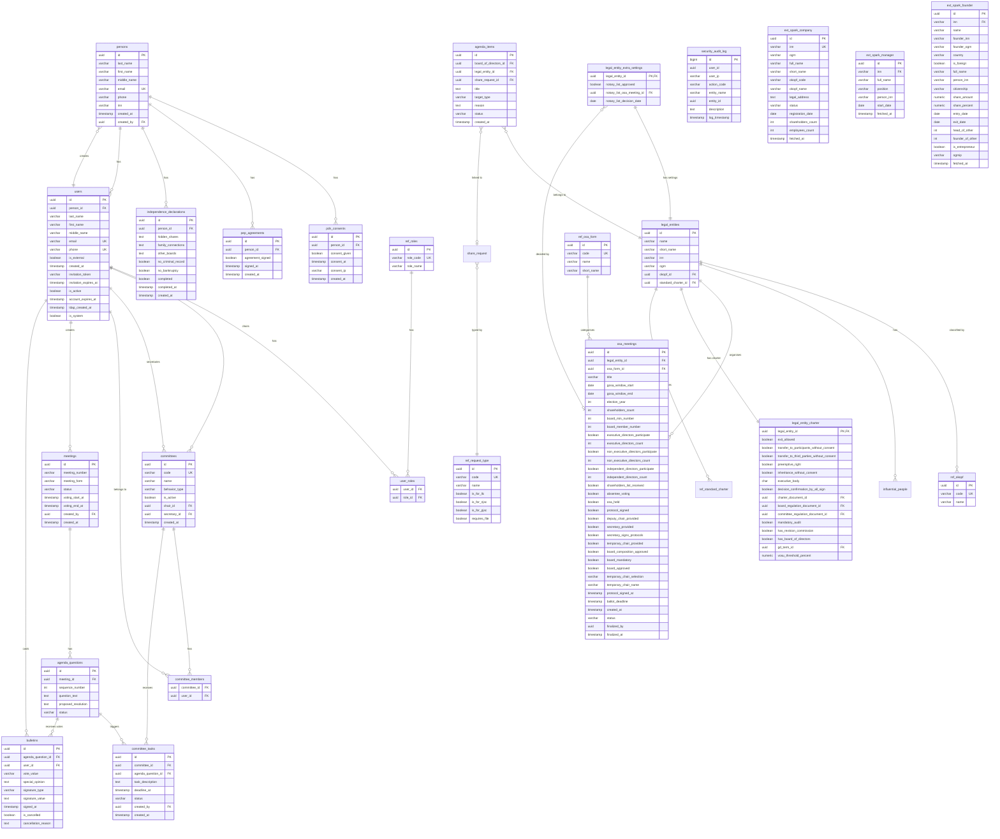

# Описание модели данных

---

## Обзор

Платформа «Цифровой Совет Директоров» использует PostgreSQL 16 в качестве основной системы хранения данных. Модель построена на принципах Domain-Driven Design с выделением агрегатов и ограниченных контекстов.

---

## Схема базы данных


```mermaid
erDiagram
    persons {
        uuid id PK
        varchar last_name
        varchar first_name
        varchar middle_name
        varchar email UK
        varchar phone
        varchar inn
        timestamp created_at
        uuid created_by FK
    }

    pdn_consents {
        uuid id PK
        uuid person_id FK
        boolean consent_given
        timestamp consent_at
        varchar consent_ip
        timestamp created_at
    }

    pep_agreements {
        uuid id PK
        uuid person_id FK
        boolean agreement_signed
        timestamp signed_at
        timestamp created_at
    }

    independence_declarations {
        uuid id PK
        uuid person_id FK
        text hidden_shares
        text family_connections
        text other_boards
        boolean no_criminal_record
        boolean no_bankruptcy
        boolean completed
        timestamp completed_at
        timestamp created_at
    }

    users {
        uuid id PK
        uuid person_id FK
        varchar last_name
        varchar first_name
        varchar middle_name
        varchar email UK
        varchar phone UK
        boolean is_external
        timestamp created_at
        varchar invitation_token
        timestamp invitation_expires_at
        boolean is_active
        timestamp account_expires_at
        timestamp ldap_created_at
        boolean is_system
    }

    ref_roles {
        uuid id PK
        varchar role_code UK
        varchar role_name
    }

    user_roles {
        uuid user_id FK
        uuid role_id FK
    }

    legal_entities {
        uuid id PK
        varchar name
        varchar short_name
        varchar inn
        varchar ogrn
        uuid okopf_id FK
        uuid standard_charter_id FK
    }

    legal_entity_charter {
        uuid legal_entity_id PK,FK
        boolean exit_allowed
        boolean transfer_to_participants_without_consent
        boolean transfer_to_third_parties_without_consent
        boolean preemptive_right
        boolean inheritance_without_consent
        char executive_body
        boolean decision_confirmation_by_all_sign
        uuid charter_document_id FK
        uuid board_regulation_document_id FK
        uuid committee_regulation_document_id FK
        boolean mandatory_audit
        boolean has_revision_commission
        boolean has_board_of_directors
        uuid gd_term_id FK
        numeric vosu_threshold_percent
    }

    legal_entity_extra_settings {
        uuid legal_entity_id PK,FK
        boolean notary_list_approved
        uuid notary_list_osa_meeting_id FK
        date notary_list_decision_date
    }

    ref_okopf {
        uuid id PK
        varchar code UK
        varchar name
    }

    committees {
        uuid id PK
        varchar code UK
        varchar name
        varchar behavior_type
        boolean is_active
        uuid chair_id FK
        uuid secretary_id FK
        timestamp created_at
    }

    committee_members {
        uuid committee_id FK
        uuid user_id FK
    }

    meetings {
        uuid id PK
        varchar meeting_number
        varchar meeting_form
        varchar status
        timestamp voting_start_at
        timestamp voting_end_at
        uuid created_by FK
        timestamp created_at
    }

    agenda_questions {
        uuid id PK
        uuid meeting_id FK
        int sequence_number
        text question_text
        text proposed_resolution
        varchar status
    }

    agenda_items {
        uuid id PK
        uuid board_of_directors_id FK
        uuid legal_entity_id FK
        uuid share_request_id FK
        text title
        varchar target_type
        text reason
        varchar status
        timestamp created_at
    }

    committee_tasks {
        uuid id PK
        uuid committee_id FK
        uuid agenda_question_id FK
        text task_description
        timestamp deadline_at
        varchar status
        uuid created_by FK
        timestamp created_at
    }

    bulletins {
        uuid id PK
        uuid agenda_question_id FK
        uuid user_id FK
        varchar vote_value
        text special_opinion
        varchar signature_type
        text signature_value
        timestamp signed_at
        boolean is_cancelled
        text cancellation_reason
    }

    security_audit_log {
        bigint id PK
        uuid user_id
        varchar user_ip
        varchar action_code
        varchar entity_name
        uuid entity_id
        text description
        timestamp log_timestamp
    }

    persons ||--o{ pdn_consents : has
    persons ||--o{ pep_agreements : has
    persons ||--o{ independence_declarations : has
    persons ||--o{ users : has
    users ||--o{ persons : creates
    users ||--o{ user_roles : has
    ref_roles ||--o{ user_roles : has
    users ||--o{ committees : chairs
    users ||--o{ committees : secretaries
    users ||--o{ committee_members : "belongs to"
    committees ||--o{ committee_members : has
    users ||--o{ meetings : creates
    meetings ||--o{ agenda_questions : has
    committees ||--o{ committee_tasks : receives
    agenda_questions ||--o{ committee_tasks : triggers
    agenda_questions ||--o{ bulletins : "receives votes"
    users ||--o{ bulletins : casts
    legal_entities ||--o{ ref_okopf : "classified by"
    legal_entities ||--o{ influential_people : has
    legal_entities ||--o{ osa_meetings : "organises"
    legal_entities ||--|| legal_entity_charter : "has charter"
    legal_entities ||--o{ ref_standard_charter : "references"
    legal_entity_extra_settings ||--|| legal_entities : "has settings"
    legal_entity_extra_settings }o--o| osa_meetings : "decided by"
    agenda_items }o--|| legal_entities : "belongs to"
    agenda_items }o--o| share_request : "linked to"
    share_request }o--|| ref_request_type : "typed by"
    ref_osa_form ||--o{ osa_meetings : "categorises"

    ext_spark_company {
        uuid id PK
        varchar inn UK
        varchar ogrn
        varchar full_name
        varchar short_name
        varchar okopf_code
        varchar okopf_name
        text legal_address
        varchar status
        date registration_date
        int shareholders_count
        int employees_count
        timestamp fetched_at
    }

    ext_spark_manager {
        uuid id PK
        varchar inn FK
        varchar full_name
        varchar position
        varchar person_inn
        date start_date
        timestamp fetched_at
    }

    ext_spark_founder {
        uuid id PK
        varchar inn FK
        varchar name
        varchar founder_inn
        varchar founder_ogrn
        varchar country
        boolean is_foreign
        varchar full_name
        varchar person_inn
        varchar citizenship
        numeric share_amount
        numeric share_percent
        date entry_date
        date exit_date
        int head_of_other
        int founder_of_other
        boolean is_entrepreneur
        varchar ogrnip
        timestamp fetched_at
    }

    ref_osa_form {
        uuid id PK
        varchar code UK
        varchar name
        varchar short_name
    }

    ref_request_type {
        uuid id PK
        varchar code UK
        varchar name
        boolean is_for_llc
        boolean is_for_njsc
        boolean is_for_pjsc
        boolean requires_file
    }

    osa_meetings {
        uuid id PK
        uuid legal_entity_id FK
        uuid osa_form_id FK
        varchar title
        date gosa_window_start
        date gosa_window_end
        int election_year
        int shareholders_count
        int board_min_number
        int board_member_number
        boolean executive_directors_participate
        int executive_directors_count
        boolean non_executive_directors_participate
        int non_executive_directors_count
        boolean independent_directors_participate
        int independent_directors_count
        boolean shareholders_list_received
        boolean absentee_voting
        boolean osa_held
        boolean protocol_signed
        boolean deputy_chair_provided
        boolean secretary_provided
        boolean secretary_signs_protocols
        boolean temporary_chair_provided
        boolean board_composition_approved
        boolean board_mandatory
        boolean board_approved
        varchar temporary_chair_selection
        varchar temporary_chair_name
        timestamp protocol_signed_at
        timestamp ballot_deadline
        timestamp created_at
        varchar status
        uuid finalized_by
        timestamp finalized_at
    }
```

---

## Применение SQL‑изменений к БД (локально, Docker)

Следуйте пошаговой инструкции из `docs/development.md` раздел «Изменения схемы данных (PostgreSQL)». Кратко:

1. Поднимите Postgres: `docker compose up -d postgres`.
2. Примените скрипты по порядку:
   - Схема: `cat tools/db/01_schema.sql | docker exec -i fiducia-postgres psql -U fiducia -d fiducia -v ON_ERROR_STOP=1`
   - Наполнение справочников: `cat tools/db/02_seed.sql | docker exec -i fiducia-postgres psql -U fiducia -d fiducia -v ON_ERROR_STOP=1`
   - Демо‑данные: `cat tools/db/03_demo.sql | docker exec -i fiducia-postgres psql -U fiducia -d fiducia -v ON_ERROR_STOP=1`
   - Доп. миграции (если есть): применяйте аналогично в нужном порядке.
3. Проверьте схему: `docker exec -it fiducia-postgres psql -U fiducia -d fiducia -c "\\dt"`.

Любые изменения модели данных должны быть отражены в этой диаграмме и соответствующих `*.sql` файлах.

---

## Описание таблиц

### persons

Физические лица (ФЛ). Хранит данные ФИО, ИНН, контактные данные.

| Поле | Тип | Описание |
|------|-----|----------|
| `id` | UUID | Первичный ключ |
| `last_name` | VARCHAR(150) | Фамилия |
| `first_name` | VARCHAR(150) | Имя |
| `middle_name` | VARCHAR(150) | Отчество (nullable) |
| `email` | VARCHAR(255) | Email (уникальный) |
| `phone` | VARCHAR(20) | Телефон (nullable) |
| `inn` | VARCHAR(12) | ИНН (nullable) |
| `created_at` | TIMESTAMP WITH TIME ZONE | Дата создания |
| `created_by` | UUID | Внешний ключ на users (кто создал) |

```sql
CREATE TABLE persons (
    id UUID PRIMARY KEY,
    last_name VARCHAR(150) NOT NULL,
    first_name VARCHAR(150) NOT NULL,
    middle_name VARCHAR(150),
    email VARCHAR(255) UNIQUE NOT NULL,
    phone VARCHAR(20),
    inn VARCHAR(12),
    created_at TIMESTAMP WITH TIME ZONE DEFAULT CURRENT_TIMESTAMP NOT NULL,
    created_by UUID NOT NULL REFERENCES users(id)
);

CREATE INDEX ix_persons_inn ON persons(inn);
```

### pdn_consents

Согласия на обработку персональных данных. Привязаны к физическому лицу, а не к учётной записи.

| Поле | Тип | Описание |
|------|-----|----------|
| `id` | UUID | Первичный ключ |
| `person_id` | UUID | Внешний ключ на persons |
| `consent_given` | BOOLEAN | Факт выдачи согласия |
| `consent_at` | TIMESTAMP WITH TIME ZONE | Дата и время выдачи согласия (nullable) |
| `consent_ip` | VARCHAR(45) | IP-адрес при даче согласия (nullable) |
| `created_at` | TIMESTAMP WITH TIME ZONE | Дата создания |

```sql
CREATE TABLE pdn_consents (
    id UUID PRIMARY KEY,
    person_id UUID NOT NULL REFERENCES persons(id) ON DELETE RESTRICT,
    consent_given BOOLEAN DEFAULT FALSE NOT NULL,
    consent_at TIMESTAMP WITH TIME ZONE,
    consent_ip VARCHAR(45),
    created_at TIMESTAMP WITH TIME ZONE DEFAULT CURRENT_TIMESTAMP NOT NULL
);

CREATE INDEX ix_pdn_consents_person_id ON pdn_consents(person_id);
```

### pep_agreements

Соглашения о ПЭП (Politically Exposed Person). Привязаны к физическому лицу.

| Поле | Тип | Описание |
|------|-----|----------|
| `id` | UUID | Первичный ключ |
| `person_id` | UUID | Внешний ключ на persons |
| `agreement_signed` | BOOLEAN | Факт подписания соглашения |
| `signed_at` | TIMESTAMP WITH TIME ZONE | Дата и время подписания (nullable) |
| `created_at` | TIMESTAMP WITH TIME ZONE | Дата создания |

```sql
CREATE TABLE pep_agreements (
    id UUID PRIMARY KEY,
    person_id UUID NOT NULL REFERENCES persons(id) ON DELETE RESTRICT,
    agreement_signed BOOLEAN DEFAULT FALSE NOT NULL,
    signed_at TIMESTAMP WITH TIME ZONE,
    created_at TIMESTAMP WITH TIME ZONE DEFAULT CURRENT_TIMESTAMP NOT NULL
);

CREATE INDEX ix_pep_agreements_person_id ON pep_agreements(person_id);
```

### independence_declarations

Анкета соответствия критериям независимости. Привязана к физическому лицу.

| Поле | Тип | Описание |
|------|-----|----------|
| `id` | UUID | Первичный ключ |
| `person_id` | UUID | Внешний ключ на persons |
| `hidden_shares` | TEXT | Скрытые доли в других организациях (nullable) |
| `family_connections` | TEXT | Родственные связи с топ-менеджментом (nullable) |
| `other_boards` | TEXT | Участие в других советах директоров (nullable) |
| `no_criminal_record` | BOOLEAN | Подтверждение отсутствия судимости |
| `no_bankruptcy` | BOOLEAN | Подтверждение отсутствия банкротства |
| `completed` | BOOLEAN | Анкета заполнена |
| `completed_at` | TIMESTAMP WITH TIME ZONE | Дата заполнения (nullable) |
| `created_at` | TIMESTAMP WITH TIME ZONE | Дата создания |

```sql
CREATE TABLE independence_declarations (
    id UUID PRIMARY KEY,
    person_id UUID NOT NULL REFERENCES persons(id) ON DELETE RESTRICT,
    hidden_shares TEXT,
    family_connections TEXT,
    other_boards TEXT,
    no_criminal_record BOOLEAN DEFAULT FALSE NOT NULL,
    no_bankruptcy BOOLEAN DEFAULT FALSE NOT NULL,
    completed BOOLEAN DEFAULT FALSE NOT NULL,
    completed_at TIMESTAMP WITH TIME ZONE,
    created_at TIMESTAMP WITH TIME ZONE DEFAULT CURRENT_TIMESTAMP NOT NULL
);

CREATE INDEX ix_independence_declarations_person_id ON independence_declarations(person_id);
```

### users

Основная таблица пользователей системы. Учётная запись привязана к физическому лицу (persons).

| Поле | Тип | Описание |
|------|-----|----------|
| `id` | UUID | Первичный ключ |
| `person_id` | UUID | Внешний ключ на persons (nullable) |
| `last_name` | VARCHAR(150) | Фамилия |
| `first_name` | VARCHAR(150) | Имя |
| `middle_name` | VARCHAR(150) | Отчество (nullable) |
| `email` | VARCHAR(255) | Email (уникальный, OAuth2 ID) |
| `phone` | VARCHAR(20) | Телефон (уникальный, для 2FA) |
| `is_external` | BOOLEAN | Флаг: Внешнее лицо / Внутренний сотрудник |
| `created_at` | TIMESTAMP WITH TIME ZONE | Дата создания |
| `invitation_token` | VARCHAR(255) | Токен приглашения (nullable) |
| `invitation_expires_at` | TIMESTAMP WITH TIME ZONE | Срок действия приглашения (nullable) |
| `is_active` | BOOLEAN | Активна ли учётная запись |
| `account_expires_at` | TIMESTAMP WITH TIME ZONE | Дата окончания действия учётной записи (nullable) |
| `ldap_created_at` | TIMESTAMP WITH TIME ZONE | Дата создания учётной записи в LDAP-каталоге (nullable) |
| `is_system` | BOOLEAN | Признак системного пользователя (не отображается в UI авторизации) |

```sql
CREATE TABLE users (
    id UUID PRIMARY KEY,
    person_id UUID REFERENCES persons(id) ON DELETE SET NULL,
    last_name VARCHAR(150) NOT NULL,
    first_name VARCHAR(150) NOT NULL,
    middle_name VARCHAR(150),
    email VARCHAR(255) UNIQUE NOT NULL,
    phone VARCHAR(20) UNIQUE NOT NULL,
    is_external BOOLEAN DEFAULT FALSE NOT NULL,
    created_at TIMESTAMP WITH TIME ZONE DEFAULT CURRENT_TIMESTAMP NOT NULL,
    invitation_token VARCHAR(255),
    invitation_expires_at TIMESTAMP WITH TIME ZONE,
    is_active BOOLEAN DEFAULT TRUE NOT NULL,
    account_expires_at TIMESTAMP WITH TIME ZONE,
    ldap_created_at TIMESTAMP WITH TIME ZONE,
    is_system BOOLEAN DEFAULT FALSE NOT NULL
);

CREATE INDEX ix_users_is_external ON users(is_external);
CREATE INDEX ix_users_is_active ON users(is_active);
CREATE INDEX ix_users_is_system ON users(is_system);
CREATE INDEX ix_users_person_id ON users(person_id);
```

### ref_roles

Справочник системных ролей (reference table с префиксом `ref_`).

| Поле | Тип | Описание |
|------|-----|----------|
| `id` | UUID | Первичный ключ |
| `role_code` | VARCHAR(50) | Код роли (уникальный) |
| `role_name` | VARCHAR(100) | Название роли |

```sql
CREATE TABLE ref_roles (
    id UUID PRIMARY KEY,
    role_code VARCHAR(50) UNIQUE NOT NULL,
    role_name VARCHAR(100) NOT NULL
);

-- Наполнение см. tools/db/02_seed.sql (идентификаторы заданы явно UUID)
```

### ref_request_type

Справочник типов требований участников.

| Поле | Тип | Описание |
|------|-----|----------|
| `id` | UUID | Первичный ключ |
| `code` | VARCHAR(50) | Код типа (уникальный) |
| `name` | VARCHAR(300) | Наименование типа |
| `is_for_llc` | BOOLEAN | Доступно для ООО |
| `is_for_njsc` | BOOLEAN | Доступно для НАО |
| `is_for_pjsc` | BOOLEAN | Доступно для ПАО |
| `requires_file` | BOOLEAN | Требуется приложить файл |
| `created_at` | TIMESTAMP WITH TIME ZONE | Дата создания |

### user_roles

Связь пользователей и ролей.

| Поле | Тип | Описание |
|------|-----|----------|
| `user_id` | UUID | Внешний ключ на users |
| `role_id` | UUID | Внешний ключ на ref_roles |

```sql
CREATE TABLE user_roles (
    user_id UUID REFERENCES users(id) ON DELETE CASCADE,
    role_id UUID REFERENCES ref_roles(id) ON DELETE CASCADE,
    PRIMARY KEY (user_id, role_id)
);
```

### committees

Динамический справочник комитетов.

| Поле | Тип | Описание |
|------|-----|----------|
| `id` | UUID | Первичный ключ |
| `code` | VARCHAR(20) | Код-аббревиатура (уникальный) |
| `name` | VARCHAR(255) | Полное наименование |
| `behavior_type` | VARCHAR(50) | Тип логики: 'CONTROL' или 'STRATEGIC' |
| `is_active` | BOOLEAN | Флаг активации/деактивации |
| `chair_id` | UUID | Ссылка на Председателя комитета |
| `secretary_id` | UUID | Ссылка на Секретаря комитета |
| `created_at` | TIMESTAMP WITH TIME ZONE | Дата создания |

```sql
CREATE TABLE committees (
    id UUID PRIMARY KEY,
    code VARCHAR(20) UNIQUE NOT NULL,
    name VARCHAR(255) NOT NULL,
    behavior_type VARCHAR(50) NOT NULL CHECK (behavior_type IN ('CONTROL', 'STRATEGIC')),
    is_active BOOLEAN DEFAULT TRUE,
    chair_id UUID REFERENCES users(id),
    secretary_id UUID REFERENCES users(id),
    created_at TIMESTAMP WITH TIME ZONE DEFAULT CURRENT_TIMESTAMP
);

CREATE INDEX idx_committees_code ON committees(code);
CREATE INDEX idx_committees_is_active ON committees(is_active);
CREATE INDEX idx_committees_behavior_type ON committees(behavior_type);
```

### committee_members

Члены комитетов.

| Поле | Тип | Описание |
|------|-----|----------|
| `committee_id` | UUID | Внешний ключ на committees |
| `user_id` | UUID | Внешний ключ на users |

```sql
CREATE TABLE committee_members (
    committee_id UUID REFERENCES committees(id) ON DELETE CASCADE,
    user_id UUID REFERENCES users(id) ON DELETE CASCADE,
    PRIMARY KEY (committee_id, user_id)
);
```

### legal_entities

Юридические лица. Справочник организаций (ПАО, НАО, ООО).

| Поле | Тип | Описание |
|------|-----|----------|
| `id` | UUID | Первичный ключ |
| `name` | VARCHAR(500) | Полное наименование |
| `short_name` | VARCHAR(255) | Краткое наименование (nullable) |
| `inn` | VARCHAR(12) | ИНН (nullable) |
| `ogrn` | VARCHAR(15) | ОГРН (nullable) |
| `okopf_id` | UUID | Внешний ключ на ref_okopf |
| `standard_charter_id` | UUID | Внешний ключ на ref_standard_charter (nullable) |

### legal_entity_charter

Параметры устава (1:1 с legal_entities). Обслуживает и типовой, и нетиповой устав.

| Поле | Тип | Описание |
|------|-----|----------|
| `legal_entity_id` | UUID | PK, FK → legal_entities |
| `exit_allowed` | BOOLEAN | Выход участника из общества разрешён |
| `transfer_to_participants_without_consent` | BOOLEAN | Переход доли к участникам без согласия остальных |
| `transfer_to_third_parties_without_consent` | BOOLEAN | Переход доли к третьим лицам без согласия остальных |
| `preemptive_right` | BOOLEAN | Преимущественное право покупки доли участниками |
| `inheritance_without_consent` | BOOLEAN | Переход доли к наследникам без согласия остальных |
| `executive_body` | CHAR(1) | Тип единоличного исп. органа: A — гендиректор, B — каждый участник, C — все совместно |
| `decision_confirmation_by_all_sign` | BOOLEAN | Подтверждение решений подписанием протокола всеми участниками |
| `charter_document_id` | UUID | FK → files (текст устава, nullable) |
| `board_regulation_document_id` | UUID | FK → files (Положение о СД, nullable) |
| `committee_regulation_document_id` | UUID | FK → files (Положение о комитетах, nullable) |
| `mandatory_audit` | BOOLEAN | Обязательный аудит (nullable) |
| `has_revision_commission` | BOOLEAN | Наличие ревизионной комиссии (nullable) |
| `has_board_of_directors` | BOOLEAN | Наличие Совета директоров по уставу |
| `gd_term_id` | UUID | FK → ref_gd_term (срок полномочий ГД, nullable) |
| `vosu_threshold_percent` | NUMERIC(4,2) | Порог доли участника для требования о созыве ВОСУ (nullable, по умолчанию 10%). Только для ООО с нетиповым уставом |

### legal_entity_extra_settings

Дополнительные настройки юридического лица (1:1 с legal_entities).

| Поле | Тип | Описание |
|------|-----|----------|
| `legal_entity_id` | UUID | PK, FK → legal_entities |
| `notary_list_approved` | BOOLEAN | Ведение списка участников через нотариат утверждено (ст. 31.1 14-ФЗ) |
| `notary_list_osa_meeting_id` | UUID | FK → osa_meetings (протокол решения, nullable) |
| `notary_list_decision_date` | DATE | Дата решения (nullable) |

### agenda_items

Повестка заседаний СД или ОСУ/ОСА.

| Поле | Тип | Описание |
|------|-----|----------|
| `id` | UUID | Первичный ключ |
| `board_of_directors_id` | UUID | FK → board_of_directors |
| `legal_entity_id` | UUID | FK → legal_entities (nullable) |
| `share_request_id` | UUID | FK → share_request (nullable, связь с запросом участника) |
| `title` | TEXT | Наименование пункта повестки |
| `target_type` | VARCHAR(20) | Тип: BOARD_MEETING или OSA |
| `reason` | TEXT | Причина создания |
| `status` | VARCHAR(20) | Статус: PENDING, ACCEPTED, REJECTED |
| `created_at` | TIMESTAMP WITH TIME ZONE | Дата создания |

### meetings

Заседания и уведомления о созыве.

| Поле | Тип | Описание |
|------|-----|----------|
| `id` | UUID | Первичный ключ |
| `meeting_number` | VARCHAR(50) | Номер заседания / Директивы |
| `meeting_form` | VARCHAR(20) | 'OCHN' (Очная) или 'ZAOCHN' (Заочная) |
| `status` | VARCHAR(50) | DRAFT, NOTIFIED, VOTING, PROTOCOL, ARCHIVE |
| `voting_start_at` | TIMESTAMP WITH TIME ZONE | UTC-время старта голосования |
| `voting_end_at` | TIMESTAMP WITH TIME ZONE | UTC-дедлайн голосования |
| `created_by` | UUID | Ссылка на Корп. секретаря |
| `created_at` | TIMESTAMP WITH TIME ZONE | Дата создания |

```sql
CREATE TABLE meetings (
    id UUID PRIMARY KEY,
    meeting_number VARCHAR(50),
    meeting_form VARCHAR(20) NOT NULL CHECK (meeting_form IN ('OCHN', 'ZAOCHN')),
    status VARCHAR(50) DEFAULT 'DRAFT' CHECK (status IN ('DRAFT', 'NOTIFIED', 'VOTING', 'PROTOCOL', 'ARCHIVE')),
    voting_start_at TIMESTAMP WITH TIME ZONE,
    voting_end_at TIMESTAMP WITH TIME ZONE,
    created_by UUID REFERENCES users(id),
    created_at TIMESTAMP WITH TIME ZONE DEFAULT CURRENT_TIMESTAMP
);

CREATE INDEX idx_meetings_meeting_number ON meetings(meeting_number);
CREATE INDEX idx_meetings_status ON meetings(status);
CREATE INDEX idx_meetings_created_at ON meetings(created_at);
```

### agenda_questions

Вопросы повестки.

| Поле | Тип | Описание |
|------|-----|----------|
| `id` | UUID | Первичный ключ |
| `meeting_id` | UUID | Внешний ключ на meetings |
| `sequence_number` | INT | Порядковый номер вопроса |
| `question_text` | TEXT | Текст вопроса |
| `proposed_resolution` | TEXT | Проект решения для бюллетеня |
| `status` | VARCHAR(50) | PENDING, DISCUSSION, VOTED, POSTPONED |

```sql
CREATE TABLE agenda_questions (
    id UUID PRIMARY KEY,
    meeting_id UUID REFERENCES meetings(id) ON DELETE CASCADE,
    sequence_number INT NOT NULL,
    question_text TEXT NOT NULL,
    proposed_resolution TEXT NOT NULL,
    status VARCHAR(50) DEFAULT 'PENDING' CHECK (status IN ('PENDING', 'DISCUSSION', 'VOTED', 'POSTPONED'))
);

CREATE INDEX idx_aq_meeting_id ON agenda_questions(meeting_id);
CREATE INDEX idx_aq_status ON agenda_questions(status);
```

### committee_tasks

Поручения комитетам.

| Поле | Тип | Описание |
|------|-----|----------|
| `id` | UUID | Первичный ключ |
| `committee_id` | UUID | Внешний ключ на committees |
| `agenda_question_id` | UUID | Внешний ключ на agenda_questions |
| `task_description` | TEXT | Описание поручения |
| `deadline_at` | TIMESTAMP WITH TIME ZONE | UTC-дедлайн выполнения |
| `status` | VARCHAR(50) | IN_WORK, REVIEW, COMPLETED |
| `created_by` | UUID | Автор (автоподстановка текущего пользователя) |
| `created_at` | TIMESTAMP WITH TIME ZONE | Дата создания |

```sql
CREATE TABLE committee_tasks (
    id UUID PRIMARY KEY,
    committee_id UUID REFERENCES committees(id) ON DELETE CASCADE,
    agenda_question_id UUID REFERENCES agenda_questions(id),
    task_description TEXT NOT NULL,
    deadline_at TIMESTAMP WITH TIME ZONE NOT NULL,
    status VARCHAR(50) DEFAULT 'IN_WORK' CHECK (status IN ('IN_WORK', 'REVIEW', 'COMPLETED')),
    created_by UUID REFERENCES users(id),
    created_at TIMESTAMP WITH TIME ZONE DEFAULT CURRENT_TIMESTAMP
);

CREATE INDEX idx_ct_committee_id ON committee_tasks(committee_id);
CREATE INDEX idx_ct_status ON committee_tasks(status);
CREATE INDEX idx_ct_deadline_at ON committee_tasks(deadline_at);
```

### bulletins

Бюллетени и электронные подписи.

| Поле | Тип | Описание |
|------|-----|----------|
| `id` | UUID | Первичный ключ |
| `agenda_question_id` | UUID | Внешний ключ на agenda_questions |
| `user_id` | UUID | Внешний ключ на users |
| `vote_value` | VARCHAR(15) | 'ZA', 'PROTIV', 'VOZDERZHALSYA', 'CONFLICT' |
| `special_opinion` | TEXT | Особое / Письменное мнение директора |
| `signature_type` | VARCHAR(10) | 'PEP' (СМС) или 'UKEP' (КриптоПро токен) |
| `signature_value` | TEXT | Хэш-значение электронной подписи |
| `signed_at` | TIMESTAMP WITH TIME ZONE | UTC-время фиксации подписи (по TSP) |
| `is_cancelled` | BOOLEAN | Флаг отмены подписания |
| `cancellation_reason` | TEXT | Обязательная причина отмены для Audit Log |

```sql
CREATE TABLE bulletins (
    id UUID PRIMARY KEY,
    agenda_question_id UUID REFERENCES agenda_questions(id) ON DELETE CASCADE,
    user_id UUID REFERENCES users(id),
    vote_value VARCHAR(15) NOT NULL CHECK (vote_value IN ('ZA', 'PROTIV', 'VOZDERZHALSYA', 'CONFLICT')),
    special_opinion TEXT,
    signature_type VARCHAR(10) NOT NULL CHECK (signature_type IN ('PEP', 'UKEP')),
    signature_value TEXT NOT NULL,
    signed_at TIMESTAMP WITH TIME ZONE NOT NULL,
    is_cancelled BOOLEAN DEFAULT FALSE,
    cancellation_reason TEXT,
    CONSTRAINT unique_vote UNIQUE (agenda_question_id, user_id, is_cancelled)
);

CREATE INDEX idx_b_agenda_question_id ON bulletins(agenda_question_id);
CREATE INDEX idx_b_user_id ON bulletins(user_id);
CREATE INDEX idx_b_vote_value ON bulletins(vote_value);
CREATE INDEX idx_b_signed_at ON bulletins(signed_at);
```

### ext_spark_company

Кэш карточки компании из СПАРК (BDR-009). Не авторитетный источник.

| Поле | Тип | Описание |
|------|-----|----------|
| `id` | UUID | Первичный ключ |
| `inn` | VARCHAR(12) | ИНН компании (уникальный) |
| `ogrn` | VARCHAR(15) | ОГРН |
| `full_name` | VARCHAR(500) | Полное наименование |
| `short_name` | VARCHAR(255) | Краткое наименование |
| `okopf_code` | VARCHAR(10) | Код ОКОПФ |
| `okopf_name` | VARCHAR(255) | Наименование ОКОПФ |
| `legal_address` | TEXT | Юридический адрес |
| `status` | VARCHAR(100) | Статус компании |
| `registration_date` | DATE | Дата регистрации |
| `shareholders_count` | INTEGER | Количество акционеров |
| `employees_count` | INTEGER | Количество сотрудников |
| `fetched_at` | TIMESTAMPTZ | Время получения данных из API |

### ext_spark_manager

Кэш данных о руководителе из СПАРК (BDR-009). Не авторитетный источник.

| Поле | Тип | Описание |
|------|-----|----------|
| `id` | UUID | Первичный ключ |
| `inn` | VARCHAR(12) | ИНН компании |
| `full_name` | VARCHAR(300) | ФИО руководителя |
| `position` | VARCHAR(200) | Должность |
| `person_inn` | VARCHAR(12) | ИНН физлица-руководителя |
| `start_date` | DATE | Дата начала полномочий |
| `fetched_at` | TIMESTAMPTZ | Время получения данных из API |

### ext_spark_founder

Кэш данных об учредителях (участниках) ООО из СПАРК (BDR-009). Не авторитетный источник.

| Поле | Тип | Описание |
|------|-----|----------|
| `id` | UUID | Первичный ключ |
| `inn` | VARCHAR(12) | ИНН компании |
| `name` | VARCHAR(500) | Наименование учредителя-ЮЛ |
| `founder_inn` | VARCHAR(12) | ИНН учредителя-ЮЛ |
| `founder_ogrn` | VARCHAR(15) | ОГРН учредителя-ЮЛ |
| `country` | VARCHAR(100) | Страна регистрации ЮЛ |
| `is_foreign` | BOOLEAN | Признак иностранного ЮЛ |
| `full_name` | VARCHAR(300) | ФИО учредителя-ФЛ |
| `person_inn` | VARCHAR(12) | ИНН учредителя-ФЛ |
| `citizenship` | VARCHAR(100) | Гражданство учредителя-ФЛ |
| `share_amount` | NUMERIC(18,2) | Номинальная стоимость доли (₽) |
| `share_percent` | NUMERIC(5,2) | Доля в процентах |
| `entry_date` | DATE | Дата вхождения в состав участников |
| `exit_date` | DATE | Дата выхода из состава (NULL — действующий) |
| `head_of_other` | INTEGER | Количество организаций, где ФЛ — руководитель |
| `founder_of_other` | INTEGER | Количество организаций, где ФЛ — учредитель/участник |
| `is_entrepreneur` | BOOLEAN | Зарегистрирован ли ФЛ как ИП |
| `ogrnip` | VARCHAR(15) | ОГРНИП учредителя-ФЛ |
| `fetched_at` | TIMESTAMPTZ | Время получения данных из API |

### security_audit_log

Журнал аудита ИБ (некорректируемый).

| Поле | Тип | Описание |
|------|-----|----------|
| `id` | BIGSERIAL | Первичный ключ |
| `user_id` | UUID | ID пользователя (NULL, если до авторизации) |
| `user_ip` | VARCHAR(45) | IP-адрес ПК директора (IPv4/IPv6) |
| `action_code` | VARCHAR(100) | Код действия |
| `entity_name` | VARCHAR(100) | Имя затронутой таблицы |
| `entity_id` | UUID | ID затронутой записи |
| `description` | TEXT | Детальное текстовое описание действия |
| `log_timestamp` | TIMESTAMP WITH TIME ZONE | Строго UTC сервера |

```sql
CREATE TABLE security_audit_log (
    id BIGSERIAL PRIMARY KEY,
    user_id UUID,
    user_ip VARCHAR(45) NOT NULL,
    action_code VARCHAR(100) NOT NULL,
    entity_name VARCHAR(100),
    entity_id UUID,
    description TEXT NOT NULL,
    log_timestamp TIMESTAMP WITH TIME ZONE DEFAULT CURRENT_TIMESTAMP
);

CREATE INDEX idx_sal_user_id ON security_audit_log(user_id);
CREATE INDEX idx_sal_action_code ON security_audit_log(action_code);
CREATE INDEX idx_sal_log_timestamp ON security_audit_log(log_timestamp);
CREATE INDEX idx_sal_entity ON security_audit_log(entity_name, entity_id);

-- Запрет UPDATE и DELETE для защиты от модификации
REVOKE UPDATE, DELETE ON security_audit_log FROM PUBLIC;
```

### tpl_org_intents — шаблоны целей организационных мероприятий

Верхний уровень иерархии шаблонов: Intent → Stage → Offer. Каждый офер — шаблон одной задачи.

| Поле | Тип | Описание |
|------|-----|----------|
| `id` | UUID | Первичный ключ |
| `code` | VARCHAR(50) | Машинный код (FIRST_BOARD, GOSA, VOSA, BOARD_MEETING, OOSU, VOSU) |
| `name` | VARCHAR(300) | Наименование цели |
| `description` | TEXT | Описание |
| `sort_order` | INT | Порядок сортировки |
| `is_for_ao` | BOOLEAN | Применим для АО (ПАО/НАО/АО) |
| `is_for_llc` | BOOLEAN | Применим для ООО |
| `requires_board_of_directors` | BOOLEAN | Требует наличия Совета директоров |
| `created_at` | TIMESTAMPTZ | Дата создания |

### tpl_org_stages — шаблоны этапов

Привязаны к целям (intents).

| Поле | Тип | Описание |
|------|-----|----------|
| `id` | UUID | Первичный ключ |
| `intent_id` | UUID | FK → tpl_org_intents |
| `name` | VARCHAR(300) | Наименование этапа |
| `description` | TEXT | Описание |
| `sort_order` | INT | Порядок сортировки |
| `start_offset_days` | INT | Смещение начала от даты триггера, дни |
| `deadline_rule` | VARCHAR(100) | Правило дедлайна: FIXED_DAYS, AFTER_START |
| `deadline_days` | INT | Количество дней до дедлайна |
| `created_at` | TIMESTAMPTZ | Дата создания |

### tpl_org_offers — шаблоны задач (оферов)

Каждый офер — шаблон одной будущей задачи. Привязан к этапу.

| Поле | Тип | Описание |
|------|-----|----------|
| `id` | UUID | Первичный ключ |
| `stage_id` | UUID | FK → tpl_org_stages |
| `name` | VARCHAR(300) | Наименование задачи |
| `description` | TEXT | Описание |
| `sort_order` | INT | Порядок сортировки |
| `start_offset_days` | INT | Смещение начала от родителя, дни |
| `deadline_rule` | VARCHAR(100) | Правило дедлайна |
| `deadline_days` | INT | Дни до дедлайна |
| `assigned_role_id` | UUID | FK → ref_roles (роль исполнителя) |
| `assigned_board_role_id` | UUID | FK → ref_board_roles (должность в СД) |
| `require_notary_confirmation` | BOOLEAN | Только при нотариальном подтверждении |
| `require_all_sign_confirmation` | BOOLEAN | Только при подписании всеми участниками |
| `require_committees` | BOOLEAN | Только при наличии обязательных комитетов |
| `require_board_regulation` | BOOLEAN | Только при наличии Положения о СД |
| `require_custom_charter` | BOOLEAN | Только для нетипового устава |
| `require_executive_body_a` | BOOLEAN | Только для гендиректора |
| `require_board_of_directors` | BOOLEAN | Только при наличии СД |
| `require_document_flow_legal_electronic` | BOOLEAN | Только при ЮЗЭДО |
| `created_at` | TIMESTAMPTZ | Дата создания |

### tpl_org_offer_roles — связи офер-роль

Пул ролей-кандидатов для офера.

| Поле | Тип | Описание |
|------|-----|----------|
| `id` | UUID | Первичный ключ |
| `tpl_offer_id` | UUID | FK → tpl_org_offers |
| `role_id` | UUID | FK → ref_roles |
| `created_at` | TIMESTAMPTZ | Дата создания |

### org_intents / org_stages / org_offers / org_tasks

Runtime-таблицы, создаваемые из шаблонов при инстанцировании. Структура аналогична шаблонным таблицам, с добавлением полей:

- `legal_entity_id` (org_intents) — привязка к ЮЛ
- `template_*_id` — ссылка на шаблон
- `status` — статус выполнения (PLANNED, IN_PROGRESS, COMPLETED)
- `assigned_user_id` — назначенный исполнитель
- `planned_start`, `planned_end` — плановые даты
- `actual_start`, `actual_end` — фактические даты

---

## Типы данных (Enums)

### MeetingForm

```sql
CREATE TYPE meeting_form AS ENUM (
    'OCHN',      -- Очное
    'ZAOCHN'     -- Заочное
);
```

### MeetingStatus

```sql
CREATE TYPE meeting_status AS ENUM (
    'DRAFT',     -- Черновик
    'NOTIFIED',  -- Уведомление отправлено
    'VOTING',    -- Идёт голосование
    'PROTOCOL',  -- Формируется протокол
    'ARCHIVE'    -- Архив
);
```

### QuestionStatus

```sql
CREATE TYPE question_status AS ENUM (
    'PENDING',      -- Ожидает рассмотрения
    'DISCUSSION',   -- На обсуждении
    'VOTED',        -- Проголосован
    'POSTPONED'     -- Отложен
);
```

### VoteValue

```sql
CREATE TYPE vote_value AS ENUM (
    'ZA',                -- За
    'PROTIV',            -- Против
    'VOZDERZHALSYA',     -- Воздержался
    'CONFLICT'           -- Конфликт интересов
);
```

### SignatureType

```sql
CREATE TYPE signature_type AS ENUM (
    'PEP',      -- Простая электронная подпись (СМС)
    'UKEP'      -- Усиленная квалифицированная (КриптоПро)
);
```

### TaskStatus

```sql
CREATE TYPE task_status AS ENUM (
    'IN_WORK',    -- В работе
    'REVIEW',     -- На проверке
    'COMPLETED'   -- Выполнено
);
```

### BehaviorType

```sql
CREATE TYPE behavior_type AS ENUM (
    'CONTROL',     -- Защитный / Контролирующий контур
    'STRATEGIC'    -- Развивающий / Стратегический контур
);
```

---

## Индексы

### Performance Indexes

```sql
-- Быстрый поиск пользователя
CREATE INDEX idx_users_email_phone ON users(email, phone);

-- Заседания по статусу и дате
CREATE INDEX idx_meetings_status_created ON meetings(status, created_at);

-- Вопросы по заседанию и статусу
CREATE INDEX idx_aq_meeting_status ON agenda_questions(meeting_id, status);

-- Бюллетени по вопросу и статусу
CREATE INDEX idx_b_question_cancelled ON bulletins(agenda_question_id, is_cancelled);

-- Аудит по времени и действию
CREATE INDEX idx_sal_timestamp_action ON security_audit_log(log_timestamp, action_code);
```

---

## Миграции

### influential_people

Лица, оказывающие существенное влияние на ЮЛ (ЛОСВ).

```sql
CREATE TABLE influential_people (
    id UUID PRIMARY KEY,
    legal_entity_id UUID NOT NULL REFERENCES legal_entities(id) ON DELETE CASCADE,
    full_name VARCHAR(300) NOT NULL,
    position VARCHAR(200)
);

CREATE INDEX ix_influential_people_legal_entity_id ON influential_people(legal_entity_id);
```

### Структура SQL-скриптов (Database‑First)

Проект использует Database‑First (BDR‑002). Все изменения схемы вносятся через SQL-скрипты:

```
tools/db/
├── 01_schema.sql    # Полная схема БД (DDL)
├── 02_seed.sql      # Начальные данные справочников
└── 03_demo.sql      # Демо-данные для разработки
```

Применение скриптов:
```bash
cat tools/db/01_schema.sql | docker exec -i fiducia-postgres psql -U fiducia -d fiducia -v ON_ERROR_STOP=1
cat tools/db/02_seed.sql | docker exec -i fiducia-postgres psql -U fiducia -d fiducia -v ON_ERROR_STOP=1
cat tools/db/03_demo.sql | docker exec -i fiducia-postgres psql -U fiducia -d fiducia -v ON_ERROR_STOP=1
```

---

## Seed Data

### Начальные данные

```sql
-- Системный пользователь (нулевой GUID)
INSERT INTO users (id, last_name, first_name, email, phone, is_external, pep_agreement_signed, created_at, is_system)
VALUES (
    '00000000-0000-0000-0000-000000000000',
    'Системный', 'Пользователь', 'system@fiducia.local',
    '+00000000000', FALSE, FALSE, '2025-01-01T00:00:00Z', TRUE
) ON CONFLICT (id) DO NOTHING;

-- Роли
INSERT INTO ref_roles (id, code, name, created_at, created_by) VALUES
    ('11111111-1111-1111-1111-111111111111','SYS_ADMIN','Системный администратор','2025-01-01T00:00:00Z','00000000-0000-0000-0000-000000000000'),
    ('22222222-2222-2222-2222-222222222222','SECRETARY','Секретарь','2025-01-01T00:00:00Z','00000000-0000-0000-0000-000000000000'),
    ('33333333-3333-3333-3333-333333333333','CHAIR_BOARD','Председатель СД','2025-01-01T00:00:00Z','00000000-0000-0000-0000-000000000000'),
    ('44444444-4444-4444-4444-444444444444','MEMBER_BOARD','Член СД','2025-01-01T00:00:00Z','00000000-0000-0000-0000-000000000000'),
    ('55555555-5555-5555-5555-555555555555','EXTERNAL_DIRECTOR','Внешний/Независимый директор','2025-01-01T00:00:00Z','00000000-0000-0000-0000-000000000000'),
    ('66666666-6666-6666-6666-666666666666','SHAREHOLDER','Акционер','2025-01-01T00:00:00Z','00000000-0000-0000-0000-000000000000');
```

---

## Оптимизация

### Partitioning

```sql
-- Разбиение таблицы аудита по месяцам
CREATE TABLE security_audit_log (
    -- ...
) PARTITION BY RANGE (log_timestamp);

CREATE TABLE security_audit_log_2026_01 PARTITION OF security_audit_log
    FOR VALUES FROM ('2026-01-01') TO ('2026-02-01');
```

### Архивирование

```sql
-- Архивация старых заседаний
INSERT INTO meetings_archive
SELECT * FROM meetings
WHERE created_at < NOW() - INTERVAL '2 years';

DELETE FROM meetings
WHERE created_at < NOW() - INTERVAL '2 years';
```

---

## Backup

### Автоматический бэкап

```bash
# Cron job для ежедневного бэкапа
0 2 * * * pg_dump -U fiducia fiducia | gzip > /backups/fiducia_$(date +\%Y\%m\%d).sql.gz
```

### Восстановление

```bash
gunzip < backup_20260115.sql.gz | psql -U fiducia fiducia
```
