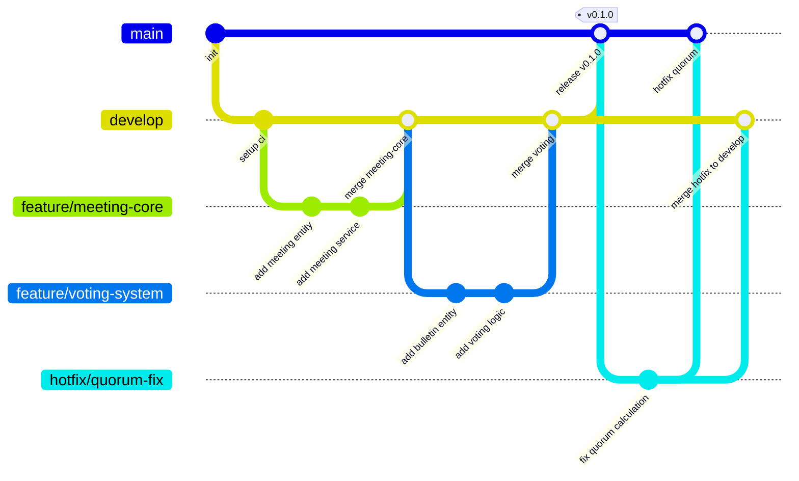

# Руководство разработчика

---

## Настройка окружения

### Требования

| Компонент | Минимальная версия | Рекомендуемая версия |
|-----------|-------------------|---------------------|
| .NET SDK | 8.0 | 8.0.100+ |
| PostgreSQL | 14 | 16 |
| Redis | 6.0 | 7.0+ |
| RabbitMQ | 3.10 | 3.12+ |
| Node.js | 18 | 20 LTS |
| Docker | 20.10 | 24.0+ |
| IDE | Visual Studio 2022 / Rider | последняя версия |

### Установка .NET SDK

```bash
# macOS (Homebrew)
brew install dotnet@8

# Windows (winget)
winget install Microsoft.DotNet.SDK.8

# Linux (Ubuntu/Debian)
wget https://packages.microsoft.com/config/ubuntu/22.04/packages-microsoft-prod.deb -O packages-microsoft-prod.deb
sudo dpkg -i packages-microsoft-prod.deb
sudo apt update && sudo apt install dotnet-sdk-8.0
```

### Установка инструментов

```bash
# Entity Framework Core tools
dotnet tool install --global dotnet-ef

# Dotnet-outdated
dotnet tool install --global dotnet-outdated-tool

# SonarAnalyzer
dotnet tool install --global dotnet-sonarscanner
```

---

## Запуск

### Через Docker Compose (рекомендуется)

```bash
# Запуск всей инфраструктуры
docker-compose up -d

# Проверка статуса
docker-compose ps

# Логи
docker-compose logs -f api
```

### Локальная разработка

```bash
# 1. Запуск зависимостей
docker-compose up -d postgres redis rabbitmq minio

# 2. Применение миграций
dotnet ef database update --project src/Infrastructure --startup-project src/Api

# 3. Запуск API
dotnet run --project src/Api

# 4. Запуск в режиме разработки (с hot-reload)
dotnet watch --project src/Api
```

### Запуск тестов

```bash
# Все тесты
dotnet test

# Только unit-тесты
dotnet test tests/Unit

# Только integration тесты
dotnet test tests/Integration

# С покрытием кода
dotnet test /p:CollectCoverage=true /p:CoverletOutput=./coverage/

# Конкретный тест
dotnet test --filter "FullyQualifiedName~MeetingServiceTests"
```

### Инициализация БД (Database‑First)

Проект использует принцип Database‑First (ADR‑012): схема БД создаётся из канонического SQL.

```bash
# Пересоздать volume (по желанию)
docker-compose down -v

# Поднять Postgres
docker-compose up -d postgres

# Применить структуру, seed и demo‑данные
docker-compose exec -T postgres psql -U fiducia -d fiducia -v ON_ERROR_STOP=1 -f /dev/stdin < tools/db/01_schema.sql
docker-compose exec -T postgres psql -U fiducia -d fiducia -v ON_ERROR_STOP=1 -f /dev/stdin < tools/db/02_seed.sql
docker-compose exec -T postgres psql -U fiducia -d fiducia -v ON_ERROR_STOP=1 -f /dev/stdin < tools/db/03_demo.sql
```

### Функциональные тесты (E2E)

Тесты ожидают работающие порталы:
- Board Portal: http://localhost:5000
- Admin Console: http://localhost:5001

```bash
# Запуск порталов в фоне (dev)
dotnet run --project SamorodinkaTech.Fiducia.BoardPortal --urls "http://localhost:5000" &
BPID=$!
dotnet run --project SamorodinkaTech.Fiducia.AdminConsole --urls "http://localhost:5001" &
APID=$!

# Небольшая задержка и/или ожидание доступности
sleep 5

# Запуск функциональных тестов
dotnet test tests/SamorodinkaTech.Fiducia.Tests.Functional

# Остановка порталов после тестов
kill $BPID $APID || true
```

См. также ADR‑011/ADR‑012 для деталей по сценариям инициализации.

---

## Тестирование

### Структура тестов

```
tests/
├── Unit/                              # Unit Tests
│   ├── Fiducia.Domain.Tests/
│   ├── Fiducia.Application.Tests/
│   └── Fiducia.Infrastructure.Tests/
├── Integration/                       # Integration Tests
│   ├── Fiducia.Api.Tests/
│   └── Fiducia.Database.Tests/
└── Functional/                        # Functional Tests (E2E)
    └── Fiducia.Functional.Tests/
```

### Запуск тестов по типам

```bash
# Unit Tests (быстрые, без зависимостей)
dotnet test tests/Unit --logger "console;verbosity=detailed"

# Integration Tests (требуют Docker)
dotnet test tests/Integration --logger "trx;LogFileName=integration.trx"

# Functional Tests (E2E)
dotnet test tests/Functional --logger "trx;LogFileName=functional.trx"
```

### Генерация отчёта покрытия

```bash
dotnet test /p:CollectCoverage=true /p:CoverletOutput=./coverage/ /p:CoverletOutputFormat=opencover

# Открыть отчёт (macOS)
open coverage/coverage.opencover.xml
```

---

## Правила разработки

### Ветвление

| Ветка | Назначение | Защита |
|-------|------------|--------|
| `main` | Продакшн | PR + 2 reviewers + CI pass |
| `develop` | Интеграция | PR + 1 reviewer + CI pass |
| `feature/*` | Фичи | PR в develop |
| `bugfix/*` | Исправления | PR в develop |
| `hotfix/*` | Экстренные | PR в main + develop |

### Commit Message

```
<type>(<scope>): <description>

[optional body]

[optional footer]
```

**Типы**:
- `feat` — Новая фича
- `fix` — Исправление бага
- `docs` — Документация
- `style` — Форматирование (не влияет на логику)
- `refactor` — Рефакторинг
- `test` — Тесты
- `chore` — Сборка, инструменты

**Примеры**:
```
feat(meeting): добавить автоматический подсчёт кворума
fix(voting): исправить логику подсчёта голосов
docs(api): обновить описание эндпоинтов голосования
```

### Code Review

**Требования к PR**:
- Один PR = одна задача (не более 400 строк)
- Описание PR с контекстом и скриншотами
- Все CI-checks проходят
- Минимум 1 approval от тимлида
- Без merge conflict с develop

**Чеклист ревью**:
- [ ] Код соответствует стилю
- [ ] Есть unit-тесты
- [ ] Нет安全隐患
- [ ] Не нарушает производительность
- [ ] Документация обновлена

---

## Стиль кода

### C#/.NET

```csharp
// ✅ Правильно
public class MeetingService : IMeetingService
{
    private readonly IMeetingRepository _repository;
    private readonly ILogger<MeetingService> _logger;

    public MeetingService(
        IMeetingRepository repository,
        ILogger<MeetingService> logger)
    {
        _repository = repository ?? throw new ArgumentNullException(nameof(repository));
        _logger = logger ?? throw new ArgumentNullException(nameof(logger));
    }

    /// <summary>
    /// Создаёт уведомление о созыве заседания совета директоров.
    /// </summary>
    /// <param name="request">Данные уведомления.</param>
    /// <param name="cancellationToken">Токен отмены.</param>
    /// <returns>Идентификатор созданного уведомления.</returns>
    public async Task<int> CreateAsync(
        CreateMeetingRequest request,
        CancellationToken cancellationToken = default)
    {
        var entity = MeetingMapper.ToEntity(request);
        await _repository.AddAsync(entity, cancellationToken);
        return entity.Id;
    }
}
```

```csharp
// ❌ Неправильно
public class BadExample
{
    MeetingRepository repo;
    public BadExample(MeetingRepository r) { repo = r; }
    public async Task<int> Create(CreateMeetingRequest req)
    {
        var e = new Meeting();
        e.Id = 0;
        e.MeetingForm = req.MeetingForm;
        e.Status = MeetingStatus.Draft;
        await repo.Add(e);
        return e.Id;
    }
}
```

### Именование

| Элемент | Стиль | Пример |
|---------|-------|--------|
| Classes | PascalCase | `MeetingService` |
| Interfaces | I + PascalCase | `IMeetingService` |
| Methods | PascalCase | `CreateAsync` |
| Properties | PascalCase | `MeetingId` |
| Parameters | camelCase | `cancellationToken` |
| Local variables | camelCase | `meetingRequest` |
| Constants | PascalCase | `MaxRetryCount` |
| Private fields | _camelCase | `_repository` |

### Структура файлов

```
src/Domain/Entities/
├── Meeting.cs                  # Одна сущность = один файл
├── MeetingBuilder.cs           # Builder pattern (если нужен)
└── MeetingExtensions.cs        # Extension methods
```

---

## Git Flow



---

## Полезные команды

### Сборка

```bash
# Полная сборка
dotnet build

# Сборка с обновлёнными зависимостями
dotnet outdated --upgrade

# Сборка Release
dotnet build -c Release
```

### Миграции

```bash
# Добавить миграцию
dotnet ef migrations add <MigrationName> --project src/Infrastructure

# Применить миграции
dotnet ef database update --project src/Infrastructure

# Откатить последнюю миграцию
dotnet ef database update LastGoodMigration --project src/Infrastructure

# Удалить последнюю миграцию
dotnet ef migrations remove --project src/Infrastructure
```

### Форматирование

```bash
# Форматирование всего решения
dotnet format

# Проверка без изменений
dotnet format --verify-no-changes

# Форматирование конкретного проекта
dotnet format src/Api
```

### Docker

```bash
# Сборка образа
docker build -t fiducia-api .

# Запуск контейнера
docker run -p 5000:8080 fiducia-api

# Остановка и удаление
docker-compose down -v
```

---

## Интеграция с IDE

### Visual Studio 2022

1. Установите расширения:
   - OzCode
   - ReSharper
   - NuGet Package Manager

2. Настройте форматирование:
   - Options → Text Editor → C# → Code Style
   - Импортируйте `.editorconfig`

### JetBrains Rider

1. Установите плагины:
   - .NET Backend Reloaded
   - EF Core Power Tools

2. Настройте hot-reload:
   - Settings → Build → Hot Reload

### VS Code

1. Установите расширения:
   - C# Dev Kit
   - EF Core Power Tools
   - GitLens

2. Настройте `settings.json`:
   ```json
   {
     "dotnet.formatting.editorConfig": true,
     "omnisharp.enableEditorConfigSupport": true
   }
   ```

---

## Troubleshooting

### Проблема: Миграции не применяются

```bash
# Проверить статус миграций
dotnet ef migrations list --project src/Infrastructure

# Принудительно применить
dotnet ef database update --project src/Infrastructure --verbose
```

### Проблема: Тесты падают

```bash
# Запустить конкретный тест с логами
dotnet test --filter "TestName" --logger "console;verbosity=detailed"

# Проверить покрытие
dotnet test /p:CollectCoverage=true
```

### Проблема: Docker не запускается

```bash
# Проверить статус Docker
docker info

# Перезапустить Docker Desktop
# macOS: Click Docker icon → Restart
# Linux: sudo systemctl restart docker
```

### Проблема: Порт занят

```bash
# Найти процесс на порту (macOS)
lsof -i :5000

# Убить процесс
kill -9 <PID>

# Или сменить порт
dotnet run --project src/Api --urls "http://localhost:5001"
```
### Изменения схемы данных (PostgreSQL)

При любом изменении схемы данных обязательно:

1. Доработать SQL‑скрипты
   - Внести правки в соответствующие `*.sql` файлы и/или добавить новые миграционные скрипты (CREATE/ALTER таблиц, индексы, CHECK/FOREIGN KEY, seed‑данные).
2. Обновить файлы со схемой данных
   - Поддерживаем минимум две диаграммы: мермаид‑ER в `docs/database.md` и отдельную ER‑диаграмму (в каталоге `docs/` или рядом с БД‑артефактами). Обе должны соответствовать фактической схеме.
3. Обновить локальную SQL БД в Docker
   - Применить изменения к контейнеру PostgreSQL из `docker-compose.yml`.

Пошагово: как применить `*.sql` к БД в Docker

Предусловия: установлен Docker, контейнер `fiducia-postgres` описан в `docker-compose.yml` (порт `5434` хост → `5432` контейнера, БД/пользователь/пароль: `fiducia`).

1. Поднять (или обновить) Postgres
   ```bash
   docker compose up -d postgres
   docker compose ps
   ```
2. Проверить готовность
   ```bash
   docker exec -it fiducia-postgres pg_isready -U fiducia -d fiducia
   ```
3. Применить SQL‑скрипт(ы)
   - Один файл:
     ```bash
     cat path/to/script.sql | docker exec -i fiducia-postgres psql -U fiducia -d fiducia -v ON_ERROR_STOP=1
     ```
   - Несколько файлов по алфавиту (пример для `tools/db`):
     ```bash
     for f in tools/db/*.sql; do \
       echo "== $f"; \
       cat "$f" | docker exec -i fiducia-postgres psql -U fiducia -d fiducia -v ON_ERROR_STOP=1 || break; \
     done
     ```
4. Проверить схему
   ```bash
   docker exec -it fiducia-postgres psql -U fiducia -d fiducia -c "\\dt"
   docker exec -it fiducia-postgres psql -U fiducia -d fiducia -c "\\d+ users"
   ```
5. Зафиксировать изменения в репозитории
   - Обновить `docs/database.md` (мермаид‑диаграмма и описания таблиц)
   - Обновить вторую ER‑диаграмму и сохранить исходник в `docs/`
   - Добавить/обновить `*.sql` в каталоге миграций/инициализации (например, `tools/db/`)

Замечания
- Разделяйте разрушительные операции (DROP/ALTER DROP COLUMN) и добавочные.
- Для сложных миграций используйте транзакции: `BEGIN; ... COMMIT;`.
- В продуктивных средах проверяйте скрипты на копии БД/в тестовом контейнере.
