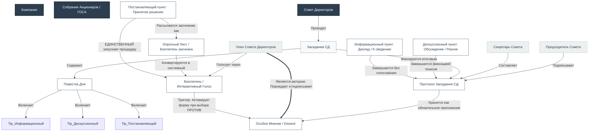

```mermaid

graph TD
    %% Строгая монохромная палитра
    classDef org fill:#2c3e50,stroke:#1a252f,stroke-width:2px,color:#fff;
    classDef role fill:#ecf0f1,stroke:#bdc3c7,stroke-width:1px,color:#2c3e50;
    classDef event fill:#f8f9fa,stroke:#7f8c8d,stroke-width:1px,color:#2c3e50;
    classDef doc fill:#ffffff,stroke:#34495e,stroke-width:1px,color:#2c3e50;

    %% Определение узлов
    Компания[Компания]:::org
    Собрание_Акционеров[Собрание Акционеров / ГОСА]:::org
    Совет_Директоров[Совет Директоров]:::org
    
    Председатель_Совета[Председатель Совета]:::role
    Секретарь_Совета[Секретарь Совета]:::role
    Член_СД[Член Совета Директоров]:::role
    
    Заседание_СД[Заседание СД]:::event
    Повестка_Дня[Повестка Дня]:::doc
    
    %% Типы вопросов повестки дня
    Тип_Информационный[Информационный пункт: Доклад / К сведению]:::doc
    Тип_Дискуссионный[Дискуссионный пункт: Обсуждение / Разное]:::doc
    Тип_Постановляющий[Постановляющий пункт: Принятие решения]:::doc
    
    Опросный_Лист[Опросный Лист / Бюллетень заочника]:::doc
    Бюллетень[Бюллетень / Интерактивный Голос]:::doc
    Особое_Мнение[Особое Мнение / Dissent]:::doc
    Протокол_Заседания[Протокол Заседания СД]:::doc

    %% Основные связи
    Совет_Директоров -->|Проводит| Заседание_СД
    Заседание_СД -->|Содержит| Повестка_Дня
    
    %% Структурирование повестки
    Повестка_Дня -->|Включает| Tip_Информационный
    Повестка_Дня -->|Включает| Tip_Дискуссионный
    Повестка_Дня -->|Включает| Tip_Постановляющий

    %% Логика ветвления
    Тип_Информационный -->|Завершается без голосования| Протокол_Заседания
    Тип_Дискуссионный -->|Завершается фиксацией тезисов| Протокол_Заседания
    
    Тип_Постановляющий -->|ЕДИНСТВЕННЫЙ запускает процедуру| Бюллетень
    Тип_Постановляющий -->|Рассылается заочникам как| Опросный_Лист

    %% Сбор голосов
    Опросный_Лист -->|Конвертируется в системный| Бюллетень
    Член_СД -->|Голосует через| Бюллетень
    
    %% КРИТИЧЕСКИЙ УЗЕЛ: Порождение особого мнения
    Бюллетень -->|Триггер: Активирует форму при выборе ПРОТИВ| Особое_Мнение
    Член_СД ===>|Является автором: Порождает и подписывает| Особое_Мнение
    
    %% Закрытие заседания
    Заседание_СД -->|Фиксируется итоговым| Протокол_Заседания
    Протокол_Заседания -->|Хранится как обязательное приложение| Особое_Мнение
    
    Секретарь_Совета -->|Составляет| Протокол_Заседания
    Председатель_Совета -->|Подписывает| Протокол_Заседания


```