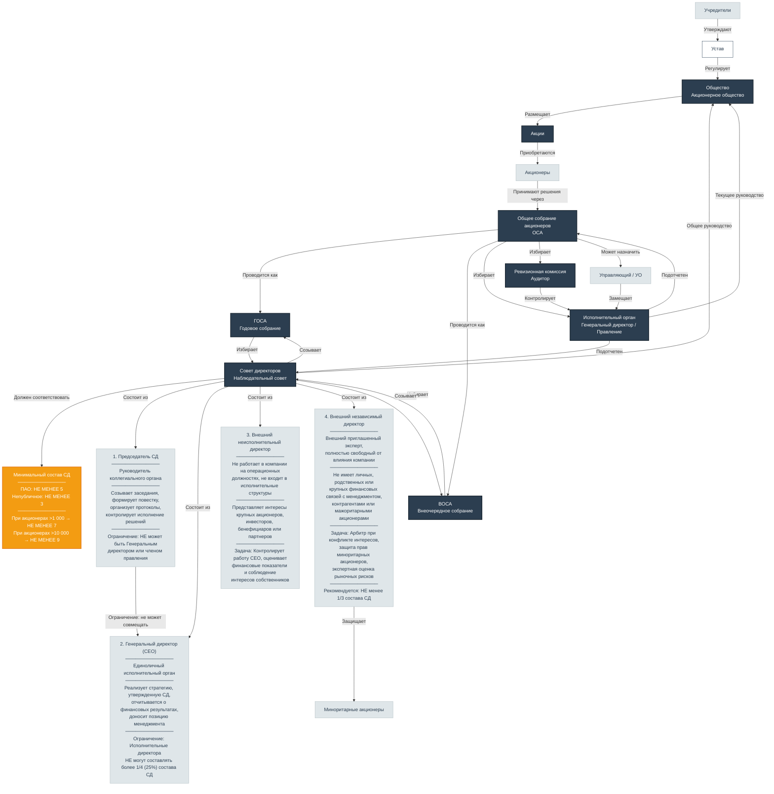

# Акционерное общество: структура, органы управления и кризисные механизмы

Акционерное общество (АО) является одной из наиболее распространенных организационно-правовых форм коммерческих организаций в Российской Федерации. Его деятельность детально регламентируется **Федеральным законом от 26.12.1995 № 208-ФЗ «Об акционерных обществах»** (далее — Закон об АО), который устанавливает правовой статус, порядок создания, реорганизации и ликвидации, а также систему органов управления.

## Устав — основной документ общества

Устав является учредительным документом акционерного общества и его требования обязательны для исполнения всеми органами общества и его акционерами **(п. 2 ст. 11 Закона об АО)**. В уставе должны содержаться следующие сведения:

- полное и сокращенное фирменные наименования общества;
- место нахождения;
- количество, номинальная стоимость, категории (обыкновенные, привилегированные) акций и типы привилегированных акций;
- права акционеров — владельцев акций каждой категории (типа);
- размер уставного капитала;
- структура и компетенция органов управления и порядок принятия ими решений;
- порядок подготовки и проведения общего собрания акционеров **(п. 3 ст. 11 Закона об АО)**.

Для публичных обществ устав должен также содержать указание на публичный статус и наличие в структуре органов управления совета директоров (наблюдательного совета) **(ст. 7, 64 Закона об АО)**.

---

## Система органов управления

Закон об АО устанавливает трехуровневую систему управления, где каждый орган имеет свою компетенцию и функции.

### 1. Общее собрание акционеров

Общее собрание акционеров является **высшим органом управления** общества **(п. 1 ст. 47 Закона об АО)**. Оно может проводиться в нескольких формах:

- на заседании (в том числе с дистанционным участием);
- на заседании, голосование на котором совмещается с заочным голосованием;
- без проведения заседания (заочное голосование) **(п. 1 ст. 50.1 Закона об АО)**.

#### Годовое общее собрание акционеров (ГОСА)

Общество обязано ежегодно проводить годовое заседание общего собрания акционеров. Оно проводится **не ранее чем через два месяца и не позднее чем через шесть месяцев после окончания отчетного года** **(п. 3 ст. 47 Закона об АО)**. На годовом собрании в обязательном порядке решаются вопросы:

- об избрании совета директоров (наблюдательного совета);
- об избрании ревизионной комиссии (если она обязательна);
- о назначении аудиторской организации;
- об утверждении годового отчета и бухгалтерской отчетности **(п. 2 ст. 47 Закона об АО)**.

#### Внеочередное общее собрание акционеров (ВОСА)

Внеочередное собрание проводится по решению совета директоров на основании его собственной инициативы либо по требованию:

- ревизионной комиссии общества;
- аудиторской организации (индивидуального аудитора) общества;
- акционеров (акционера), являющихся владельцами не менее **10 процентов** голосующих акций общества на дату предъявления требования **(п. 1 ст. 55 Закона об АО)**.

**Сроки проведения** внеочередного собрания:

- в течение **40 дней** с момента представления требования (общий случай);
- в течение **75 дней**, если повестка содержит вопрос об избрании совета директоров **(п. 2 ст. 55 Закона об АО)**.

**Рассмотрение требования** о созыве ВОСА осуществляется советом директоров в течение **пяти рабочих дней** с даты его предъявления **(п. 3 ст. 55 Закона об АО)**.

Если совет директоров в установленный срок не принял решение о созыве или принял решение об отказе, лица, требующие созыва, вправе обратиться в суд с требованием о понуждении общества провести внеочередное общее собрание акционеров **(п. 8 ст. 55 Закона об АО)**.

### 2. Совет директоров (наблюдательный совет)

Совет директоров осуществляет **общее руководство** деятельностью общества, за исключением вопросов, отнесенных к компетенции общего собрания акционеров **([п. 1 ст. 64 Закона об АО](../laws/article-64.md))**.

#### Формирование Совета директоров

Члены Совета директоров избираются **общим собранием акционеров** на срок до следующего годового собрания **([п. 1 ст. 66 Закона об АО](../laws/article-66.md))**.

**Способ избрания — кумулятивное голосование ([п. 4 ст. 66 Закона об АО](../laws/article-66.md)):**

- Количество голосов акционера умножается на число мест в Совете.
- Акционер вправе отдать все голоса одному кандидату или распределить между несколькими.
- Избранными считаются кандидаты, набравшие наибольшее число голосов.

**Обязательность кумулятивного голосования:**

| Категория общества | Обязательность |
|---|---|
| Публичные АО | **Обязательно** |
| Непубличные АО с числом акционеров более 1000 | **Обязательно** |
| Непубличные АО с числом акционеров до 1000 | **По уставу** |

**Исключение:** В АО с одним акционером кумулятивное голосование не применяется, т.к. все решения принимаются единолично **(п. 6 ст. 47 Закона об АО)**.

**Примечание:** В непубличных АО уставом может быть предусмотрено избрание членов СД взамен выбывших **не кумулятивным** голосованием при потере кворума **([п. 2 ст. 68 Закона об АО](../laws/article-68.md))**.

#### Четыре обязательные роли в составе Совета директоров

В составе Совета директоров выделяются четыре ключевые роли, каждая из которых выполняет строго фиксированную функцию:

**1. Председатель Совета директоров** — руководитель коллегиального органа, избираемый его членами из своего состава большинством голосов от общего числа членов Совета . Функции: созывает заседания и заочные голосования, формирует и утверждает повестку дня, председательствует на заседаниях Совета и общего собрания акционеров, организует ведение протоколов и контролирует исполнение решений . **Ограничение:** Председателем Совета директоров не может быть назначен Генеральный директор или член правления компании **([п. 3 ст. 68 Закона об АО](../laws/article-68.md))**.

**2. Генеральный директор (CEO)** — единоличный исполнительный орган компании, отвечающий за текущую операционную деятельность . Функции: реализует утвержденную Советом стратегию, отчитывается о финансовых результатах, доносит позицию менеджмента до директоров, обеспечивает непрерывность управления . **Ограничение:** Генеральный директор и члены правления входят в Совет как часть группы **исполнительных директоров**, чье общее присутствие в Совете по закону **не может превышать 1/4 (25%) от всего состава (п. 4 ст. 65.3 ГК РФ)**.

**3. Внешние неисполнительные директора** — члены Совета, которые не работают в компании на операционных должностях и не входят в ее исполнительные структуры . Функции: представляют интересы крупных акционеров, инвесторов, бенефициаров или партнеров, контролируют работу CEO, оценивают финансовые показатели и соблюдение интересов собственников бизнеса .

**4. Внешние независимые директора** — внешние приглашенные эксперты, полностью свободные от любого влияния со стороны компании . Не имеют личных, родственных или крупных финансовых связей с менеджментом, контрагентами или мажоритарными акционерами . Функции: выступают арбитрами при конфликте интересов, защищают права миноритарных акционеров и дают экспертную оценку рыночных рисков . **Рекомендация:** Согласно Кодексу корпоративного управления, независимые директора должны составлять **не менее одной трети (1/3) мест** в Совете.

#### Количественный состав

Количественный состав совета директоров определяется **уставом общества или решением общего собрания акционеров**, но не может быть менее установленного законом минимума **([п. 3 ст. 66 Закона об АО](../laws/article-66.md))**:

| Категория общества | Минимальный состав |
|---|---|
| Публичное АО | **5 членов** |
| Непубличное АО (менее 1000 акционеров) | **3 члена** |
| АО с числом акционеров от 1000 до 10000 | **7 членов** |
| АО с числом акционеров более 10000 | **9 членов** |

**Важно:** В непубличном акционерном обществе устав может предусматривать меньшее количество членов совета директоров по сравнению с предусмотренным законом. Соответствующее положение включается в устав по решению общего собрания акционеров, принятому **единогласно** **(пп. 6 п. 3 ст. 66.3 ГК РФ)**.

#### Заседания совета директоров

Заседание совета директоров созывается председателем по его собственной инициативе или по требованию:

- члена совета директоров;
- ревизионной комиссии (ревизора) общества;
- аудиторской организации (индивидуального аудитора) общества;
- исполнительного органа общества;
- иных лиц, определенных уставом **([п. 1 ст. 68 Закона об АО](../laws/article-68.md))**.

**Кворум** для проведения заседания совета директоров определяется уставом общества, но **не должен быть менее половины от числа избранных членов** совета директоров **(п. 2 ст. 68 Закона об АО)**.

### 3. Исполнительный орган

Исполнительный орган осуществляет **текущее руководство** деятельностью общества. Он может быть:

- **единоличным** (директор, генеральный директор);
- **коллегиальным** (правление, дирекция).

Исполнительный орган подотчетен общему собранию акционеров и совету директоров **([п. 2, 3 ст. 69 Закона об АО](../laws/article-69.md))**.

Важная гарантия непрерывности управления: полномочия исполнительных органов после истечения срока их полномочий **продолжают действовать** до образования новых исполнительных органов **([п. 4 ст. 69 Закона об АО](../laws/article-69.md))**.

---

## Кризисные ситуации и механизмы их преодоления

### 1. Потеря кворума совета директоров

Это одна из наиболее серьезных кризисных ситуаций, способных парализовать управление обществом.

**Механизм наступления:** В случае, когда количество членов совета директоров становится **менее количества, составляющего кворум** (менее половины от избранного состава), оставшиеся члены совета директоров **обязаны** принять решение о проведении внеочередного общего собрания акционеров для избрания нового состава совета директоров **([абз. 2 п. 2 ст. 68 Закона об АО](../laws/article-68.md))**.

**Критическое ограничение:** Оставшиеся члены совета директоров вправе принимать решение **только** о созыве такого внеочередного общего собрания акционеров. Иных решений они принимать не вправе **(абз. 2 п. 2 ст. 68 Закона об АО)**.

**Срок:** Внеочередное собрание должно быть проведено в течение **75 дней** с момента возникновения основания **(п. 2 ст. 55 Закона об АО)**.

**Бездействие:** Если оставшиеся члены совета директоров не исполняют эту обязанность, акционеры, владеющие не менее **10%** голосующих акций, вправе самостоятельно инициировать созыв внеочередного собрания **(п. 1 ст. 55 Закона об АО)**. Бездействие также влечет административную ответственность по **ст. 15.23.1 КоАП РФ**.

---

### 2. Полная нетрудоспособность совета директоров

Ситуация, когда все члены совета директоров одновременно не могут исполнять свои обязанности (например, в связи с болезнью, госпитализацией).

**Последствия:** Совет директоров полностью парализован — никто не может принять решение даже о созыве внеочередного собрания.

**Механизм преодоления:** Акционеры, владеющие не менее **10%** голосующих акций, вправе самостоятельно инициировать созыв внеочередного общего собрания акционеров, направляя требование **непосредственно в общество** (исполнительному органу, минуя совет директоров) **(п. 1, 8 ст. 55 Закона об АО)**.

**Срок:** Общество обязано провести собрание в течение **40 дней** (или **70 дней**, если повестка содержит вопрос об избрании совета директоров) **(п. 2 ст. 55 Закона об АО)**.

---

### 3. Истечение срока полномочий совета директоров

Члены совета директоров избираются на срок **до следующего годового заседания** общего собрания акционеров **(п. 1 ст. 66 Закона об АО)**. Законодательство предусматривает два случая прекращения полномочий:

**Случай 1. Годовое собрание не проведено в срок:**

Если годовое заседание общего собрания акционеров **не было проведено** в сроки, установленные **[п. 3 ст. 47 Закона об АО](../laws/article-47.md)** (с 1 марта по 30 июня), полномочия совета директоров **прекращаются**, за исключением полномочий по подготовке и проведению годового заседания общего собрания акционеров **(п. 1 ст. 66 Закона об АО)**.

**Случай 2. Годовое собрание проведено, но решение об избрании СД не принято:**

Если на годовом заседании общего собрания акционеров решение об избрании членов совета директоров **не было принято**, полномочия совета директоров **прекращаются**, за исключением полномочий по подготовке и проведению **внеочередного** заседания общего собрания акционеров для принятия решения об избрании членов совета директоров **(п. 1 ст. 66 Закона об АО)**.

В обоих случаях совет директоров сохраняет ограниченную правоспособность — только для проведения собрания, которое изберет новый состав.

---

### 4. Отсутствие кворума на общем собрании акционеров

Общее собрание акционеров правомочно принимать решения, если в нем приняли участие акционеры, обладающие **более чем половиной голосов** размещенных голосующих акций общества **(п. 1 ст. 58 Закона об АО)**.

**При отсутствии кворума** **(п. 4 ст. 58 Закона об АО)**:

- **На годовом заседании** — **обязательно** проводится повторное заседание с той же повесткой дня.
- **На внеочередном заседании** — **может** быть проведено повторное заседание или повторное заочное голосование.

**Кворум для повторного заседания** составляет **не менее 30%** голосов размещенных голосующих акций общества. Уставом общества с числом акционеров более 500 тысяч может быть предусмотрен меньший кворум **(п. 4 ст. 58 Закона об АО)**.

**Если и повторное заседание не состоялось** — вопросы, включенные в повестку дня, считаются **не решенными** до проведения нового собрания.

---

### 5. Бездействие совета директоров (уклонение от созыва)

Ситуация, когда совет директоров не созывает заседания, не рассматривает требования членов совета или акционеров, не направляет мотивированных отказов.

**Механизм преодоления:**

- Член совета директоров или акционер вправе инициировать созыв внеочередного заседания совета директоров **(п. 1 ст. 68 Закона об АО)**.
- При бездействии совета директоров акционеры с **10%** акций вправе требовать созыва внеочередного общего собрания акционеров **(п. 1 ст. 55 Закона об АО)**.

**Ответственность:** Уклонение от созыва заседаний или общего собрания акционеров влечет административную ответственность по **ст. 15.23.1 КоАП РФ**:

| Субъект | Наказание |
|---|---|
| Должностные лица | Штраф от 20 000 до 30 000 руб. или дисквалификация до 1 года |
| Юридические лица | Штраф от 500 000 до 700 000 руб. |

---

### 6. Ничтожность решений совета директоров

**Пункт 8 статьи 68 Закона об АО** устанавливает, что решения совета директоров, принятые:

- с нарушением компетенции совета директоров;
- при отсутствии кворума для проведения заседания;
- без необходимого для принятия решения большинства голосов,

**не имеют силы** независимо от обжалования их в судебном порядке.

Это означает, что такие решения являются **ничтожными** (абсолютно недействительными) в силу прямого указания закона.

---

### 7. Обжалование решений

**Член совета директоров**, не участвовавший в голосовании или голосовавший против решения, принятого с нарушением порядка, вправе обжаловать его в суд в течение **одного месяца** со дня, когда он узнал о принятом решении **([п. 5 ст. 68 Закона об АО](../laws/article-68.md))**.

**Акционер** вправе обжаловать решение совета директоров в суд в течение **трех месяцев**, если этим решением нарушены его права и законные интересы **([п. 6 ст. 68 Закона об АО](../laws/article-68.md))**.

---

## Особенности публичного и непубличного АО

Закон об АО выделяет две основные категории обществ, для которых установлены различные требования:

### Публичное общество

- Обязательно наличие совета директоров **(п. 1 ст. 64 Закона об АО)**.
- Устав должен содержать указание на публичный статус **(п. 1 ст. 7 Закона об АО)**.
- Устав должен содержать сведения о ревизионной комиссии в случае принятия решения о ее создании **(п. 3 ст. 11 Закона об АО)**.
- Общее собрание не вправе рассматривать вопросы, не отнесенные к его компетенции законом **(п. 1 ст. 48 Закона об АО)**.
- **Кумулятивное голосование при избрании СД обязательно (п. 4 ст. 66 Закона об АО)**.

### Непубличное общество

- Может не создавать совет директоров (если число акционеров менее 50, его функции может выполнять общее собрание) **(п. 1 ст. 64 Закона об АО)**.
- Уставом могут быть установлены ограничения количества акций, принадлежащих одному акционеру, и максимального числа голосов, предоставляемых одному акционеру **(п. 3 ст. 11 Закона об АО)**.
- Уставом может быть предусмотрена передача вопросов компетенции общего собрания совету директоров или коллегиальному исполнительному органу **(п. 3 ст. 48 Закона об АО)**.
- Устав может содержать сведения об отсутствии ревизионной комиссии **(п. 3 ст. 11 Закона об АО)**.
- **Кумулятивное голосование при избрании СД обязательно только при > 1000 акционеров**; при ≤ 1000 — если предусмотрено уставом **(п. 4 ст. 66 Закона об АО)**.

---

## Ключевые правовые нормы

| Действие | Правовое основание |
|---|---|
| Устав как учредительный документ | ст. 11 Закона об АО |
| Высший орган управления — общее собрание | ст. 47 Закона об АО |
| Компетенция общего собрания | ст. 48 Закона об АО |
| Внеочередное собрание | ст. 55 Закона об АО |
| Кворум общего собрания | ст. 58 Закона об АО |
| Кумулятивное голосование | п. 4 ст. 66 Закона об АО |
| Количественный состав СД | п. 3 ст. 66 Закона об АО |
| Заседания и кворум СД | [ст. 68 Закона об АО](../laws/article-68.md) |
| Исполнительный орган | [ст. 69 Закона об АО](../laws/article-69.md) |
| Ответственность за нарушения | ст. 15.23.1 КоАП РФ |

---

*Документ подготовлен на основе норм действующего законодательства РФ по состоянию на 2026 год. Рекомендуется актуализировать ссылки при изменении нормативной базы.*
