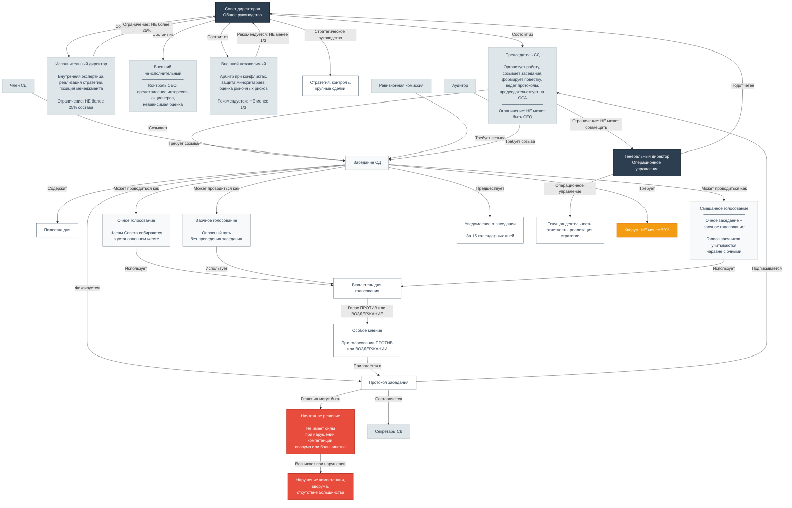

# Оперативное управление обществом: взаимодействие Генерального директора и Совета директоров

Оперативное управление акционерным обществом строится на четком разделении полномочий между **Советом директоров** (стратегический уровень) и **Генеральным директором** (исполнительный уровень). В данной статье рассматривается механизм их взаимодействия, порядок принятия решений, процедуры голосования, а также критические ситуации, возникающие в процессе оперативного управления.

## 1. Разграничение компетенций

### Совет директоров — стратегическое руководство

Совет директоров осуществляет **общее руководство** деятельностью общества, за исключением вопросов, отнесенных к компетенции общего собрания акционеров **(п. 1 ст. 64 Закона об АО)**.

К компетенции Совета директоров относятся:

- определение приоритетных направлений деятельности общества **(пп. 1 п. 1 ст. 65 Закона об АО)**;
- созыв годового и внеочередного общих собраний акционеров **(пп. 2 п. 1 ст. 65 Закона об АО)**;
- утверждение повестки дня общего собрания акционеров **(пп. 3 п. 1 ст. 65 Закона об АО)**;
- увеличение уставного капитала общества **(пп. 5 п. 1 ст. 65 Закона об АО)**;
- образование исполнительного органа общества и досрочное прекращение его полномочий, если это отнесено к его компетенции уставом **(пп. 8 п. 1 ст. 65 Закона об АО)**;
- рекомендации по размеру дивидендов и порядку их выплаты **(пп. 11 п. 1 ст. 65 Закона об АО)**;
- утверждение сделок, в совершении которых имеется заинтересованность, в случаях, предусмотренных законом **(пп. 13 п. 1 ст. 65 Закона об АО)**.

### Генеральный директор — операционное управление

Генеральный директор является **единоличным исполнительным органом** общества **(п. 3 ст. 69 Закона об АО)**. Он:

- осуществляет текущее руководство деятельностью общества;
- реализует стратегию, утвержденную Советом директоров;
- отчитывается о финансовых результатах;
- обеспечивает непрерывность управления **(п. 4 ст. 69 Закона об АО)**;
- без доверенности действует от имени общества, представляет его интересы, совершает сделки, утверждает штаты, издает приказы и дает указания, обязательные для всех работников **(п. 2 ст. 69 Закона об АО)**.

**Подотчетность:** Генеральный директор подотчетен общему собранию акционеров и Совету директоров **(п. 1 ст. 69 Закона об АО)**.

---

## 2. Роли в Совете директоров

| Роль | Функции внутри Совета | Ограничения |
|---|---|---|
| **Председатель СД** | Организует работу Совета, созывает заседания, формирует повестку, председательствует на заседаниях, организует ведение протоколов, председательствует на общих собраниях акционеров (если иное не предусмотрено уставом) | Не может быть Генеральным директором или членом правления **(п. 2 ст. 66 Закона об АО)** |
| **Исполнительные директора** | Вносят внутреннюю экспертизу, реализуют стратегию, доносят позицию менеджмента | **Не более 25% состава СД (п. 2 ст. 66 Закона об АО)** |
| **Внешние неисполнительные директора** | Контролируют работу CEO, представляют интересы акционеров, дают независимую оценку | Не работают в компании |
| **Внешние независимые директора** | Выступают арбитрами при конфликтах, защищают миноритариев, оценивают рыночные риски | Рекомендуется **не менее 1/3 состава СД** |

---

## 3. Порядок проведения заседаний Совета директоров

### Инициация созыва

Заседание Совета директоров созывается **Председателем**:

- по его собственной инициативе;
- по требованию члена Совета директоров;
- по требованию ревизионной комиссии (ревизора) общества;
- по требованию аудиторской организации (индивидуального аудитора) общества;
- по требованию исполнительного органа общества;
- иных лиц, определенных уставом **(п. 1 ст. 68 Закона об АО)**.

### Уведомление

Члены Совета директоров должны быть уведомлены о проведении заседания **не позднее чем за 15 календарных дней** до его даты **(п. 2 ст. 68 Закона об АО)**.

### Кворум

Заседание Совета директоров правомочно, если на нем присутствуют члены, составляющие кворум. Кворум определяется уставом, но **не может быть менее половины от числа избранных членов** **(п. 2 ст. 68 Закона об АО)**.

### Порядок голосования

Каждый член Совета директоров обладает **одним голосом** при принятии решений **(п. 3 ст. 68 Закона об АО)**.

**Решения принимаются большинством голосов** членов Совета, принимающих участие в заседании, если уставом не предусмотрено большее число голосов **(п. 2 ст. 68 Закона об АО)**.

Для отдельных решений (например, приостановление полномочий единоличного исполнительного органа) может требоваться **квалифицированное большинство в три четверти голосов** членов Совета **(п. 3 ст. 69 Закона об АО)**.

**Особое мнение:** Член Совета, голосовавший против решения или воздержавшийся, вправе потребовать внесения своего особого мнения в протокол. Оно обязательно прилагается к протоколу заседания **(п. 5 ст. 68 Закона об АО)**.

---

## 4. Механизмы принятия решений

### Очное заседание

Члены Совета собираются в установленном месте, обсуждают вопросы повестки и голосуют. Протокол подписывается Председателем и Секретарем.

### Заочное голосование

Законодательство и устав могут предусматривать возможность принятия решений без проведения заседания (опросным путем) **(п. 1 ст. 68 Закона об АО)**. При этом:

- члены Совета получают бюллетени для голосования;
- срок получения бюллетеней устанавливается уставом;
- если член Совета не ответил в установленный срок, его голос не учитывается.

**Ограничения:** Некоторые вопросы не могут решаться заочным голосованием (например, избрание Председателя СД).

### Смешанный способ (очное заседание + заочное голосование)

**Смешанный способ** — это сочетание очного заседания и заочного голосования в рамках одного заседания **(п. 1 ст. 68 Закона об АО)**.

**Порядок применения:**

1. Заседание проводится в очной форме с участием части членов Совета.
2. Отсутствующие члены Совета получают бюллетени для заочного голосования по вопросам повестки дня.
3. Голоса, поданные заочно, учитываются наравне с голосами, поданными на заседании.
4. Итоговое решение принимается на основе совокупности голосов, поданных очно и заочно.

**Важно:** Порядок проведения заочного голосования должен быть установлен **уставом или внутренними документами** общества **(п. 1 ст. 68 Закона об АО)**.

**Ограничения:** Не все вопросы могут решаться с использованием смешанного способа. Как правило, вопросы, требующие обсуждения (например, избрание Председателя СД), должны решаться только на очном заседании, если иное не предусмотрено уставом.

---

## 5. Взаимодействие Генерального директора и Совета директоров

### Подотчетность

Генеральный директор **подотчетен** Совету директоров и общему собранию акционеров **(п. 1 ст. 69 Закона об АО)**. Формы подотчетности:

- регулярная отчетность о финансовых результатах;
- отчеты о выполнении стратегии;
- предоставление информации по запросу членов Совета.

Исполнительный орган **организует выполнение решений** общего собрания акционеров и Совета директоров **(п. 2 ст. 69 Закона об АО)**.

### Вхождение Генерального директора в состав Совета

Генеральный директор входит в состав Совета как исполнительный директор. Его доля в Совете **не может превышать 25%** (члены коллегиального исполнительного органа также входят в эту квоту) **(п. 2 ст. 66 Закона об АО)**. Он не может занимать должность Председателя Совета **(п. 2 ст. 66 Закона об АО)**.

**Важно:** Указанное ограничение распространяется также на физическое лицо, выполняющее функции единоличного исполнительного органа управляющей организации акционерного общества.

### Контроль и санкции

Совет директоров имеет право:

- запрашивать у Генерального директора любую информацию, необходимую для выполнения своих функций;
- рекомендовать общему собранию акционеров досрочное прекращение полномочий Генерального директора;
- утверждать крупные сделки и сделки с заинтересованностью (в пределах своей компетенции).

---

## 6. Оформление решений

### Протокол заседания

Протокол должен содержать:

- дату, место и время проведения заседания;
- сведения о лицах, присутствовавших на заседании;
- повестку дня;
- результаты голосования по каждому вопросу;
- принятые решения.

Протокол подписывается **Председателем** и **Секретарем** заседания. Особые мнения прилагаются к протоколу **(п. 5 ст. 68 Закона об АО)**.

### Решения Совета директоров

Решения, принятые с нарушением компетенции, при отсутствии кворума или без необходимого большинства голосов, **не имеют силы** независимо от их обжалования в судебном порядке **(п. 8 ст. 68 Закона об АО)**. Это означает, что такие решения являются **ничтожными**.

---

## 7. Критические ситуации в оперативном управлении

### 7.1. Конфликт компетенций

**Ситуация:** Совет директоров принимает решение, выходящее за пределы его компетенции, или Генеральный директор принимает решение по вопросу, отнесенному к исключительной компетенции Совета директоров.

**Правовые последствия:** Такое решение может быть признано ничтожным **(п. 8 ст. 68 Закона об АО)** или оспорено в судебном порядке.

---

### 7.2. Отсутствие кворума

**Ситуация:** На заседании Совета директоров отсутствует необходимое количество членов (менее половины от числа избранных членов).

**Правовые последствия:** Решения, принятые при отсутствии кворума, являются **ничтожными** **(п. 8 ст. 68 Закона об АО)**.

**Механизм разрешения:** При потере кворума оставшиеся члены Совета обязаны созвать ВОСА для избрания нового состава **(п. 2 ст. 68 Закона об АО)**.

---

### 7.3. Неизбрание Генерального директора

**Ситуация:** Решение об образовании единоличного исполнительного органа отнесено к компетенции Совета директоров, но новый директор не был избран на двух заседаниях подряд либо в течение двух месяцев с даты прекращения полномочий прежнего **(п. 6 ст. 69 Закона об АО)**.

**Правовые последствия:**
- Общество обязано раскрыть информацию о непринятии решения (или уведомить акционеров).
- После уведомления акционеров до момента образования временного исполнительного органа от имени общества действует **Председатель Совета директоров**.
- Акционеры вправе требовать проведения ВОСА для решения вопроса.

---

### 7.4. Приостановление полномочий Генерального директора

**Ситуация:** Если образование исполнительных органов осуществляется общим собранием акционеров, уставом может быть предусмотрено право Совета директоров **приостановить** полномочия Генерального директора **(п. 3 ст. 69 Закона об АО)**.

**Порядок:** Одновременно с приостановлением полномочий Совет директоров **обязан**:
- образовать временный единоличный исполнительный орган;
- провести внеочередное собрание акционеров для решения вопроса о досрочном прекращении полномочий и избрании нового директора.

**Особые требования:** Решение о приостановлении принимается **квалифицированным большинством в три четверти голосов** членов Совета директоров **(п. 3 ст. 69 Закона об АО)**.

---

### 7.5. Превышение полномочий Генеральным директором

**Ситуация:** Генеральный директор принимает решение по вопросу, отнесенному к компетенции Совета директоров или общего собрания акционеров.

**Правовые последствия:** Решение может быть признано недействительным.

**Механизм разрешения:** Совет директоров вправе отменить решение Генерального директора, если оно принято с превышением полномочий, либо обжаловать его в судебном порядке.

---

### 7.6. Бездействие Генерального директора

**Ситуация:** Генеральный директор уклоняется от исполнения решений Совета директоров, не выполняет свои обязанности или бездействует.

**Правовые последствия:** Нарушение договора управления, подотчетности. Может повлечь убытки для общества.

**Механизм разрешения:**
- Совет директоров вправе рекомендовать общему собранию акционеров досрочное прекращение полномочий Генерального директора.
- Взыскание убытков с Генерального директора **(п. 2 ст. 71 Закона об АО)**.

---

### 7.7. Отказ в предоставлении информации

**Ситуация:** Генеральный директор отказывает Совету директоров или его членам в предоставлении запрашиваемой информации, необходимой для выполнения их функций.

**Правовые последствия:** Нарушение принципа подотчетности исполнительного органа Совету директоров **(п. 1 ст. 69 Закона об АО)**.

**Механизм разрешения:** Обжалование отказа в предоставлении информации в судебном порядке.

---

### 7.8. Отсутствие кворума для кадровых решений

**Ситуация:** Уставом общества установлен повышенный кворум для принятия решений об образовании или прекращении полномочий единоличного исполнительного органа (более половины от числа избранных членов), и данный кворум не может быть обеспечен **(п. 5 ст. 69 Закона об АО)**.

**Механизм разрешения:** Вопрос может быть вынесен на решение общего собрания акционеров в случаях, предусмотренных пунктами 6 и 7 статьи 69 Закона об АО.

---

## 8. Ответственность

### Членов Совета директоров

Члены Совета директоров несут **административную ответственность** по **ст. 15.23.1 КоАП РФ** за:

- незаконный отказ в созыве или уклонение от созыва общего собрания акционеров;
- нарушение порядка или срока уведомления о проведении собрания;
- незаконный отказ во внесении вопросов в повестку дня.

**Голосовавший против** член Совета к ответственности по ст. 15.23.1 КоАП РФ **не привлекается** (примечание к ст. 15.23.1 КоАП РФ).

### Генерального директора

Генеральный директор несет:

- **гражданско-правовую ответственность** за убытки, причиненные обществу виновными действиями **(п. 2 ст. 71 Закона об АО)**;
- **административную ответственность** как должностное лицо за нарушения в сфере управления обществом.

**Освобождение от ответственности:** В Совете директоров и коллегиальном исполнительном органе не несут ответственность члены, голосовавшие против решения, которое повлекло причинение убытков, или не принимавшие участия в голосовании **(п. 2 ст. 71 Закона об АО)**.

**Право на иск:** Общество или акционеры, владеющие в совокупности не менее чем **1 процентом** размещенных обыкновенных акций, вправе обратиться в суд с иском к Генеральному директору о возмещении причиненных обществу убытков **(п. 5 ст. 71 Закона об АО)**.

---

## 9. Связь между уровнями

Данный уровень **«Совет директоров + Генеральный директор»** является вторым в иерархии:

1. **Уровень 1: Общество** — создание, акционеры, ОСА/ГОСА/ВОСА, избрание СД, кумулятивное голосование, количественный состав СД.
2. **Уровень 2: Совет директоров + Генеральный директор** — внутренняя работа СД, порядок заседаний, голосования, взаимодействие СД и CEO, кризисные ситуации в оперативном управлении.
3. **Уровень 3: Комитеты** — специализированные органы при СД (по аудиту, стратегии, номинациям, вознаграждениям и др.).

---

## Ключевые правовые нормы

| Действие | Правовое основание |
|---|---|
| Компетенция СД | ст. 65 Закона об АО |
| Заседания и кворум СД | ст. 68 Закона об АО |
| Заочное и смешанное голосование | п. 1 ст. 68 Закона об АО |
| Исполнительный орган | ст. 69 Закона об АО |
| Ограничение исполнительных директоров | п. 2 ст. 66 Закона об АО |
| Ограничение Председателя СД | п. 2 ст. 66 Закона об АО |
| Приостановление полномочий ЕИО | п. 3 ст. 69 Закона об АО |
| Квалифицированное большинство (3/4) | п. 3 ст. 69 Закона об АО |
| Ответственность членов СД | ст. 15.23.1 КоАП РФ |
| Ответственность Генерального директора | ст. 71 Закона об АО |

---

*Документ подготовлен на основе норм действующего законодательства РФ по состоянию на 2026 год.*