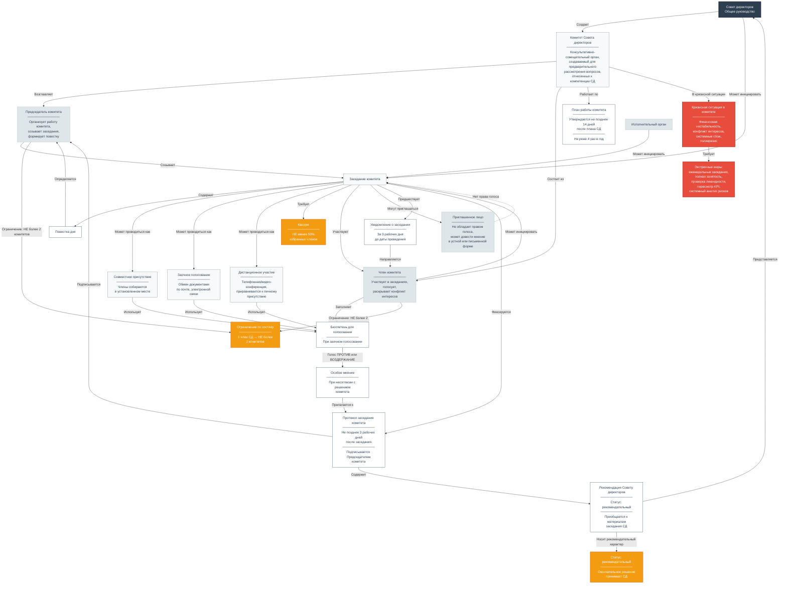

# Комитеты Совета директоров: структура, функции и организация работы

Комитеты являются неотъемлемой частью эффективной системы корпоративного управления. Они представляют собой **консультативно-совещательные органы**, создаваемые при Совете директоров для предварительного рассмотрения наиболее важных вопросов, отнесенных к компетенции Совета . Наличие комитетов позволяет детально проработать каждый вопрос до его вынесения на общее заседание, что значительно повышает качество принимаемых решений . Решения комитетов носят рекомендательный характер .

---

## 1. Правовое регулирование деятельности комитетов

Совет директоров вправе создавать комитеты для предварительного рассмотрения вопросов, относящихся к его компетенции **(п. 1 ст. 68 Закона об АО)** .

В соответствии с **Кодексом корпоративного управления** (письмо Банка России от 10.04.2014 № 06-52/2463), в уставе или внутреннем документе, регулирующем деятельность Совета директоров, рекомендуется предусмотреть создание в первоочередном порядке:

- комитета по аудиту;
- комитета по номинациям (назначениям);
- комитета по вознаграждениям;
- комитета по стратегии .

Совет директоров может также создавать и другие постоянно действующие или временные комитеты — например, по корпоративному управлению, по этике, по управлению рисками .

Рекомендуется утверждать отдельные положения о каждом комитете, определяющие его задачи, порядок формирования и работы . Положения о комитетах разрабатываются в соответствии с Методическими рекомендациями Банка России и утверждаются Советом директоров .

---

## 2. Основные комитеты и их функции

### 2.1. Комитет по аудиту

Комитет по аудиту является важнейшим инструментом корпоративного управления, обеспечивающим независимый контроль финансово-хозяйственной деятельности компании . Его роль неуклонно растет в условиях необходимости обеспечения соответствия требованиям регуляторов и повышения инвестиционной привлекательности .

**Основные задачи комитета:**

- **Надзор за формированием отчетности:** Комитет осуществляет контроль за полнотой, точностью и достоверностью годовой и промежуточной бухгалтерской (финансовой) отчетности, анализирует существенные аспекты учетной политики и элементы отчетности, подверженные оценочным суждениям .

- **Контроль систем управления рисками и внутреннего контроля:** Комитет мониторит надежность и эффективность системы управления рисками и внутреннего контроля, рассматривает результаты оценки эффективности этих систем по данным отчетов исполнительных органов и материалам проверок внутреннего аудита .

- **Взаимодействие с внешним аудитором:** Комитет оценивает кандидатуры внешних аудиторов, разрабатывает рекомендации Совету директоров по их назначению, анализирует результаты внешнего аудита и заключения аудиторов .

- **Взаимодействие со службой внутреннего аудита:** Комитет взаимодействует со службой внутреннего аудита, которая должна быть подотчетна Совету директоров через работу с комитетом, обеспечивая независимость внутреннего аудита от менеджмента .

**Состав:** Рекомендуется, чтобы членами Комитета по аудиту были только независимые директора, обладающие глубокими знаниями и практическим опытом в областях бухгалтерского учета, аудита, управления рисками и внутреннего контроля . Если это невозможно в силу объективных причин, большинство членов комитета должны составлять независимые директора, а председателем комитета может быть только независимый директор .

---

### 2.2. Комитет по вознаграждениям и номинациям

В российской практике комитеты по назначениям (номинациям) и по вознаграждениям практически всегда объединены в один **комитет по кадрам и вознаграждениям** . Это связано с тем, что в российском законодательстве выдвижение директоров в Совет производится непосредственно акционерами, имеющими не менее 2% голосующих акций .

**Основные задачи комитета:**

- Разработка и периодический пересмотр политики по вознаграждению для членов Совета директоров, Генерального директора, руководителя службы внутреннего аудита, корпоративного секретаря и ключевых сотрудников.
- Подготовка предложений Совету директоров по размеру вознаграждения указанных лиц.
- Разработка программ краткосрочной и долгосрочной мотивации.
- Планирование кадровых назначений и обеспечение преемственности деятельности Генерального директора и других ключевых руководителей.
- Оценка профессиональной квалификации и независимости кандидатов в состав Совета директоров.
- Проведение оценки эффективности работы Совета директоров, его членов и комитетов.

**Состав:** Рекомендуется, чтобы Комитет по вознаграждениям и номинациям состоял только из независимых директоров, а если это невозможно в силу объективных причин — большинство членов комитета должны составлять независимые директора, а председателем комитета может быть только независимый директор .

---

### 2.3. Комитет по стратегии

Комитет по стратегии предназначен для предварительного рассмотрения вопросов стратегического развития общества .

**Основные задачи комитета:**

- Определение стратегических целей деятельности общества.
- Контроль реализации стратегии и выработка рекомендаций по ее корректировке.
- Разработка приоритетных направлений деятельности общества.
- Выработка рекомендаций по дивидендной политике.
- Оценка эффективности деятельности общества в долгосрочной перспективе.
- Предварительное рассмотрение вопросов участия общества в других организациях (приобретение и отчуждение долей, акций).
- Рассмотрение финансовой модели и модели оценки стоимости бизнеса.
- Рассмотрение вопросов реорганизации и ликвидации общества и подконтрольных организаций.

**Состав:** Рекомендуется, чтобы большинство членов Комитета по стратегии составляли независимые директора, а остальными членами могли быть члены Совета директоров, не являющиеся Генеральным директором или членами правления .

---

### 2.4. Дополнительные комитеты

Совет директоров может создавать и другие комитеты по своему усмотрению, в зависимости от потребностей общества . К ним относятся:

- **Комитет по управлению рисками:** Осуществляет мониторинг и контроль за системой управления рисками, особенно актуален для компаний с высокими отраслевыми рисками (например, банковский сектор) .

- **Комитет по корпоративному управлению:** Занимается вопросами совершенствования корпоративного управления, взаимодействия с акционерами, раскрытия информации .

- **Комитет по этике:** Обеспечивает соблюдение этических норм и предотвращение конфликтов интересов.

- **Комитет по финансовым рынкам:** Рассматривает вопросы взаимодействия с финансовыми рынками .

---

## 3. Порядок проведения заседаний комитетов

### 3.1. Формирование комитетов

Комитеты формируются **Советом директоров на первом заседании после избрания нового состава** и действуют до прекращения полномочий Совета директоров . Комитеты формируются из числа членов Совета директоров, обладающих соответствующими профессиональными знаниями, компетенциями и навыками . При избрании членов комитетов должны учитываться их образование, профессиональная подготовка и опыт работы в соответствующей сфере .

**Требования к составу:**

| Комитет | Требование к составу |
|---------|----------------------|
| Комитет по аудиту | Только независимые директора (или большинство независимых, председатель — только независимый)  |
| Комитет по кадрам и вознаграждениям | Только независимые директора (или большинство независимых, председатель — только независимый)  |
| Комитет по стратегии | Большинство — независимые директора, остальные — члены СД, не являющиеся CEO или членами правления  |

**Ограничение:** Член Совета директоров не должен возглавлять более чем два комитета .

### 3.2. Планирование работы

Заседания комитетов проводятся по мере необходимости, но **не реже четырех раз в год** в соответствии с утвержденным планом работы . Планы работы комитетов формируются на основании утвержденного плана работы Совета директоров и утверждаются **не позднее 14 дней** с даты утверждения плана заседаний Совета директоров на соответствующее полугодие .

План работы комитета может содержать дополнительные вопросы, не входящие в план заседаний Совета директоров, но оказывающие существенное влияние на развитие общества .

### 3.3. Инициация созыва

**Плановые заседания** созываются Председателями комитетов в соответствии с планами работы .

**Внеочередные заседания** могут инициироваться:

- Председателем комитета;
- членами комитета;
- членами Совета директоров, не являющимися членами комитета;
- ревизионной комиссией общества;
- аудитором общества;
- единоличным исполнительным органом общества (Генеральным директором);
- топ-менеджерами общества.

Повестку дня заседания комитета определяет **Председатель комитета** . Она может быть изменена (дополнена/сокращена) по решению Председателя по своей инициативе или по предложениям членов комитета, членов Совета директоров, ревизионной комиссии, аудитора, единоличного исполнительного органа, профильных топ-менеджеров .

### 3.4. Уведомление

Уведомление о проведении заседания комитета с приложением материалов по вопросам повестки дня направляется членам комитета **не позднее 3 рабочих дней** до даты проведения заседания .

В исключительных случаях, не терпящих отлагательства, срок направления материалов может быть сокращен по решению Председателя комитета .

Уведомление направляется в электронном виде посредством электронной почты с указанием:

- даты, времени и места проведения заседания;
- повестки дня;
- приложением информации (материалов), проектов решений, бланков индивидуального голосования.

### 3.5. Кворум

Кворум для проведения заседания комитета составляет **не менее половины от числа избранных членов** соответствующего комитета .

При определении кворума и результатов голосования учитываются голоса отсутствующих членов комитета, представивших до заседания **заполненные и подписанные бланки индивидуального голосования** .

При отсутствии кворума заседание комитета переносится на дату, определенную решением Председателя комитета .

### 3.6. Формы проведения заседаний

Заседания комитетов могут проводиться в нескольких формах :

| Форма проведения | Описание |
|------------------|----------|
| **Совместное присутствие** | Члены комитета собираются в установленном месте для обсуждения и голосования |
| **Заочное голосование** | Без проведения заседания, члены заполняют бюллетени |
| **Телефонная (видео-) конференция** | При наличии технической возможности |

**Дистанционное участие** приравнивается к личному присутствию на заседании .

Форма проведения заседания определяется Председателем комитета с учетом значимости вопросов повестки дня .

### 3.7. Участники заседания

На заседаниях комитетов должны присутствовать только члены комитетов. Присутствие остальных лиц допускается только по приглашению комитета .

На заседания могут приглашаться:

- члены Совета директоров, не являющиеся членами комитета;
- Генеральный директор Общества;
- члены коллегиального исполнительного органа;
- члены Ревизионной комиссии;
- представители аудитора;
- топ-менеджеры и иные работники Общества, обладающие необходимыми профессиональными знаниями и компетенцией.

**Приглашенные лица не обладают правом голоса** по рассматриваемым вопросам. Они могут довести свое мнение до членов комитета в устной или письменной форме .

Комитеты вправе проводить **совместные заседания**. Вопросы, подлежащие обсуждению одновременно в нескольких комитетах, могут рассматриваться как на совместных заседаниях, так и раздельно. В случае проведения совместного заседания голосование проводится раздельно в каждом комитете .

### 3.8. Голосование

Каждый член комитета обладает **одним голосом** .

Решения (рекомендации) на заседаниях комитетов принимаются **большинством голосов** членов соответствующего комитета, присутствующих на заседании (представивших бланки индивидуального голосования) .

В случае равенства голосов членов соответствующего комитета голос председательствующего на заседании члена комитета является **решающим** .

**Заочное голосование** проводится путем обмена документами посредством почтовой, телеграфной, электронной или иной связи, обеспечивающей аутентичность передаваемых сообщений . Принявшими участие в заочном голосовании считаются члены комитетов, бланки голосования которых получены не позднее установленной даты .

### 3.9. Оформление результатов

Протокол заседания комитета составляется **не позднее 3 рабочих дней** после проведения заседания в форме совместного присутствия или заочного голосования .

Протокол должен содержать :

1. Дату, время и место проведения заседания (или дату окончания приема бюллетеней при заочном голосовании);
2. Лиц, присутствующих на заседании (или представивших бланки индивидуального голосования);
3. Указание на наличие кворума;
4. Повестку дня;
5. Вопросы, поставленные на голосование, и итоги голосования по ним;
6. Принятые решения (рекомендации Совету директоров);
7. Особое мнение члена комитета в случае, если оно не совпадает с принятым решением.

Протокол подписывается **Председателем комитета** и передается на хранение секретарю комитета .

**Статус решений комитетов:** Решения комитетов носят **рекомендательный характер** . Принятое комитетом решение по вопросу компетенции Совета директоров является **рекомендацией** Совету директоров .

Протокол заседания комитета, содержащий рекомендации по вопросам компетенции Совета директоров, с приложениями и необходимыми материалами приобщается к материалам заседания Совета директоров и представляется Совету директоров в сроки, предусмотренные Положением о Совете директоров .

---

## 4. Кризисные ситуации в работе комитетов

Комитеты — это не только инструмент «мирного времени». В кризисных ситуациях именно они берут на себя основную нагрузку по детальной проработке сложных вопросов и выработке решений в условиях высокой неопределенности .

### 4.1. Комитет по аудиту: удар на себя

В кризис этот комитет превращается в главный «боевой» орган. На его плечи ложится контроль за финансовой стабильностью компании. Во время локдаунов в 2020 году, например, комитеты по аудиту стали центральным местом обсуждения сценариев падения выручки, проверки ликвидности и пересмотра выплаты дивидендов .

**Ключевые риски:**

- **Нехватка времени для анализа:** В спокойное время комитет по аудиту встречается 3-4 раза в год. Во время кризиса заседания могут проходить еженедельно, а председатель комитета вынужден проводить частые личные встречи с финансовым директором и казначеем .
- **Оценка «живучести» компании:** Комитету приходится оценивать, сможет ли компания расплатиться по долгам в ближайшие 12 месяцев. В условиях резкого падения спроса вопрос стоял ребром .
- **Киберугрозы:** При утечке данных или кибератаке именно комитет по аудиту и рискам отвечает за расследование инцидента, оценку ущерба и контроль за устранением недостатков в системе безопасности .
- **Проверка достоверности прогнозов:** Одно из самых сложных решений — определить, насколько реалистичны прогнозы менеджмента в условиях, когда «обычные» методы прогнозирования перестают работать .

### 4.2. Комитет по вознаграждениям: конфликт интересов

Традиционно этот комитет разрабатывает систему мотивации топ-менеджеров. В кризис возникает классический конфликт: когда бонусы менеджмента поощряют рост краткосрочной стоимости акций, даже если это наносит долгосрочный вред бизнесу .

**Ключевые риски:**

- **Бонусы за «выживание»:** Комитету приходится пересматривать KPI для гендиректора. Если раньше бонус платили за рост прибыли, то теперь, возможно, за сохранение штата или поддержание минимального денежного потока.
- **Сокращения и мотивация:** Важно не допустить паники среди ключевых сотрудников. Комитет должен рекомендовать Совету решения по «замораживанию» зарплат или их перераспределению в пользу ядра коллектива, чтобы компания не потеряла ключевых экспертов в разгар кризиса .

### 4.3. Комитет по стратегии и рискам: системные сбои

Эпоха «поликризиса» (когда несколько катастроф накладываются друг на друга) требует от комитетов нового мышления .

**Ключевые риски:**

- **Иллюзия изолированных рисков:** Классическая ошибка — рассматривать киберриски, операционные риски и репутационные риски отдельно. В современном мире кибератака может остановить завод, что приведет к дефициту поставок, судебным искам и обвалу акций — всё одновременно .
- **Наследие и преемственность:** Особенно остро это стоит в семейных компаниях. Кризис может быть спровоцирован не внешним шоком, а внутренним — отсутствием плана преемственности или конфликтом между наследниками учредителя .

### 4.4. Что происходит с работой комитетов в кризис?

На практике кризис радикально меняет три параметра работы :

1. **Участие становится полным:** Члены комитетов (особенно по аудиту и рискам) переходят на «режим полной занятости» до разрешения ситуации.
2. **Ритм заседаний ускоряется:** Вместо обычных квартальных встреч проводятся еженедельные заседания, зачастую в формате «коротких» конференц-звонков, чтобы быстро адаптировать стратегию к меняющимся условиям.
3. **Вопросы становятся сложнее:** Комитеты переходят от обсуждения планов к обсуждению экзистенциальных вопросов: «Хватит ли у нас денег до конца года?», «Сохраним ли мы ключевых поставщиков?», «Приостановить ли инвестиции?».

**Важное ограничение:** Комитеты — это консультативно-совещательные органы. Они готовят рекомендации, но окончательное решение всегда остается за Советом директоров в полном составе . Однако в кризис, когда решения нужно принимать быстро, Совет часто делегирует комитетам широкие полномочия, а сам выступает в роли «арбитра» .

---

## 5. Ответственность членов комитетов

Наличие комитетов не освобождает членов Совета директоров от ответственности за принятые решения в рамках компетенции Совета директоров . Комитеты лишь готовят рекомендации, но окончательные решения принимаются Советом директоров .

---

## 6. Связь между уровнями

Данный уровень **«Комитеты»** является третьим в иерархии системы управления акционерным обществом:

1. **Уровень 1: Общество** — создание, акционеры, ОСА/ГОСА/ВОСА, избрание СД, кумулятивное голосование, количественный состав СД.

2. **Уровень 2: Совет директоров + Генеральный директор** — внутренняя работа СД, порядок заседаний, голосования, взаимодействие СД и CEO.

3. **Уровень 3: Комитеты** — специализированные органы при СД, обеспечивающие детальную проработку вопросов перед их вынесением на заседание Совета.

---

## Ключевые правовые нормы

| Действие | Правовое основание |
|---|---|
| Создание комитетов | п. 1 ст. 68 Закона об АО |
| Рекомендации по созданию комитетов | Кодекс корпоративного управления (письмо Банка России от 10.04.2014 № 06-52/2463) |
| Состав и функции комитетов | Методические рекомендации Банка России |
| Статус решений комитетов | Рекомендательный характер (практика корпоративного управления) |
| Периодичность заседаний | Не реже 4 раз в год (практика) |
| Кворум | Не менее 50% членов комитета |

---

*Документ подготовлен на основе Кодекса корпоративного управления, Постановления Правительства РФ № 585 и норм действующего законодательства РФ по состоянию на 2026 год.*