# Заседания Совета директоров: организация, подготовка и принятие решений

Заседание Совета директоров является центральным элементом корпоративного управления акционерным обществом. На нем принимаются ключевые стратегические и управленческие решения, осуществляется контроль за деятельностью исполнительных органов и обеспечивается соблюдение интересов акционеров. В данной статье рассматривается полный цикл организации и проведения заседания Совета директоров: от формирования повестки до оформления протокола.

---

## 1. Правовое регулирование

В соответствии со **статьями 65 и 68 Федерального закона «Об акционерных обществах» (№ 208-ФЗ)**, Совет директоров осуществляет общее руководство деятельством общества, а его заседания проводятся в порядке, установленном уставом или внутренними документами общества.

**Ключевые законодательные требования:**

- Заседание созывается **председателем Совета директоров** по его инициативе или по требованию члена СД, ревизионной комиссии, аудитора, исполнительного органа, а также иных лиц, определенных уставом **(п. 1 ст. 68 Закона об АО)**.
- Кворум составляет **не менее половины от числа избранных членов** Совета директоров **(п. 2 ст. 68 Закона об АО)**.
- Каждый член Совета директоров обладает **одним голосом**. Решения принимаются **большинством голосов** членов, участвующих в заседании **(п. 2, 3 ст. 68 Закона об АО)**.
- Протокол заседания составляется **не позднее трех календарных дней** после его проведения **(п. 4 ст. 68 Закона об АО)**.
- Решения, принятые с нарушением компетенции, при отсутствии кворума или без необходимого большинства голосов, **не имеют силы (п. 8 ст. 68 Закона об АО)**.

---

## 2. Организация заседания: подготовительный этап

### 2.1. Формирование повестки дня

Повестка дня заседания Совета директоров формируется **председателем Совета директоров** на основе:

- плана работы Совета директоров;
- предложений членов Совета директоров;
- требований ревизионной комиссии, аудитора, исполнительного органа;
- предложений акционеров (в случаях, предусмотренных уставом).

**Важно:** Все **постановляющие вопросы** (требующие голосования) должны быть включены в повестку заблаговременно, поскольку по ним необходимо подготовить бюллетени с проектами решений.

**Критический архитектурный принцип:** При формировании списка получателей уведомлений система **автоматически включает всех членов Совета директоров**. Это предотвращает злоупотребления (умышленное неизвещение кого-либо из членов) и обеспечивает соблюдение прав всех членов СД на участие в управлении.

**Сроки:** Предложения о включении вопросов в повестку дня должны быть направлены с учетом сроков, установленных внутренними документами, чтобы обеспечить возможность подготовки бюллетеней и материалов для членов Совета директоров.

### 2.2. Подготовка материалов и бюллетеней

Для каждого постановляющего вопроса повестки дня подготавливаются:

- **Пояснительная записка** с обоснованием необходимости принятия решения.
- **Проект решения** с четкой формулировкой.
- **Бюллетень для голосования**, содержащий формулировку вопроса и варианты голосования: «ЗА», «ПРОТИВ», «ВОЗДЕРЖАЛСЯ».

**Правовое обоснование:** Согласно **п. 4 ст. 53 Закона об АО**, предложение о внесении вопросов в повестку дня может содержать формулировку решения по каждому предлагаемому вопросу. Согласно **п. 7 ст. 53**, Совет директоров **не вправе вносить изменения** в формулировки решений по вопросам, предложенным для включения в повестку. Это требование делает обязательным наличие заранее подготовленных формулировок решений.

**Для организационных вопросов** (утверждение повестки, избрание секретаря заседания, регламент работы) бюллетени не требуются — такие решения принимаются непосредственно в ходе заседания.

### 2.3. Уведомление членов Совета директоров

Уведомление о проведении заседания с приложением материалов по вопросам повестки дня направляется членам Совета директоров **не позднее чем за 15 календарных дней** до даты его проведения **(п. 2 ст. 68 Закона об АО)**.

**Процедура отправки через автоматизированную систему:**

1. Уведомление формируется в системе уполномоченным лицом (Секретарем или Председателем СД).
2. Система **автоматически включает всех членов СД** в список получателей.
3. Уполномоченное лицо подтверждает отправку (нажатие кнопки).
4. Факт отправки фиксируется в логах системы: кто, когда, кому отправлено.
5. При использовании ПЭП — логирование является подтверждением личного действия.

Уведомление должно содержать:

- дату, время и место проведения заседания (или указание на проведение без определения места проведения);
- повестку дня;
- приложенные материалы (пояснительные записки, проекты решений, бюллетени).

## Диаграмма 1. Полный цикл заседания Совета директоров

```mermaid
graph TD
    %% Стили
    classDef process fill:#f8f9fa,stroke:#7f8c8d,stroke-width:1px,color:#2c3e50;
    classDef doc fill:#ffffff,stroke:#34495e,stroke-width:1px,color:#2c3e50;
    classDef legal fill:#f39c12,stroke:#e67e22,stroke-width:2px,color:#fff;
    classDef decision fill:#fff3cd,stroke:#ffc107,stroke-width:2px,color:#2c3e50;
    classDef source fill:#e8f4f8,stroke:#4a90d9,stroke-width:1px,color:#2c3e50;
    classDef error fill:#f8d7da,stroke:#dc3545,stroke-width:2px,color:#721c24;

    %% ===== ЗАСЕДАНИЕ =====
    Заседание[Заседание Совета директоров]:::process

    %% ===== КВОРУМ =====
    Кворум{Проверка кворума<br>──────────────<br>НЕ менее 50%}:::decision

    %% ===== ВОПРОСЫ ПОВЕСТКИ =====
    Вопросы_Повестки[Вопросы повестки дня]:::doc

    %% ===== ТИПЫ ВОПРОСОВ =====
    Информационный_Вопрос[Информационный вопрос<br>──────────────<br>Доклад / К сведению]:::doc
    Постановляющий_Вопрос[Постановляющий вопрос<br>──────────────<br>Требует голосования]:::doc
    Организационный_Вопрос[Организационный вопрос<br>──────────────<br>По повестке / Регламент]:::doc

    %% ===== ИСТОЧНИКИ ИНФОРМАЦИИ =====
    Источник_Менеджмент[Источник: Менеджмент<br>──────────────<br>Отчеты о стратегии,<br>бюджет, фин. результаты]:::source
    
    Источник_Внешний[Источник: Внешние/независимые<br>──────────────<br>Аудитор, ревизионная комиссия,<br>регуляторы, акционеры]:::source

    %% ===== ИНФОРМАЦИОННЫЙ ДОКЛАД =====
    Информационный_Доклад[Информационный доклад<br>──────────────<br>Источник: МЕНЕДЖМЕНТ]:::doc

    %% ===== ДОНЕСЕНИЕ ИНФОРМАЦИИ =====
    Донесение_Информации[Донесение информации к сведению<br>──────────────<br>Источник: ВНЕШНИЕ/<br>НЕЗАВИСИМЫЕ СТОРОНЫ]:::doc

    %% ===== БЮЛЛЕТЕНЬ =====
    Бюллетень[Бюллетень для голосования<br>──────────────<br>Готовится ДО заседания<br>──────────────<br>Содержит проекты решений<br>по постановляющим вопросам]:::doc

    %% ===== ПРИНЯТИЕ РЕШЕНИЯ =====
    Принятие_Решения[Принятие решения по вопросу<br>──────────────<br>Обязательно по каждому<br>вопросу повестки]:::process

    %% ===== ТИПЫ РЕШЕНИЙ =====
    Решение_Принять_К_Сведению[Принять к сведению]:::doc
    Решение_Дать_Поручение[Дать поручение<br>──────────────<br>Ответственным лицам]:::doc
    Решение_Включить_В_Повестку[Включить вопрос<br>в повестку следующего<br>заседания СД]:::doc

    %% ===== РЕШЕНИЯ ПО УПРАВЛЕНИЮ =====
    Решение_Управление[Решение по управлению<br>──────────────<br>Требует голосования<br>по бюллетеню]:::doc

    %% ===== РЕШЕНИЯ ПО ПОВЕСТКЕ =====
    Решение_Повестка[Решение по повестке<br>──────────────<br>Принимается в ходе заседания]:::doc

    %% ===== ПРОТОКОЛ =====
    Протокол[Протокол заседания<br>──────────────<br>Составляется в течение<br>3 календарных дней]:::doc

    %% ===== ПОВЕСТКА СЛЕДУЮЩЕГО ЗАСЕДАНИЯ =====
    Повестка_Следующего[Повестка следующего заседания<br>──────────────<br>Формируется на основе<br>принятых решений]:::doc

    %% ===== НОВЫЙ БЛОК: УВЕДОМЛЕНИЕ =====
    Уведомление_Процесс[Уведомление членов СД<br>──────────────<br>Формируется в системе<br>уполномоченным лицом<br>──────────────<br>СИСТЕМА АВТОМАТИЧЕСКИ<br>ВКЛЮЧАЕТ ВСЕХ ЧЛЕНОВ СД<br>в список получателей<br>──────────────<br>Фиксируется в логах:<br>кто, когда, кому отправлено<br>──────────────<br>При ПЭП логирование =<br>подтверждение личного действия]:::process

    %% ===== НОВЫЙ БЛОК: АРХИТЕКТУРНЫЙ БАРЬЕР =====
    Барьер[АРХИТЕКТУРНЫЙ БАРЬЕР<br>──────────────<br>Система НЕ ПОЗВОЛЯЕТ<br>исключить кого-либо<br>из списка получателей<br>──────────────<br>Это предотвращает<br>злоупотребления]:::legal

    %% ===== НОВЫЙ БЛОК: ЗЛОУПОТРЕБЛЕНИЕ =====
    Злоупотребление[⚠ КРИТИЧЕСКАЯ ОШИБКА<br>──────────────<br>Система ПОЗВОЛЯЕТ<br>выбирать получателей<br>──────────────<br>Это создает возможность<br>для злоупотреблений:<br>• неизвещение члена СД<br>• нарушение прав<br>• оспаривание решений<br>• вмешательство Комитета по аудиту]:::error

    %% ===== СВЯЗИ =====
    Заседание -->|Предшествует| Уведомление_Процесс
    Уведомление_Процесс -->|Обеспечивает| Барьер
    Барьер -->|Все члены СД уведомлены| Кворум
    Кворум -->|Кворум ЕСТЬ| Вопросы_Повестки

    Злоупотребление -.->|Если система позволяет<br>исключить члена СД| Уведомление_Процесс
    Злоупотребление -.->|Влечет| Расследование[Расследование Комитета по аудиту]:::error
    Расследование -.->|Приводит к| Оспаривание[Оспаривание решений СД<br>в судебном порядке]:::error

    Вопросы_Повестки -->|Включает| Информационный_Вопрос
    Вопросы_Повестки -->|Включает| Постановляющий_Вопрос
    Вопросы_Повестки -->|Включает| Организационный_Вопрос

    %% Информационные вопросы
    Информационный_Вопрос -->|Источник: МЕНЕДЖМЕНТ| Информационный_Доклад
    Информационный_Вопрос -->|Источник: ВНЕШНИЙ| Донесение_Информации

    Источник_Менеджмент -->|Предоставляет| Информационный_Доклад
    Источник_Внешний -->|Предоставляет| Донесение_Информации

    %% Постановляющие вопросы
    Постановляющий_Вопрос -->|Требует| Бюллетень
    Бюллетень -->|Содержит проект решения| Решение_Управление

    %% Организационные вопросы
    Организационный_Вопрос -->|Принимается| Решение_Повестка

    %% По каждому вопросу принимается решение
    Информационный_Доклад -->|По вопросу принимается| Принятие_Решения
    Донесение_Информации -->|По вопросу принимается| Принятие_Решения
    Решение_Управление -->|По вопросу принимается| Принятие_Решения
    Решение_Повестка -->|По вопросу принимается| Принятие_Решения

    %% Варианты решений по информационным вопросам
    Принятие_Решения -->|Вариант 1| Решение_Принять_К_Сведению
    Принятие_Решения -->|Вариант 2| Решение_Дать_Поручение
    Принятие_Решения -->|Вариант 3| Решение_Включить_В_Повестку

    %% Решения фиксируются в протоколе
    Решение_Принять_К_Сведению -->|Фиксируется| Протокол
    Решение_Дать_Поручение -->|Фиксируется| Протокол
    Решение_Включить_В_Повестку -->|Фиксируется| Протокол
    Решение_Управление -->|Фиксируется| Протокол
    Решение_Повестка -->|Фиксируется| Протокол

    %% Формирование повестки следующего заседания
    Решение_Включить_В_Повестку -->|Вопрос включается| Повестка_Следующего
    
    %% Дополнительные пояснения
    Пояснение_Кворум[Кворум — это не полный состав<br>──────────────<br>Заседание правомочно при наличии<br>не менее 50% избранных членов<br>──────────────<br>Отсутствие членов по их воле<br>не является нарушением]:::legal
    
    Пояснение_Злоупотребление[Умышленное неизвещение<br>члена СД — это злоупотребление<br>──────────────<br>Отличие от легитимного кворума:<br>• кворум — не явились по своей воле<br>• злоупотребление — не дали<br>возможности явиться]:::legal

    Кворум -.->|Пояснение| Пояснение_Кворум
    Злоупотребление -.->|Пояснение| Пояснение_Злоупотребление
```

**Сокращение сроков:** Указанные сроки могут быть сокращены по решению председателя совета директоров с учетом положений законодательства Российской Федерации, а также в случае необходимости оперативного решения вопросов, отнесенных к компетенции совета директоров. Сокращение срока не должно препятствовать надлежащей подготовке членов Совета директоров к заседанию.

---

## 3. Проведение заседания

### 3.1. Проверка кворума

Заседание открывается проверкой наличия кворума. Кворум для проведения заседания Совета директоров составляет **не менее половины от числа избранных членов** **(п. 2 ст. 68 Закона об АО)**.

**Важно:** Кворум — это не полный состав. Заседание правомочно при наличии минимального числа членов, установленного законом и уставом (не менее 50% избранных членов). Отсутствие части членов по их собственной воле не является препятствием для проведения заседания, если кворум соблюден.

При определении кворума учитываются:

- члены Совета, лично присутствующие на заседании;
- члены Совета, участвующие дистанционно;
- члены Совета, представившие письменное мнение по вопросам повестки до начала заседания (если это предусмотрено уставом).

**Если кворум отсутствует:** Заседание не может принимать решения. Оставшиеся члены Совета обязаны принять решение о созыве внеочередного общего собрания акционеров для избрания нового состава Совета директоров **(п. 2 ст. 68 Закона об АО)**.

**Принципиальное отличие:**
- **Легитимный кворум** — часть членов не явилась по своей воле, заседание правомочно.
- **Умышленное неизвещение** — члену СД не дали возможности явиться, не сообщив о заседании. Это злоупотребление и нарушение порядка созыва.

### 3.2. Типы вопросов повестки дня

Все вопросы повестки дня делятся на три категории:

| Тип вопроса | Описание | Требует голосования |
|-------------|----------|---------------------|
| **Информационный** | Доклад или донесение информации к сведению | Нет |
| **Дискуссионный** | Обсуждение вопроса без принятия обязательного решения | Нет |
| **Постановляющий** | Вопрос, требующий принятия обязательного решения | Да |

### 3.3. Информационные вопросы: доклады и донесения

Информационные вопросы могут поступать из разных источников:

**Информационный доклад** — предоставляется **менеджментом** (Генеральным директором, финансовым директором, руководителями подразделений). Примеры: отчет о выполнении стратегии, отчет об исполнении бюджета, отчет о дивидендной политике.

**Донесение информации к сведению** — поступает от **внешних или независимых сторон** (аудиторская организация, ревизионная комиссия, регулятор, акционеры). Примеры: аудиторское заключение, предписание Банка России, заключение ревизионной комиссии, сообщение акционера о нарушении прав.

**Важно:** По каждому информационному вопросу Совет директоров **обязан принять решение**, даже если это решение заключается в принятии информации к сведению. Это прямое требование законодательства — по каждому вопросу повестки дня должно быть принято решение.

### 3.4. Принятие решений по информационным вопросам

По информационным вопросам Совет директоров может принять одно из следующих решений:

1. **Принять информацию к сведению** (информация фиксируется в протоколе, но не требует дополнительных действий).
2. **Дать поручение** исполнительному органу (например, подготовить дополнительные материалы, провести анализ).
3. **Включить вопрос в повестку следующего заседания** для более детального рассмотрения.
4. **Мотивированно отказать** во включении вопроса в повестку (если вопрос не относится к компетенции СД или не соответствует требованиям закона).

### 3.5. Голосование по постановляющим вопросам

Постановляющие вопросы выносятся на голосование. Голосование может проводиться в одной из трех форм:

| Форма голосования | Описание |
|-------------------|----------|
| **Очное голосование** | Члены Совета собираются в установленном месте, обсуждают и голосуют |
| **Заочное голосование** | Голосование проводится опросным путем без проведения заседания |
| **Смешанное голосование** | Очное заседание совмещается с заочным голосованием для отсутствующих членов |

**Порядок голосования:**
- Каждый член Совета директоров имеет **один голос**.
- Решения принимаются **большинством голосов** членов, участвующих в заседании **(п. 2, 3 ст. 68 Закона об АО)**.
- В случае равенства голосов голос председателя Совета директоров является **решающим** (если это предусмотрено уставом).

**Квалифицированное большинство:** Для отдельных решений (например, приостановление полномочий единоличного исполнительного органа) требуется **квалифицированное большинство в три четверти голосов** членов Совета директоров **(п. 3 ст. 69 Закона об АО)**.

### 3.6. Особое мнение

Член Совета директоров, не согласный с решением большинства, вправе подать **особое мнение** для приобщения к протоколу заседания. Особое мнение должно быть подано **в течение суток** с момента окончания заседания и является обязательным приложением к протоколу **(п. 5 ст. 68 Закона об АО)**.

**Важно:** Член Совета, голосовавший против решения или воздержавшийся, к административной ответственности по **ст. 15.23.1 КоАП РФ** не привлекается (примечание к ст. 15.23.1 КоАП РФ).

---

## 4. Два типа решений Совета директоров

В практике работы Совета директоров выделяются два принципиально разных типа решений:

### 4.1. Решения по управлению

Это решения по вопросам, которые требуют **формального голосования** по заранее подготовленным бюллетеням.

**Особенности:**
- Вопросы такого типа обязательно включаются в повестку дня заблаговременно.
- Бюллетень содержит формулировку проекта решения по каждому вопросу.
- Члены Совета имеют возможность ознакомиться с проектами решений до заседания.
- Совет директоров **не вправе вносить изменения** в формулировки решений по предложенным вопросам **(п. 7 ст. 53 Закона об АО)**.

**Примеры:**
- Утверждение годового отчета.
- Избрание членов Совета директоров.
- Утверждение крупных сделок.
- Утверждение изменений в устав.
- Утверждение сделок с заинтересованностью.

### 4.2. Решения по повестке (организационные, процедурные)

Это решения, которые принимаются **по ходу заседания** и не требуют предварительного голосования бюллетенями.

**Особенности:**
- Принимаются непосредственно на заседании в рамках обсуждения.
- Не требуют предварительной подготовки бюллетеней.
- Фиксируются в протоколе как решения по ведению заседания.

**Примеры:**
- Утверждение повестки дня заседания.
- Избрание секретаря заседания.
- Утверждение регламента работы.
- Перенос рассмотрения вопроса на следующее заседание.
- Принятие информации к сведению.

---

## 5. Перерывы и продолжение заседания

Заседание Совета директоров может прерываться на перерывы и продолжаться на следующий день.

### 5.1. Краткосрочный перерыв

Длительность: до 2-4 часов. Для отдыха, приема пищи, ожидания приглашенных лиц. Не требует переноса на следующий день.

### 5.2. Долгосрочный перерыв

Длительность: от 4 часов до 10-20 календарных дней. Для подготовки заключений, внесения изменений в документы, разрешения вопросов. Требует повторной проверки кворума после возобновления. Может быть объявлен только в рамках одного заседания (не более одного раза).

### 5.3. Продолжение заседания на следующий день

В случае, если в первый день не удалось рассмотреть все вопросы, заседание может быть продолжено на следующий день. При продолжении заседания:

- Сохраняется повестка дня.
- Кворум проверяется повторно.
- Перерыв между днями считается **долгосрочным перерывом**.

**Терминология:** В законодательстве и регламентах используется термин **«продолжение заседания»** или **«перенос заседания на следующий день»**. Термин «сессия» в данном контексте не применяется.

---

## 6. Оформление протокола

### 6.1. Содержание протокола

Протокол заседания Совета директоров должен содержать **(п. 4 ст. 68 Закона об АО)**:

1. Дату, время и место проведения заседания (или сведения о том, что заседание проводилось без определения места проведения).
2. Лиц, принявших участие в заседании (включая дистанционное участие).
3. Повестку дня.
4. Вопросы повестки дня, поставленные на голосование, и результаты голосования с указанием варианта голосования каждого члена Совета либо сведений о том, что он не принял участия в голосовании.
5. Вопросы повестки дня, которые не ставились на голосование.
6. Принятые решения по каждому вопросу.
7. Сведения о лице, подписавшем протокол.
8. Особые мнения (при наличии).

### 6.2. Срок составления

Протокол заседания составляется **не позднее трех календарных дней** после даты проведения заседания или даты окончания приема документов при заочном голосовании **(п. 4 ст. 68 Закона об АО)**. Если последний день срока выпадает на выходной, он переносится на ближайший рабочий день (ст. 193 ГК РФ).

### 6.3. Подписание протокола

Протокол подписывается **председателем Совета директоров**, а в случае его отсутствия — членом Совета директоров, осуществляющим функции председателя. Лицо, подписавшее протокол, несет ответственность за правильность его составления.

---

## 7. Ничтожность решений Совета директоров

**Пункт 8 статьи 68 Закона об АО** устанавливает, что решения Совета директоров, принятые:

- с нарушением компетенции Совета директоров;
- при отсутствии кворума для проведения заседания;
- без необходимого для принятия решения большинства голосов,

**не имеют силы** независимо от обжалования их в судебном порядке.

Это означает, что такие решения являются **ничтожными** (абсолютно недействительными) в силу прямого указания закона.

---

## 8. Формирование повестки следующего заседания

На основании принятых решений формируется повестка следующего заседания Совета директоров. В частности, если Совет директоров принял решение **«включить вопрос в повестку следующего заседания»**, этот вопрос вносится председателем Совета директоров или секретарем Совета в план работы и повестку следующего заседания.

**Порядок формирования повестки следующего заседания:**

1. На заседании принимается решение о включении вопроса в повестку следующего заседания.
2. Решение фиксируется в протоколе.
3. Председатель Совета директоров (или секретарь) включает вопрос в план работу и повестку следующего заседания.
4. Подготавливаются материалы и бюллетени для голосования по данному вопросу.

---

## 9. Ответственность

### Членов Совета директоров

Члены Совета директоров несут **административную ответственность** по **ст. 15.23.1 КоАП РФ** за:

- незаконный отказ в созыве или уклонение от созыва общего собрания акционеров;
- нарушение порядка или срока уведомления о проведении собрания;
- незаконный отказ во внесении вопросов в повестку дня.

**Голосовавший против** член Совета к ответственности по ст. 15.23.1 КоАП РФ **не привлекается** (примечание к ст. 15.23.1 КоАП РФ).

### Генерального директора

Генеральный директор несет:

- **гражданско-правовую ответственность** за убытки, причиненные обществу виновными действиями **(п. 2 ст. 71 Закона об АО)**;
- **административную ответственность** как должностное лицо за нарушения в сфере управления обществом.

---

## 10. Ключевые правовые нормы

| Действие | Правовое основание |
|---|---|
| Компетенция Совета директоров | ст. 65 Закона об АО |
| Инициация созыва заседания | п. 1 ст. 68 Закона об АО |
| Кворум | п. 2 ст. 68 Закона об АО |
| Порядок голосования | п. 2, 3 ст. 68 Закона об АО |
| Срок составления протокола | п. 4 ст. 68 Закона об АО |
| Особое мнение | п. 5 ст. 68 Закона об АО |
| Ничтожность решений | п. 8 ст. 68 Закона об АО |
| Формулировка решений в повестке | п. 4, 7 ст. 53 Закона об АО |
| Приостановление полномочий ЕИО | п. 3 ст. 69 Закона об АО |
| Ответственность членов СД | ст. 15.23.1 КоАП РФ |
| Ответственность Генерального директора | ст. 71 Закона об АО |

---

*Документ подготовлен на основе норм действующего законодательства РФ по состоянию на 2026 год.*