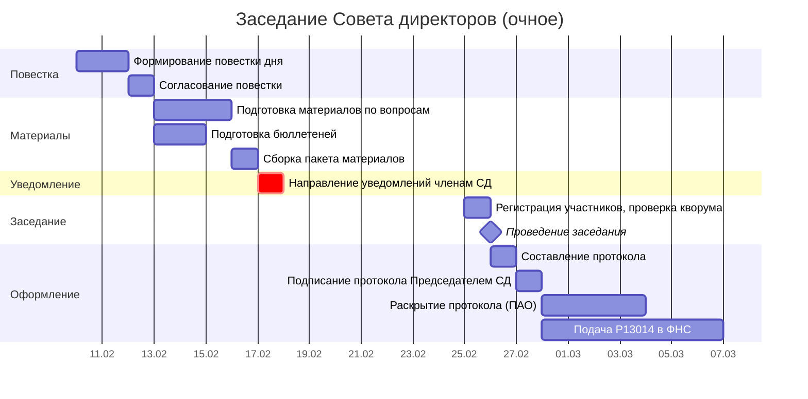
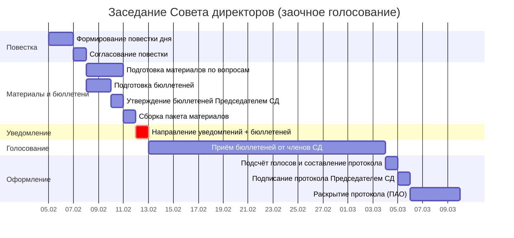

# Диаграмма Ганта и документооборот заседания Совета директоров

> Продолжение [документации по заседаниям СД](4 BOD meeting.md). Здесь — таблица для построения диаграммы Ганта и реестр документов.
>
> **О модели данных:** соглашения об ID, столбцах, вехах и фазах — в [описании модели данных](gantt-data-model.md).

---

## 1. Таблица для диаграммы Ганта

Длительности задач указаны в рабочих днях (р.д.). Законодательные дедлайны (уведомление, протокол) — в **календарных днях** (см. [столбец «Примечание»](gantt-data-model.md)).

**Критический путь:** П1 → П2 → П3 → У1 → ЗС1 → ЗС2 → ЗС3 → ПР1 (≈10 р.д. до заседания + 3 кал.дн. на протокол).

Два сценария: **очное** (15 кал.дн. уведомление) и **заочное** (20 кал.дн. уведомление + бюллетени).

### Сценарий А: Очное заседание

**Критический путь:** П1 → П2 → П3 → У1 → ЗС1 → ЗС2 → ПР1 (≈10 р.д. до заседания).

| ID | Задача | Исполнитель | Длит. (р.д.) | Начало | Конец | Предшественники | Примечание |
|----|--------|------------|-------------|--------|-------|-----------------|------------|
| **→ Фаза 1: Формирование повестки (Д−25…Д−20)** |
| П1 | Формирование повестки дня | Председатель СД | 2 | Д−25 | Д−24 | — | На основе плана работы, предложений членов СД, требований ревизора/аудитора |
| П2 | Согласование повестки с Председателем СД | Секретарь СД | 1 | Д−23 | Д−23 | П1 | Финализация формулировок вопросов |
| **→ Фаза 2: Подготовка материалов (Д−22…Д−17)** |
| П3 | Подготовка материалов по вопросам повестки | Ответственные по вопросам | 3 | Д−22 | Д−20 | П2 | Пояснительные записки, проекты решений, финансовая отчётность |
| Б1 | Подготовка бюллетеней (для постановляющих вопросов) | Секретарь СД | 2 | Д−19 | Д−18 | П2 | Формулировки вопросов и варианты голосования: ЗА/ПРОТИВ/ВОЗДЕРЖАЛСЯ |
| П4 | Сборка пакета материалов | Секретарь СД | 1 | Д−17 | Д−17 | П3, Б1 | |
| **→ Фаза 3: Уведомление (Д−16…Д−15)** |
| У1 | Направление уведомлений членам СД | Секретарь СД | 1 | Д−16 | Д−16 | П4 | [З1](#z1), [Р1](#r1). −**15 кал.** дней до заседания (п. 1 ст. 68 208-ФЗ) |
| У2 | Сохранение доказательств отправки | Секретарь СД | — | Д−16 | — | У1 | Логи СЭД / квитанции / подтверждения email |
| **→ Фаза 4: Заседание (Д−0)** |
| ЗС1 | Регистрация участников, проверка кворума | Секретарь СД | 1 | Д−0 | Д−0 | У1 | Кворум ≥50% избранных членов (п. 2 ст. 68 208-ФЗ) |
| ЗС2 | Проведение заседания: обсуждение и голосование | Председатель СД | 1 | Д−0 | Д−0 | ЗС1 | Решения — большинством голосов членов, участвующих в заседании |
| **→ Фаза 5: Оформление результатов (Д+1…Д+3)** |
| ПР1 | Составление протокола заседания | Секретарь СД | 1 | Д+1 | Д+1 | ЗС2 | −**3 кал.** дня после заседания (п. 4 ст. 68 208-ФЗ). Если последний день — выходной, переносится (ст. 193 ГК РФ) |
| ПР2 | Подписание протокола Председателем СД | Председатель СД | 1 | Д+2 | Д+2 | ПР1 | В случае отсутствия — член СД, исполняющий функции председателя |
| ПР3 | Раскрытие протокола (для ПАО) | Секретарь СД | 1 | Д+3 | Д+3 | ПР2 | [Р2](#r2). Не позднее **4 р.д.** (ст. 76.2 Положения ЦБ № 714-П). Только для ПАО |
| Р13014 | Подача Р13014 в ФНС (при смене состава СД) | Гендиректор | 1 | Д+3–Д+10 | — | ПР2 | [З2](#z2). **7 р.д.** после заседания (ст. 5 129-ФЗ) |
| **→ Вехи** |
| ▼В1 | Повестка утверждена | — | 0 | Д−23 | Д−23 | П2 | |
| ▼В2 | Уведомления разосланы | — | 0 | Д−16 | Д−16 | У1 | |
| ▼В3 | Заседание проведено | — | 0 | Д−0 | Д−0 | ЗС2 | |
| ▼В4 | Протокол подписан | — | 0 | Д+2 | Д+2 | ПР2 | |

> **Анализ:** Критический путь — 10 р.д. от формирования повестки до заседания. Уведомление (У1) на Д−16 обеспечивает ≥15 календарных дней до заседания на Д−0. Протокол (ПР1+ПР2) — 2 р.д., укладывается в 3-календарный день. **Ключевой риск — задержка с формированием повестки (П1) или подготовкой материалов (П3).**

---

### Сценарий Б: Заочное голосование

**Критический путь:** П1 → П2 → П3 → Б1 → Б2 → У1 → ЗС1 (≈12 р.д. до рассылки бюллетеней).

| ID | Задача | Исполнитель | Длит. (р.д.) | Начало | Конец | Предшественники | Примечание |
|----|--------|------------|-------------|--------|-------|-----------------|------------|
| **→ Фаза 1: Формирование повестки (Д−30…Д−25)** |
| П1 | Формирование повестки дня | Председатель СД | 2 | Д−30 | Д−29 | — | На основе плана работы, предложений членов СД |
| П2 | Согласование повестки с Председателем СД | Секретарь СД | 1 | Д−28 | Д−28 | П1 | |
| **→ Фаза 2: Подготовка материалов и бюллетеней (Д−27…Д−21)** |
| П3 | Подготовка материалов по вопросам повестки | Ответственные по вопросам | 3 | Д−27 | Д−25 | П2 | Пояснительные записки, проекты решений |
| Б1 | Подготовка бюллетеней для заочного голосования | Секретарь СД | 2 | Д−24 | Д−23 | П2 | Бюллетени обязательны для заочного голосования |
| Б2 | Утверждение бюллетеней Председателем СД | Председатель СД | 1 | Д−22 | Д−22 | Б1 | Подпись на бюллетенях |
| П4 | Сборка пакета материалов | Секретарь СД | 1 | Д−21 | Д−21 | П3, Б2 | |
| **→ Фаза 3: Уведомление и рассылка (Д−20)** |
| У1 | Направление уведомлений + бюллетеней членам СД | Секретарь СД | 1 | Д−20 | Д−20 | П4 | [З1](#z1), [Р1](#r1). −**20 кал.** дней до окончания приёма бюллетеней |
| У2 | Сохранение доказательств отправки | Секретарь СД | — | Д−20 | — | У1 | Логи СЭД / квитанции |
| **→ Фаза 4: Период голосования (Д−19…Д−0)** |
| ГЛ1 | Приём заполненных бюллетеней от членов СД | Секретарь СД | 19 | Д−19 | Д−0 | У1 | Срок приёма определяется уставом / решением Председателя |
| **→ Фаза 5: Подсчёт и оформление (Д+1…Д+3)** |
| ПР1 | Подсчёт голосов и составление протокола | Секретарь СД | 1 | Д+1 | Д+1 | ГЛ1 | −**3 кал.** дня после окончания приёма бюллетеней (п. 4 ст. 68 208-ФЗ) |
| ПР2 | Подписание протокола Председателем СД | Председатель СД | 1 | Д+2 | Д+2 | ПР1 | |
| ПР3 | Раскрытие протокола (для ПАО) | Секретарь СД | 1 | Д+3 | Д+3 | ПР2 | [Р2](#r2). Не позднее **4 р.д.** (ст. 76.2 Положения ЦБ № 714-П) |
| **→ Вехи** |
| ▼В1 | Повестка утверждена | — | 0 | Д−28 | Д−28 | П2 | |
| ▼В2 | Бюллетени разосланы | — | 0 | Д−20 | Д−20 | У1 | |
| ▼В3 | Голосование завершено | — | 0 | Д−0 | Д−0 | ГЛ1 | |
| ▼В4 | Протокол подписан | — | 0 | Д+2 | Д+2 | ПР2 | |

---

**Условные обозначения:**
- **П*** — подготовка повестки и материалов
- **Б*** — бюллетени для голосования
- **У*** — уведомление членов СД
- **ЗС*** — заседание СД
- **ПР*** — протокол и оформление результатов
- **ГЛ*** — голосование (заочное)
- **Р13014** — подача в ФНС
- **▼В*** — вехи (нулевая длительность)

## 1.1. Диаграмма Ганта — Очное заседание СД (Mermaid)

## 1.2. Диаграмма Ганта — Заочное голосование СД (Mermaid)

---

## 2. Документооборот

### 2.1. Задачи для СЭД — внутренние получатели

| Индекс | Задача Ганта | Документ | Отправитель | Получатель |
|--------|-------------|----------|-------------|------------|
| **С1** | П1 | Проект повестки дня заседания СД | Председатель СД / Секретарь | Председатель СД (утверждение) |
| **С2** | П3 | Материалы по вопросам повестки (пояснительные записки, проекты решений) | Ответственные по вопросам | Секретарь СД (сборка пакета) |
| **С3** | ПР1 | Протокол заседания СД (проект) | Секретарь СД | Председатель СД (подписание) |

### 2.2. Уведомления членам Совета директоров

| Индекс | Задача Ганта | Что отправляется | Способ | Срок |
|--------|-------------|-----------------|--------|------|
| **З1** | У1 | Уведомление о проведении заседания + пакет материалов (+ бюллетени для заочного) | СЭД / email / заказное письмо | Очное: −15 кал.дн.; Заочное: −20 кал.дн. |

### 2.3. Сводная таблица уведомлений

| Индекс | Что | Кому | Крайний срок | Задача Ганта |
|--------|-----|------|-------------|-------------|
| **Р1** | Уведомление о заседании + материалы (+ бюллетени) | Все члены СД | Очное: −15 кал.дн.; Заочное: −20 кал.дн. | У1 |
| **Р2** | Протокол заседания СД | Все члены СД + раскрытие (ПАО) | Протокол — в течение 3 кал.дн.; Раскрытие — 4 р.д. | ПР1, ПР3 |

---

← [Документация по заседаниям СД](4 BOD meeting.md) | [Уведомления](5 BOD mittings notifications.md) | [Комитеты СД](committee-gantt.md)
