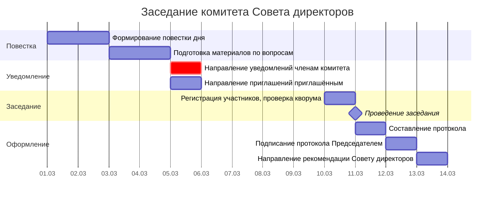

# Диаграмма Ганта и документооборот заседания комитета Совета директоров

> Продолжение [документации по комитетам СД](3 commitee.md). Здесь — таблица для построения диаграммы Ганта и реестр документов.
>
> **О модели данных:** соглашения об ID, столбцах, вехах и фазах — в [описании модели данных](gantt-data-model.md).

---

## 1. Таблица для диаграммы Ганта

Длительности задач и законодательные дедлайны — в **рабочих днях** (раб. дн.) (п. 5, 6 Положения о комитетах СД).

**Критический путь:** П1 → П2 → У1 → ЗК1 → ЗК2 → ПР1 → ПР2 (≈8 раб. дн.).

| ID | Задача | Исполнитель | Длит. | Начало | Конец | Предшественники | Примечание |
|----|--------|------------|-------------|--------|-------|-----------------|------------|
| **→ Фаза 1: Формирование повестки (Д−10…Д−7)** |
| П1 | Формирование повестки дня заседания комитета | Председатель комитета | 2 раб. дн. | SS | SS + 1 | — | На основе плана работы комитета, запросов членов СД |
| П2 | Подготовка материалов по вопросам повестки | Ответственные по вопросам | 2 раб. дн. | Д−8 | Д−7 | П1 | Аналитические записки, заключения, проекты рекомендаций |
| **→ Фаза 2: Уведомление (Д−6…Д−3)** |
| У1 | Направление уведомлений членам комитета | Председатель комитета / Секретарь | 1 раб. дн. | Д−6 | Д−6 | П2 | [З1](#z1). −**3 раб. дн.** до заседания. Способ — по уставу/Положению |
| У2 | Направление приглашений приглашённым лицам | Секретарь комитета | 1 раб. дн. | Д−5 | Д−5 | П2 | Приглашённые не обладают правом голоса |
| **→ Фаза 3: Заседание (Д−0)** |
| ЗК1 | Регистрация участников, проверка кворума | Секретарь комитета | 1 раб. дн. | Д−0 | Д−0 | У1 | Кворум ≥50% избранных членов комитета |
| ЗК2 | Проведение заседания: обсуждение и голосование | Председатель комитета | 1 раб. дн. | Д−0 | Д−0 | ЗК1 | Решения — большинством голосов членов, участвующих в заседании |
| **→ Фаза 4: Оформление результатов (Д+1…Д+3)** |
| ПР1 | Составление протокола заседания комитета | Секретарь комитета | 1 раб. дн. | Д+1 | Д+1 | ЗК2 | −**3 раб. дн.** после заседания |
| ПР2 | Подписание протокола Председателем комитета | Председатель комитета | 1 раб. дн. | Д+2 | Д+2 | ПР1 | |
| ПР3 | Направление рекомендации Совету директоров | Председатель комитета | 1 раб. дн. | Д+3 | Д+3 | ПР2 | [Р1](#r1). Рекомендация приобщается к материалам ближайшего заседания СД |
| **→ Вехи** |
| ▼В1 | Повестка утверждена | — | 0 раб. дн. | Д−9 | Д−9 | П1 | |
| ▼В2 | Уведомления разосланы | — | 0 раб. дн. | Д−6 | Д−6 | У1 | |
| ▼В3 | Заседание проведено | — | 0 раб. дн. | Д−0 | Д−0 | ЗК2 | |
| ▼В4 | Протокол и рекомендация готовы | — | 0 раб. дн. | Д+3 | Д+3 | ПР3 | |

> **Анализ:** Критический путь — 8 раб. дн. Уведомление (У1) на Д−6 обеспечивает ≥3 раб. дн. до заседания. Протокол (ПР1+ПР2) — 2 раб. дн., укладывается в 3-раб. дн.. Рекомендация (ПР3) направляется СД для включения в материалы ближайшего заседания.

---

**Условные обозначения:**
- **П*** — подготовка повестки и материалов
- **У*** — уведомление членов комитета
- **ЗК*** — заседание комитета
- **ПР*** — протокол и оформление результатов
- **▼В*** — вехи (нулевая длительность)

## 1.1. Диаграмма Ганта — Заседание комитета СД (Mermaid)

---

## 2. Документооборот

### 2.1. Задачи для СЭД — внутренние получатели

| Индекс | Задача Ганта | Документ | Отправитель | Получатель |
|--------|-------------|----------|-------------|------------|
| **С1** | П1 | Проект повестки дня заседания комитета | Председатель комитета | Секретарь комитета |
| **С2** | П2 | Материалы по вопросам повестки | Ответственные по вопросам | Секретарь комитета (сборка) |
| **С3** | ПР1 | Протокол заседания комитета (проект) | Секретарь комитета | Председатель комитета (подписание) |
| **С4** | ПР3 | Рекомендация Совету директоров | Председатель комитета | Совет директоров (через Секретаря СД) |

### 2.2. Уведомления членам комитета

| Индекс | Задача Ганта | Что отправляется | Способ | Срок |
|--------|-------------|-----------------|--------|------|
| **З1** | У1 | Уведомление о проведении заседания + пакет материалов | СЭД / email / иной по уставу | −3 раб. дн. до заседания |

### 2.3. Сводная таблица уведомлений

| Индекс | Что | Кому | Крайний срок | Задача Ганта |
|--------|-----|------|-------------|-------------|
| **Р1** | Рекомендация комитета + протокол | Совет директоров | До ближайшего заседания СД | ПР3 |

---

← [Документация по комитетам СД](3 commitee.md) | [Заседания СД](bod-gantt.md) | [Модель данных Ганта](gantt-data-model.md)
