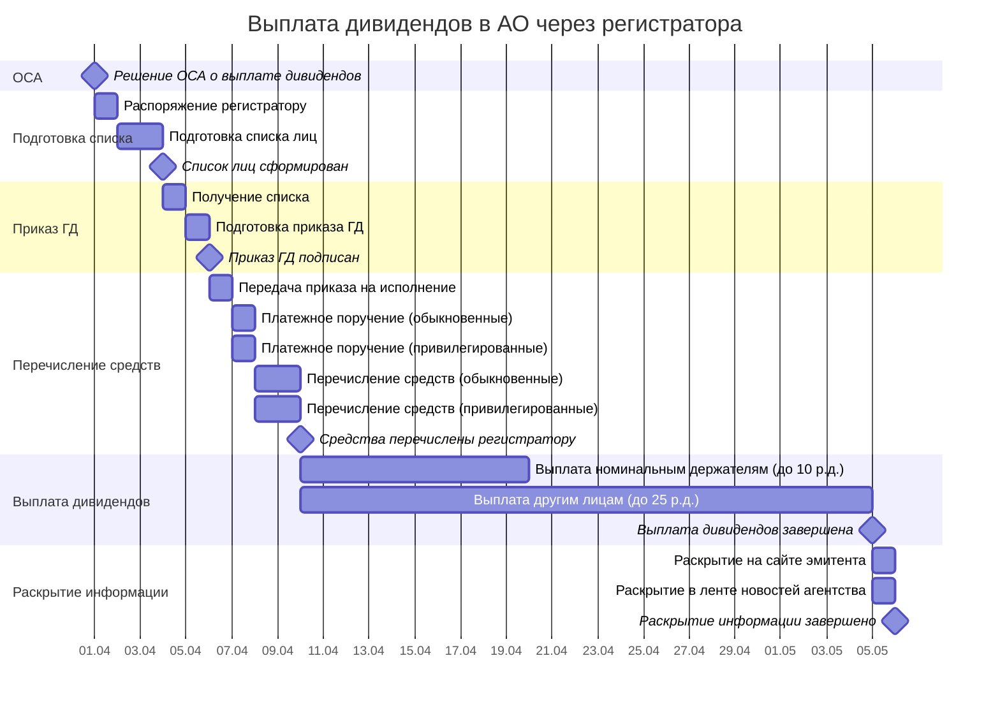

# Диаграмма Ганта: Выплата дивидендов в АО через регистратора

> **Об исполнителях.** Регистратор — лицензированный участник рынка ценных бумаг. Сроки операций регистратора определяются Правилами регистратора / договором с регистратором, а не нормами 208-ФЗ.
>
> **Общие ссылки:** [ст. 42 208-ФЗ](../laws/article-42.md), [ст. 43 208-ФЗ](../laws/article-43.md), [ст. 44 208-ФЗ](../laws/article-44.md).

---

## 1. Таблица для диаграммы Ганта

| № | Элемент | Ответственный | Срок | Тип | Зависимость |
|---|---------|---------------|------|-----|-------------|
| **0** | **Решение ОСА о выплате дивидендов принято, протокол подписан** | — | День 0 | 🔷 **Стартовый сигнал** | — |
| 1 | Направить регистратору распоряжение на подготовку списка лиц, имеющих право на получение дивидендов | Корпоративный блок АО | В срок, установленный Правилами регистратора / договором с регистратором | Задача | 0 |
| 2 | Подготовить список лиц, имеющих право на получение дивидендов | Регистратор | В срок, установленный Правилами регистратора / договором; по состоянию на дату, установленную ОСА | Задача | 1 |
| **3** | **Список лиц, имеющих право на получение дивидендов, сформирован** | Регистратор | — | 🔶 **Веха** | 2 |
| 4 | Получить список лиц, имеющих право на получение дивидендов | Корпоративный блок АО | В срок, установленный Правилами регистратора / договором | Задача | 3 |
| 5 | Подготовить приказ ГД об осуществлении выплаты дивидендов с приложением списка акционеров | Корпоративный блок / финансовая служба | По внутреннему регламенту АО | Задача | 4 |
| **6** | **Приказ ГД об осуществлении выплаты дивидендов подписан** | Генеральный директор | — | 🔶 **Веха** | 5 |
| 7 | Передать приказ ГД с приложенным списком акционеров на исполнение | Корпоративный блок / финансовая служба | По внутреннему регламенту АО | Задача | 6 |
| 8 | Подготовить платежное поручение для выплаты дивидендов по обыкновенным акциям | Финансовая служба АО | По внутреннему регламенту / договору с регистратором | Задача | 7 |
| 9 | Подготовить платежное поручение для выплаты дивидендов по привилегированным акциям | Финансовая служба АО | По внутреннему регламенту / договору с регистратором | Задача | 7 |
| 10 | Перечислить денежные средства регистратору по обыкновенным акциям | Финансовая служба АО | По Правилам регистратора / договору | Задача | 8 |
| 11 | Перечислить денежные средства регистратору по привилегированным акциям | Финансовая служба АО | По Правилам регистратора / договору | Задача | 9 |
| **12** | **Денежные средства перечислены регистратору** | АО | — | 🔶 **Веха** | 10, 11 |
| 13 | Выплата дивидендов номинальным держателям / доверительным управляющим — профессиональным участникам рынка ценных бумаг | Регистратор | **Не более 10 рабочих дней с даты определения лиц** | Задача | 12 |
| 14 | Выплата дивидендов другим зарегистрированным лицам | Регистратор | **Не более 25 рабочих дней с даты определения лиц** | Задача | 12 |
| **15** | **Выплата дивидендов завершена** | — | — | 🔶 **Веха** | 13, 14 |
| 16 | Раскрытие информации о выплате дивидендов на официальном сайте эмитента | Корпоративный блок АО | Не позднее **1 рабочего дня** после исполнения обязательства по выплате | Задача | 15 |
| 17 | Раскрытие информации о выплате дивидендов в ленте новостей уполномоченного информационного агентства | Корпоративный блок АО | Не позднее **1 рабочего дня** после исполнения обязательства по выплате | Задача | 15 |
| **18** | **Раскрытие информации завершено** | — | — | 🔶 **Веха** | 16, 17 |

**Условные обозначения:**
- 🔷 **Стартовый сигнал** — событие, запускающее процесс
- 🔶 **Веха** — контрольная точка (завершение этапа)
- **Задача** — операция, выполняемая ответственным лицом

---

## 2. Диаграмма Ганта

**Примечание:** сроки операций registrатора (задачи 2, 4, 13, 14) определяются Правилами регистратора / договором. Задачи 8–9 и 10–11 (платежные поручения и перечисления по обыкновенным / привилегированным акциям) выполняются параллельно.

---

## 3. Атрибуты корпоративного действия

Атрибуты **не являются элементами Ганта** — это параметры, определяемые решением ОСА и условиями договора:

- дата принятия решения ОСА;
- **дата определения лиц, имеющих право на получение дивидендов**;
- размер дивиденда на одну обыкновенную акцию;
- размер дивиденда на одну привилегированную акцию;
- категории/типы акций;
- регистратор;
- реквизиты договора с регистратором;
- применяемые Правила регистратора.

---

## 4. Примечание по платежным поручениям

В строках 8–9 разделение на обыкновенные / привилегированные акции как две отдельные операции выполнено для согласования со схемой работы АО. Юридическое требование о **двух платежных поручениях** необходимо подтверждать Правилами конкретного регистратора / договором, а не законом об АО.

---

## 5. Юридические основания

| Норма | Содержание |
|-------|-----------|
| [ст. 42 208-ФЗ](../laws/article-42.md) | Порядок распределения чистой прибыли и выплаты дивидендов |
| [ст. 43 208-ФЗ](../laws/article-43.md) | Ограничения выплаты дивидендов |
| [ст. 44 208-ФЗ](../laws/article-44.md) | Держатель реестра акционеров (регистратор) |
| ст. 92 208-ФЗ | Общая обязанность АО раскрывать информацию в случаях, предусмотренных Банком России |
| ст. 30 39-ФЗ | Общие требования к раскрытию информации эмитентами на рынке ценных бумаг |
| п. 5.1.17 Положения Банка России от 31.12.2020 № 706-П | Обязанность раскрывать информацию о выплаченных доходах по ценным бумагам |
| Указание Банка России от 28.12.2015 № 3929-У | Перечень существенных фактов, подлежащих раскрытию, включая доходы по ценным бумагам |

---

## 6. Раскрытие информации о выплате дивидендов

### 6.1. Обязанность раскрытия

Эмитент обязан раскрывать информацию о выплате дивидендов как о **существенном факте деятельности**. Раскрытие осуществляется двумя способами:

1. **На официальном сайте эмитента** в сети «Интернет».
2. **В ленте новостей уполномоченного информационного агентства** (ПРАЙМ, Интерфакс, СКРИН, AK&M и др.).

### 6.2. Сроки раскрытия

Сроки раскрытия привязаны к дате определения лиц (закрытия реестра):

| Событие | Срок раскрытия |
|---------|----------------|
| Выплата номинальным держателям / доверительным управляющим | Не позднее **1 рабочего дня** после исполнения обязательства по выплате (но не позднее 10 рабочих дней с даты определения лиц) |
| Выплата другим зарегистрированным лицам | Не позднее **1 рабочего дня** после исполнения обязательства по выплате (но не позднее 25 рабочих дней с даты определения лиц) |

> Если обязанность по выплате исполнена в первом периоде (номинальным держателям) и соответствующее сообщение опубликовано, повторно раскрывать информацию по истечении 25 рабочих дней не требуется.

### 6.3. Уполномоченные информационные агентства

Банк России аккредитовал следующие агентства для публикации обязательной информации:

| Агентство | Сайт раскрытия |
|-----------|----------------|
| АО «Агентство экономической информации «ПРАЙМ» | disclosure.1prime.ru |
| ООО «Интерфакс – Центр раскрытия корпоративной информации» | e-disclosure.ru |
| ООО «Система комплексного раскрытия информации и новостей» (СКРИН) | disclosure.skrin.ru |
| ЗАО «Анализ, Консультации и Маркетинг» (AK&M) | disclosure.ru |
| АНО «Ассоциация защиты информационных прав инвесторов» (АЗИПИ) | — |

> Общество не обязано раскрывать сам факт того, с каким агентством заключён договор. Публикация происходит на сайте того агентства, с которым заключён договор.

### 6.4. Информационно-аналитическая система СПАРК-Интерфакс

Система **СПАРК-Интерфакс** аккумулирует публичную корпоративную информацию, включая сведения о выплате дивидендов:

- **Статус «Интерфакса»** как уполномоченного агентства: группа «Интерфакс» аккредитована Банком России для раскрытия информации на фондовом рынке.
- **Прямая интеграция:** информация, размещаемая эмитентами через Центр раскрытия корпоративной информации «Интерфакса» (e-disclosure.ru), поступает в аналитическую систему «СПАРК-Интерфакс».
- **Назначение системы:** СПАРК-Интерфакс предназначена для всесторонней проверки контрагентов, интегрирует данные из более чем 300 источников корпоративной информации.

---

← [Назад к документации](README.md)
