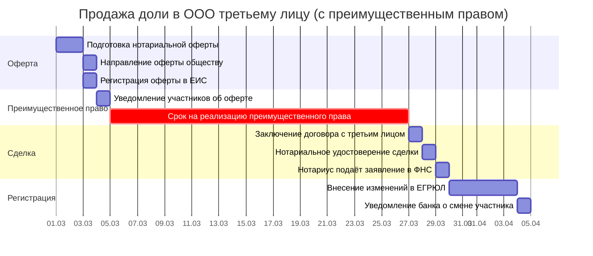
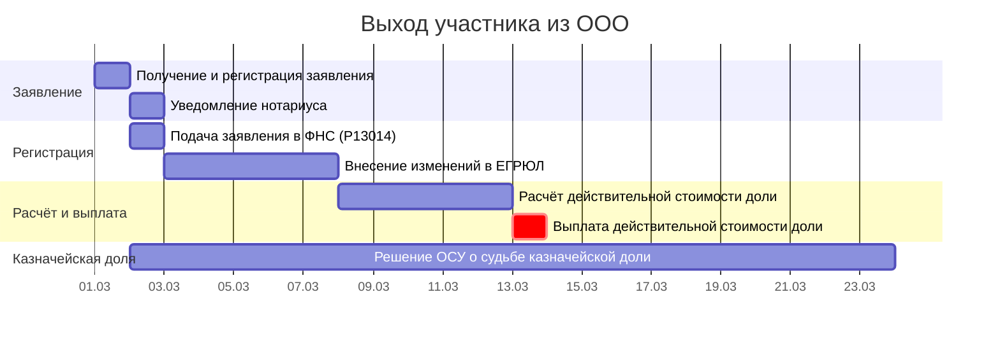
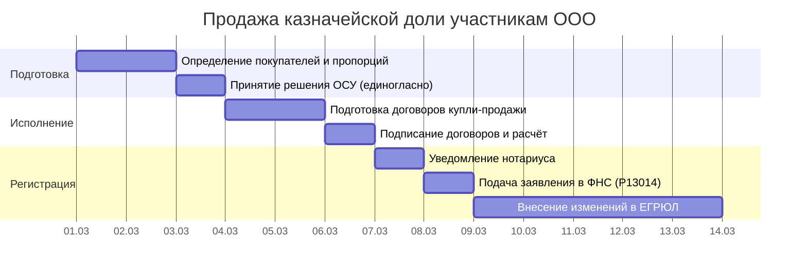

# Диаграмма Ганта и документооборот сделок с долями участников ООО

> Продолжение [бизнес-процесса «Покупка и продажа доли в ООО`](../business-processes/llc-share-purchase-sale.md). Здесь — таблицы для построения диаграммы Ганта и реестр документов.
>
> **О модели данных:** соглашения об ID, столбцах, вехах и фазах — в [описании модели данных](gantt-data-model.md).

---

## 1. Сценарий А: Продажа доли третьему лицу (с преимущественным правом)

**Критический путь:** О1 → О2 → О3 → Н1 → Р1 (≈35 раб. дн. + 30 кал.дн. ожидания).

> Преимущественное право покупки (ст. 21 14-ФЗ): продавец направляет нотариальную оферту обществу; участники имеют **30 календарных дней** (или иной срок по уставу) на реализацию преимущественного права. Если никто не покупает — доля продаётся третьему лицу на тех же условиях.

| ID | Задача | Исполнитель | Длит. | Начало | Конец | Предшественники | Примечание |
|----|--------|------------|-------------|--------|-------|-----------------|------------|
| **→ Фаза 1: Подготовка оферты** |
| О1 | Подготовка нотариально удостоверенной оферты о продаже доли | Продавец + нотариус | 2 раб. дн. | SS | SS + 1 | — | Нотариальное удостоверение обязательно (ст. 21 14-ФЗ). Содержание: размер доли, цена, условия продажи |
| О2 | Направление оферты обществу | Продавец | 1 раб. дн. | FS + 1 раб. дн. | FS + 1 | О1 | Направляется через общество (не напрямую участникам) |
| О3 | Регистрация оферты в ЕИС нотариата | Нотариус | 1 раб. дн. | FS + 1 раб. дн. | FS + 1 | О1 | Фиксация факта оферты |
| **▼ВР1** | **Оферта направлена** | — | — | FS | FS | О2 | **Фаза 1 завершена** |
| **→ Фаза 2: Реализация преимущественного права** |
| ПП1 | Уведомление участников об оферте | Гендиректор | 1 раб. дн. | FS + 1 раб. дн. | FS + 1 | ▼ВР1 | Направить всем участникам копию оферты |
| ⚡КВ1 | Срок реализации преимущественного права — дедлайн | — | — | Д+30 | Д+30 | — | Ст. 21 14-ФЗ: не менее 30 кал. дн. Устав может увеличить срок |
| ПП3 | Принятие решений участниками | Участники | — | — | FS | ПП1 | Участники направляют заявления о намерении купить долю |
| **▼ВР2** | **Преимущественное право реализовано** | — | — | FS | FS | ПП3 | **Фаза 2 завершена** |
| **→ Фаза 3: Продажа третьему лицу** |
| Н1 | Заключение договора купли-продажи доли с третьим лицом | Продавец + покупатель | 1 раб. дн. | FS + 1 раб. дн. | FS + 1 | ▼ВР2 | На тех же условиях, что и в оферте (цена, условия) |
| Н2 | Нотариальное удостоверение сделки | Нотариус | 1 раб. дн. | FS + 1 раб. дн. | FS + 1 | Н1 | Проверка: оплата доли, отсутствие арестов, согласие супруга |
| Н3 | Нотариус подаёт заявление в ФНС (ЕГРЮЛ) | Нотариус | 2 раб. дн. | FS + 1 раб. дн. | FS + Длит. раб. дн. | Н2 | В течение **2 раб. дн.** после удостоверения сделки |
| **▼ВР3** | **Сделка удостоверена** | — | — | FS | FS | Н3 | **Фаза 3 завершена** |
| **→ Фаза 4: Регистрация и завершение** |
| Р1 | Внесение изменений в ЕГРЮЛ | ФНС | 5 раб. дн. | FS + 1 раб. дн. | FS + Длит. раб. дн. | ▼ВР3 | **5 раб. дн.** (ст. 8 129-ФЗ) |
| Р2 | Уведомление банка о смене участника (если применимо) | Гендиректор | 1 раб. дн. | FS + 1 раб. дн. | FS + 1 | Р1 | При наличии банковского счёта |
| ⚡КВ1 | Срок преимущественного права — дедлайн | — | — | Д+22 | Д+22 | — | П. 6 ст. 21 14-ФЗ: 30 кал. дн. на реализацию преимущественного права |
| ⚡КВ2 | Нотариус направляет в ФНС — дедлайн | — | — | Д+26 | Д+26 | — | П. 13, 14 ст. 21 14-ФЗ: не более 2 раб. дн. после удостоверения сделки |
| ⚡КВ3 | ФНС вносит изменения — дедлайн | — | — | Д+30 | Д+30 | — | Ст. 8 129-ФЗ: не более 5 раб. дн. |
| **→ Вехи (сценарий А)** |
| ▼В1 | Оферта зарегистрирована | — | 0 раб. дн. | Д−2 | Д−2 | О3 | |
| ▼В2 | Срок преимущественного права истёк | — | 0 раб. дн. | Д+22 | Д+22 | ПП3 | |
| ▼В3 | Сделка удостоверена нотариусом | — | 0 раб. дн. | Д+24 | Д+24 | Н2 | |
| ▼В4 | ЕГРЮЛ обновлён | — | 0 раб. дн. | Д+30 | Д+30 | Р1 | |

> **Анализ:** Основное время — 30 календарных дней ожидания реализации преимущественного права. Сама сделка (нотариус + ФНС) занимает ~7 раб. дн. **Ключевой риск — отказ нотариуса из-за отсутствия согласия супруга** (если доля приобретена в браке).

---

## 2. Сценарий Б: Выход участника из ООО

**Критический путь:** З1 → З2 → Р1 (≈8 раб. дн. + 3 мес. на выплату).

> Участник вправе выйти из ООО, направив заявление о выходе (ст. 26 14-ФЗ). Доля переходит к ООО (казначейская). Общество обязано выплатить действительную стоимость доли в течение **3 месяцев** со дня получения заявления (если устав не предусматривает иной срок).

| ID | Задача | Исполнитель | Длит. | Начало | Конец | Предшественники | Примечание |
|----|--------|------------|-------------|--------|-------|-----------------|------------|
| **→ Фаза 1: Получение заявления** |
| З1 | Получение и регистрация заявления о выходе участника | Гендиректор | 1 раб. дн. | SS | SS | — | Нотариально удостоверенное заявление (ст. 26 14-ФЗ) |
| З2 | Уведомление нотариуса об изменении состава участников | Гендиректор | 1 раб. дн. | FS + 1 раб. дн. | FS + 1 | З1 | Нотариус обновляет реестр в ЕИС |
| **▼ВР1** | **Заявление о выходе получено** | — | — | FS | FS | З1 | **Фаза 1 завершена** |
| **→ Фаза 2: Регистрация в ЕГРЮЛ** |
| Р1 | Подача заявления в ФНС (форма Р13014) | Гендиректор | 1 раб. дн. | FS + 1 раб. дн. | FS + 1 | ▼ВР1 | **7 раб. дн.** после получения заявления (ст. 5 129-ФЗ) |
| Р2 | Внесение изменений в ЕГРЮЛ | ФНС | 5 раб. дн. | FS + 1 раб. дн. | FS + Длит. раб. дн. | Р1 | **5 раб. дн.** |
| **▼ВР2** | **ЕГРЮЛ обновлён** | — | — | FS | FS | Р2 | **Фаза 2 завершена** |
| **→ Фаза 3: Расчёт и выплата** |
| Р3 | Расчёт действительной стоимости доли | Бухгалтерия | 5 раб. дн. | FS + 1 раб. дн. | FS + Длит. раб. дн. | ▼ВР2 | По данным бухгалтерской отчётности (ст. 23 14-ФЗ) |
| Р4 | Выплата действительной стоимости доли | Финансовая служба | 1 раб. дн. | FS + 1 раб. дн. | FS + 1 | Р3 | В течение **3 месяцев** (≈65 раб. дн.) со дня получения заявления (ст. 26 14-ФЗ) |
| **▼ВР3** | **Доля выплачена** | — | — | FS | FS | Р4 | **Фаза 3 завершена** |
| **→ Фаза 4: Распоряжение казначейской долей** |
| КД1 | Решение ОСУ о судьбе казначейской доли | Участники | — | — | FS | ▼ВР3 | В течение **1 года**: продать, распределить или погасить (ст. 24 14-ФЗ) |
| ⚡КВ1 | Общество направляет заявление в ФНС — дедлайн | — | — | Д+1 | Д+1 | — | П. 2 ст. 26 14-ФЗ: не позднее 1 раб. дн. со дня передачи заявления обществу |
| ⚡КВ2 | ФНС вносит изменения — дедлайн | — | — | Д+6 | Д+6 | — | Ст. 8 129-ФЗ: не более 5 раб. дн. |
| ⚡КВ3 | Выплата действительной стоимости — дедлайн | — | — | Д+65 | Д+65 | — | П. 4 ст. 26 14-ФЗ: в течение 3 месяцев со дня получения заявления |
| ⚡КВ4 | Судьба казначейской доли — дедлайн | — | — | Д+365 | Д+365 | — | П. 1 ст. 24 14-ФЗ: в течение 1 года со дня перехода к обществу |
| **→ Вехи (сценарий Б)** |
| ▼В1 | Заявление о выходе получено | — | 0 раб. дн. | Д−1 | Д−1 | З1 | |
| ▼В2 | ЕГРЮЛ обновлён | — | 0 раб. дн. | Д+6 | Д+6 | Р2 | |
| ▼В3 | Доля выплачена | — | 0 раб. дн. | Д+12 | Д+12 | Р4 | |
| ▼В4 | Казначейская доля распределена | — | 0 раб. дн. | Д+365 | Д+365 | КД1 | |

---

## 3. Сценарий В: Казначейская доля — продажа участникам

**Критический путь:** Р1 → Р2 → Н1 → Н2 → Р3 (≈12 раб. дн.).

> Казначейская доля продаётся участникам ООО. Преимущественное право НЕ действует. Нотариальное удостоверение НЕ требуется. Решение — единогласное (ст. 24 14-ФЗ).

| ID | Задача | Исполнитель | Длит. | Начало | Конец | Предшественники | Примечание |
|----|--------|------------|-------------|--------|-------|-----------------|------------|
| **→ Фаза 1: Подготовка** |
| Р1 | Определение покупателей и пропорций | Гендиректор | 2 раб. дн. | SS | SS + 1 | — | Кому и в каких долях продаётся казначейская доля |
| Р2 | Принятие решения ОСУ (единогласно) | Участники | 1 раб. дн. | FS + 1 раб. дн. | FS + 1 | Р1 | Решение принимается единогласно (ст. 24 14-ФЗ) |
| **▼ВР1** | **Решение ОСУ принято** | — | — | FS | FS | Р2 | **Фаза 1 завершена** |
| **→ Фаза 2: Исполнение** |
| Н1 | Подготовка договоров купли-продажи | Гендиректор / юрист | 2 раб. дн. | FS + 1 раб. дн. | FS + Длит. раб. дн. | ▼ВР1 | Договоры с каждым покупателем |
| Н2 | Подписание договоров и расчёт | Гендиректор + покупатели | 1 раб. дн. | FS + 1 раб. дн. | FS + 1 | Н1 | Оплата — до или в момент подписания |
| **▼ВР2** | **Договоры подписаны** | — | — | FS | FS | Н2 | **Фаза 2 завершена** |
| **→ Фаза 3: Регистрация** |
| Р3 | Уведомление нотариуса об изменении состава участников | Гендиректор | 1 раб. дн. | FS + 1 раб. дн. | FS + 1 | ▼ВР2 | Нотариус обновляет реестр |
| Р4 | Подача заявления в ФНС (форма Р13014) | Гендиректор | 1 раб. дн. | FS + 1 раб. дн. | FS + 1 | Р3 | **7 раб. дн.** после изменения состава участников |
| Р5 | Внесение изменений в ЕГРЮЛ | ФНС | 5 раб. дн. | FS + 1 раб. дн. | FS + Длит. раб. дн. | Р4 | **5 раб. дн.** |
| ⚡КВ1 | ФНС вносит изменения — дедлайн | — | — | Д+9 | Д+9 | — | Ст. 8 129-ФЗ: не более 5 раб. дн. |
| **→ Вехи (сценарий В)** |
| ▼В1 | Решение ОСУ принято | — | 0 раб. дн. | Д−3 | Д−3 | Р2 | |
| ▼В2 | Договоры подписаны | — | 0 раб. дн. | Д+2 | Д+2 | Н2 | |
| ▼В3 | ЕГРЮЛ обновлён | — | 0 раб. дн. | Д+9 | Д+9 | Р5 | |

---

**Условные обозначения:**
- **О*** — оферта и преимущественное право
- **ПП*** — реализация преимущественного права
- **Н*** — нотариальное удостоверение сделки
- **З*** — выход участника
- **Р*** — регистрация в ЕГРЮЛ
- **КД*** — казначейская доля
- **▼В*** — вехи (нулевая длительность)

## 3.1. Диаграмма Ганта — Сценарий А: Продажа доли третьему лицу (Mermaid)

## 3.2. Диаграмма Ганта — Сценарий Б: Выход участника (Mermaid)

## 3.3. Диаграмма Ганта — Сценарий В: Продажа казначейской доли (Mermaid)

---

## 4. Документооборот

### 4.1. Задачи для СЭД — внутренние получатели

| Индекс | Задача Ганта | Документ | Отправитель | Получатель |
|--------|-------------|----------|-------------|------------|
| **С1** | Р2 | Решение ОСУ о продаже/распределении казначейской доли | Участники | Гендиректор (исполнение) |
| **С2** | Р1 | Заявление участника о выходе из ООО | Участник | Гендиректор (регистрация) |

### 4.2. Нотариальные документы

| Индекс | Задача Ганта | Что | Способ | Куда |
|--------|-------------|-----|--------|------|
| **З1** | О1 | Нотариально удостоверенная оферта о продаже доли | Нотариус | ЕИС нотариата → общество |
| **З2** | Н2 | Заявление о государственной регистрации перехода доли | Нотариус (автоматически) | ФНС (ЕГРЮЛ) — в течение 2 раб. дн. |

### 4.3. Сводная таблица уведомлений

| Индекс | Что | Кому | Крайний срок | Задача Ганта |
|--------|-----|------|-------------|-------------|
| **Р1** | Копия оферты | Все участники ООО | Одновременно с направлением оферты обществу | ПП1 |
| **Р2** | Уведомление о выходе участника | ФНС (через нотариуса / Р13014) | 7 раб. дн. после получения заявления | Р1 |

---

← [Бизнес-процесс: покупка/продажа доли](../business-processes/llc-share-purchase-sale.md) | [Дивиденды](dividend-distribution-gantt.md) | [Модель данных Ганта](gantt-data-model.md)
