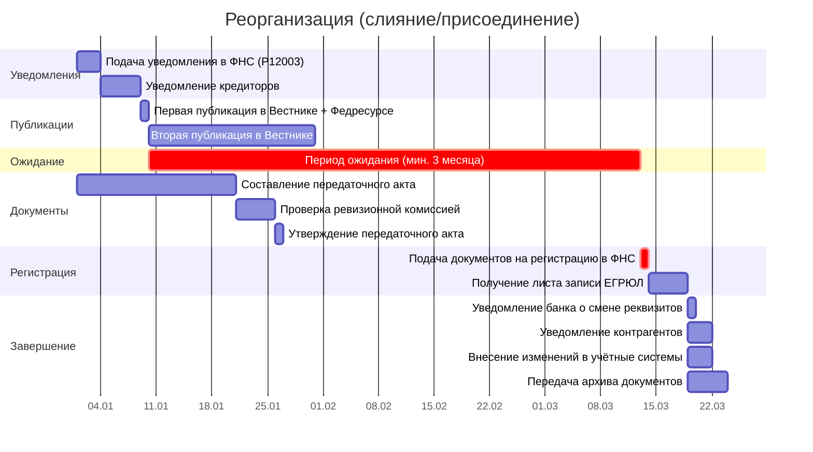
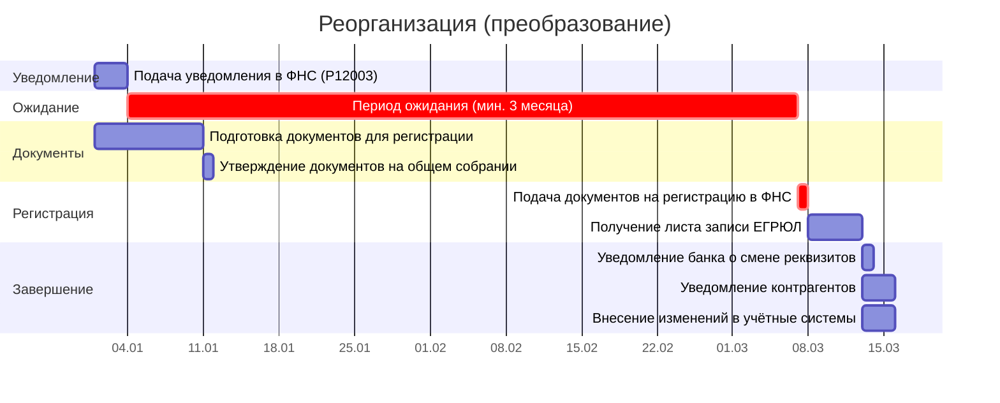

# Диаграмма Ганта и документооборот реорганизации

> Продолжение [контрольного списка задач по реорганизации](reorganization-checklist.md). Здесь — таблицы для построения диаграммы Ганта, реестр внутренних документов СЭД и сводка внешних рассылок.
>
> **Об исполнителях.** В таблицах указаны идеальные роли. На практике, если юрист отсутствует — его задачи выполняет **гендиректор или его заместитель**. Если бухгалтерия на аутсорсе — гендиректор координирует внешнего бухгалтера и контролирует сроки.
>
> **О модели данных:** соглашения об ID, столбцах, вехах и фазах — в [описании модели данных](gantt-data-model.md).

---

## 1. Таблица для диаграммы Ганта

Длительности указаны в рабочих днях (р.д.). Три сценария: слияние/присоединение, разделение/выделение, преобразование.

### Стартовое событие

**Принятие решения о реорганизации** — это стартовый сигнал для всех последующих задач. Решение оформляется протоколом общего собрания участников (акционеров) и является моментом отсчёта всех законодательных сроков. Для ООО решение должно быть **единогласным** (п. 7 ст. 37 14-ФЗ).

> Дата принятия решения = **День 0** на временно́й шкале всех сценариев.

### Сценарий А: Слияние / Присоединение

**Критический путь:** Ф1 → К1 → П1 → П2 → О1 → Д3 → РГ1 (≈105 р.д.).

> Минимальный срок — 3 месяца (≈65 р.д.). С учётом публикаций и подготовки документов — до 105 р.д.

| ID | Задача | Исполнитель | Длит. (р.д.) | Начало | Конец | Предшественники | Примечание |
|----|--------|------------|-------------|--------|-------|-----------------|------------|
| **→ Фаза 1: Уведомления (неделя 1)** |
| Ф1 | Подача уведомления в ФНС (форма Р12003) | Гендиректор | 3 | Д+1 | Д+3 | — | [С1](#c1). 3 рабочих дня после решения |
| К1 | Уведомление кредиторов | Гендиректор | 5 | Д+4 | Д+8 | Ф1 | [З1](#z1). 5 рабочих дней после ФНС |
| **→ Фаза 2: Публикации (недели 2-6)** |
| П1 | Первая публикация в «Вестнике» + Федресурсе | Гендиректор | 1 | Д+9 | Д+9 | К1 | [С2](#c2). Одновременно в обоих источниках |
| П2 | Вторая публикация в «Вестнике» | Гендиректор | 1 | Д+30 | Д+30 | П1 | Интервал ≥1 месяца между публикациями |
| **→ Фаза 3: Период ожидания (недели 2-14)** |
| О1 | Период ожидания (минимум 3 месяца) | — | 0 | Д+9 | Д+100 | П1 | Кредиторы могут требовать досрочного исполнения |
| **→ Фаза 4: Подготовка документов (недели 6-14)** |
| Д1 | Составление передаточного акта | Бухгалтерия | 20 | Д+1 | Д+20 | — | Параллельно с уведомлениями |
| Д2 | Проверка передаточного акта ревизионной комиссией | Ревизионная комиссия | 5 | Д+21 | Д+25 | Д1 | Если комиссия создана |
| Д3 | Утверждение передаточного акта на общем собрании | Участники | 1 | Д+26 | Д+26 | Д2 | Одновременно с окончанием ожидания |
| **→ Фаза 5: Регистрация (недели 14-16)** |
| РГ1 | Подача документов на регистрацию в ФНС | Гендиректор | 1 | Д+100 | Д+100 | О1, Д3 | [З2](#z2). Не ранее 3 месяцев с начала процедуры |
| РГ2 | Получение листа записи ЕГРЮЛ | Гендиректор | 5 | Д+101 | Д+105 | РГ1 | 5 рабочих дней |
| **→ Фаза 6: Завершение (недели 16-18)** |
| З1 | Уведомление банка о смене реквизитов | Гендиректор | 1 | Д+106 | Д+106 | РГ2 | При изменении реквизитов |
| З2 | Уведомление контрагентов | Гендиректор | 3 | Д+106 | Д+108 | РГ2 | [З3](#z3). Рассылка уведомлений |
| З3 | Внесение изменений в учётные системы | Бухгалтерия / IT | 3 | Д+106 | Д+108 | РГ2 | — |
| З4 | Передача архива документов правопреемнику | Гендиректор | 5 | Д+106 | Д+110 | РГ2 | — |
| **→ Вехи** |
| ▼В1 | Кредиторы уведомлены | — | 0 | Д+8 | Д+8 | К1 | |
| ▼В2 | Публикации завершены | — | 0 | Д+30 | Д+30 | П2 | |
| ▼В3 | 3 месяца истекли | — | 0 | Д+100 | Д+100 | О1 | |
| ▼В4 | Реорганизация завершена | — | 0 | Д+105 | Д+105 | РГ2 | |

> **Анализ:** Минимальный срок — 3 месяца (65 р.д.), но с учётом подготовки документов и регистрационных процедур — до 110 р.д. Критический путь: ожидание (3 мес.) блокирует подачу документов.

---

### Сценарий Б: Разделение / Выделение

**Критический путь:** Ф1 → К1 → П1 → П2 → О1 → Д3 → РГ1 (≈105 р.д.).

> Аналогично сценарию А, но вместо передаточного акта — разделительный баланс.

| ID | Задача | Исполнитель | Длит. (р.д.) | Начало | Конец | Предшественники | Примечание |
|----|--------|------------|-------------|--------|-------|-----------------|------------|
| **→ Фаза 1: Уведомления (неделя 1)** |
| Ф1 | Подача уведомления в ФНС (форма Р12003) | Гендиректор | 3 | Д+1 | Д+3 | — | [С1](#c1). 3 рабочих дня после решения |
| К1 | Уведомление кредиторов | Гендиректор | 5 | Д+4 | Д+8 | Ф1 | [З1](#z1). 5 рабочих дней после ФНС |
| **→ Фаза 2: Публикации (недели 2-6)** |
| П1 | Первая публикация в «Вестнике» + Федресурсе | Гендиректор | 1 | Д+9 | Д+9 | К1 | [С2](#c2). Одновременно в обоих источниках |
| П2 | Вторая публикация в «Вестнике» | Гендиректор | 1 | Д+30 | Д+30 | П1 | Интервал ≥1 месяца между публикациями |
| **→ Фаза 3: Период ожидания (недели 2-14)** |
| О1 | Период ожидания (минимум 3 месяца) | — | 0 | Д+9 | Д+100 | П1 | Кредиторы могут требовать досрочного исполнения |
| **→ Фаза 4: Подготовка документов (недели 6-14)** |
| Д1 | Составление разделительного баланса | Бухгалтерия | 20 | Д+1 | Д+20 | — | Параллельно с уведомлениями |
| Д2 | Проверка разделительного баланса ревизионной комиссией | Ревизионная комиссия | 5 | Д+21 | Д+25 | Д1 | Если комиссия создана |
| Д3 | Утверждение разделительного баланса на общем собрании | Участники | 1 | Д+26 | Д+26 | Д2 | Одновременно с окончанием ожидания |
| **→ Фаза 5: Регистрация (недели 14-16)** |
| РГ1 | Подача документов на регистрацию в ФНС | Гендиректор | 1 | Д+100 | Д+100 | О1, Д3 | [З2](#z2). Не ранее 3 месяцев с начала процедуры |
| РГ2 | Получение листа записи ЕГРЮЛ | Гендиректор | 5 | Д+101 | Д+105 | РГ1 | 5 рабочих дней |
| **→ Фаза 6: Завершение (недели 16-18)** |
| З1 | Уведомление банка о смене реквизитов | Гендиректор | 1 | Д+106 | Д+106 | РГ2 | При изменении реквизитов |
| З2 | Уведомление контрагентов | Гендиректор | 3 | Д+106 | Д+108 | РГ2 | [З3](#z3). Рассылка уведомлений |
| З3 | Внесение изменений в учётные системы | Бухгалтерия / IT | 3 | Д+106 | Д+108 | РГ2 | — |
| З4 | Передача архива документов правопреемникам | Гендиректор | 5 | Д+106 | Д+110 | РГ2 | Нескольким правопреемникам |
| **→ Вехи** |
| ▼В1 | Кредиторы уведомлены | — | 0 | Д+8 | Д+8 | К1 | |
| ▼В2 | Публикации завершены | — | 0 | Д+30 | Д+30 | П2 | |
| ▼В3 | 3 месяца истекли | — | 0 | Д+100 | Д+100 | О1 | |
| ▼В4 | Реорганизация завершена | — | 0 | Д+105 | Д+105 | РГ2 | |

---

### Сценарий В: Преобразование

**Критический путь:** Ф1 → О1 → Д2 → РГ1 (≈70 р.д.).

> Преобразование — **упрощённый порядок**: нет уведомления кредиторов, нет публикаций, нет обязательного передаточного акта. Минимальный срок — 3 месяца.

| ID | Задача | Исполнитель | Длит. (р.д.) | Начало | Конец | Предшественники | Примечание |
|----|--------|------------|-------------|--------|-------|-----------------|------------|
| **→ Фаза 1: Уведомление ФНС (неделя 1)** |
| Ф1 | Подача уведомления в ФНС (форма Р12003) | Гендиректор | 3 | Д+1 | Д+3 | — | [С1](#c1). 3 рабочих дня после решения |
| **→ Фаза 2: Период ожидания (недели 2-14)** |
| О1 | Период ожидания (минимум 3 месяца) | — | 0 | Д+4 | Д+65 | Ф1 | Кредиторы не уведомляются, публикаций нет |
| **→ Фаза 3: Подготовка документов (недели 2-10)** |
| Д1 | Подготовка документов для регистрации | Бухгалтерия / юрист | 10 | Д+1 | Д+10 | — | Без обязательного передаточного акта |
| Д2 | Утверждение документов на общем собрании | Участники | 1 | Д+11 | Д+11 | Д1 | — |
| **→ Фаза 4: Регистрация (недели 10-12)** |
| РГ1 | Подача документов на регистрацию в ФНС | Гендиректор | 1 | Д+65 | Д+65 | О1, Д2 | [З2](#z2). Не ранее 3 месяцев с начала процедуры |
| РГ2 | Получение листа записи ЕГРЮЛ | Гендиректор | 5 | Д+66 | Д+70 | РГ1 | 5 рабочих дней |
| **→ Фаза 5: Завершение (недели 12-14)** |
| З1 | Уведомление банка о смене реквизитов | Гендиректор | 1 | Д+71 | Д+71 | РГ2 | При изменении реквизитов |
| З2 | Уведомление контрагентов | Гендиректор | 3 | Д+71 | Д+73 | РГ2 | [З3](#z3). Рассылка уведомлений |
| З3 | Внесение изменений в учётные системы | Бухгалтерия / IT | 3 | Д+71 | Д+73 | РГ2 | — |
| **→ Вехи** |
| ▼В1 | 3 месяца истекли | — | 0 | Д+65 | Д+65 | О1 | |
| ▼В2 | Реорганизация завершена | — | 0 | Д+70 | Д+70 | РГ2 | |

> **Анализ:** Преобразование — самый быстрый вариант. Критический путь: только ожидание (3 мес.) + регистрация (5 р.д.). Итого ~70 р.д.

---

**Условные обозначения:**
- **Ф*** — взаимодействие с ФНС
- **К*** — уведомление кредиторов
- **П*** — публикации
- **О*** — ожидание
- **Д*** — подготовка документов
- **РГ*** — регистрация
- **З*** — завершение
- **▼В*** — вехи (нулевая длительность)
- ⚠️ — задача критического пути

## 1.1. Диаграмма Ганта — Сценарий А: Слияние/Присоединение (Mermaid)



## 1.2. Диаграмма Ганта — Сценарий В: Преобразование (Mermaid)



---

## 2. Документооборот и рассылки

### Список артефактов

| Индекс | Название | Тип | Куда направляется |
|--------|----------|-----|-------------------|
| **С1** | Уведомление о начале процедуры реорганизации (форма Р12003) | Внутренний | ФНС |
| **С2** | Текст уведомления для публикации | Внутренний | «Вестник» + Федресурс |
| **З1** | Уведомление кредиторов | Заказное письмо | Все известные кредиторы |
| **З2** | Пакет документов для регистрации | Лично / МФЦ / УКЭП | ФНС |
| **З3** | Уведомление контрагентов | Заказное письмо / email | Контрагенты |
| **Р1** | Уведомление о реорганизации | Рассылка | Все известные кредиторы |
| **Р2** | Уведомление о завершении реорганизации | Рассылка | Контрагенты |

### 2.1. Задачи для СЭД — внутренние получатели

Документы, проходящие через систему электронного документооборота: создание, согласование, подписание. **Получатель — сотрудник или орган внутри общества.**

| Индекс | Задача Ганта | Документ | Отправитель | Получатель |
|--------|-------------|----------|-------------|------------|
| <a id="c1"></a>**С1** | Ф1 | Уведомление о начале процедуры реорганизации (форма Р12003) | Гендиректор | ФНС |
| <a id="c2"></a>**С2** | П1 | Текст уведомления для публикации в «Вестнике» + Федресурсе | Гендиректор / юрист | Гендиректор (утверждение) |

### 2.2. Заказные письма и электронные отправления

Отправления, для которых важен **факт и дата отправки** — подтверждение соблюдения сроков уведомления.

> **О доставке.** «Заказное письмо» — только через **Почту России** (квитанция с трек-номером = доказательство в суде). Альтернативы: **вручение под роспись** или иной способ, **предусмотренный уставом**. Email без УКЭП суды не считают надлежащим уведомлением.

| Индекс | Задача Ганта | Что отправляется | Способ | Отправитель | Получатель |
|--------|-------------|-----------------|--------|-------------|------------|
| <a id="z1"></a>**З1** | К1 | Уведомление о реорганизации с требованием досрочного исполнения (при необходимости) | **Заказное письмо** | Гендиректор | Все известные кредиторы |
| <a id="z2"></a>**З2** | РГ1 | Пакет документов для регистрации (заявление, устав, передаточный акт/баланс, протоколы) | Лично в ФНС, через МФЦ, или **электронно с УКЭП** | Гендиректор | ФНС |
| <a id="z3"></a>**З3** | З2 | Уведомление контрагентов о реорганизации | Заказное письмо или email | Гендиректор | Контрагенты |

### 2.3. Сводная таблица рассылок

Уведомления и копии, направляемые кредиторам и контрагентам.

| Индекс | Что | Кому | Крайний срок | Задача Ганта |
|--------|-----|------|-------------|-------------|
| <a id="r1"></a>**Р1** | Уведомление о реорганизации | Все известные кредиторы | 5 рабочих дней после подачи в ФНС | К1 |
| <a id="r2"></a>**Р2** | Уведомление о завершении реорганизации | Контрагенты | Разумный срок после регистрации | З2 |

---

## 3. Временна́я шкала (линейная)

```
День 0 ──────────────────────────────────────────────────────────────── День 110+
  │                                                                      │
  │  День 0: Принятие решения                                            │
  │                                                                      │
  ├── Дни 1-3: Уведомление ФНС (форма Р12003)                          │
  │                                                                      │
  ├── Дни 4-8: Уведомление кредиторов (5 р.д.)                          │
  │                                                                      │
  ├── День 9: Первая публикация в «Вестнике» + Федресурсе              │
  │                                                                      │
  ├── День 30: Вторая публикация в «Вестнике» (интервал ≥1 мес.)       │
  │                                                                      │
  ├── Дни 9-100: Период ожидания (минимум 3 месяца)                     │
  │   │                                                                  │
  │   ├── Кредиторы могут требовать досрочного исполнения               │
  │   └─ Заинтересованные лица могут обжаловать решение в суде          │
  │                                                                      │
  ├── День 100: Подача документов на регистрацию                        │
  │                                                                      │
  ├── Дни 101-105: Регистрация в ФНС (5 р.д.)                          │
  │                                                                      │
  └── Дни 106-110: Завершение (уведомления, передача архива)            │
```

← [Назад к чеклисту](reorganization-checklist.md) | [Кредитные организации](reorganization-credit-gantt.md) | [Модель данных Ганта](gantt-data-model.md)
