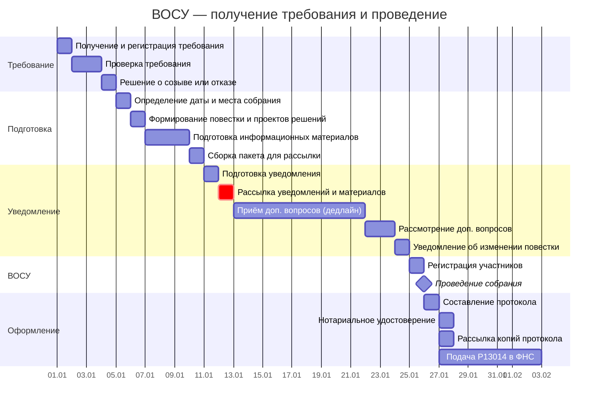

# Диаграмма Ганта и документооборот ВОСУ

> Продолжение [контрольного списка задач по подготовке ВОСУ](vosu-checklist.md). Здесь — таблицы для построения диаграммы Ганта, реестр внутренних документов и сводка внешних рассылок.
>
> **О модели данных:** соглашения об ID, столбцах, вехах и фазах — в [описании модели данных](gantt-data-model.md).

---

## 1. Таблица для диаграммы Ганта

Длительности указаны в рабочих днях (раб. дн.). Сценарий: требование поступает от участников ≥10%.

**Критический путь:** Т1 → Т2 → П1 → П2 → П3 → П4 → У1 → У2 → ОС2 (≈18 раб. дн. до рассылки + 30 кал.дн. уведомления). С учётом дедлайнов 45 дней — запас минимален.

> **Важно о единицах:** Длительности задач — в рабочих днях (раб. дн.). Законодательные дедлайны (30 дней уведомления, 15 дней доп. вопросы, 10 дней изменение повестки) — в **календарных днях** (п. 1, 2 ст. 36 14-ФЗ). Уведомление يجب направить не позднее 30 **календарных** дней до даты собрания. 30 кал.дн. ≈ 22 раб. дн. (с учётом выходных). Рассылка на Д+11 обеспечивает ≥30 кал.дн. до собрания на Д+35.

| ID | Задача | Исполнитель | Длит. | Начало | Конец | Предшественники | Примечание |
|----|--------|------------|-------------|--------|-------|-----------------|------------|
| **→ Фаза 1: Получение требования** |
| Т1 | Получение и регистрация требования | Гендиректор | 1 раб. дн. | SS | SS | — | [С1](#c1). Дата «Д» = дата получения требования |
| Т2 | Проверка требования (доля ≥10%, повестка) | Юрист / гендиректор | 2 раб. дн. | FS + 1 раб. дн. | FS + 2 | Т1 | [C2](#c2). Проверить реестр участников, доли |
| Т3 | Принятие решения о созыве или отказе | Гендиректор | 1 раб. дн. | FS + 1 раб. дн. | FS + 1 | Т2 | Дедлайн: 5 дней с даты требования |
| **▼ВР1** | **Требование рассмотрено** | — | — | FS | FS | Т3 | **Фаза 1 завершена** |
| **→ Фаза 2: Подготовка** |
| П1 | Определение даты и места собрания | Гендиректор | 1 раб. дн. | FS + 1 раб. дн. | FS + 1 | ▼ВР1 | Дата = Д + 35–40 дней (запас до 45) |
| П2 | Формирование повестки и проектов решений | Гендиректор (+ юрист) | 1 раб. дн. | FS + 1 раб. дн. | FS + 1 | П1 | [С3](#c3). С учётом требования инициатора. Сжато до 1 раб. дн. (повестка = вопрос из требования) |
| П3 | Подготовка информационных материалов | Бухгалтерия / юрист | 3 раб. дн. | FS + 1 раб. дн. | FS + 3 | П2 | Сжато до 3 раб. дн. |
| П4 | Сборка пакета для рассылки | Гендиректор | 1 раб. дн. | FS + 1 раб. дн. | FS + 1 | П3 | |
| **▼ВР2** | **Пакет готов к рассылке** | — | — | FS | FS | П4 | **Фаза 2 завершена** |
| **→ Фаза 3: Уведомление** |
| У1 | Подготовка уведомления о созыве | Гендиректор | 1 раб. дн. | FS + 1 раб. дн. | FS + 1 | ▼ВР2 | [З1](#z1), [Р1](#r1) |
| У2 | Рассылка уведомлений + материалов участникам | Гендиректор | 1 раб. дн. | FS + 1 раб. дн. | FS + 1 | У1 | Заказное письмо или по уставу. −30 **кал.** дней (≥22 раб. дн. до собрания) |
| У3 | Сохранение доказательств отправки | Гендиректор | — | FS + 1 раб. дн. | — | У2 | Квитанции, трек-номера |
| Д1 | Приём доп. вопросов от участников (дедлайн) | — | — | Д+20 | Д+20 | — | −15 **кал.** дней до собрания. Контрактная веха ⚡КВ3 |
| Д2 | Рассмотрение доп. вопросов, включение в повестку | Гендиректор | 2 раб. дн. | FS + 1 раб. дн. | FS + 2 | Д1 | |
| Д3 | Уведомление об изменении повестки | Гендиректор | 1 раб. дн. | FS + 1 раб. дн. | FS + 1 | Д2 | [З2](#z2), [Р2](#r2). −10 **кал.** дней до собрания |
| **▼ВР3** | **Уведомления разосланы** | — | — | FS | FS | У2 | **Фаза 3 завершена** |
| **→ Фаза 4: Проведение ВОСУ** |
| ОС1 | Регистрация участников, проверка полномочий | Секретарь | 1 раб. дн. | FS + 1 раб. дн. | FS + 1 | ▼ВР3 | |
| ОС2 | Проведение собрания: обсуждение, голосование, подсчёт | ОСУ | 1 раб. дн. | FS + 1 раб. дн. | FS + 1 раб. дн. | ОС1 | ⚠️ Не позднее 45 дней с даты требования |
| **▼ВР4** | **Собрание проведено** | — | — | FS | FS | ОС2 | **Фаза 4 завершена** |
| **→ Фаза 5: Оформление и регистрация** |
| ОС3 | Составление и подписание протокола ВОСУ | Секретарь / председатель | 1 раб. дн. | FS + 1 раб. дн. | FS + 1 | ▼ВР4 | [Р3](#r3). В течение 3 дней |
| ОС4 | Нотариальное удостоверение протокола | Гендиректор / юрист | 1 раб. дн. | FS + 1 раб. дн. | FS + 1 | ОС3 | Если не заменено уставом |
| ОС5 | Рассылка копий протокола участникам | Гендиректор | 1 раб. дн. | FS + 1 раб. дн. | FS + 1 | ОС3 | |
| ОС6 | Подача Р13014 в ФНС (при необходимости) | Гендиректор | 1 раб. дн. | FS + 1 раб. дн. | FS + 1 | ОС3 | [З3](#z3). 7 раб. дн. |
| **▼ВР5** | **Протокол оформлен и подписан** | — | — | FS | FS | ОС5 | **Фаза 5 завершена** |
| **→ Фаза 6: Завершение** |
| З1 | Фиксация результатов в системе | Секретарь | 1 раб. дн. | FS + 1 раб. дн. | FS + 1 | ▼ВР5 | |
| З2 | Организация хранения документов | Гендиректор | 1 раб. дн. | FS + 1 раб. дн. | FS + 1 | ▼ВР5 | |
| З3 | Организация исполнения решений | Гендиректор | 1 раб. дн. | FS + 1 раб. дн. | FS + 1 | ▼ВР5 | |
| ⚡КВ1 | Уведомление участников — дедлайн | — | — | Д+11 | Д+11 | — | Ст. 36 14-ФЗ: не позднее 30 кал. дн. до собрания |
| ⚡КВ2 | Подача Р13014 — дедлайн | — | — | Д+51 | Д+51 | — | Ст. 5 129-ФЗ: не более 7 раб. дн. после собрания |
| ⚡КВ3 | Приём доп. вопросов — дедлайн | — | — | Д+20 | Д+20 | — | Ст. 36 14-ФЗ: не позднее 15 кал. дн. до собрания |
| **→ Вехи** |
| ▼В1 | Требование получено и проверено | — | 0 раб. дн. | Д+2 | Д+2 | Т2 | |
| ▼В2 | Решение о созыве принято | — | 0 раб. дн. | Д+3 | Д+3 | Т3 | |
| ▼В3 | Уведомления разосланы | — | 0 раб. дн. | Д+11 | Д+11 | У2 | |
| ▼В4 | ВОСУ проведено | — | 0 раб. дн. | Д+35 | Д+35 | ОС2 | |

> **Анализ:** Критический путь — 18 раб. дн. до рассылки. Уведомление (У2) на Д+11 обеспечивает ≥30 календарных дней до собрания на Д+35 (ранний срок) или более при позднем собрании. **Ключевой риск — затягивание с проверкой требования (Т2).** При срочной повестке (смена директора) этапы П2–П4 могут быть сжаты до 1–2 дней. Общий предельный срок — 45 дней с даты требования (п. 2 ст. 35 14-ФЗ).

## 1.1. Диаграмма Ганта (Mermaid)

---

## 2. Документооборот и рассылки

### 2.1. Задачи для СЭД — внутренние получатели

| Индекс | Задача Ганта | Документ | Отправитель | Получатель |
|--------|-------------|----------|-------------|------------|
| **С1** | Т1 | Входящий № требования о созыве ВОСУ | Инициатор | Гендиректор |
| **С2** | Т2 | Служебная записка о результатах проверки требования | Юрист | Гендиректор |
| **С3** | П2 | Проект повестки и решений ВОСУ | Гендиректор (+ юрист) | Гендиректор (утверждение) |

### 2.2. Заказные письма и электронные отправления

| Индекс | Задача Ганта | Что отправляется | Способ | Отправитель | Получатель |
|--------|-------------|-----------------|--------|-------------|------------|
| **З1** | У2 | Уведомление о созыве ВОСУ + повестка + пакет материалов | **Заказное письмо** | Гендиректор | Все участники |
| **З2** | Д3 | Уведомление об изменении повестки + доп. материалы | **Заказное письмо** | Гендиректор | Все участники |
| **З3** | ОС6 | Заявление по форме Р13014 | Лично в ФНС, через МФЦ, или **электронно с УКЭП** | Гендиректор | ФНС |

### 2.3. Сводная таблица рассылок

| Индекс | Что | Кому | Крайний срок | Задача Ганта |
|--------|-----|------|-------------|-------------|
| **Р1** | Уведомление о созыве + повестка + материалы | Все участники | За 30 кал. дн. до ВОСУ | У2 |
| **Р2** | Уведомление об изменении повестки + доп. материалы | Все участники | За 10 кал. дн. до ВОСУ | Д3 |
| **Р3** | Копия протокола ВОСУ | Все участники | Разумный срок после собрания | ОС5 |

---

← [Назад к чеклисту](vosu-checklist.md) | [Статья о ВОСУ](vosu.md)