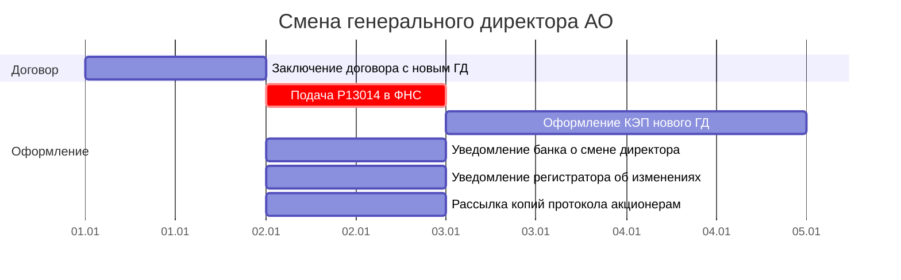

# Диаграмма Ганта: Смена генерального директора

> **Связанные документы:**
> - [Чеклист: смена генерального директора](../domain/director-change-checklist.md)
> - [Базовый сценарий ВОСА (40 дней)](vosa-gantt.md)
> - [Описание модели данных](gantt-data-model.md)

---

## 1. Таблица для диаграммы Ганта

План оформления смены генерального директора АО. Стартовое событие — утверждение нового ГД решением общего собрания акционеров (ОСА).

**Критический путь:** Д1 → ОС6 (≈8 кал. дн.).

---

> **Стартовый сигнал:** Новый генеральный директор утверждён решением ОСА — **День 0**.

### Фаза 1: Заключение договора с новым ГД

| ID | Задача | Исполнитель | Длит. | Начало | Конец | Предшественники | Примечание |
|----|--------|------------|------------|--------|-------|-----------------|------------|
| Д1 | Заключение трудового (гражданско-правового) договора с новым ГД | Совет директоров / новый ГД | 1 кал. дн. | SS | SS | — | Договор подписывается после утверждения ОСА. Копия — корп. секретарю |
| ▼В1 | Договор с новым ГД подписан | — | 0 кал. дн. | FS | FS | Д1 | — |

### Фаза 2: Оформление и уведомления

| ID | Задача | Исполнитель | Длит. | Начало | Конец | Предшественники | Примечание |
|----|--------|------------|------------|--------|-------|-----------------|------------|
| ОС6 | Подача заявления Р13014 в ФНС | Новый ГД / гендиректор | 1 кал. дн. | FS + 1 кал. дн. | FS + 1 | ▼В1 | Лично в ФНС, через МФЦ или электронно с УКЭП. ⚠️ Не позднее 7 раб. дн. после утверждения |
| КЭП1 | Оформление квалифицированной электронной подписи нового ГД | Новый ГД | 2 раб. дн. | FS + 1 раб. дн. | FS + 2 раб. дн. | ОС6 | Обращение в аккредитованный УЦ. Паспорт + СНИЛС. Выдача сертификата и ключевого носителя |
| ОС7 | Уведомление банка о смене директора | Новый ГД | 1 кал. дн. | FS + 1 кал. дн. | FS + 1 | ▼В1 | Смена карточки с образцами подписей. Параллельно с ОС6 |
| ОС8 | Уведомление регистратора об изменениях | Новый ГД | 1 кал. дн. | FS + 1 кал. дн. | FS + 1 | ▼В1 | Обновление сведений в реестре акционеров. Параллельно с ОС6 |
| ОС9 | Рассылка копий протокола ОСА акционерам | Корп. секретарь | 1 кал. дн. | FS + 1 кал. дн. | FS + 1 | ▼В1 | Копия протокола с решением о смене ГД. Параллельно с ОС6 |
| ▼ВР1 | Оформление смены завершено | — | 0 кал. дн. | FS | FS | КЭП1, ОС7, ОС8, ОС9 | Все уведомления отправлены, КЭП получена |

**→ Контрольные точки:**

| ID | Веха | Начало | Предшественники | Контроль | Примечание |
|----|------|--------|-----------------|----------|------------|
| ⚡КВ1 | Подача Р13014 — дедлайн | FS + 7 раб. дн. | — | ОС6 | Ст. 5 129-ФЗ: не более 7 раб. дн. после утверждения нового директора |

---

## 2. Диаграмма Ганта (Mermaid)

