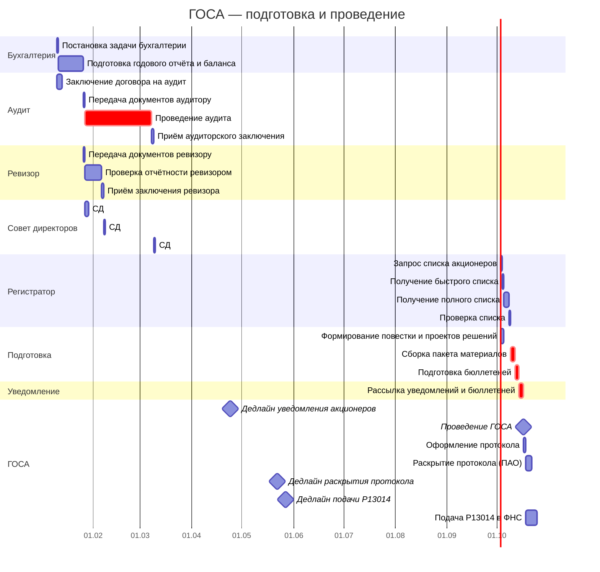

# Диаграмма Ганта и документооборот ГОСА

> Продолжение [контрольного списка задач по подготовке ГОСА](gosa-checklist.md). Здесь — таблица для построения диаграммы Ганта, реестр внутренних документов СЭД и сводка внешних рассылок.
>
> **Об исполнителях.** В таблицах указаны идеальные роли. На практике, если корп. секретарь или юрист отсутствуют — их задачи выполняет **гендиректор или его заместитель**. Регистратор — единственная роль, которую нельзя заменить: это лицензированный участник рынка ценных бумаг.
>
> **О модели данных:** соглашения об ID, столбцах, вехах и фазах — в [описании модели данных](gantt-data-model.md).

---

## 1. Таблица для диаграммы Ганта

Длительности указаны в рабочих днях (раб. дн.). Расчёт на **типичное ГОСА 15 мая** с аудитом. Для НАО без обязательного аудита — исключите задачи аудитора (А1–А4), ГОСА возможно раньше.

**Критический путь:** Б2 → А3 → А4 → П2 → П3 → ОС1 (≈51 раб. дн.). Без аудитора: Б2 → СД3 → РГ2 → РГ3 → П2 → П3 → ОС1 (≈28 раб. дн.).

### Фаза 1: Запуск и предложения акционеров (январь – февраль)

| ID | Задача | Исполнитель | Длит. | Начало | Конец | Предшественники | Примечание |
|----|--------|------------|-------------|--------|-------|-----------------|------------|
| Б1 | Постановка задачи бухгалтерии | Гендиректор | 1 раб. дн. | SS | SS | — | [С1](#c1) |
| Б2 | Подготовка годового отчёта и баланса | Бухгалтерия | 15 раб. дн. | FS + 1 раб. дн. | FS + Длит. раб. дн. | Б1 | [С2](#c2). Формирование с 01.01, активная фаза с 13.01 |
| АК1 | Приём предложений акционеров в повестку (дедлайн) | — | — | — | 31.01 | — | Акционеры с ≥2% голосующих акций. −30 дней после окончания года |
| СД1 | Заседание СД: рассмотрение предложений акционеров | Совет директоров | 2 раб. дн. | FS + 1 раб. дн. | FS + Длит. раб. дн. | АК1 | В течение 5 дней после дедлайна. Включить или мотивированно отказать ([ст. 53 208-ФЗ](../laws/article-53.md)) |

### Фаза 2: Проверка отчётности (февраль – апрель)

| ID | Задача | Исполнитель | Длит. | Начало | Конец | Предшественники | Примечание |
|----|--------|------------|-------------|--------|-------|-----------------|------------|
| Р1 | Передача документов ревизору | Гендиректор | 1 раб. дн. | FS + 1 раб. дн. | FS + 1 | Б2 | Параллельно с А2 |
| Р2 | Проверка отчётности ревизором | Ревизионная комиссия (ревизор) | 10 раб. дн. | FS + 1 раб. дн. | FS + Длит. раб. дн. | Р1 | Параллельно с А3 |
| Р3 | Приём заключения ревизора | Гендиректор | 1 раб. дн. | FS + 1 раб. дн. | FS + 1 | Р2 | Проверка полноты, подписей |
| А1 | Заключение договора на аудит | Гендиректор | 3 раб. дн. | 10.01 | 14.01 | — | Аудитор назначен на прошлом ГОСА. Параллельно с Б1. **Не путать с назначением аудитора на след. год — это делает ГОСА** |
| А2 | Передача документов аудитору | Гендиректор | 1 раб. дн. | FS + 1 раб. дн. | FS + 1 | Б2 | Параллельно с Р1 |
| А3 | Проведение аудита | Аудитор | 40 раб. дн. | FS + 1 раб. дн. | FS + Длит. раб. дн. | А2 | ⚠️ Критический путь. 8 недель — достаточно для окна в 4 месяца |
| А4 | Приём аудиторского заключения | Гендиректор | 1 раб. дн. | FS + 1 раб. дн. | FS + 1 | А3 | Проверка формы, подписей, даты |

| ▼ИН3 | Заключения ревизора и аудитора получены | — | — | FS | FS | А4, Р3 | Сходятся путь ревизора и путь аудитора |

### Фаза 3: Решение СД о созыве и подготовка списка (март – апрель)

| ID | Задача | Исполнитель | Длит. | Начало | Конец | Предшественники | Примечание |
|----|--------|------------|-------------|--------|-------|-----------------|------------|
| СД2 | Заседание СД: утверждение годового отчёта | Совет директоров | 1 раб. дн. | FS + 1 раб. дн. | FS + 1 | ▼ИН3 | Годовой отчёт предварительно утверждается СД перед ГОСА |
| СД3 | Заседание СД: решение о созыве ГОСА | Совет директоров | 1 раб. дн. | FS + 1 раб. дн. | FS + 1 | ▼ИН3 | Дата, повестка, форма, дата фиксации списка. После получения аудиторского заключения |
| РГ1 | Запрос списка акционеров у регистратора | Гендиректор / корп. секретарь | 1 раб. дн. | FS + 1 раб. дн. | FS + 1 | СД3 | На дату фиксации, определённую СД |
| РГ2 | Получение быстрого списка от регистратора | Регистратор | 1 раб. дн. | FS + 1 раб. дн. | FS + 1 | РГ1 | След. раб. дн. после запроса |
| РГ3 | Получение полного списка (с раскрытием номинальных) | Регистратор | 3 раб. дн. | FS + 1 раб. дн. | FS + Длит. раб. дн. | РГ2 | До 3 раб. дн. на раскрытие номинальных держателей. Для НАО без номинальных — совпадает с РГ2 |
| РГ4 | Проверка списка (валидация) | Гендиректор / корп. секретарь | 1 раб. дн. | FS + 1 раб. дн. | FS + 1 | РГ3 | Адреса, кворум, казначейские акции, паспорта |

| ▼ВР3 | Фаза 3 завершена | — | — | FS | FS | СД3 | Решение о созыве ГОСА принято |

### Фаза 4: Подготовка и уведомление (апрель – май)

| ID | Задача | Исполнитель | Длит. | Начало | Конец | Предшественники | Примечание |
|----|--------|------------|-------------|--------|-------|-----------------|------------|
| П1 | Формирование повестки и проектов решений | Совет директоров | 2 раб. дн. | FS + 1 раб. дн. | FS + 1 | СД3 | [С3](#c3). На основе предложений акционеров (СД1) и обязательных вопросов |
| ▼ИН1 | Список и повестка готовы | — | — | FS | FS | РГ4, П1 | Сходятся два критических пути |
| П2 | Сборка пакета материалов к ГОСА | Корп. секретарь / гендиректор | 3 раб. дн. | FS + 1 раб. дн. | FS + Длит. раб. дн. | ▼ИН1 | Годовой отчёт (утв. СД), баланс, заключения, сведения о кандидатах, рекомендации СД по дивидендам, бюллетени |
| П3 | Подготовка бюллетеней для голосования | Корп. секретарь / гендиректор | 2 раб. дн. | FS + 1 раб. дн. | FS + Длит. раб. дн. | П2 | [С4](#c4). Для >500 акционеров — обязательно. Кумулятивное голосование в СД |
| ▼ИН2 | Бюллетени и список готовы | — | — | FS | FS | РГ4, П3 | Сходятся путь списка и путь бюллетеней |
| П4 | Рассылка уведомлений и бюллетеней акционерам | Регистратор | 3 раб. дн. | FS + 1 раб. дн. | FS + Длит. раб. дн. | ▼ИН2 | [З1](#z1), [Р1](#r1). −21 кал. дн. до ГОСА |
| П5 | Доступ к материалам для акционеров | — | — | FS + 1 раб. дн. | — | П4 | [Р2](#r2). За 20 кал. дн. до ГОСА |
| Н1 | Запрос выписки из ЕИС у нотариуса | Юрист / гендиректор | 1 раб. дн. | FS + 1 раб. дн. | FS + 1 | РГ4 | [З2](#z2). До уведомления акционеров. Для ООО-аналога — здесь список участников из ЕИС |
| П6 | Уведомление нотариуса о собрании | Юрист / корп. секретарь | 1 раб. дн. | FS + 1 раб. дн. | FS + 1 | П1 | [З3](#z3). Минимум за 7–10 раб. дн. до ГОСА |
| Д1 | Уведомление об изменении повестки (если есть доп. вопросы) | Гендиректор | 1 раб. дн. | FS + 1 раб. дн. | FS + 1 | — | [З4](#z4), [Р3](#r3). −10 кал. дн. до ГОСА |

| ▼ВР4 | Фаза 4 завершена | — | — | FS | FS | П4 | Уведомления разосланы, материалы доступны |

### Фаза 5: ГОСА и завершение (май – июнь)

| ID | Задача | Исполнитель | Длит. | Начало | Конец | Предшественники | Примечание |
|----|--------|------------|-------------|--------|-------|-----------------|------------|
| ОС1 | Проведение ГОСА | ОСА | 1 раб. дн. | FS + 1 раб. дн. | FS + 1 | ▼ВР4 | Избрание СД (кумулятивное), ревизора, назначение аудитора на след. год, утверждение отчётности, дивиденды |
| ОС2 | Оформление протокола ГОСА | Корп. секретарь / гендиректор | 1 раб. дн. | FS + 1 раб. дн. | FS + 1 | ОС1 | [Р4](#r4) |
| ОС3 | Раскрытие протокола (ПАО) | Корп. секретарь | 1 раб. дн. | FS + 1 раб. дн. | FS + 1 | ОС2 | В течение 4 раб. дн. — лента новостей (Интерфакс). Только для ПАО |
| ОС4 | Подача Р13014 в ФНС | Гендиректор | 1 раб. дн. | FS + 1 раб. дн. | FS + 1 | ОС2 | [З5](#z5). В течение 7 раб. дн. **Только при смене директора/устава.** Если вопрос не на повестке — пропустить |
| ОС5 | Уведомление банка о смене директора | Гендиректор | 1 раб. дн. | FS + 1 раб. дн. | FS + 1 | ОС1 | **Только при смене директора.** Незамедлительно |
| ОС6 | Уведомление регистратора об изменениях | Гендиректор | 1 раб. дн. | FS + 1 раб. дн. | FS + 1 | ОС1 | **Только при изменениях в составе СД/смене директора** |

**→ Контрольные точки:**

### Межэтапные вехи (▼ВР\*)

| ID | Веха | Предшественник | Дата |
|----|------|----------------|------|
| ▼ВР1 | Фаза 1 завершена | СД1 | FS |
| ▼ВР3 | Фаза 3 завершена | СД3 | FS |
| ▼ВР4 | Фаза 4 завершена | П4 | FS |

### Юридические вехи (⚡ЮВ\*)

| ID | Веха | Начало | Предшественник | Контроль | Примечание |
|----|------|--------|----------------|----------|------------|
| ⚡ЮВ1 | Уведомление акционеров — дедлайн | FS + 21 кал. дн. | П4 | П4 | Не позднее 21 кал. дн. до ГОСА (ст. 52 208-ФЗ) |
| ⚡ЮВ2 | Раскрытие протокола — дедлайн (ПАО) | FS + 4 раб. дн. | ОС1 | ОС3 | Не позднее 4 раб. дн. после ГОСА (ЦБ №714-П) |
| ⚡ЮВ3 | Подача Р13014 — дедлайн | FS + 7 раб. дн. | ОС1 | ОС4 | Не более 7 раб. дн. после заседания (ст. 5 129-ФЗ) |

### Обычные вехи (▼В\*)

| ID | Веха | Дата |
|----|------|------|
| ▼В1 | Отчётность готова | FS |
| ▼В2 | Заключения получены (оба) | FS |
| ▼В3 | Решение СД о созыве принято | FS |
| ▼В4 | Список акционеров проверен | FS |
| ▼В5 | Уведомления разосланы | FS |
| ▼В6 | ГОСА проведено | FS |

---

**Условные обозначения:**
- **Б*** — задачи бухгалтерии
- **СД*** — задачи совета директоров
- **АК*** — задачи по предложениям акционеров
- **Р*** — задачи ревизионной комиссии (ревизора)
- **А*** — задачи аудитора
- **РГ*** — задачи регистратора
- **П*** — задачи подготовки к собранию
- **Д*** — задачи по дополнительным вопросам
- **Н*** — задачи по нотариусу
- **ОС*** — задачи ГОСА и завершения
- **▼В\***, **▼ВР\*** — вехи и межэтапные вехи
- **▼ИН\*** — интеграционные вехи
- **⚡ЮВ\*** — юридические вехи (дедлайны по закону)
- ⚠️ — задача критического пути

## 1.1. Диаграмма Ганта (Mermaid)

---

## 2. Документооборот и рассылки

### 2.1. Задачи для СЭД — внутренние получатели

| Индекс | Задача Ганта | Документ | Отправитель | Получатель |
|--------|-------------|----------|-------------|------------|
| **С1** | Б1 | Приказ/поручение о подготовке годовой отчётности | Гендиректор | Бухгалтерия |
| **С2** | Б2 | Годовой отчёт и баланс (проект на подпись) | Бухгалтерия | Гендиректор |
| **С3** | П1 | Проект повестки ГОСА + проекты решений | Совет директоров | Корп. секретарь / гендиректор |
| **С4** | П3 | Бюллетени для голосования (проект) | Корп. секретарь | Совет директоров (утверждение) |

### 2.2. Заказные письма и электронные отправления с УКЭП

> **О доставке.** «Заказное письмо» — только через **Почту России** (квитанция с трек-номером = доказательство в суде). Для ГОСА ([ст. 52 208-ФЗ](../laws/article-52.md)): общество с **>500 акционеров — только заказное письмо**, без альтернатив. Для меньших — допускается вручение под роспись. Email без УКЭП суды не считают надлежащим уведомлением.

| Индекс | Задача Ганта | Что отправляется | Способ | Отправитель | Получатель |
|--------|-------------|-----------------|--------|-------------|------------|
| **З1** | П4 | Уведомление о созыве ГОСА + бюллетени | **Заказное письмо** (для >500 акц. — обязательно) | Регистратор | Все акционеры |
| **З2** | Н1 | Запрос выписки из реестра списков участников ЕИС | Заказное письмо или лично | Юрист / гендиректор | Нотариус |
| **З3** | П6 | Уведомление о дате/времени/месте собрания | **Заказное письмо** | Юрист / корп. секретарь | Нотариус |
| **З4** | Д1 | Уведомление об изменении повестки + доп. материалы | **Заказное письмо** | Гендиректор | Все акционеры |
| **З5** | ОС4 | Заявление по форме Р13014 | Лично в ФНС, через МФЦ, или **электронно с УКЭП** | Гендиректор | ФНС |

### 2.3. Сводная таблица рассылок

| Индекс | Что | Кому | Крайний срок | Задача Ганта |
|--------|-----|------|-------------|-------------|
| **Р1** | Уведомление о созыве ГОСА + бюллетени | Все акционеры | За 21 кал. дн. до ГОСА | П4 |
| **Р2** | Пакет материалов к ГОСА (годовой отчёт, баланс, заключения, сведения о кандидатах, рекомендации СД) | Все акционеры | За 20 кал. дн. до ГОСА (доступ) | П5 |
| **Р3** | Уведомление об изменении повестки + доп. материалы | Все акционеры | За 10 кал. дн. до ГОСА | Д1 |
| **Р4** | Копия протокола ГОСА | Все акционеры | Разумный срок после собрания | ОС2 |

