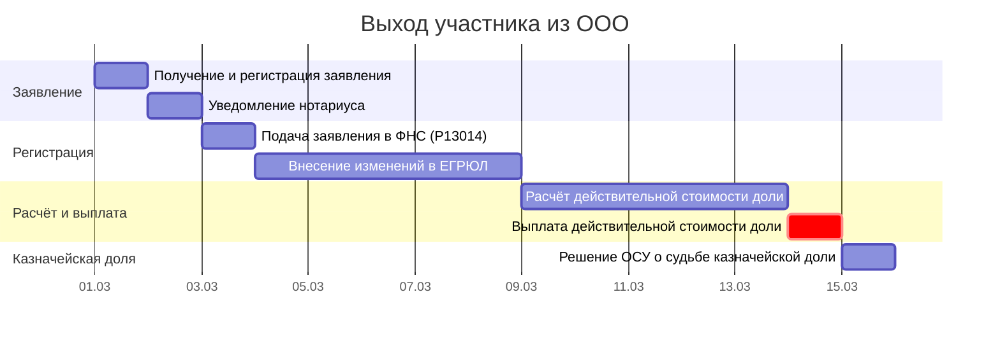

# Диаграмма Ганта: выход участника из ООО

> Продолжение [бизнес-процесса «Покупка и продажа доли в ООО`](../business-processes/llc/llc-share-purchase-sale.md). Сценарий Б.
>
> **О модели данных:** соглашения об ID, столбцах, вехах и фазах — в [описании модели данных](gantt-data-model.md).

**Критический путь:** З1 → З2 → Р1 (≈8 раб. дн. + 3 мес. на выплату).

> Участник вправе выйти из ООО, направив заявление о выходе (ст. 26 14-ФЗ). Доля переходит к ООО (казначейская). Общество обязано выплатить действительную стоимость доли в течение **3 месяцев** со дня получения заявления (если устав не предусматривает иной срок).

> **Стартовый сигнал:** Заявление участника о выходе из ООО поступило обществу — **День 0**.

| ID | Задача | Исполнитель | Длит. | Начало | Конец | Предшественники | Примечание |
|----|--------|------------|-------|--------|-------|-----------------|------------|
| **→ Фаза 1: Получение заявления** |
| З1 | Получение и регистрация заявления о выходе участника | Гендиректор | 1 раб. дн. | SS | SS | — | Нотариально удостоверенное заявление (ст. 26 14-ФЗ) |
| З2 | Уведомление нотариуса об изменении состава участников | Гендиректор | 1 раб. дн. | FS + 1 раб. дн. | FS + 1 | З1 | Нотариус обновляет реестр в ЕИС |
| **→ Фаза 2: Регистрация в ЕГРЮЛ** |
| Р1 | Подача заявления в ФНС (форма Р13014) | Гендиректор | 1 раб. дн. | FS + 1 раб. дн. | FS + 1 | З2 | **7 раб. дн.** после получения заявления (ст. 5 129-ФЗ) |
| Р2 | Внесение изменений в ЕГРЮЛ | ФНС | 5 раб. дн. | FS + 1 раб. дн. | FS + 5 | Р1 | **5 раб. дн.** |
| **→ Фаза 3: Расчёт и выплата** |
| Р3 | Расчёт действительной стоимости доли | Бухгалтерия | 5 раб. дн. | FS + 1 раб. дн. | FS + 5 | Р2 | По данным бухгалтерской отчётности (ст. 23 14-ФЗ) |
| Р4 | Выплата действительной стоимости доли | Финансовая служба | 1 раб. дн. | FS + 1 раб. дн. | FS + 1 | Р3 | В течение **3 месяцев** (≈65 раб. дн.) со дня получения заявления (ст. 26 14-ФЗ) |
| **→ Фаза 4: Распоряжение казначейской долей** |
| КД1 | Решение ОСУ о судьбе казначейской доли | Участники | 0 раб. дн. | FS | FS | Р4 | В течение **1 года**: продать, распределить или погасить (ст. 24 14-ФЗ) |
| ▼В1 | Заявление о выходе получено | — | 0 раб. дн. | FS | FS | З1 | |
| ▼В2 | ЕГРЮЛ обновлён | — | 0 раб. дн. | FS | FS | Р2 | |
| ▼В3 | Доля выплачена | — | 0 раб. дн. | FS | FS | Р4 | |
| ▼В4 | Казначейская доля распределена | — | 0 раб. дн. | FS | FS | КД1 | |

> **Анализ:** Основное время — 3 месяца на выплату действительной стоимости доли. Регистрация в ЕГРЮЛ занимает ~7 раб. дн. **Ключевой риск — превышение срока выплаты** (ст. 26 14-ФЗ: 3 месяца).

### Контрольные точки

| ID | Веха | Начало | Предшественники | Контроль | Примечание |
|----|------|--------|-----------------|----------|------------|
| ▼ВР1 | Заявление о выходе получено | FS | З1 | З1 | Фаза 1 завершена |
| ▼ВР2 | ЕГРЮЛ обновлён | FS | Р2 | Р2 | Фаза 2 завершена |
| ▼ВР3 | Доля выплачена | FS | Р4 | Р4 | Фаза 3 завершена |
| ⚡ЮВ1 | Общество направляет заявление в ФНС — дедлайн | FS + 1 раб. дн. | З1 | Р1 | П. 2 ст. 26 14-ФЗ: не позднее 1 раб. дн. со дня передачи заявления обществу |
| ⚡ЮВ2 | ФНС вносит изменения — дедлайн | FS + 5 раб. дн. | Р1 | Р2 | Ст. 8 129-ФЗ: не более 5 раб. дн. |
| ⚡ЮВ3 | Выплата действительной стоимости — дедлайн | FS + 3 мес. | З1 | Р4 | П. 4 ст. 26 14-ФЗ: в течение 3 месяцев со дня получения заявления |
| ⚡ЮВ4 | Судьба казначейской доли — дедлайн | FS + 1 год | Р4 | КД1 | П. 1 ст. 24 14-ФЗ: в течение 1 года со дня перехода к обществу |

### Диаграмма Ганта (Mermaid)

### Документооборот

| Индекс | Задача Ганта | Документ | Отправитель | Получатель |
|--------|-------------|----------|-------------|------------|
| С2 | З1 | Заявление участника о выходе из ООО | Участник | Гендиректор (регистрация) |
| Р2 | Р1 | Уведомление о выходе участника | Гендиректор | ФНС (через нотариуса / Р13014) |
