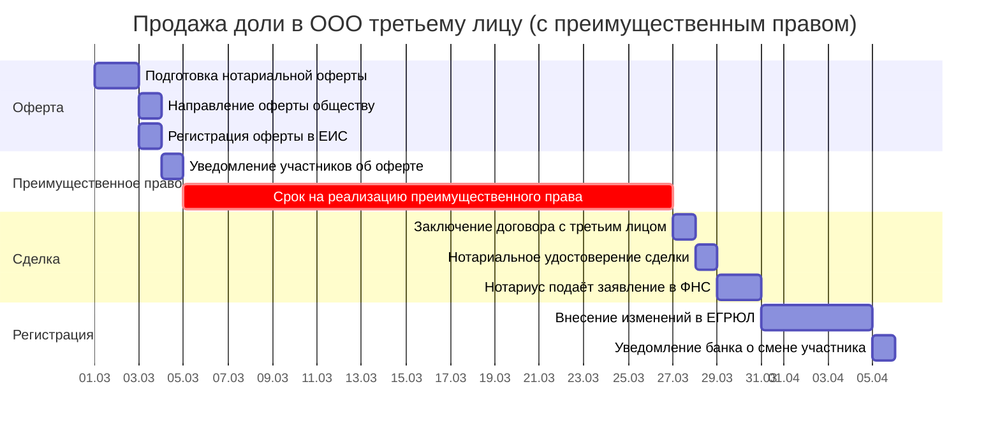

# Диаграмма Ганта: продажа доли в ООО третьему лицу

> Продолжение [бизнес-процесса «Покупка и продажа доли в ООО`](../business-processes/llc-share-purchase-sale.md). Сценарий А.
>
> **О модели данных:** соглашения об ID, столбцах, вехах и фазах — в [описании модели данных](gantt-data-model.md).

**Критический путь:** О1 → О2 → О3 → Н1 → Р1 (≈35 раб. дн. + 30 кал.дн. ожидания).

> Преимущественное право покупки (ст. 21 14-ФЗ): продавец направляет нотариальную оферту обществу; участники имеют **30 календарных дней** (или иной срок по уставу) на реализацию преимущественного права. Если никто не покупает — доля продаётся третьему лицу на тех же условиях.

> **Стартовый сигнал:** Решение о продаже доли третьему лицу принято, продавец готов к нотариальному удостоверению оферты — **День 0**.

| ID | Задача | Исполнитель | Длит. | Начало | Конец | Предшественники | Примечание |
|----|--------|------------|-------|--------|-------|-----------------|------------|
| **→ Фаза 1: Подготовка оферты** |
| О1 | Подготовка нотариально удостоверенной оферты о продаже доли | Продавец + нотариус | 2 раб. дн. | SS | SS + 1 | — | Нотариальное удостоверение обязательно (ст. 21 14-ФЗ). Содержание: размер доли, цена, условия продажи |
| О2 | Направление оферты обществу | Продавец | 1 раб. дн. | FS + 1 раб. дн. | FS + 1 | О1 | Направляется через общество (не напрямую участникам) |
| О3 | Регистрация оферты в ЕИС нотариата | Нотариус | 1 раб. дн. | FS + 1 раб. дн. | FS + 1 | О1 | Фиксация факта оферты |
| **→ Фаза 2: Реализация преимущественного права** |
| ПП1 | Уведомление участников об оферте | Гендиректор | 1 раб. дн. | FS + 1 раб. дн. | FS + 1 | О2, О3 | Направить всем участникам копию оферты |
| ПП2 | Срок реализации преимущественного права (ожидание) | Участники | 30 кал. дн. | FS | FS + 29 кал. дн. | ПП1 | Ст. 21 14-ФЗ: не менее 30 кал. дн. Устав может увеличить срок |
| ПП3 | Принятие решений участниками | Участники | 0 раб. дн. | FS | FS | ПП2 | Участники направляют заявления о намерении купить долю |
| **→ Фаза 3: Продажа третьему лицу** |
| Н1 | Заключение договора купли-продажи доли с третьим лицом | Продавец + покупатель | 1 раб. дн. | FS + 1 раб. дн. | FS + 1 | ПП3 | На тех же условиях, что и в оферте (цена, условия) |
| Н2 | Нотариальное удостоверение сделки | Нотариус | 1 раб. дн. | FS + 1 раб. дн. | FS + 1 | Н1 | Проверка: оплата доли, отсутствие арестов, согласие супруга |
| Н3 | Нотариус подаёт заявление в ФНС (ЕГРЮЛ) | Нотариус | 2 раб. дн. | FS + 1 раб. дн. | FS + 2 | Н2 | В течение **2 раб. дн.** после удостоверения сделки |
| **→ Фаза 4: Регистрация и завершение** |
| Р1 | Внесение изменений в ЕГРЮЛ | ФНС | 5 раб. дн. | FS + 1 раб. дн. | FS + 5 | Н3 | **5 раб. дн.** (ст. 8 129-ФЗ) |
| Р2 | Уведомление банка о смене участника (если применимо) | Гендиректор | 1 раб. дн. | FS + 1 раб. дн. | FS + 1 | Р1 | При наличии банковского счёта |
| ▼В1 | Оферта зарегистрирована | — | 0 раб. дн. | FS | FS | О3 | |
| ▼В2 | Срок преимущественного права истёк | — | 0 раб. дн. | FS | FS | ПП2 | |
| ▼В3 | Сделка удостоверена нотариусом | — | 0 раб. дн. | FS | FS | Н2 | |
| ▼В4 | ЕГРЮЛ обновлён | — | 0 раб. дн. | FS | FS | Р1 | |

> **Анализ:** Основное время — 30 календарных дней ожидания реализации преимущественного права. Сама сделка (нотариус + ФНС) занимает ~7 раб. дн. **Ключевой риск — отказ нотариуса из-за отсутствия согласия супруга** (если доля приобретена в браке).

### Контрольные точки

| ID | Веха | Начало | Предшественники | Контроль | Примечание |
|----|------|--------|-----------------|----------|------------|
| ▼ВР1 | Оферта направлена | FS | О2, О3 | О3 | Фаза 1 завершена |
| ▼ВР2 | Преимущественное право реализовано | FS | ПП3 | ПП3 | Фаза 2 завершена |
| ▼ВР3 | Сделка удостоверена | FS | Н3 | Н3 | Фаза 3 завершена |
| ▼ВР4 | ЕГРЮЛ обновлён | FS | Р1 | Р1 | Фаза 4 завершена |
| ⚡ЮВ1 | Срок преимущественного права — дедлайн | FS | ПП1 | ПП2 | П. 6 ст. 21 14-ФЗ: 30 кал. дн. на реализацию преимущественного права |
| ⚡ЮВ2 | Нотариус направляет в ФНС — дедлайн | FS + 2 раб. дн. | Н2 | Н3 | П. 13, 14 ст. 21 14-ФЗ: не более 2 раб. дн. после удостоверения сделки |
| ⚡ЮВ3 | ФНС вносит изменения — дедлайн | FS + 5 раб. дн. | Н3 | Р1 | Ст. 8 129-ФЗ: не более 5 раб. дн. |

### Диаграмма Ганта (Mermaid)

### Документооборот

| Индекс | Задача Ганта | Документ | Способ | Куда |
|--------|-------------|----------|--------|------|
| З1 | О1 | Нотариально удостоверенная оферта о продаже доли | Нотариус | ЕИС нотариата → общество |
| З2 | Н2 | Заявление о государственной регистрации перехода доли | Нотариус (автоматически) | ФНС (ЕГРЮЛ) — в течение 2 раб. дн. |
| Р1 | ПП1 | Копия оферты | Гендиректор | Все участники ООО |
