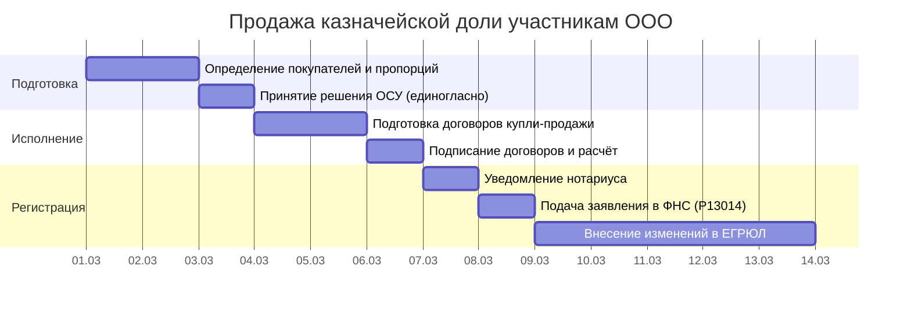

# Диаграмма Ганта: продажа казначейской доли участникам ООО

> Продолжение [бизнес-процесса «Покупка и продажа доли в ООО`](../business-processes/llc/llc-share-purchase-sale.md). Сценарий В.
>
> **О модели данных:** соглашения об ID, столбцах, вехах и фазах — в [описании модели данных](gantt-data-model.md).

**Критический путь:** Р1 → Р2 → Н1 → Н2 → Р3 (≈12 раб. дн.).

> Казначейская доля продаётся участникам ООО. Преимущественное право НЕ действует. Нотариальное удостоверение НЕ требуется. Решение — единогласное (ст. 24 14-ФЗ).

> **Стартовый сигнал:** Решение о продаже казначейской доли принято, покупатели определены — **День 0**.

| ID | Задача | Исполнитель | Длит. | Начало | Конец | Предшественники | Примечание |
|----|--------|------------|-------|--------|-------|-----------------|------------|
| **→ Фаза 1: Подготовка** |
| Р1 | Определение покупателей и пропорций | Гендиректор | 2 раб. дн. | SS | SS + 1 | — | Кому и в каких долях продаётся казначейская доля |
| Р2 | Принятие решения ОСУ (единогласно) | Участники | 1 раб. дн. | FS + 1 раб. дн. | FS + 1 | Р1 | Решение принимается единогласно (ст. 24 14-ФЗ) |
| **→ Фаза 2: Исполнение** |
| Н1 | Подготовка договоров купли-продажи | Гендиректор / юрист | 2 раб. дн. | FS + 1 раб. дн. | FS + 2 | Р2 | Договоры с каждым покупателем |
| Н2 | Подписание договоров и расчёт | Гендиректор + покупатели | 1 раб. дн. | FS + 1 раб. дн. | FS + 1 | Н1 | Оплата — до или в момент подписания |
| **→ Фаза 3: Регистрация** |
| Р3 | Уведомление нотариуса об изменении состава участников | Гендиректор | 1 раб. дн. | FS + 1 раб. дн. | FS + 1 | Н2 | Нотариус обновляет реестр |
| Р4 | Подача заявления в ФНС (форма Р13014) | Гендиректор | 1 раб. дн. | FS + 1 раб. дн. | FS + 1 | Р3 | **7 раб. дн.** после изменения состава участников |
| Р5 | Внесение изменений в ЕГРЮЛ | ФНС | 5 раб. дн. | FS + 1 раб. дн. | FS + 5 | Р4 | **5 раб. дн.** |
| ▼В1 | Решение ОСУ принято | — | 0 раб. дн. | FS | FS | Р2 | |
| ▼В2 | Договоры подписаны | — | 0 раб. дн. | FS | FS | Н2 | |
| ▼В3 | ЕГРЮЛ обновлён | — | 0 раб. дн. | FS | FS | Р5 | |

> **Анализ:** Продажа казначейской доли — самый быстрый сценарий (~12 раб. дн.). Преимущественное право участников не действует, нотариальное удостоверение не требуется. **Ключевой риск — единогласие участников** (ст. 24 14-ФЗ).

### Контрольные точки

| ID | Веха | Начало | Предшественники | Контроль | Примечание |
|----|------|--------|-----------------|----------|------------|
| ▼ВР1 | Решение ОСУ принято | FS | Р2 | Р2 | Фаза 1 завершена |
| ▼ВР2 | Договоры подписаны | FS | Н2 | Н2 | Фаза 2 завершена |
| ▼ВР3 | ЕГРЮЛ обновлён | FS | Р5 | Р5 | Фаза 3 завершена |
| ⚡ЮВ1 | ФНС вносит изменения — дедлайн | FS + 5 раб. дн. | Р4 | Р5 | Ст. 8 129-ФЗ: не более 5 раб. дн. |

### Диаграмма Ганта (Mermaid)

### Документооборот

| Индекс | Задача Ганта | Документ | Отправитель | Получатель |
|--------|-------------|----------|-------------|------------|
| С1 | Р2 | Решение ОСУ о продаже/распределении казначейской доли | Участники | Гендиректор (исполнение) |
