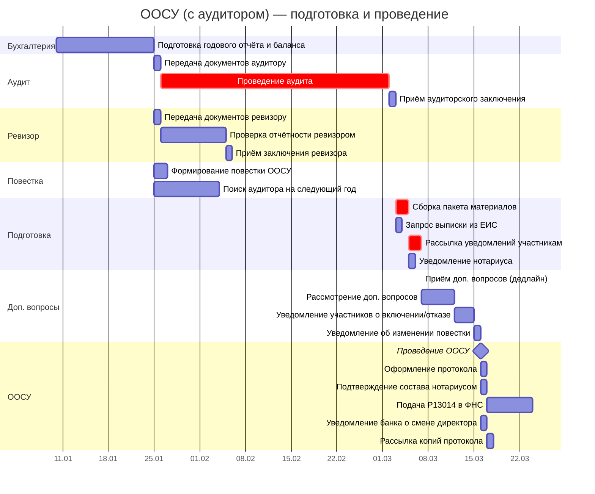

# Диаграмма Ганта ООСУ — Сценарий А: с аудитором

> Связанные документы: [Чеклист задач по подготовке ООСУ](../domain/oosu-checklist.md) · [Описание модели данных](gantt-data-model.md)
>
> **Об исполнителях.** В таблицах указаны идеальные роли. На практике, если юрист/корп. секретарь отсутствуют — их задачи выполняет **гендиректор или его заместитель**. Если бухгалтерия на аутсорсе — гендиректор координирует внешнего бухгалтера и контролирует сроки.

> **Стартовый сигнал:** Бухгалтерия завершила формирование годовой отчётности, аудитор назначен на прошлом ООСУ (договор заключён) — **День 0**.

---

## 1. Таблица для диаграммы Ганта

Два сценария: с аудитором (ООСУ не ранее 28 апреля) и без аудитора (ООСУ ~1 апреля). Длительности — в рабочих днях (раб. дн.), если не указано иное.

**Критический путь:** Б2 → А2 → А3 → А4 → П2 → П3 → ОС1 (≈53 раб. дн.).

> Аудитор назначен на **прошлом ООСУ** — договор уже заключён. Текущая задача: передать отчётность и получить заключение. На текущем ООСУ параллельно назначается аудитор на следующий год.

| ID | Задача | Исполнитель | Длит. | Начало | Конец | Предшественники | Примечание |
|----|--------|------------|-------|--------|-------|-----------------|------------|
| **→ Фаза 1: Подготовка отчётности (январь – февраль)** |
| Б2 | Подготовка годового отчёта и баланса | Бухгалтерия | 15 раб. дн. | SS | SS + 14 | — | СЭД [С1](#c1). Формирование возможно с 01.01, активная фаза с 13.01. Обязательный аудит — при выручке >800 млн ₽ или активах >400 млн ₽ ([ст. 5 307-ФЗ](../laws/208-fz/article-307fz-5.md)) |
| П1 | Формирование повестки ООСУ | Гендиректор (+ юрист) | 2 раб. дн. | FS | FS + 1 | Б2 | СЭД [С2](#c2). Требуется понимание результатов года |
| П0 | Поиск аудитора на следующий год | Гендиректор → уполномоченный исполнитель | 10 раб. дн. | FS | FS + 9 | Б2 | СЭД [С3](#c3). Запрос КП у 2–3 организаций, проверка СРО/аттестатов. Для гос. участия ≥25% — конкурс по 44-ФЗ/223-ФЗ. **Параллельно с Б2** |
| **→ Фаза 3: Проверка отчётности (февраль – март)** |
| Р1 | Передача документов ревизору | Гендиректор | 1 раб. дн. | SS | SS | — | Параллельно с П1 и А2 |
| Р2 | Проверка отчётности ревизором | Ревизионная комиссия (ревизор) | 10 раб. дн. | FS | FS + 9 | Р1 | Параллельно с А3 |
| Р3 | Приём заключения ревизора | Гендиректор | 1 раб. дн. | FS | FS | Р2 | Проверка полноты, подписей |
| А2 | Передача документов аудитору | Гендиректор | 1 раб. дн. | SS | SS | — | Аудитор назначен на прошлом ООСУ. Параллельно с Р1 |
| А3 | Проведение аудита | Аудитор | 35 раб. дн. | FS | FS + 34 | А2 | ⚠️ Критический путь |
| А4 | Приём аудиторского заключения | Гендиректор | 1 раб. дн. | FS | FS | А3 | Проверка формы, подписей, даты |
| **→ Фаза 4: Подготовка к собранию (март – апрель)** |
| П2 | Сборка пакета материалов | Гендиректор | 2 раб. дн. | FS | FS + 1 | Р3, А4 | Зависит от ОБОИХ заключений. Включает рекомендацию по аудитору (П0) |
| Н1 | Запрос выписки из ЕИС у нотариуса | Юрист / гендиректор | 1 раб. дн. | FS | FS | А4 | Заказное письмо [З2](#z2). С 01.09.2025 реестр участников ведёт нотариус ([ст. 31.1 14-ФЗ](../laws/14-fz/article-14fz-31.1.md)). До уведомления участников (П3). Параллельно с П2 |
| П3 | Рассылка уведомлений и материалов участникам | Гендиректор | 2 раб. дн. | FS | FS + 1 | П2 | Заказное письмо [З1](#z1), Рассылка [Р1](#r1). −30 кал. дн. до ООСУ ([ст. 36 14-ФЗ](../laws/14-fz/article-14fz-35.md)): 28.04 − 30 = 29.03 ✅ |
| П4 | Уведомление нотариуса о собрании | Юрист / гендиректор | 1 раб. дн. | FS | FS | П2 | Заказное письмо [З3](#z3). Минимум 7–10 раб. дн. до ООСУ ([ст. 67.1 ГК РФ](../laws/article-gk-67.1.md)). Только при нотариальном удостоверении |
| Д1 | Приём доп. вопросов от участников (дедлайн) | — | 0 | FS | FS | П3 | −15 кал. дн. до ООСУ |
| Д2 | Рассмотрение доп. вопросов | Гендиректор | 5 раб. дн. | FS | FS + 4 | Д1 | В течение 5 дней |
| Д4 | Уведомление участников о включении/отказе | Гендиректор | 3 раб. дн. | FS | FS + 2 | Д2 | 3 дня с даты принятия решения ([п. 2 ст. 36 14-ФЗ](../laws/14-fz/article-14fz-35.md)) |
| Д3 | Уведомление об изменении повестки | Гендиректор | 1 раб. дн. | FS | FS | Д4 | Заказное письмо [З4](#z4), Рассылка [Р2](#r2). −10 кал. дн. до ООСУ ([п. 2 ст. 36 14-ФЗ](../laws/14-fz/article-14fz-35.md)) |
| **→ Фаза 5: ООСУ и завершение (апрель – май)** |
| ОС1 | Проведение ООСУ | ОСУ | 1 раб. дн. | FS | FS | Д3 | Включает назначение аудитора на след. год. **Кворум >50%** ([ст. 33 14-ФЗ](../laws/14-fz/article-14fz-33.md)). ⛔ Без заключения ревизора (при >15 уч.) ООСУ не вправе утверждать отчётность ([ст. 47 14-ФЗ](../laws/14-fz/article-14fz-47.md)) |
| ОС2 | Оформление протокола | Гендиректор | 1 раб. дн. | FS | FS | ОС1 | |
| Н2 | Подтверждение состава участников нотариусом | Нотариус | 1 раб. дн. | FS | FS | ОС1 | Параллельно с ОС2. Нотариальное удостоверение или подписание протокола всеми участниками ([ст. 67.1 ГК РФ](../laws/article-gk-67.1.md)) |
| ОС3 | Подача Р13014 в ФНС | Гендиректор | 7 раб. дн. | FS | FS + 6 | ОС2 | Заявление в ФНС [З5](#z5). **7 раб. дн.** ([ст. 5 129-ФЗ](../laws/208-fz/article-129fz-5.md)). **Только при смене директора/устава/адреса.** Если вопрос не на повестке — пропустить |
| ОС4 | Уведомление банка о смене директора | Гендиректор | 1 раб. дн. | FS | FS | ОС1 | **Только при смене директора.** Незамедлительно ([ст. 89 14-ФЗ](../laws/14-fz/article-14fz-89.md)) |
| ОС5 | Рассылка копий протокола участникам | Гендиректор | 1 раб. дн. | FS | FS | ОС2, Н2 | Рассылка [Р3](#r3). Разумный срок после собрания |

> **Анализ:** ООСУ 28 апреля — **впритык к дедлайну 30 апреля**. Аудит (А3, 35 раб. дн.) съедает почти весь запас. **Любая задержка на 2 дня — выход за пределы 30 апреля.** Чтобы снизить риск: передать аудитору документацию раньше — например, предварительный отчёт в январе.

---

## 2. Контрольные точки

### 2.1. Межэтапные вехи

| ID | Веха | Предшественник | Дата |
|----|------|----------------|------|
| ▼ВР1 | Отчётность готова | Б2 | FS |
| ▼ВР2 | Заключения получены | Р3, А4 | FS |
| ▼ВР3 | Материалы разосланы | Д3 | FS |

### 2.2. Юридические вехи

| ID | Веха | Начало | Предшественники | Контроль | Примечание |
|----|------|--------|-----------------|----------|------------|
| ⚡ЮВ1 | Уведомление участников — дедлайн | FS − 30 кал. дн. | ОС1 | П3 | Не позднее 30 кал. дн. до ООСУ ([ст. 36 14-ФЗ](../laws/14-fz/article-14fz-35.md)): 28.04 − 30 = 29.03 |
| ⚡ЮВ2 | Подача Р13014 — дедлайн | FS + 7 раб. дн. | ОС1 | ОС3 | Не более 7 раб. дн. после ООСУ ([ст. 5 129-ФЗ](../laws/208-fz/article-129fz-5.md)) |

---

## 3. Диаграмма Ганта (Mermaid)

---

## 4. Документооборот и рассылки

### 4.1. Задачи для СЭД — внутренние получатели

Документы, проходящие через систему электронного документооборота: создание, согласование, подписание. **Получатель — сотрудник или орган внутри общества.**

| Индекс | Задача Ганта | Документ | Отправитель | Получатель |
|--------|-------------|----------|-------------|------------|
| **С1** | Б2 | Годовой отчёт и баланс (проект на подпись) | Бухгалтерия | Гендиректор |
| **С2** | П1 | Проект повестки ООСУ | Гендиректор (+ юрист) | Гендиректор (утверждение) |
| **С3** | П0 | Служебная записка с обоснованием выбора аудитора + КП | Уполномоченный исполнитель | Гендиректор |
| **С4** | Д4 | Уведомление участнику о включении вопроса или мотивированный отказ | Гендиректор | Участник-инициатор |
| **С5** | Н2 | Протокол ООСУ (для нотариального удостоверения) | Секретарь / гендиректор | Нотариус |

### 4.2. Заказные письма и электронные отправления с УКЭП

Отправления, для которых важен **факт и дата отправки** — подтверждение соблюдения сроков уведомления.

> **О доставке.** «Заказное письмо» — только через **Почту России** (квитанция с трек-номером = доказательство в суде). Альтернативы для ООСУ ([ст. 36 14-ФЗ](../laws/14-fz/article-14fz-35.md)): **вручение под роспись** или иной способ, **предусмотренный уставом**. Email без УКЭП суды не считают надлежащим уведомлением — если уставом не предусмотрено иное.

| Индекс | Задача Ганта | Что отправляется | Способ | Отправитель | Получатель |
|--------|-------------|-----------------|--------|-------------|------------|
| **З1** | П3 | Уведомление о созыве ООСУ + повестка + пакет материалов | **Заказное письмо** | Гендиректор | Все участники |
| **З2** | Н1 | Запрос выписки из реестра списков участников ЕИС | Заказное письмо или лично | Юрист / гендиректор | Нотариус |
| **З3** | П4 | Уведомление о дате/времени/месте собрания | **Заказное письмо** | Юрист / гендиректор | Нотариус |
| **З4** | Д3 | Уведомление об изменении повестки + доп. материалы | **Заказное письмо** | Гендиректор | Все участники |
| **З5** | ОС3 | Заявление по форме Р13014 | Лично в ФНС, через МФЦ, или **электронно с УКЭП** | Гендиректор | ФНС |

### 4.3. Сводная таблица рассылок

Уведомления и копии, направляемые участникам. Уведомление нотариуса — см. [З3](#z3), запрос ЕИС — см. [Н1 в Ганте](#1-таблица-для-диаграммы-ганта).

| Индекс | Что | Кому | Крайний срок | Задача Ганта |
|--------|-----|------|-------------|-------------|
| **Р1** | Уведомление о созыве ООСУ + повестка + пакет материалов | Все участники | За 30 кал. дн. до ООСУ | П3 |
| **Р2** | Уведомление об изменении повестки + доп. материалы | Все участники | За 10 кал. дн. до ООСУ | Д3 |
| **Р3** | Копия протокола ООСУ | Все участники | Разумный срок после собрания | ОС5 |

---

**Условные обозначения:**
- **Б*** — задачи бухгалтерии
- **А*** — задачи аудитора
- **Р*** — задачи ревизионной комиссии (ревизора)
- **П*** — задачи подготовки к собранию
- **Н*** — задачи, связанные с нотариусом
- **Д*** — задачи по дополнительным вопросам участников
- **ОС*** — задачи ООСУ и завершения
- **▼ВР*** — межэтапные вехи (нулевая длительность)
- **⚡ЮВ*** — юридические вехи (дедлайны по закону)
- ⚠️ — задача критического пути
