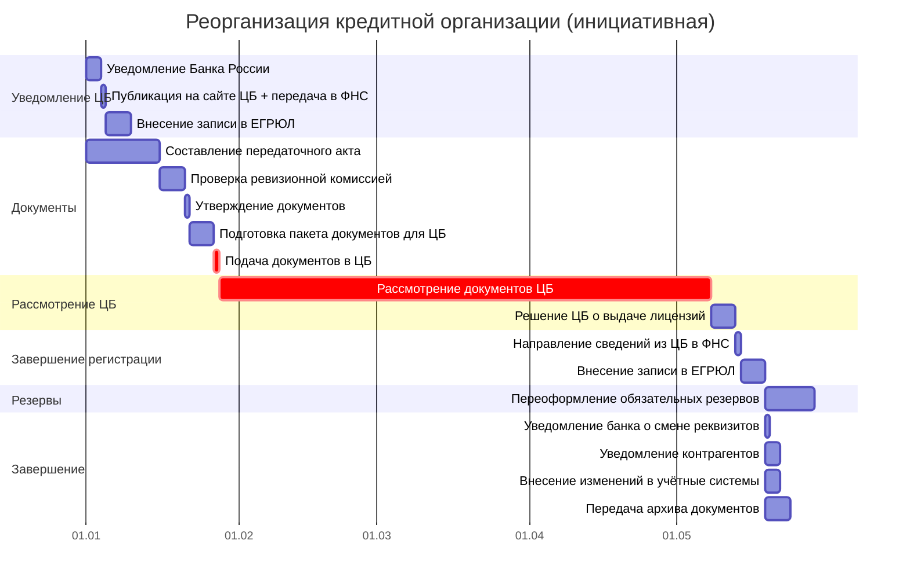
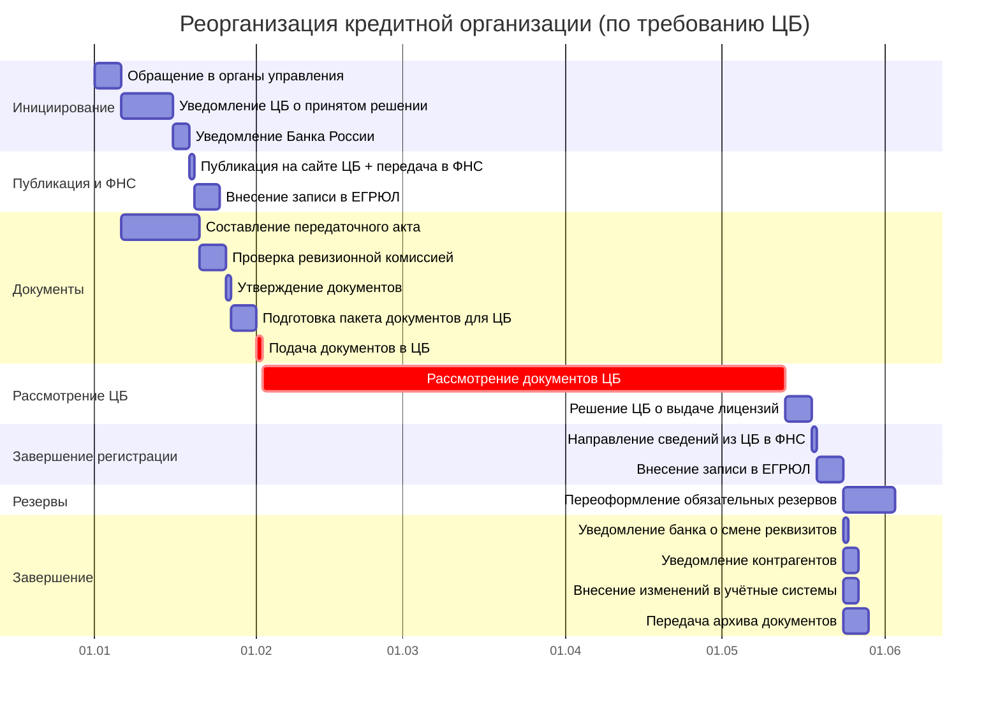

# Диаграмма Ганта и документооборот реорганизации кредитных организаций

> Продолжение [контрольного списка задач по реорганизации кредитных организаций](reorganization-credit-checklist.md). Здесь — таблицы для построения диаграммы Ганта, реестр внутренних документов СЭД и сводка внешних рассылок.
>
> **Об исполнителях.** В таблицах указаны идеальные роли. На практике, если юрист отсутствует — его задачи выполняет **гендиректор или его заместитель**.
>
> **О модели данных:** соглашения об ID, столбцах, вехах и фазах — в [описании модели данных](gantt-data-model.md).

---

## 1. Таблица для диаграммы Ганта

Длительности указаны в рабочих днях (раб. дн.). Два сценария: инициативная реорганизация и реорганизация по требованию ЦБ.

### Стартовое событие

**Принятие решения о реорганизации** — это стартовый сигнал для всех последующих задач. Решение оформляется протоколом общего собрания участников (акционеров) и является моментом отсчёта всех законодательных сроков. Для ООО решение должно быть **единогласным** (п. 7 ст. 37 14-ФЗ).

Для сценария «по требованию ЦБ» триггером additionally является **получение требования Банка России** — это событие, с которого начинается ускоренная процедура (5 дней на обращение в органы управления + 10 дней на уведомление ЦБ).

> Дата принятия решения (или получения требования ЦБ) = **День 0** на временно́й шкале.

### Сценарий А: Инициативная реорганизация

**Критический путь:** Б1 → Ц1 → Ф1 → Д4 → РГ1 → Ц2 → Ц3 → РГ2 → РГ3 (≈148 раб. дн.).

> Максимальный срок — **6 месяцев** (≈130 раб. дн.) с даты представления документов в ЦБ. С учётом подготовки и завершения — до 148 раб. дн.

| ID | Задача | Исполнитель | Длит. | Начало | Конец | Предшественники | Примечание |
|----|--------|------------|-------------|--------|-------|-----------------|------------|
| **→ Фаза 1: Уведомление ЦБ** |
| Б1 | Уведомление Банка России | Гендиректор | 3 раб. дн. | SS | SS + 2 | — | [С1](#c1). 3 рабочих дня после решения |
| **▼ВР1** | **ЦБ уведомлён** | — | — | FS | FS | Б1 | **Фаза 1 завершена** |
| **→ Фаза 2: Публикация и передача в ФНС** |
| Ц1 | Публикация на сайте ЦБ + передача в ФНС | ЦБ | 1 раб. дн. | FS + 1 раб. дн. | FS + 1 | ▼ВР1 | Автоматически, 1 раб. дн. |
| Ф1 | Внесение записи в ЕГРЮЛ | ФНС | 5 раб. дн. | FS + 1 раб. дн. | FS + Длит. раб. дн. | Ц1 | На основании данных от ЦБ |
| **▼ВР2** | **Документы переданы в ФНС** | — | — | FS | FS | Ф1 | **Фаза 2 завершена** |
| **→ Фаза 3: Подготовка и подача документов** |
| Д1 | Составление передаточного акта / разделительного баланса | Бухгалтерия | 15 раб. дн. | FS + 1 раб. дн. | FS + Длит. раб. дн. | ▼ВР2 | Параллельно с уведомлением ЦБ |
| Д2 | Проверка ревизионной комиссией | Ревизионная комиссия | 5 раб. дн. | FS + 1 раб. дн. | FS + Длит. раб. дн. | Д1 | Если комиссия создана |
| Д3 | Утверждение документов на общем собрании | Участники | 1 раб. дн. | FS + 1 раб. дн. | FS + 1 | Д2 | — |
| Д4 | Подготовка полного пакета документов для ЦБ | Гендиректор / юрист | 5 раб. дн. | FS + 1 раб. дн. | FS + Длит. раб. дн. | Д3 | [С2](#c2) |
| РГ1 | Подача документов в территориальное учреждение ЦБ | Гендиректор | 1 раб. дн. | FS + 1 раб. дн. | FS + 1 | Д4 | [З1](#z1). **В течение 1 месяца** со дня решения |
| **▼ВР3** | **Документы поданы в ЦБ** | — | — | FS | FS | РГ1 | **Фаза 3 завершена** |
| **→ Фаза 4: Рассмотрение ЦБ** |
| Ц2 | Рассмотрение документов ЦБ | ЦБ | 100 раб. дн. | FS + 1 раб. дн. | FS + Длит. раб. дн. | ▼ВР3 | В пределах 6 месяцев |
| Ц3 | Решение ЦБ о выдаче лицензий | ЦБ | 5 раб. дн. | FS + 1 раб. дн. | FS + Длит. раб. дн. | Ц2 | В пределах 6 месяцев |
| **▼ВР4** | **Лицензии получены** | — | — | FS | FS | Ц3 | **Фаза 4 завершена** |
| **→ Фаза 5: Завершение регистрации** |
| РГ2 | Направление сведений из ЦБ в ФНС | ЦБ | 1 раб. дн. | FS + 1 раб. дн. | FS + 1 | ▼ВР4 | Автоматически |
| РГ3 | Внесение записи в ЕГРЮЛ о завершении реорганизации | ФНС | 5 раб. дн. | FS + 1 раб. дн. | FS + Длит. раб. дн. | РГ2 | 5 раб. дн. |
| **▼ВР5** | **Реорганизация завершена** | — | — | FS | FS | РГ3 | **Фаза 5 завершена** |
| **→ Фаза 6: Переоформление резервов** |
| РЗ1 | Переоформление обязательных резервов | ЦБ | 10 раб. дн. | FS + 1 раб. дн. | FS + Длит. раб. дн. | ▼ВР5 | Со дня внесения записи до очередного периода регулирования |
| **▼ВР6** | **Резервы переоформлены** | — | — | FS | FS | РЗ1 | **Фаза 6 завершена** |
| **→ Фаза 7: Завершение** |
| З1 | Уведомление банка о смене реквизитов | Гендиректор | 1 раб. дн. | FS + 1 раб. дн. | FS + 1 | ▼ВР6 | При изменении реквизитов |
| З2 | Уведомление контрагентов | Гендиректор | 3 раб. дн. | FS + 1 раб. дн. | FS + Длит. раб. дн. | РГ3, РЗ1 | [З2](#z2). Рассылка уведомлений |
| З3 | Внесение изменений в учётные системы | Бухгалтерия / IT | 3 раб. дн. | FS + 1 раб. дн. | FS + Длит. раб. дн. | РГ3, РЗ1 | — |
| З4 | Передача архива документов правопреемнику | Гендиректор | 5 раб. дн. | FS + 1 раб. дн. | FS + Длит. раб. дн. | РГ3, РЗ1 | — |
| ⚡КВ1 | Уведомление Банка России — дедлайн | — | — | Д+3 | Д+3 | — | Ст. 18.1 395-ФЗ: не более 3 раб. дн. после решения |
| ⚡КВ2 | Подача документов в ЦБ — дедлайн | — | — | Д+26 | Д+26 | — | Ст. 18.1 395-ФЗ: в течение 1 месяца со дня решения |
| ⚡КВ3 | Рассмотрение ЦБ — дедлайн | — | — | Д+132 | Д+132 | — | Ст. 18.1 395-ФЗ: в пределах 6 месяцев |
| ⚡КВ4 | Регистрация в ФНС — дедлайн | — | — | Д+138 | Д+138 | — | Ст. 8 129-ФЗ: не более 5 раб. дн. |
| **→ Вехи** |
| ▼В1 | ЦБ уведомлён | — | 0 раб. дн. | Д+3 | Д+3 | Б1 | |
| ▼В2 | Документы поданы в ЦБ | — | 0 раб. дн. | Д+26 | Д+26 | РГ1 | |
| ▼В3 | Лицензии получены | — | 0 раб. дн. | Д+132 | Д+132 | Ц3 | |
| ▼В4 | Реорганизация завершена | — | 0 раб. дн. | Д+138 | Д+138 | РГ3 | |

> **Анализ:** Максимальный срок — 6 месяцев (130 раб. дн.) с даты подачи документов в ЦБ. Критический путь: рассмотрение ЦБ (до 130 раб. дн.). Любая задержка с подачей документов сдвигает общую дату завершения.

---

### Сценарий Б: Реорганизация по требованию ЦБ

**Критический путь:** Р1 → Р3 → Б1 → Ц1 → Ф1 → Д4 → РГ1 → Ц2 → Ц3 → РГ2 → РГ3 (≈173 раб. дн.).

> Ускоренный порядок инициации: 5 дней на обращение + 10 дней на уведомление ЦБ. Далее — общий порядок.

| ID | Задача | Исполнитель | Длит. | Начало | Конец | Предшественники | Примечание |
|----|--------|------------|-------------|--------|-------|-----------------|------------|
| **→ Фаза 1: Инициирование** |
| Р1 | Обращение в органы управления с ходатайством | Гендиректор | 5 раб. дн. | SS | SS + 4 | — | **В течение 5 дней** с момента получения требования ЦБ |
| **▼ВР1** | **Обращение направлено** | — | — | FS | FS | Р1 | **Фаза 1 завершена** |
| **→ Фаза 2: Уведомление ЦБ** |
| Р3 | Уведомление ЦБ о принятом решении | Гендиректор | 10 раб. дн. | FS + 1 раб. дн. | FS + Длит. раб. дн. | ▼ВР1 | **Не позднее 10 дней** с момента получения требования |
| Б1 | Уведомление Банка России | Гендиректор | 3 раб. дн. | FS + 1 раб. дн. | FS + Длит. раб. дн. | Р3 | [С1](#c1). 3 рабочих дня после решения |
| **▼ВР2** | **ЦБ уведомлён** | — | — | FS | FS | Б1 | **Фаза 2 завершена** |
| **→ Фаза 3: Публикация и передача в ФНС** |
| Ц1 | Публикация на сайте ЦБ + передача в ФНС | ЦБ | 1 раб. дн. | FS + 1 раб. дн. | FS + 1 | ▼ВР2 | Автоматически, 1 раб. дн. |
| Ф1 | Внесение записи в ЕГРЮЛ | ФНС | 5 раб. дн. | FS + 1 раб. дн. | FS + Длит. раб. дн. | Ц1 | На основании данных от ЦБ |
| **▼ВР3** | **Документы переданы в ФНС** | — | — | FS | FS | Ф1 | **Фаза 3 завершена** |
| **→ Фаза 4: Подготовка и подача документов** |
| Д1 | Составление передаточного акта / разделительного баланса | Бухгалтерия | 15 раб. дн. | FS + 1 раб. дн. | FS + Длит. раб. дн. | ▼ВР3 | Параллельно с уведомлением ЦБ |
| Д2 | Проверка ревизионной комиссией | Ревизионная комиссия | 5 раб. дн. | FS + 1 раб. дн. | FS + Длит. раб. дн. | Д1 | Если комиссия создана |
| Д3 | Утверждение документов на общем собрании | Участники | 1 раб. дн. | FS + 1 раб. дн. | FS + 1 | Д2 | — |
| Д4 | Подготовка полного пакета документов для ЦБ | Гендиректор / юрист | 5 раб. дн. | FS + 1 раб. дн. | FS + Длит. раб. дн. | Д3 | [С2](#c2) |
| РГ1 | Подача документов в территориальное учреждение ЦБ | Гендиректор | 1 раб. дн. | FS + 1 раб. дн. | FS + 1 | Д4 | [З1](#z1). **В течение 1 месяца** со дня решения |
| **▼ВР4** | **Документы поданы в ЦБ** | — | — | FS | FS | РГ1 | **Фаза 4 завершена** |
| **→ Фаза 5: Рассмотрение ЦБ** |
| Ц2 | Рассмотрение документов ЦБ | ЦБ | 100 раб. дн. | FS + 1 раб. дн. | FS + Длит. раб. дн. | ▼ВР4 | В пределах 6 месяцев |
| Ц3 | Решение ЦБ о выдаче лицензий | ЦБ | 5 раб. дн. | FS + 1 раб. дн. | FS + Длит. раб. дн. | Ц2 | В пределах 6 месяцев |
| **▼ВР5** | **Лицензии получены** | — | — | FS | FS | Ц3 | **Фаза 5 завершена** |
| **→ Фаза 6: Завершение регистрации** |
| РГ2 | Направление сведений из ЦБ в ФНС | ЦБ | 1 раб. дн. | FS + 1 раб. дн. | FS + 1 | ▼ВР5 | Автоматически |
| РГ3 | Внесение записи в ЕГРЮЛ о завершении реорганизации | ФНС | 5 раб. дн. | FS + 1 раб. дн. | FS + Длит. раб. дн. | РГ2 | 5 раб. дн. |
| **▼ВР6** | **Реорганизация завершена** | — | — | FS | FS | РГ3 | **Фаза 6 завершена** |
| **→ Фаза 7: Переоформление резервов** |
| РЗ1 | Переоформление обязательных резервов | ЦБ | 10 раб. дн. | FS + 1 раб. дн. | FS + Длит. раб. дн. | ▼ВР6 | Со дня внесения записи до очередного периода регулирования |
| **▼ВР7** | **Резервы переоформлены** | — | — | FS | FS | РЗ1 | **Фаза 7 завершена** |
| **→ Фаза 8: Завершение** |
| З1 | Уведомление банка о смене реквизитов | Гендиректор | 1 раб. дн. | FS + 1 раб. дн. | FS + 1 | ▼ВР7 | При изменении реквизитов |
| З2 | Уведомление контрагентов | Гендиректор | 3 раб. дн. | FS + 1 раб. дн. | FS + Длит. раб. дн. | РГ3, РЗ1 | [З2](#z2). Рассылка уведомлений |
| З3 | Внесение изменений в учётные системы | Бухгалтерия / IT | 3 раб. дн. | FS + 1 раб. дн. | FS + Длит. раб. дн. | РГ3, РЗ1 | — |
| З4 | Передача архива документов правопреемнику | Гендиректор | 5 раб. дн. | FS + 1 раб. дн. | FS + Длит. раб. дн. | РГ3, РЗ1 | — |
| ⚡КВ1 | Обращение в органы управления — дедлайн | — | — | Д+5 | Д+5 | — | Ст. 18.2 395-ФЗ: в течение 5 дней с момента получения требования ЦБ |
| ⚡КВ2 | Уведомление ЦБ о решении — дедлайн | — | — | Д+15 | Д+15 | — | Ст. 18.2 395-ФЗ: не позднее 10 дней с момента получения требования |
| ⚡КВ3 | Уведомление Банка России — дедлайн | — | — | Д+18 | Д+18 | — | Ст. 18.1 395-ФЗ: не более 3 раб. дн. после решения |
| ⚡КВ4 | Подача документов в ЦБ — дедлайн | — | — | Д+31 | Д+31 | — | Ст. 18.1 395-ФЗ: в течение 1 месяца со дня решения |
| ⚡КВ5 | Рассмотрение ЦБ — дедлайн | — | — | Д+137 | Д+137 | — | Ст. 18.1 395-ФЗ: в пределах 6 месяцев |
| ⚡КВ6 | Регистрация в ФНС — дедлайн | — | — | Д+143 | Д+143 | — | Ст. 8 129-ФЗ: не более 5 раб. дн. |
| **→ Вехи** |
| ▼В1 | ЦБ уведомлён | — | 0 раб. дн. | Д+3 | Д+3 | Б1 | |
| ▼В2 | Документы поданы в ЦБ | — | 0 раб. дн. | Д+26 | Д+26 | РГ1 | |
| ▼В3 | Лицензии получены | — | 0 раб. дн. | Д+132 | Д+132 | Ц3 | |
| ▼В4 | Реорганизация завершена | — | 0 раб. дн. | Д+138 | Д+138 | РГ3 | |

> **Анализ:** Ускоренная инициация (18 дней вместо 3), но общий срок рассмотрения ЦБ не меняется — до 6 месяцев. Итого до 158 раб. дн.

---

**Условные обозначения:**
- **Р*** — решения и уведомления
- **Т*** — требования ЦБ
- **Б*** — взаимодействие с Банком России
- **Ц*** — действия ЦБ (публикация, рассмотрение, лицензии)
- **Ф*** — ФНС
- **Д*** — подготовка документов
- **РГ*** — регистрация
- **РЗ*** — переоформление резервов
- **З*** — завершение
- **▼В*** — вехи (нулевая длительность)
- ⚠️ — задача критического пути

## 1.1. Диаграмма Ганта — Сценарий А: Инициативная реорганизация (Mermaid)



## 1.2. Диаграмма Ганта — Сценарий Б: По требованию ЦБ (Mermaid)



---

## 2. Документооборот и рассылки

### Список артефактов

| Индекс | Название | Тип | Куда направляется |
|--------|----------|-----|-------------------|
| **С1** | Уведомление Банка России о начале процедуры реорганизации | Внутренний | Банк России |
| **С2** | Пакет документов для территориального учреждения ЦБ | Внутренний | Гендиректор (утверждение) |
| **З1** | Пакет документов для регистрации | Напрямую в ЦБ | Банк России |
| **З2** | Уведомление контрагентов | Заказное письмо / email | Контрагенты |
| **Р1** | Уведомление о завершении реорганизации | Рассылка | Контрагенты |

### 2.1. Задачи для СЭД — внутренние получатели

Документы, проходящие через систему электронного документооборота: создание, согласование, подписание. **Получатель — сотрудник или орган внутри общества.**

| Индекс | Задача Ганта | Документ | Отправитель | Получатель |
|--------|-------------|----------|-------------|------------|
| <a id="c1"></a>**С1** | Б1 | Уведомление Банка России о начале процедуры реорганизации | Гендиректор | Банк России |
| <a id="c2"></a>**С2** | Д4 | Пакет документов для территориального учреждения ЦБ (устав, передаточный акт, протоколы) | Гендиректор / юрист | Гендиректор (утверждение) |

### 2.2. Заказные письма и электронные отправления

Отправления, для которых важен **факт и дата отправки** — подтверждение соблюдения сроков уведомления.

> **О доставке.** Уведомление ЦБ направляется **напрямую** в Банк России (не через ФНС). Способ доставки — по уставу или установленный ЦБ порядок.

| Индекс | Задача Ганта | Что отправляется | Способ | Отправитель | Получатель |
|--------|-------------|-----------------|--------|-------------|------------|
| <a id="z1"></a>**З1** | РГ1 | Пакет документов для регистрации (заявление, устав, передаточный акт/баланс, протоколы, лицензии) | Напрямую в территориальное учреждение ЦБ | Гендиректор | Банк России |
| <a id="z2"></a>**З2** | З2 | Уведомление контрагентов о реорганизации | Заказное письмо или email | Гендиректор | Контрагенты |

### 2.3. Сводная таблица рассылок

Уведомления и копии, направляемые контрагентам.

| Индекс | Что | Кому | Крайний срок | Задача Ганта |
|--------|-----|------|-------------|-------------|
| <a id="r1"></a>**Р1** | Уведомление о завершении реорганизации | Контрагенты | Разумный срок после регистрации | З2 |

---

## 3. Временна́я шкала (линейная)

```
День 0 ──────────────────────────────────────────────────────────────── День 173+
  │                                                                      │
  │  День 0: Принятие решения                                            │
  │                                                                      │
  ├── Дни 1-3: Уведомление Банка России (3 рабочих дня)                 │
  │                                                                      │
  ├── День 4: Публикация на сайте ЦБ + передача в ФНС (1 раб. дн.)        │
  │                                                                      │
  ├── Дни 5-35: Подача документов в ЦБ (1 месяц)                        │
  │                                                                      │
  ├── Дни 36-166: Рассмотрение ЦБ + выдача лицензий (в пределах 6 мес.)│
  │                                                                      │
  ├── День 166: Завершение регистрации (5 раб. дн. на внесение в ЕГРЮЛ)    │
  │                                                                      │
  ├── Дни 167-176: Переоформление обязательных резервов                 │
  │                                                                      │
  └── Дни 177+: Завершение (уведомления, передача архива)               │
```

← [Назад к чеклисту](../domain/reorganization-credit-checklist.md) | [Общий порядок](reorganization-gantt.md) | [Модель данных Ганта](gantt-data-model.md)
