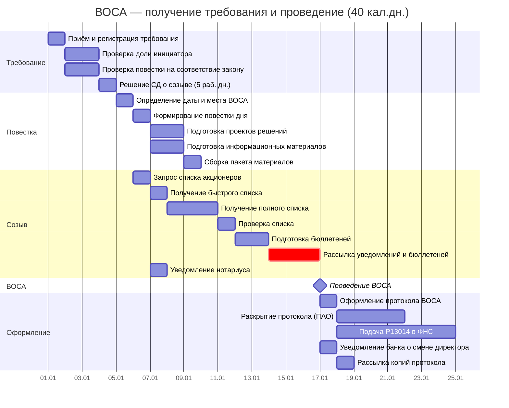

# Диаграмма Ганта и документооборот ВОСА

> **Связанные документы:**
> - [Контрольный список задач по подготовке ВОСА](../domain/vosa-checklist.md)
> - [Описание модели данных](gantt-data-model.md)

---

## 1. Таблица для диаграммы Ганта

Длительности указаны в календарных днях. Расчёт на **типичное ВОСА со сменой генерального директора** (без избрания СД — предельный срок 40 дней).

**Критический путь:** Т1 → Т3 → СД1 → П1 → С3 → ОС1 (≈33 кал. дн.).

---

> **Стартовый сигнал:** Требование о проведении ВОСА поступило в совет директоров — **День 0**.

### Фаза 1: Получение и проверка требования

| ID | Задача | Исполнитель | Длит. | Начало | Конец | Предшественники | Примечание |
|----|--------|------------|------------|--------|-------|-----------------|------------|
| Т1 | Приём и регистрация требования | Гендиректор / корп. секретарь | 1 кал. дн. | SS | SS | — | Дата получения — День 0, от неё отсчитываются все сроки |
| ▼В1 | Требование получено и зарегистрировано | — | 0 кал. дн. | FS | FS | Т1 | — |
| Т2 | Проверка доли инициатора (≥10%) | Корп. секретарь / регистратор | 2 кал. дн. | FS + 1 кал. дн. | FS + 2 кал. дн. | Т1 | Запрос выписки из реестра на дату требования. Для инициативы СД / ревизора / аудитора — не требуется |
| Т3 | Проверка повестки на соответствие закону и уставу | СД / юрист | 2 кал. дн. | SS | SS + 1 | — | Параллельно с Т2 |
| ▼ИН1 | Проверки завершены | — | 0 кал. дн. | FS | FS | Т2, Т3 | Сходятся две проверки |
| Т4 | Принятие решения о созыве или отказе | Совет директоров | 1 кал. дн. | FS + 1 кал. дн. | FS + 1 | ▼ИН1 | ⚠️ Жёсткий дедлайн: **5 раб. дн.** с даты получения требования. При бездействии — иск |
| ▼В2 | Решение СД о созыве принято | — | 0 кал. дн. | FS | FS | Т4 | — |

---

### Фаза 2: Подготовка повестки и материалов

| ID | Задача | Исполнитель | Длит. | Начало | Конец | Предшественники | Примечание |
|----|--------|------------|------------|--------|-------|-----------------|------------|
| СД1 | Определение даты и места ВОСА | Совет директоров | 1 кал. дн. | FS + 1 кал. дн. | FS + 1 | ▼В2 | Дата в пределах 40 кал. дн. от Дня 0 (75 — с избранием СД). Выбор с учётом 21-дневного уведомления |
| П1 | Формирование повестки дня (из требования) | СД / корп. секретарь | 1 кал. дн. | FS + 1 кал. дн. | FS + 1 | СД1 | [С1](#c1). Повестка = ровно то, что в требовании. СД не вправе менять формулировки |
| П2 | Подготовка проектов решений | Корп. секретарь / юрист | 2 кал. дн. | FS + 1 кал. дн. | FS + 2 кал. дн. | П1 | По каждому вопросу — формулировка решения |
| П3 | Подготовка информационных материалов | Корп. секретарь / юрист | 2 кал. дн. | FS + 1 кал. дн. | FS + 2 кал. дн. | П1 | Параллельно с П2. При смене директора: сведения о кандидате |
| ▼ИН2 | Решения и материалы готовы | — | 0 кал. дн. | FS | FS | П2, П3 | Сходятся проекты решений и материалы |
| П4 | Сборка пакета материалов для акционеров | Корп. секретарь / гендиректор | 1 кал. дн. | FS + 1 кал. дн. | FS + 1 | ▼ИН2 | Проекты решений, сведения о кандидатах, информационные материалы |
| ▼В3 | Пакет материалов готов | — | 0 кал. дн. | FS | FS | П4 | — |

---

### Фаза 3: Созыв собрания

| ID | Задача | Исполнитель | Длит. | Начало | Конец | Предшественники | Примечание |
|----|--------|------------|------------|--------|-------|-----------------|------------|
| С1 | Запрос списка акционеров у регистратора | Гендиректор / корп. секретарь | 1 кал. дн. | FS + 1 кал. дн. | FS + 1 | ▼В3 | На дату фиксации, определённую СД |
| С2 | Получение быстрого списка от регистратора | Регистратор | 1 раб. дн. | FS + 1 раб. дн. | FS + 1 раб. дн. | С1 | След. раб. дн. после запроса |
| С3 | Получение полного списка (с раскрытием номинальных) | Регистратор | 3 кал. дн. | FS + 1 кал. дн. | FS + 3 кал. дн. | С2 | До 3 кал. дн. на раскрытие. Для НАО без номинальных — совпадает с С2 |
| С4 | Проверка списка (валидация) | Гендиректор / корп. секретарь | 1 кал. дн. | FS + 1 кал. дн. | FS + 1 | С3 | Адреса, кворум, казначейские акции, паспорта |
| ▼В4 | Список акционеров проверен | — | 0 кал. дн. | FS | FS | С4 | — |
| ▼ИН3 | Список и пакет готовы | — | 0 кал. дн. | FS | FS | С4, П4 | Сходятся список акционеров и пакет материалов |
| С5 | Подготовка бюллетеней для голосования | Корп. секретарь / гендиректор | 2 кал. дн. | FS + 1 кал. дн. | FS + 2 кал. дн. | ▼ИН3 | [С2](#c2). Для >500 акционеров — обязательно. Кумулятивное голосование — при избрании СД |
| ▼ИН4 | Бюллетени и список готовы | — | 0 кал. дн. | FS | FS | С4, С5 | Сходятся проверенный список и бюллетени |
| С6 | Рассылка уведомлений и бюллетеней акционерам | Регистратор | 3 кал. дн. | FS + 1 кал. дн. | FS + 3 кал. дн. | ▼ИН4 | [З1](#z1), [Р1](#r1). −21 кал. дн. до ВОСА |
| ▼В5 | Уведомления разосланы | — | 0 кал. дн. | FS | FS | С6 | — |
| С7 | Доступ к материалам для акционеров | — | 0 кал. дн. | FS + 1 кал. дн. | — | С6 | [Р2](#r2). За 20 кал. дн. до ВОСА |
| Н1 | Уведомление нотариуса о собрании | Юрист / корп. секретарь | 1 кал. дн. | FS + 1 кал. дн. | FS + 1 | П1 | [З2](#z2). Минимум за 7–10 кал. дн. до ВОСА. При нотариальном удостоверении |

---

### Фаза 4: Проведение ВОСА и завершение

| ID | Задача | Исполнитель | Длит. | Начало | Конец | Предшественники | Примечание |
|----|--------|------------|------------|--------|-------|-----------------|------------|
| ОС1 | Регистрация участников и проверка полномочий | Регистратор | 1 кал. дн. | FS + 1 кал. дн. | FS + 1 | С6 | ⚠️ Запас 4 дня до предельного срока 40 кал. дн. |
| ОС2 | Проверка кворума (>50%) | Регистратор / председатель | 0 кал. дн. | FS | FS | ОС1 | Момент открытия собрания |
| ОС3 | Проведение собрания: обсуждение и голосование | ОСА | 1 кал. дн. | FS + 1 кал. дн. | FS + 1 | ОС2 | Голосование по вопросам повестки, подсчёт, оглашение |
| ▼В6 | ВОСА проведено | — | 0 кал. дн. | FS | FS | ОС3 | — |
| ОС4 | Оформление протокола ВОСА | Корп. секретарь / гендиректор | 1 кал. дн. | FS + 1 кал. дн. | FS + 1 | ОС3 | [Р3](#r3) |
| ОС5 | Раскрытие протокола (ПАО) | Корп. секретарь | 1 кал. дн. | FS + 1 кал. дн. | FS + 1 | ОС4 | В течение 4 кал. дн. — лента новостей (Интерфакс). Только для ПАО |
| ОС6 | Подача Р13014 в ФНС | Гендиректор | 1 кал. дн. | FS + 1 кал. дн. | FS + 1 | ОС4 | [З3](#z3). В течение 7 кал. дн. после смены директора/устава. Лично/МФЦ или электронно с УКЭП |
| ОС7 | Уведомление банка о смене директора | Гендиректор | 1 кал. дн. | FS + 1 кал. дн. | FS + 1 | ОС3 | Только при смене директора |
| ОС8 | Уведомление регистратора об изменениях | Гендиректор | 1 кал. дн. | FS + 1 кал. дн. | FS + 1 | ОС3 | |
| ОС9 | Рассылка копий протокола акционерам | Корп. секретарь | 1 кал. дн. | FS + 1 кал. дн. | FS + 1 | ОС4 | [Р4](#r4) |

**→ Контрольные точки:**

| ID | Веха | Предшественник | Дата |
|----|------|----------------|------|
| ▼ВР1 | Требование рассмотрено | Т4 | FS |
| ▼ВР2 | Пакет материалов готов | П4 | FS |
| ▼ВР3 | Уведомления разосланы | С6 | FS |

| ID | Веха | Начало | Предшественники | Контроль | Примечание |
|----|------|--------|-----------------|----------|------------|
| ⚡КВ1 | Решение СД — дедлайн | FS + 5 кал. дн. | — | Т4 | Ст. 53 208-ФЗ: не позднее 5 дней после окончания срока подачи предложений |
| ⚡КВ2 | Рассылка уведомлений — дедлайн | FS + 15 кал. дн. | — | С6 | Ст. 52 208-ФЗ: не позднее 21 кал. дн. до ВОСА |
| ⚡КВ3 | Подача Р13014 — дедлайн | FS + 46 кал. дн. | — | ОС4 | Ст. 5 129-ФЗ: не более 7 раб. дн. после ВОСА |

---

## 1.1. Диаграмма Ганта — Базовый сценарий (40 дней, Mermaid)

---

> **Дополнительный сценарий:** [Смена генерального директора](director-change-gantt.md).

---

## 2. Документооборот и рассылки

### 2.1. Задачи для СЭД — внутренние получатели

| Индекс | Задача Ганта | Документ | Отправитель | Получатель |
|--------|-------------|----------|-------------|------------|
| **С1** | П1 | Повестка дня ВОСА + проекты решений | Совет директоров | Корп. секретарь / гендиректор |
| **С2** | С5 | Бюллетени для голосования (проект) | Корп. секретарь | Совет директоров (утверждение) |

### 2.2. Заказные письма и электронные отправления с УКЭП

> **О доставке.** «Заказное письмо» — только через **Почту России** (квитанция с трек-номером = доказательство в суде). Для ОСА ([ст. 52 208-ФЗ](../laws/208-fz/article-52.md)): общество с **>500 акционеров — только заказное письмо**, без альтернатив. Для меньших — допускается вручение под роспись.

| Индекс | Задача Ганта | Что отправляется | Способ | Отправитель | Получатель |
|--------|-------------|-----------------|--------|-------------|------------|
| **З1** | С6 | Уведомление о созыве ВОСА + бюллетени | **Заказное письмо** (для >500 акц. — обязательно) | Регистратор | Все акционеры |
| **З2** | Н1 | Уведомление о дате/времени/месте собрания | **Заказное письмо** | Юрист / корп. секретарь | Нотариус |
| **З3** | ОС6 | Заявление по форме Р13014 | Лично в ФНС, через МФЦ, или **электронно с УКЭП** | Гендиректор | ФНС |

### 2.3. Сводная таблица рассылок

| Индекс | Что | Кому | Крайний срок | Задача Ганта |
|--------|-----|------|-------------|-------------|
| **Р1** | Уведомление о созыве ВОСА + бюллетени | Все акционеры | За 21 кал. дн. до ВОСА | С6 |
| **Р2** | Пакет материалов к ВОСА (проекты решений, сведения о кандидатах) | Все акционеры | За 20 кал. дн. до ВОСА (доступ) | С7 |
| **Р3** | Копия протокола ВОСА | Все акционеры | Разумный срок после собрания | ОС4 |
| **Р4** | Раскрытие протокола (ПАО) | Неограниченный круг лиц | 4 кал. дн. после собрания | ОС5 |

