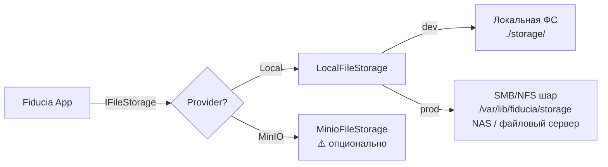

# Интеграции с внешними системами

> Документирует API-прокси, Docker-демо-стенды и известные ограничения для внешних интеграций проекта.

---

## Известные ограничения: Docker-образы x86_64 на Apple Silicon (M1–M4)

Ряд внешних систем поставляются только в виде linux/amd64 Docker-образов и **не работают** на Mac с ARM-процессорами через эмуляцию (Rosetta 2 / QEMU):

| Система | Образ | Статус на Apple Silicon | Причина |
|---------|-------|------------------------|---------|
| **TrueConf Server** | `trueconf/trueconf-server:stable` | ❌ SIGBUS на `tc_server` | Невыровненный доступ к памяти в ядре видеосервера (72 MB) — не эмулируется Rosetta |
| **OpenLDAP** (`osixia`) | `osixia/openldap:latest` | ❌ init-скрипты падают | `/container/run/startup/slapd` не находит `replication-disable.ldif` и `root-password-change.ldif` — образ несовместим с эмуляцией |

**Решение для разработки**: использовать API-прокси с mock-объектами (все операции покрыты unit-тестами без поднятых серверов).

**Решение для production**: развёртывание на нативном x86_64 Linux (VPS, bare-metal, или CI/CD-раннер).

---

# Интеграция с TrueConf Server

> Внешняя система: **TrueConf Server** (API v4, для v5.5+) — российская платформа видеоконференцсвязи.

---

## Известные ограничения

### Запуск TrueConf Server в Docker на Apple Silicon (M1–M4)

Попытка запуска TrueConf Server через официальный Docker-образ (`trueconf/trueconf-server:stable`, ~1.1 GB, linux/amd64) на macOS с Apple Silicon **неудачна**:

| Режим эмуляции | Результат | Причина |
|----------------|-----------|---------|
| **Rosetta 2** | `tc_server` падает с SIGBUS (Bus error), supervisor переводит процесс в FATAL | Невыровненный доступ к памяти в бинарнике ядра видеосервера (72 MB), не эмулируется Rosetta |
| **QEMU** | Контейнер уходит в restart loop, инициализация не завершается за 90+ сек | Общая нестабильность эмуляции x86_64 на ARM |

**Вывод**: TrueConf Server **не работает в Docker** на Apple Silicon через любую эмуляцию x86_64. Требуется нативный x86_64 Linux (VPS, bare-metal, или Windows/Linux-сервер).

**Альтернативы для локальной разработки**:
- Аренда VPS с Ubuntu x86_64 (300–500 ₽/мес)
- Физический сервер / рабочая станция с x86_64 Linux
- Использование только API-прокси (реализован) — бизнес-логика не требует поднятого сервера для тестов

---

## Обзор

Для обеспечения дистанционного участия членов совета директоров в заседаниях платформа интегрируется с TrueConf Server через REST API v4. Интеграция построена по паттерну **Proxy (API-клиент)** с соблюдением принципов SOLID: интерфейс определён в Domain, реализация — в Infrastructure, что позволяет тестировать бизнес-логику без поднятого сервера TrueConf.

---

## Место в архитектуре

```
┌──────────────┐      ┌─────────────────────┐      ┌─────────────────┐
│  Application │─────▶│  ITrueConfApiClient  │─────▶│  TrueConf Server │
│  (Use Cases) │      │  (Domain Interface)  │      │  (REST API v4)   │
└──────────────┘      └─────────────────────┘      └─────────────────┘
                              ▲
                              │ implements
                      ┌───────┴──────────┐
                      │ TrueConfApiClient │  ← Infrastructure
                      │ (HttpClient)      │
                      └──────────────────┘
```

Интеграция расположена на уровне **Инфраструктуры** в соответствии с чистой архитектурой: внешние зависимости направлены внутрь, бизнес-логика зависит только от абстракции `ITrueConfApiClient`.

---

## Аутентификация

TrueConf Server API v4 использует **OAuth2 (client_credentials)**:

```
POST /oauth2/v1/token
{
    "grant_type": "client_credentials",
    "client_id":     "<oauth_app_id>",
    "client_secret": "<oauth_app_secret>"
}
→ { "access_token": "..." }
```

Токен передаётся query-параметром во все последующие запросы:
```
GET /api/v3.11/conferences?access_token=<token>
```

### Настройка на стороне TrueConf

1. В панели администратора TrueConf (`/admin`):
   - Включить HTTPS.
   - Перейти в **API → OAuth2**.
   - Создать OAuth2-приложение с правами: `conferences`, `groups`, `groups.users`, `users`.
2. Сохранить `client_id` и `client_secret` в конфигурацию Fiducia.

---

## Операции API, используемые в проекте

| Метод | Endpoint | Применение |
|-------|----------|------------|
| `POST` | `/oauth2/v1/token` | Получение токена доступа |
| `POST` | `/api/v3.11/conferences` | Создание ВКС-комнаты для заседания СД |
| `GET` | `/api/v3.11/conferences/{id}` | Проверка статуса конференции, получение ссылки для входа |
| `DELETE` | `/api/v3.11/conferences/{id}` | Удаление устаревших конференций |
| `GET` | `/api/v3.11/conferences?state=stopped&tag=...` | Очистка завершённых заседаний |
| `GET` | `/api/v3.11/users` | Синхронизация списка участников СД с пользователями TrueConf |

---

## Жизненный цикл конференции в Fiducia

```
Создание заседания СД
  │
  ├─ 1. MeetingService.CreateAsync()
  │     └─ Создаёт запись заседания в БД
  │
  ├─ 2. TrueConfApiClient.CreateConferenceAsync()
  │     ├─ display_name: "Заседание СД №42"
  │     ├─ start_time:    дата и время начала
  │     ├─ duration:      плановая длительность
  │     └─ tag:           "board-meeting"
  │     → Возвращает conferenceId и joinLink
  │
  ├─ 3. Сохранить joinLink в заседание
  │
  ├─ 4. NotificationService отправляет директорам
  │     ссылку на ВКС вместе с повесткой
  │
Проведение заседания
  │
  ├─ 5. Директора подключаются по joinLink
  │
  └─ 6. MeetingService завершает заседание

Очистка (фоновая задача)
  │
  └─ 7. TrueConfApiClient.DeleteConferenceAsync()
        или GetStoppedConferencesAsync() → массовое удаление
        через N дней после завершения
```

---

## Структура кода

```
src/Domain/
  Models/TrueConf/
    TrueConfConference.cs            — модель конференции
    TrueConfSchedule.cs              — расписание
    TrueConfUser.cs                  — пользователь
    TrueConfTokenResponse.cs         — ответ OAuth2
    CreateTrueConfConferenceRequest.cs — запрос на создание
  Interfaces/
    ITrueConfApiClient.cs            — интерфейс клиента (абстракция)

src/Infrastructure/
  Services/
    TrueConfApiClient.cs             — реализация через HttpClient

tests/SamorodinkaTech.Fiducia.Tests.Unit/
  Mocks/
    MockTrueConfApiClient.cs         — mock для тестирования
  Services/
    TrueConfApiClientTests.cs        — 11 unit-тестов
```

---

## Конфигурация

В `appsettings.json` (секция `TrueConf`):

```json
{
  "TrueConf": {
    "ServerUrl": "https://video.company.ru",
    "ClientId": "your-oauth-app-id",
    "ClientSecret": "your-oauth-app-secret",
    "DefaultTag": "board-meeting",
    "ConferenceDurationMinutes": 120,
    "RetentionDays": 90
  }
}
```

| Параметр | Описание |
|----------|----------|
| `ServerUrl` | URL TrueConf Server (FQDN или IP) |
| `ClientId` | Идентификатор OAuth2-приложения |
| `ClientSecret` | Секретный ключ OAuth2-приложения |
| `DefaultTag` | Тег для фильтрации конференций СД |
| `ConferenceDurationMinutes` | Длительность ВКС по умолчанию |
| `RetentionDays` | Срок хранения завершённых конференций до удаления |

---

## Регистрация в DI

```csharp
// Program.cs
builder.Services.AddHttpClient<ITrueConfApiClient, TrueConfApiClient>(
    (sp, client) =>
    {
        var config = sp.GetRequiredService<IConfiguration>();
        var logger = sp.GetRequiredService<ILogger<TrueConfApiClient>>();
        var serverUrl = config["TrueConf:ServerUrl"]!;
        return new TrueConfApiClient(client, logger, serverUrl);
    });
```

---

## Тестирование

Интеграция тестируется на двух уровнях:

1. **Unit-тесты** (11 тестов) — используют `MockTrueConfApiClient`, проверяют корректность контракта без реального сервера:
   - Создание конференций с проверкой всех полей
   - Уникальность идентификаторов
   - CRUD-операции (включая граничные случаи: не найден, повторное удаление)
   - Фильтрация завершённых заседаний по тегу
   - Имитация отказа сервера (`SimulateFailure = true`)

2. **Интеграционные тесты** (планируются) — подключаются к реальному TrueConf Server в тестовом контуре.

---

## Безопасность

- **HTTPS** обязателен для всех запросов к TrueConf Server.
- OAuth2-токен передаётся только в query-параметрах (спецификация TrueConf API v4).
- `client_secret` хранится в защищённом хранилище (Azure Key Vault / HashiCorp Vault / переменные окружения), не в открытой конфигурации.
- Аудит-лог Fiducia фиксирует факт создания и удаления ВКС-комнат.
- Доступ к API TrueConf ограничен сетью (файрвол/сегментация): только сервер приложений Fiducia.

---

## Зависимости

- **TrueConf Server** v5.5+ (для API v4). Более старые версии используют API v3.
- **Сетевой доступ** от сервера Fiducia к TrueConf Server по HTTPS (порт 443).
- Конфигурация OAuth2-приложения в панели администратора TrueConf (права `conferences`, `groups`, `users`).

---

## Ссылки

- [Документация TrueConf Server API v4](https://developers.trueconf.ru/server-api/ru.html)
- [Примеры API TrueConf (GitHub)](https://github.com/TrueConf/TrueConf-Server-API-examples)
- [OAuth2 в TrueConf Server](https://docs.trueconf.com/server/admin/web-config#oauth2)

---

# Интеграция с МТС Линк

> Внешняя система: **МТС Линк** (API v3, `userapi.mts-link.ru`) — российская платформа для вебинаров, встреч и онлайн-обучения.

---

## Обзор

МТС Линк используется как альтернативный провайдер видеоконференцсвязи для заседаний совета директоров. Интеграция построена по тому же паттерну **Proxy (API-клиент)**, что и TrueConf: интерфейс в Domain, реализация в Infrastructure.

**Ключевое отличие от TrueConf**: МТС Линк использует двухшаговое создание мероприятия — сначала шаблон (Event), затем сама встреча (EventSession).

---

## Место в архитектуре

```
┌──────────────┐      ┌────────────────────┐      ┌──────────────────┐
│  Application │─────▶│  IMtsLinkApiClient  │─────▶│  МТС Линк API v3 │
│  (Use Cases) │      │  (Domain Interface) │      │  userapi.mts-link │
└──────────────┘      └────────────────────┘      └──────────────────┘
                              ▲
                              │ implements
                      ┌───────┴─────────┐
                      │ MtsLinkApiClient │  ← Infrastructure
                      │ (HttpClient)     │
                      └─────────────────┘
```

---

## Аутентификация

МТС Линк API v3 использует авторизацию через **API-ключ** в HTTP-заголовке:

```
x-auth-token: <api_key>
```

Ключ создаётся в личном кабинете: [my.mts-link.ru/business/api](https://my.mts-link.ru/business/api) (доступен на тарифах PRO, Enterprise, Total).

**Важно**: ключ действует от имени создателя организации. Все запросы к API выполняются с его правами. Также поддерживается OAuth2 для ограничения доступа данными конкретного пользователя.

---

## Двухшаговое создание встречи

МТС Линк разделяет сущности **Event** (шаблон) и **EventSession** (конкретная встреча):

```
Шаг 1: POST /v3/events
  ├─ name, accessSettings, type=meeting
  └─ → { eventId: 2356695, link: "..." }

Шаг 2: POST /v3/events/{eventID}/sessions
  ├─ name, startsAtTimestamp
  └─ → { eventSessionId: 2405055, link: "..." }
```

Клиент `MtsLinkApiClient.CreateMeetingAsync()` выполняет оба шага автоматически.

---

## Операции API, используемые в проекте

| Метод | Endpoint | Применение |
|-------|----------|------------|
| `POST` | `/v3/events` | Создание шаблона мероприятия (шаг 1) |
| `POST` | `/v3/events/{id}/sessions` | Создание встречи (шаг 2) |
| `GET` | `/v3/eventsessions/{id}` | Проверка статуса, получение данных |
| `DELETE` | `/v3/eventsessions/{id}` | Удаление встречи |
| `PUT` | `/v3/eventsessions/{id}/start` | Запуск трансляции |
| `PUT` | `/v3/eventsessions/{id}/stop` | Остановка трансляции |
| `POST` | `/v3/eventsessions/{id}/register` | Регистрация участника (директора) |

---

## Жизненный цикл встречи в Fiducia

```
Создание заседания СД
  │
  ├─ 1. MtsLinkApiClient.CreateMeetingAsync()
  │     ├─ POST /v3/events (шаблон)
  │     ├─ POST /v3/events/{id}/sessions (встреча)
  │     └─ → eventSessionId + link
  │
  ├─ 2. Для каждого директора:
  │     └─ RegisterParticipantAsync(eventSessionId, ...)
  │        → персональная ссылка для входа
  │
  ├─ 3. NotificationService отправляет
  │     персональные ссылки директорам
  │
Проведение заседания
  │
  ├─ 4. StartEventSessionAsync() — запуск
  ├─ 5. Директора подключаются по ссылкам
  └─ 6. StopEventSessionAsync() — завершение

Очистка
  │
  └─ 7. DeleteEventSessionAsync(eventSessionId, sendEmail: false)
```

---

## Структура кода

```
src/Domain/
  Models/MtsLink/
    MtsLinkEvent.cs                       — шаблон мероприятия (Event)
    MtsLinkEventSession.cs                — встреча (EventSession)
    MtsLinkParticipation.cs               — участие с персональной ссылкой
    CreateMtsLinkMeetingRequest.cs        — запрос на создание встречи
    RegisterMtsLinkParticipantRequest.cs  — запрос на регистрацию участника
  Interfaces/
    IMtsLinkApiClient.cs                  — интерфейс клиента

src/Infrastructure/
  Services/
    MtsLinkApiClient.cs                   — реализация через HttpClient

tests/SamorodinkaTech.Fiducia.Tests.Unit/
  Mocks/
    MockMtsLinkApiClient.cs               — mock для тестирования
  Services/
    MtsLinkApiClientTests.cs              — 11 unit-тестов
```

---

## Конфигурация

В `appsettings.json` (секция `MtsLink`):

```json
{
  "MtsLink": {
    "BaseUrl": "https://userapi.mts-link.ru",
    "ApiToken": "your-api-token",
    "DefaultType": "meeting",
    "DefaultDuration": "PT1H30M0S",
    "DefaultLang": "RU"
  }
}
```

| Параметр | Описание |
|----------|----------|
| `BaseUrl` | Базовый URL API МТС Линк |
| `ApiToken` | API-ключ из личного кабинета |
| `DefaultType` | Тип мероприятия по умолчанию: `meeting` / `webinar` / `training` |
| `DefaultDuration` | Длительность в формате ISO 8601 (`PT1H30M0S` = 1.5 часа) |
| `DefaultLang` | Язык интерфейса встречи (`RU` / `EN`) |

---

## Регистрация в DI

```csharp
// Program.cs
builder.Services.AddHttpClient<IMtsLinkApiClient, MtsLinkApiClient>(
    (sp, client) =>
    {
        var config = sp.GetRequiredService<IConfiguration>();
        var logger = sp.GetRequiredService<ILogger<MtsLinkApiClient>>();
        var baseUrl = config["MtsLink:BaseUrl"]!;
        var apiToken = config["MtsLink:ApiToken"]!;
        return new MtsLinkApiClient(client, logger, baseUrl, apiToken);
    });
```

---

## Тестирование

1. **Unit-тесты** (11 тестов) — используют `MockMtsLinkApiClient`:
   - Создание встречи с проверкой двухшагового процесса
   - Уникальность идентификаторов
   - CRUD встреч (получить/удалить/start/stop)
   - Регистрация одного и нескольких участников с уникальными ссылками
   - Имитация отказа API (`SimulateFailure = true`) — все 6 методов выбрасывают `HttpRequestException`

2. **Интеграционные тесты** (планируются) — с реальным API МТС Линк в тестовом контуре.

---

## Безопасность

- Все запросы выполняются по HTTPS.
- `ApiToken` хранится в защищённом хранилище (переменные окружения / vault).
- Ключ действует от имени создателя организации — доступ включает все мероприятия и файлы всех сотрудников. Для ограниченного доступа используйте OAuth2.
- Аудит-лог Fiducia фиксирует создание, запуск и удаление встреч.
- Сетевой доступ ограничен: только сервер Fiducia → `userapi.mts-link.ru:443`.

---

## Зависимости

- **МТС Линк**: тариф PRO, Enterprise или Total (API-доступ).
- **API-ключ**: создаётся в личном кабинете [my.mts-link.ru/business/api](https://my.mts-link.ru/business/api).
- **Сетевой доступ**: HTTPS к `userapi.mts-link.ru`.

---

## Ссылки

- [МТС Линк API — список методов](https://help.mts-link.ru/article/19615)
- [Интеграция API. С чего начать](https://help.mts-link.ru/article/19686)
- [OAuth интеграции в МТС Линк](https://help.mts-link.ru/article/21115)
- [Создание мероприятия (EventSession)](https://help.mts-link.ru/article/19682)
- [Регистрация участника](https://help.mts-link.ru/article/19671)

---

# Интеграция с LDAP/AD-каталогом

> Внешняя система: **OpenLDAP / Active Directory** — корпоративный каталог пользователей для синхронизации состава Совета директоров и SSO-аутентификации.

---

## Обзор

LDAP-каталог используется как единый источник данных о директорах. При подготовке ОСА администратор выбирает членов СД из каталога, а не вводит данные вручную. Аутентификация через LDAP (SSO) позволяет директорам входить под своими корпоративными учётными записями.

**Ограничение**: Docker-образ `osixia/openldap` не работает на Apple Silicon (см. [Известные ограничения](#известные-ограничения-docker-образы-x86_64-на-apple-silicon-m1m4)). Разработка и тестирование ведутся через mock-объекты.

---

## Место в архитектуре

```
┌──────────────┐      ┌──────────────┐      ┌───────────────────┐
│  Login.razor │─────▶│ IAuthProvider │      │                   │
│  (Admin)     │      │ LdapAuthProv. │─────▶│  LDAP-каталог     │
└──────────────┘      └──────┬───────┘      │  (OpenLDAP / AD)  │
                             │              └───────────────────┘
                    ┌────────▼──────────┐
                    │   ILdapService    │  ← Domain (абстракция)
                    └────────┬──────────┘
                             │ implements
                    ┌────────▼──────────┐
                    │   LdapService     │  ← Infrastructure
                    │ (S.DS.Protocols)  │
                    └───────────────────┘

┌──────────────────┐      ┌──────────────────────────┐
│ Страница СД      │─────▶│ IBoardMemberLdapService   │
│ (Admin Console)  │      │ • GetCandidatesAsync()    │
└──────────────────┘      │ • IsDuplicate()           │
                          │ • FindDuplicates()        │
                          └──────────────────────────┘
```

---

## Аутентификация (SSO)

Настроена через `LdapAuthProvider` — реализует `IAuthProvider`:

1. **Bind**: проверка логина/пароля через `ILDapService.AuthenticateAsync()`
2. **Поиск**: получение `LdapUser` с атрибутами и членством в группах
3. **Роли**: маппинг LDAP-групп на роли Fiducia:
   - `cn=SysAdmins` → `SYS_ADMIN` (доступ в Admin Console)
   - `cn=BoardOfDirectors` → `MEMBER_BOARD` (доступ в Board Portal)
4. **Приоритет**: если пользователь в обеих группах — получает `SYS_ADMIN`

### Включение SSO

```json
// appsettings.json
"Auth": { "Method": "LDAP" },
"Ldap": {
    "Enabled": true,
    "SysAdminGroupDn": "cn=SysAdmins,ou=Groups,dc=bryansk-arsenal,dc=local",
    "BoardGroupDn": "cn=BoardOfDirectors,ou=Groups,dc=bryansk-arsenal,dc=local"
}
```

---

## Синхронизация состава СД

При редактировании Совета директоров (страница «ЮЛ») администратор нажимает «Загрузить из LDAP» — вызывается `IBoardMemberLdapService.GetCandidatesAsync()`, который:

1. Читает членов группы `cn=BoardOfDirectors` из каталога
2. Маппит LDAP-должности на типы `ref_board_member_types`:
   - «Председатель Совета директоров» → `EXECUTIVE`
   - «Независимый директор» → `INDEPENDENT`
   - «Неисполнительный директор» → `NON_EXECUTIVE`
   - «Член Совета директоров» → `STAFF`
3. Возвращает `BoardMemberCandidate` с заполненными полями: логин, ФИО, email, телефон, предложенный тип

### Контроль уникальности

- `IsDuplicate(existingLogins, newLogin)` — проверяет, не назначен ли уже этот LDAP-пользователь
- `FindDuplicates(logins)` — находит все дубликаты в списке перед сохранением

---

## Docker-демо

`docker-compose.ldap.yml` — OpenLDAP с seed-данными (6 директоров ПАО «Брянский арсенал» + администратор). **Не работает на Apple Silicon** — требуется нативный x86_64 Linux.

Структура каталога:
```
dc=bryansk-arsenal,dc=local
├── ou=Users
│   ├── i.ivanov (Председатель СД)
│   ├── p.petrov (Независимый директор)
│   ├── s.sidorov (Неисполнительный директор)
│   ├── k.kuznetsov (Исполнительный директор)
│   ├── a.smirnova (Член СД)
│   ├── f.fedorov (Член СД, миноритарии)
│   └── v.vasilieva (Корп. секретарь → SYS_ADMIN)
└── ou=Groups
    ├── cn=BoardOfDirectors (6 членов)
    └── cn=SysAdmins (v.vasilieva)
```

---

## Структура кода

```
src/Domain/
  Models/Ldap/
    LdapUser.cs                         — пользователь каталога
    BoardMemberCandidate.cs             — кандидат в СД с предложенным типом
  Interfaces/
    ILdapService.cs                     — низкоуровневые LDAP-операции
    IBoardMemberLdapService.cs          — бизнес-уровень (маппинг, уникальность)

src/Infrastructure/
  Services/
    LdapService.cs                      — реализация через S.DS.Protocols
    BoardMemberLdapService.cs           — композиция над ILdapService
  Authentication/
    LdapAuthProvider.cs                 — SSO-провайдер (IAuthProvider)

docker-compose.ldap.yml                 — демо-стенд (только x86_64)
tools/ldap/seed.ldif                    — seed-данные каталога

tests/.../Mocks/
    MockLdapService.cs                  — mock LDAP (in-memory)
    MockBoardMemberLdapService.cs       — mock бизнес-уровня
tests/.../Services/
    LdapServiceTests.cs                 — 11 тестов
    BoardMemberLdapServiceTests.cs      — 12 тестов
```

---

## Конфигурация

```json
{
  "Ldap": {
    "Enabled": false,
    "Server": "localhost",
    "Port": 389,
    "BaseDn": "dc=bryansk-arsenal,dc=local",
    "BindUser": "cn=admin,dc=bryansk-arsenal,dc=local",
    "BindPassword": "admin",
    "BoardGroupDn": "cn=BoardOfDirectors,ou=Groups,dc=bryansk-arsenal,dc=local",
    "SysAdminGroupDn": "cn=SysAdmins,ou=Groups,dc=bryansk-arsenal,dc=local"
  }
}
```

---

## Архитектурное решение

См. [ADR-011: Интеграция с LDAP/AD-каталогом](decision_records/dr_architecture.md#adr-011-интеграция-с-ldapad-каталогом-для-синхронизации-состава-совета-директоров).

---

# Файловое хранилище (IFileStorage)

> Абстракция файлового хранилища для документов, протоколов, бюллетеней и вложений. Регламентировано [ADR‑020](decision_records/dr_architecture.md).

---

## Архитектурное решение: папочное хранилище как основной подход

**Ключевое требование проекта, вытекающее из 152-ФЗ и требований некорректируемого аудит-лога**: файлы однажды сохранённого документа **не должны подлежать удалению или перезаписи**. Хранилище работает в режиме **WORM** (Write Once, Read Many): запись — один раз, чтение — многократно, удаление — не предусмотрено.

Этому требованию наиболее естественно соответствует **простое папочное (файловое) хранилище**:
- Физически — каталог на диске (локальная ФС, SMB-шар, NFS-монтирование)
- Защита от удаления — на уровне прав ОС (файлы создаются с правами только на чтение для приложения после записи)
- Интерфейс — стандартные файловые операции (создать, прочитать), без HTTP API
- Прозрачность — любой администратор может проверить содержимое стандартными средствами ОС

**`LocalFileStorage` — не «локальное для разработки», а универсальный провайдер для любого папочного хранилища.** В production каталог `/var/lib/fiducia/storage` монтируется как SMB-шар с выделенного файлового сервера (NAS) или NFS-экспорт. Для приложения это прозрачно — оно работает с путём в локальной ФС, физическое расположение данных определяется на уровне инфраструктуры.



---

## Провайдеры

### 1. LocalFileStorage — основной (папочное хранилище)

Реализует `IFileStorage` через стандартные файловые операции .NET (`FileStream`). Файлы сохраняются в подкаталоги по дате (`yyyy/MM/dd/GUID.ext`). Поддерживает любую ФС, доступную ОС: локальный диск, SMB-шар (монтированный через `/etc/fstab` или `mount -t cifs`), NFS.

### 2. MinioFileStorage — опциональный (S3-объектное хранилище)

Резервная реализация через MinIO SDK. Включена в проект как **опциональная альтернатива** для сценариев, где S3-совместимый API предпочтителен по инфраструктурным причинам (например, организация уже использует MinIO как корпоративный стандарт).

> ⚠️ **Важно:** MinIO не обеспечивает WORM-семантику из коробки. Объекты в S3-корзинае могут быть удалены через API или консоль. Для соответствия требованиям аудита потребуется дополнительная настройка: object lock (режим compliance/governance) с retention-периодом и legal hold. Рекомендуемый подход для проекта — папочное хранилище с правами ОС.

**Ключевые компоненты**:

| Компонент | Расположение | Назначение |
|-----------|-------------|------------|
| `IFileStorage` | `src/Domain/Interfaces/` | Абстракция (Dependency Inversion) |
| `LocalFileStorage` | `src/Infrastructure/FileStorage/` | Папочное хранилище — основной провайдер |
| `MinioFileStorage` | `src/Infrastructure/FileStorage/` | S3/MinIO — опциональный провайдер |
| `FileStorageOptions` | `src/Infrastructure/FileStorage/` | Конфигурация: провайдер, путь/endpoint, ключи |
| `FileStorageServiceCollectionExtensions` | `src/Infrastructure/FileStorage/` | Регистрация в DI с выбором провайдера |

---

## Регистрация в DI

```csharp
// Program.cs — единый вызов для обоих порталов
builder.Services.AddFileStorage(builder.Configuration);
```

Метод `AddFileStorage()` читает `FileStorage:Provider` и регистрирует нужную реализацию как синглтон `IFileStorage`. По умолчанию — `LocalFileStorage`.

---

## Конфигурация

Секция `FileStorage` в `appsettings.json`:

```json
{
  "FileStorage": {
    "Provider": "Local",
    "LocalBasePath": "/var/lib/fiducia/storage",
    "MinioEndpoint": "localhost:9000",
    "MinioAccessKey": "minioadmin",
    "MinioSecretKey": "minioadmin",
    "MinioBucketName": "fiducia",
    "MinioUseSsl": false
  }
}
```

| Параметр | Значение по умолчанию | Описание |
|----------|----------------------|----------|
| `Provider` | `Local` | `Local` (папочное хранилище, рекомендовано) или `MinIO` (опционально) |
| `LocalBasePath` | `/var/lib/fiducia/storage` | Путь к каталогу. В production — точка монтирования SMB/NFS |
| `MinioEndpoint` | `localhost:9000` | Адрес MinIO-сервера (только при `Provider: MinIO`) |
| `MinioAccessKey` | `minioadmin` | Ключ доступа MinIO |
| `MinioSecretKey` | `minioadmin` | Секретный ключ MinIO |
| `MinioBucketName` | `fiducia` | Имя корзины (создаётся автоматически) |
| `MinioUseSsl` | `false` | HTTPS-подключение к MinIO |

---

## Production: монтирование SMB/NFS

Пример настройки SMB-шара на Linux-сервере:

```bash
# Монтирование SMB-шара с файлового сервера (права 440 — только чтение)
mount -t cifs //fileserver.local/fiducia-storage /var/lib/fiducia/storage \
    -o username=fiducia,password=...,uid=1000,gid=1000,file_mode=0440,dir_mode=0750

# Запись в /etc/fstab для автоматического монтирования при загрузке
//fileserver.local/fiducia-storage /var/lib/fiducia/storage cifs \
    credentials=/etc/fiducia/smb.credentials,uid=1000,gid=1000,file_mode=0440,dir_mode=0750 0 0
```

После монтирования приложение продолжает использовать `Provider: Local` — для него это обычный каталог, физически расположенный на удалённом NAS.

---

## Запуск MinIO в Docker (опционально)

```bash
# Запуск контейнера (только при Provider: MinIO)
docker compose up minio -d

# Проверка
docker compose ps minio
```

После запуска:
- **S3 API**: `http://localhost:9000`
- **Web Console**: `http://localhost:9001` (логин: `minioadmin` / `minioadmin`)

```yaml
# docker-compose.yml (фрагмент)
minio:
  image: minio/minio:latest
  container_name: fiducia-minio
  restart: unless-stopped
  command: server /data --console-address ":9001"
  environment:
    MINIO_ROOT_USER: minioadmin
    MINIO_ROOT_PASSWORD: minioadmin
  ports:
    - "9000:9000"
    - "9001:9001"
  volumes:
    - minio_data:/data
```

---

## Тестирование

| Уровень | Файлы | Что проверяется |
|---------|-------|-----------------|
| **Unit** (13 тестов) | `MockFileStorageTests.cs` | In-memory реализация: CRUD, `FileCount`, `StorageKeys`, флаг `SimulateFailure` |
| | `MinioFileStorageTests.cs` | Валидация конструктора: обязательность endpoint, access key, secret key |
| **Integration** (планируется) | — | Подключение к реальному SMB-шару и MinIO в тестовом контуре |

---

## Модель прав и WORM-семантика

Главное требование 152-ФЗ — файлы сохранённого документа **не должны удаляться или перезаписываться после публикации**. Это достигается комбинацией прав ОС и дополнительных механизмов неизменяемости.

### Права сервисной учётной записи (Linux)

Приложение работает под выделенным пользователем `fiducia`. Базовая модель:

```
# Каталог хранилища
drwxr-s---  root    fiducia  /var/lib/fiducia/storage/
#                  ↑ группа fiducia — только создание, не удаление

# Создаваемые файлы
-r--r-----  fiducia fiducia  /var/lib/fiducia/storage/2026/07/19/abc123.pdf
#           ↑ владелец — fiducia, но права 440 (только чтение)
```

| Операция | Кто выполняет | Разрешено | Механизм |
|----------|--------------|-----------|----------|
| Создание файла | `fiducia` (приложение) | ✅ Да | Группа `fiducia` имеет `w` на каталог |
| Чтение файла | `fiducia` (приложение) | ✅ Да | Владелец файла |
| Удаление файла | `fiducia` (приложение) | ❌ Нет | Файл создаётся с правами `440` (без `w` для владельца) + `chattr +i` |
| Аудит/проверка | `auditor` (read-only пользователь) | ✅ Да | Группа `fiducia` или ACL `r--` на каталог |

### Архитектурное решение: WORM — на уровне инфраструктуры, не в коде приложения

**Код приложения (`LocalFileStorage`) не управляет правами файлов и директорий.** `LocalFileStorage` выполняет только операции записи и чтения потока — `FileStream` + `CopyToAsync`. Приложение не вызывает `chmod`, `chattr +i`, `SetUnixFileMode` и не изменяет владельца файла.

WORM-семантика (невозможность удаления и перезаписи) обеспечивается **исключительно на уровне инфраструктуры**, до запуска приложения:

- **SGID на каталоге** (`chmod g+s /var/lib/fiducia/storage`) — все новые файлы наследуют группу каталога, а не основную группу процесса
- **umask процесса** (`umask 0266` → файлы создаются с `440`) — задаётся в systemd-юните или стартовом скрипте, не в коде
- **Права каталога** — владелец `root`, группа `fiducia`, sticky bit при необходимости
- **`chattr +i`** — выполняется администратором или внешним cron-скриптом, не приложением
- **WORM на уровне СХД** — настраивается администратором хранилища

Мотивация: разделение ответственности. Приложение — бизнес-логика (создать/прочитать файл), инфраструктура — безопасность (запретить удаление). Это исключает ситуацию, когда баг в коде или компрометация приложения приводит к обходу WORM-защиты.

### Три уровня WORM

| Уровень | Механизм | Гарантия | Применимость |
|---------|----------|----------|-------------|
| **1. Права ФС** | `chmod 440` после записи | Приложение не может удалить файл стандартными средствами | Минимальный, всегда работает |
| **2. Immutable-флаг** | `chattr +i` (ext4/xfs/btrfs) | Никто, включая root, не может удалить без снятия флага | Рекомендуемый для production |
| **3. Аппаратный WORM** | Отечественные СХД (Аэродиск, Yadro TATLIN) или NAS с WORM-политикой | Удаление невозможно на уровне СХД, даже при физическом доступе | Максимальная защита для регулируемых отраслей |

### Специализированные WORM-решения

Помимо стандартных прав ОС, для обеспечения некорректируемого хранения могут применяться:

#### Отечественные решения (рекомендованы)

- **Аэродиск (Aerodisk)** — российская СХД (в реестре Минпромторга), поддерживает неизменяемые (immutable) снапшоты. Файлы в снапшоте не могут быть изменены или удалены. Решение сертифицировано для использования в госсекторе и организациях с повышенными требованиями ИБ.
- **Yadro TATLIN** — российская платформа хранения данных (в реестре Минпромторга), корпоративные СХД уровня All-Flash и Hybrid. Поддерживают аппаратную защиту данных от модификации, включая неизменяемые тома и снапшоты.
- **RAIDIX** — российское программное обеспечение для систем хранения данных (в реестре отечественного ПО). Позволяет построить WORM-хранилище на стандартном серверном оборудовании через механизмы неизменяемых снапшотов и контроля доступа на уровне СХД.

#### Программные WORM-механизмы (Linux)

- **Linux `chattr +i`** (immutable) — встроен в ext4/xfs/btrfs. Файл не может быть изменён, удалён, переименован или перелинкован. Требует `CAP_LINUX_IMMUTABLE`. Снять флаг может только root.
- **SMB-шар с WORM** — SMB-сервер (Windows Server, Samba) может быть настроен на режим «только запись и чтение» для шар, без права удаления на уровне SMB-протокола.
- **NFS с экспортом readonly-after-write** — NFS-сервер может экспортировать каталог с опциями, запрещающими удаление существующих файлов.

#### Настройка WORM для S3-корзинаов (MinIO / AWS S3)

S3-совместимые хранилища поддерживают два механизма предотвращения удаления объектов:

1. **S3 Object Lock** — блокировка объекта на заданный retention-период
2. **IAM/Bucket Policy** — запрет операций удаления на уровне политик доступа

##### S3 Object Lock: пошаговая настройка

Object Lock **включается при создании корзины** и не может быть добавлен к существующему корзины.

**Шаг 1. Включить версионирование и Object Lock при создании корзины**

MinIO Console: при создании корзины включить флаги **Versioning** и **Object Locking**.

MinIO Client (mc):
```bash
# Создание корзины с Object Lock
mc mb --with-lock fiducia/fiducia-storage
```

AWS CLI / S3 API:
```bash
aws s3api create-bucket \
    --bucket fiducia-storage \
    --object-lock-enabled-for-bucket \
    --endpoint-url http://localhost:9000
```

**Шаг 2. Установить default retention на корзину (опционально)**

Все новые объекты автоматически получат retention-период:
```bash
mc retention set --default compliance 365d fiducia/fiducia-storage
```

Режимы retention:
| Режим | Описание | Кто может снять |
|-------|----------|-----------------|
| `governance` | Защита от удаления, но администратор со специальной ролью `s3:BypassGovernanceRetention` может снять | Администратор с bypass-правом |
| `compliance` | Абсолютная защита — **никто**, включая root-администратора хранилища, не может снять до истечения срока | Никто |

**Рекомендация для проекта**: режим `compliance` с retention-периодом, соответствующим сроку хранения документов (например, 10 лет для протоколов СД).

**Шаг 3. Устанавливать retention при загрузке объекта**

```bash
# Загрузка с retention на 10 лет
mc put --retention "mode=compliance,retain-until-date=2036-07-19" \
    protocol.pdf fiducia/fiducia-storage/2026/07/19/
```

В коде (`MinioFileStorage`): передача retention-параметров в `PutObjectArgs`:
```csharp
var putArgs = new PutObjectArgs()
    .WithBucket(_bucketName)
    .WithObject(storageKey)
    .WithStreamData(content)
    .WithObjectSize(content.Length)
    .WithRetention(new Retention(
        mode: RetentionMode.COMPLIANCE,
        retainUntilDate: DateTime.UtcNow.AddYears(10)));
```

**Шаг 4. Legal Hold — дополнительная защита**

Для критичных документов можно установить legal hold — объект не может быть удалён даже при истечении retention-периода:
```bash
mc legalhold set fiducia/fiducia-storage/protocol.pdf
```

##### IAM/Bucket Policy: запрет DeleteObject на уровне политик

Альтернативный или дополнительный подход — IAM-политика, запрещающая операции удаления для сервисного пользователя приложения:

```json
{
  "Version": "2012-10-17",
  "Statement": [
    {
      "Effect": "Allow",
      "Action": [
        "s3:PutObject",
        "s3:GetObject",
        "s3:ListBucket"
      ],
      "Resource": [
        "arn:aws:s3:::fiducia-storage",
        "arn:aws:s3:::fiducia-storage/*"
      ]
    },
    {
      "Effect": "Deny",
      "Action": [
        "s3:DeleteObject",
        "s3:DeleteObjectVersion",
        "s3:PutObjectRetention",
        "s3:BypassGovernanceRetention"
      ],
      "Resource": "arn:aws:s3:::fiducia-storage/*"
    }
  ]
}
```

При такой политике даже без Object Lock сервисный пользователь `fiducia-app` не сможет удалить объекты из корзины.

##### Сводка: комбинированная защита для production

| Механизм | Что предотвращает | Настройка |
|----------|-------------------|-----------|
| Object Lock `compliance` | Удаление до истечения срока | При создании корзины + retention на объект |
| Legal Hold | Удаление даже после истечения retention | На критичные документы |
| IAM `Deny s3:DeleteObject` | Удаление через API сервисным пользователем | Политика корзины |
| Bucket Versioning | Скрытое удаление через перезапись | Включено (обязательно для Object Lock) |
| Отсутствие `s3:BypassGovernanceRetention` у сервисного пользователя | Обход governance-блокировки | Не выдавать право в IAM |

> **Важно**: Object Lock и IAM-политики — настройки инфраструктуры. Код `MinioFileStorage` не управляет retention, legal hold и политиками корзины. WORM-семантика S3 обеспечивается исключительно конфигурацией корзины и IAM, не кодом приложения.

#### Иностранные решения (ранее использовались)

- **NetApp SnapLock** — аппаратный WORM на уровне СХД. Compliance-режим не позволяет снять блокировку даже администратору СХД.
- **Dell EMC Isilon SmartLock** — WORM на уровне кластерной ФС Isilon OneFS. Два режима: enterprise (администратор может снять) и compliance (нельзя снять).

> **Рекомендация для production**: уровень 2 (`chattr +i`, выполняется внешним скриптом администратора) как минимум, уровень 3 (отечественные СХД: Аэродиск, Yadro TATLIN, RAIDIX) для организаций с повышенными требованиями ИБ (банки, госсектор). Приложение не управляет правами — WORM настраивается на уровне инфраструктуры.

---

## Безопасность

- **Права ФС** — WORM-семантика обеспечивается инфраструктурой, не кодом приложения (см. «Архитектурное решение» выше). Приложение не вызывает `chmod`/`chattr`/`SetUnixFileMode`. Файлы создаются с правами, заданными umask процесса (рекомендовано `440`), каталог — с SGID.
- **Аудит** — факты создания/чтения файлов логируются через `ILogger<LocalFileStorage>` / `ILogger<MinioFileStorage>`.
- **Access Key / Secret Key** (MinIO) — в production через переменные окружения, не в `appsettings.json`.
- **Сеть** — SMB-шар или MinIO должны быть доступны только с сервера приложений (файрвол/сегментация).

---

## Зависимости

- **Папочное хранилище**: стандартная библиотека .NET (`System.IO`), без внешних зависимостей
- **MinIO**: NuGet `Minio` v6.0.4, Docker-образ `minio/minio:latest`
- **Инфраструктура**: файловый сервер с SMB/NFS (для production с папочным хранилищем) или MinIO Server (опционально)

---

## Ссылки

- [ADR-020: Файловое хранилище](decision_records/dr_architecture.md#adr-020-файловое-хранилище)
- [chattr(1) — Linux immutable flag](https://man7.org/linux/man-pages/man1/chattr.1.html)
- [Linux filesystem capabilities (CAP_LINUX_IMMUTABLE)](https://man7.org/linux/man-pages/man7/capabilities.7.html)
- [SMB/CIFS в Linux (mount.cifs)](https://wiki.samba.org/index.php/Mounting_samba_shares_from_a_unix_client)
- [NFS в Linux](https://wiki.archlinux.org/title/NFS)
- [Аэродиск — российская СХД (реестр Минпромторга)](https://aerodisk.ru/)
- [Yadro TATLIN — российская платформа хранения данных](https://yadro.com/products/tatlin/)
- [RAIDIX — российское ПО для СХД (реестр ПО)](https://www.raidix.com/ru)
- [Документация MinIO](https://min.io/docs/minio/linux/index.html)
- [MinIO Object Lock (WORM)](https://min.io/docs/minio/linux/administration/object-management/object-lock.html)
- [NetApp SnapLock (WORM)](https://docs.netapp.com/us-en/ontap/snaplock/) — ранее использовалось
- [Dell EMC Isilon SmartLock (WORM)](https://www.dell.com/support/kbdoc/000156903) — ранее использовалось
